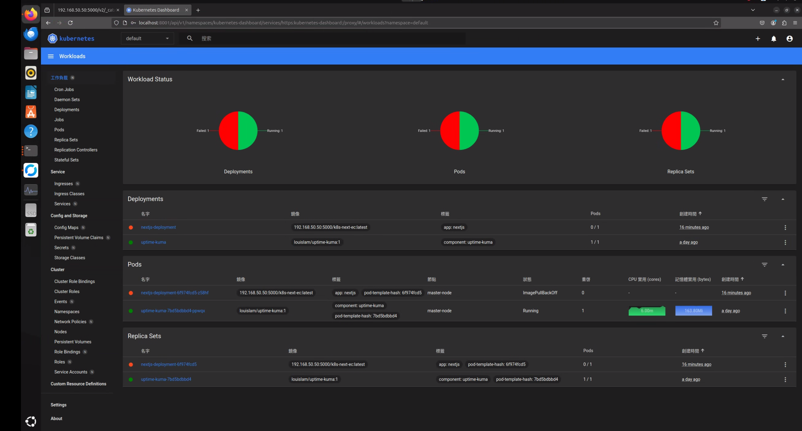
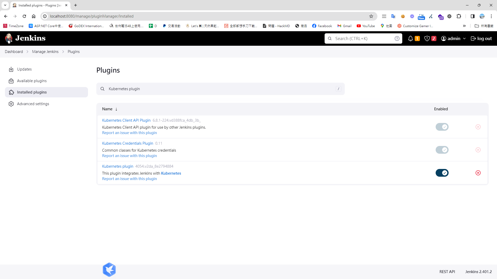
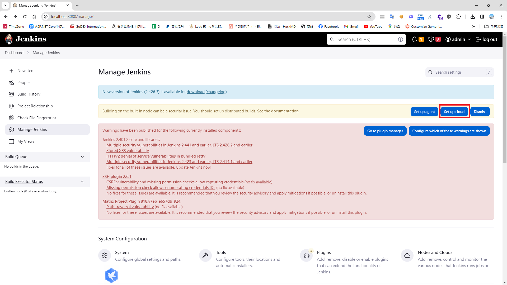
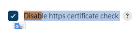
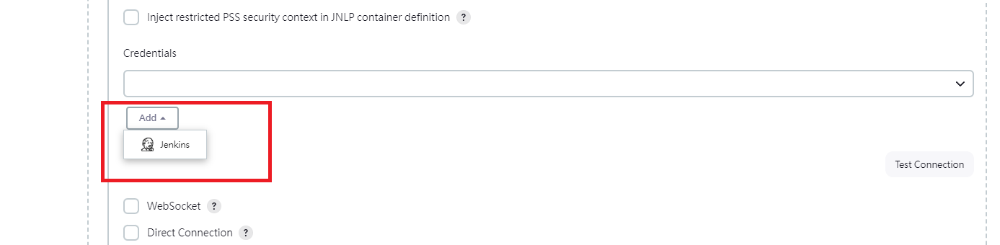
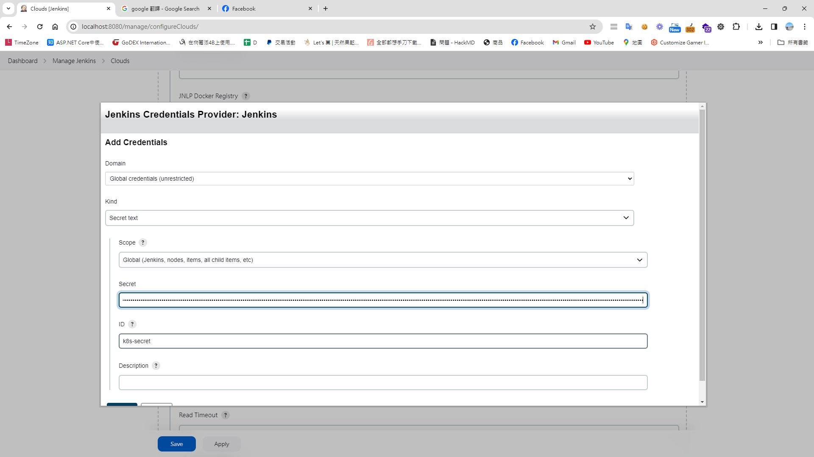
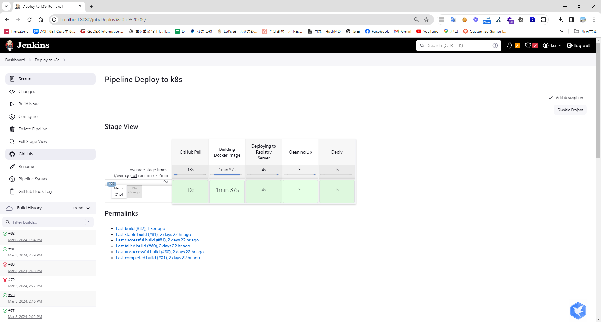

# 前言 
[先前有研究 Windows Desktop 上的 Kubernetes 整合 jenkins](https://blog.markkulab.net/jenkins-deploy-kubernetes-with-docker-for-windows/)，這次來試著用Jenkins 整合 Linux 的 Kubernetes。 

## 預先準備 
* Ubuntu 上安裝 Kubernetes
* 一套Jenkins 
* Next JS 專案，裡面並寫好 yaml 檔

## 首先，要先安裝 Kubernetes Dashboard及產生 ServiceAccount 及 取得Token (這個token 是要拿去給jenkins 用的)
### 安裝 Kubernetes Dashboard
```bash
kubectl apply -f https://raw.githubusercontent.com/kubernetes/dashboard/v2.7.0/aio/deploy/recommended.yaml
```
### 建立 admin user 
```bash
sudo vim dashboard-adminuser.yaml
```
### 建立 admin user
```yaml
apiVersion: v1
kind: ServiceAccount
metadata:
  name: admin-user
  namespace: kubernetes-dashboard

---

apiVersion: rbac.authorization.k8s.io/v1
kind: ClusterRoleBinding
metadata:
  name: admin-user
roleRef:
  apiGroup: rbac.authorization.k8s.io
  kind: ClusterRole
  name: cluster-admin
subjects:
  - kind: ServiceAccount
    name: admin-user
    namespace: kubernetes-dashboard
```

### create service account 
```bash
kubectl apply -f dashboard-adminuser.yaml
```

### get admin token 
```bash
kubectl -n kubernetes-dashboard create token admin-user  --duration=876000h

```
### 啟動Proxy 
```
kubectl proxy
```

### 此時訪問以下連結即可登入Dashboard
```
http://localhost:8001/api/v1/namespaces/kubernetes-dashboard/services/https:kubernetes-dashboard:/proxy/#/login 
```


### 安裝 Jenkins 
參考先前撰寫的[文章](https://blog.markkulab.net/docker-jenkins-build-docker-image-and-github-integration/) 

### 在Jenkins 容器中中安裝 kubectl
```bash
docker exec -it -uroot jenkins bash // 進入jenkins 容器中
curl -LO https://storage.googleapis.com/kubernetes-release/release/v1.29.1/bin/linux/amd64/kubectl // 下載 kubectl
chmod +x ./kubectl // 給予權限
mv ./kubectl /usr/local/bin/kubectl // 複製到系統環境資料夾
kubectl version --client // 查詢版本
```
P.S. Unbuntu 和 Jenkins 容器的 kubectl 版本最好一致

### 複製 kubectl 設定至 Jenkins 容器中 (需要逐行執行)
```bash
docker exec -it -uroot jenkins /bin/bash 
mkdir -p /.kube
exit 
docker cp ~/.kube/config jenkins:/root/.kube 
```

### Jenkins 透過 Kubernetes CLI 連線 kubernetes 
1. 要想把jenkins關聯到Kubernetes中需要安裝幾個最件，打開  系統管理 > 套件管理
* Kubernetes plugin
* Kubernetes CLI Plugin

2. [set up cloud](http://localhost:8080/configureClouds/)

3. set Disable https certificate check => true

4. Kubernetes URL => 
Ubuntu 透過可以 kubectl cluster-info 查出 Url

```
https://192.168.50.50:6443  // 192.168.50.50是我家的Ubuntu 內網的主機IP
```
5. Jenkins URL
Jenkins URL:http://host.docker.internal:8080/
Jenkins tunnel:https://192.168.50.50:50000
6. Credentials =>

7. Copy dashboard token to here


### 撰寫 Jenkins pipeline 
```groovy
properties([pipelineTriggers([githubPush()])])
pipeline {
    agent any 

    environment {
        tag = ':latest'
        imageShortName = 'k8s-next-ec'
        imageName = "${imageShortName}${tag}"
        containerName = "${imageShortName}-1"
        containerUrl = "192.168.50.49:2376"
        dockerfile = "./Dockerfile"        
        registry = "192.168.50.49:5000/next-ec"				
		
    }   
   
    stages {
        stage("GitHub Pull") {
             steps {
                git branch: 'main', 
                credentialsId: '946a703f-dff7-4138-84b2-0aba700dedca', 
                url:  'git@github.com:markku636/ec.git/'
            }
            
        }
		
        stage("Building Docker Image") {
			steps {
				script {
					dockerImage = docker.build "$registry:latest"
				}
			}
		}
		
		stage("Deploying to Registry Server") {
			steps {
				script {
					docker.withRegistry("http://192.168.50.50:5000", "") {
						dockerImage.push()
					}
				}
			}
		}
		
		stage("Cleaning Up") {
			steps {
				sleep(time: 3, unit: "SECONDS")

				sh "docker rmi --force $registry:latest"
			}
		}					
		
        stage("Deply") {
             steps {
                    withKubeConfig([credentialsId: 'k8s-secret', serverUrl: 'https://192.168.50.50:6443']) {                     
                     sh 'kubectl apply -f ./next-js-deployment.yaml'
                    }
                
             }
        }    			        
    }
}
```

## 在 Github next-ec 專案裡建立 Kubernetes 的 YAML 佈署設定檔(next-js-deployment.yaml) 
```yaml
apiVersion: apps/v1
kind: Deployment
metadata:
  name: nextjs-deployment
  labels:
    app: nextjs
spec:
  replicas: 1
  selector:
    matchLabels:
      app: nextjs
  template:
    metadata:
      labels:
        app: nextjs
    spec:
      containers:
      - name: nextjs50
        image: 192.168.50.50:5000/k8s-next-ec:latest
        ports:
        - containerPort: 80
        resources:
          limits:
            memory: "128Mi"
            cpu: "500m"

---

apiVersion: v1
kind: Service
metadata:
  name: nextjs-service
spec:
  type: NodePort
  selector:
    app: nextjs
  ports:
  - protocol: TCP
    port: 80
    targetPort: 80
    nodePort: 30055

```

此時執行 Jenkins 執行建置，應該己經可以看到成功。


## 補充 - 如果遇到權限不足，出現以下錯誤

ERROR: permission denied while trying to connect to the Docker daemon socket at unix:///var/run/docker.sock: Head "http://%2Fvar%2Frun%2Fdocker.sock/_ping": dial unix /var/run/docker.sock: connect: permission denied
```bash
sudo chmod 777 /var/run/docker.sock
```

## 參考
* [使用Kubernetes Dashboard GUI管理cluster](https://ciao-chung.com/page/article/kubernetes-dashboard-manage-cluster)
* [Upgrading Your Cloud Run CI/CD with Jenkins](https://manel-lemin.medium.com/upgrading-your-cloud-run-ci-cd-with-jenkins-92a3717e9f1c)
* [How to Deploy application on GKE using Jenkins](https://blog.knoldus.com/how-to-deploy-application-on-gke-using-jenkins/)
