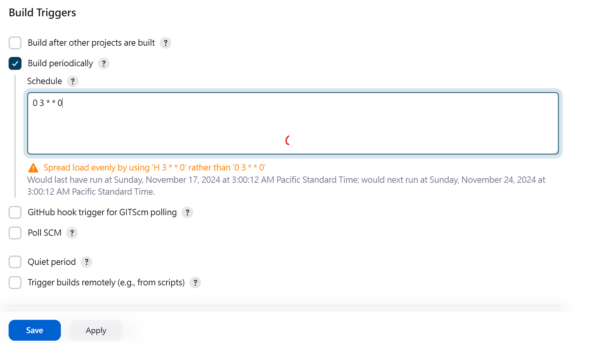

## 解決問題
因為 docker registry 發現用久了會硬碟不足，過去只要一陣子過後就要刪掉重建，因此我找寫了個腳本解決。

## Docker 運行 registry ，要加上這參數 REGISTRY_STORAGE_DELETE_ENABLED = true

```
docker run -d -p 5000:5000 -e REGISTRY_STORAGE_DELETE_ENABLED=true --name registry registry:2

docker update --restart=always registry
```
## Build Triggers > Build periodically > 輸入
如果你想讓 Jenkins 的 Job 在每週日的 凌晨 3 點 執行，可以使用以下的 CRON 表達式：
```
0 3 * * 0  
```
0：秒數（固定為 0，因為不需要精確到秒）。  
3：小時數，表示凌晨 3 點。  
*：每天（不限制日期）。  
*：每個月（不限制月份）。  
0：星期天。  


P.S. 想要什麼時間可以問chatgpt。
## 安裝Plugin  - Pipeline Utility Steps

## 撰寫Jenkins pipeline
```
pipeline {
    agent any
    environment {
        REGISTRY = "192.168.50.50:5000"
    }
    stages {
        stage('Clean Registry') {
            steps {
                script {
                    try {
                        // Fetch all repositories
                        def response = httpRequest url: "http://${env.REGISTRY}/v2/_catalog", validResponseCodes: '200'
                        def repositories = readJSON(text: response.content).repositories

                        for (repository in repositories) {
                            echo "Processing repository: $repository"

                            // Fetch tags for the repository
                            def tagsResponse = httpRequest url: "http://${env.REGISTRY}/v2/${repository}/tags/list", validResponseCodes: '200,404'
                            def tagsList = readJSON(text: tagsResponse.content).tags

                            // Handle case when tagsList is null
                            if (tagsList == null || tagsList instanceof net.sf.json.JSONNull) {
                                echo "No tags found for repository: $repository. Skipping..."
                                continue
                            }

                            // Ensure tagsList is a serializable list
                            tagsList = new ArrayList(tagsList)

                            for (tag in tagsList) {
                                echo "Processing tag: $tag for repository: $repository"

                                try {
                         s           // Fetch manifest and digest
                                    def manifestResponse = httpRequest(
                                        url: "http://${env.REGISTRY}/v2/${repository}/manifests/${tag}",
                                        customHeaders: [[name: 'Accept', value: 'application/vnd.docker.distribution.manifest.v2+json']],
                                        validResponseCodes: '200,404',
                                        httpMode: 'HEAD'
                                    )

                                    // Retrieve digest from headers
                                    def digest = manifestResponse.headers['Docker-Content-Digest']?.first()

                                    if (digest) {
                                        // Delete the image by digest
                                        httpRequest(
                                            url: "http://${env.REGISTRY}/v2/${repository}/manifests/${digest}",
                                            httpMode: 'DELETE',
                                            validResponseCodes: '202'
                                        )
                                        echo "Deleted ${repository}:${tag} with digest: ${digest}"
                                    } else {
                                        echo "Digest for ${repository}:${tag} not found! Skipping..."
                                    }
                                } catch (Exception e) {
                                    echo "Failed to process tag: $tag for repository: $repository. Error: ${e.message}"
                                }
                            }
                        }
                    } catch (Exception e) {
                        echo "Failed to clean registry. Error: ${e.message}"
                        error("Pipeline terminated due to errors.")
                    }
                }
            }
        }
    }
}
```