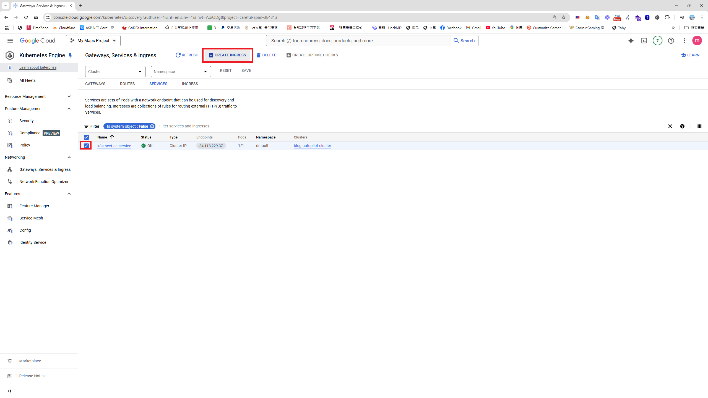
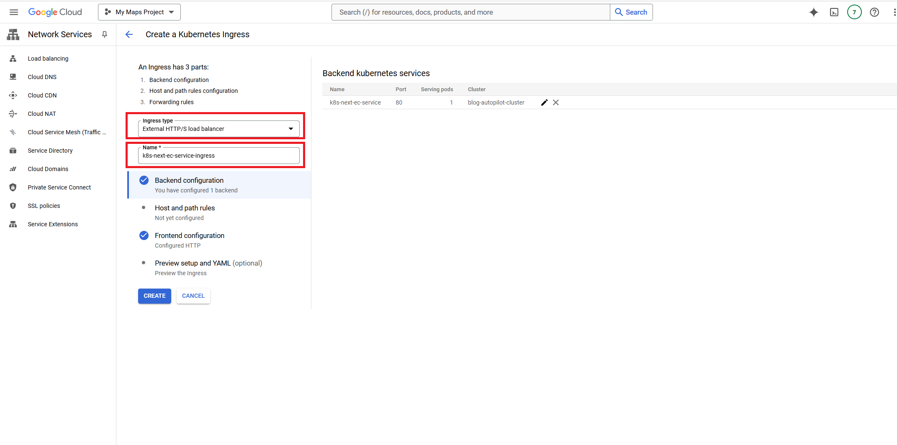
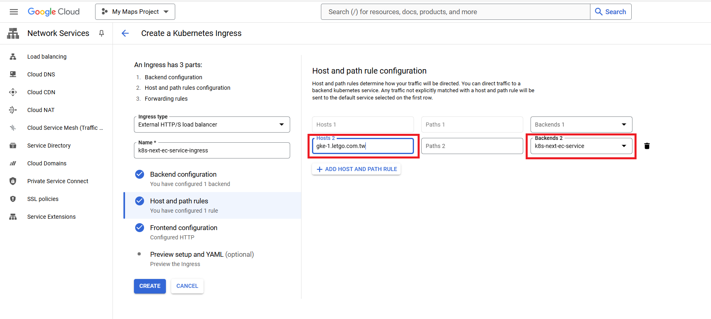
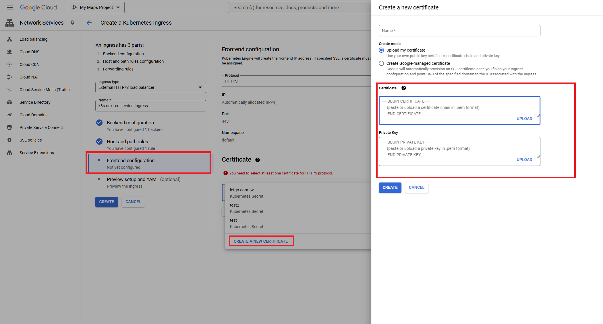
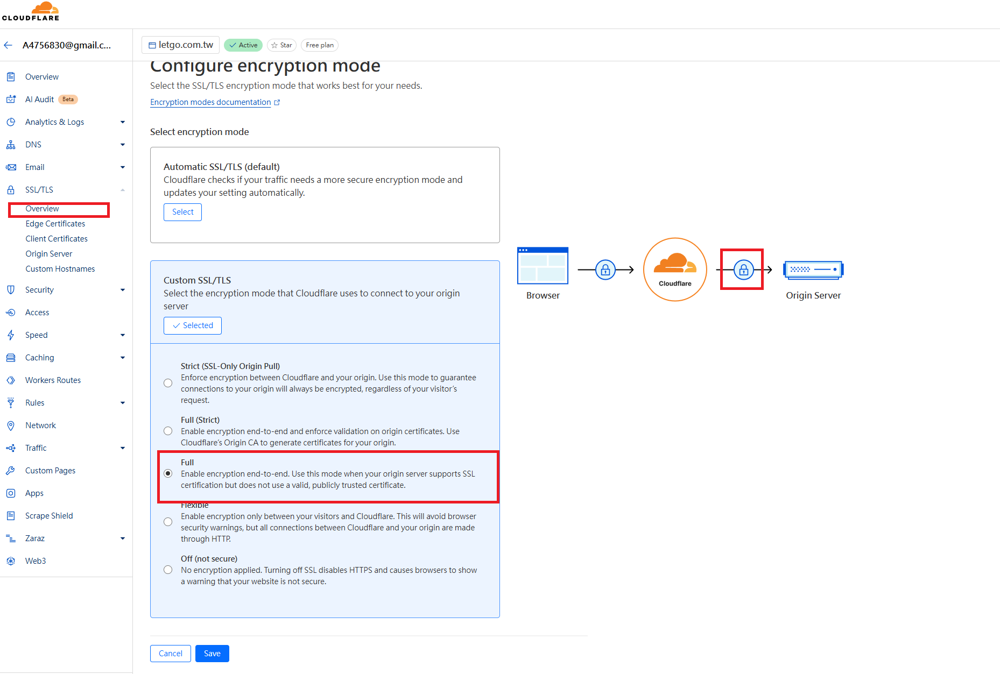
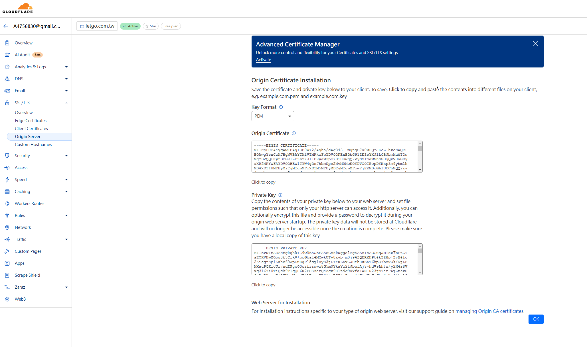
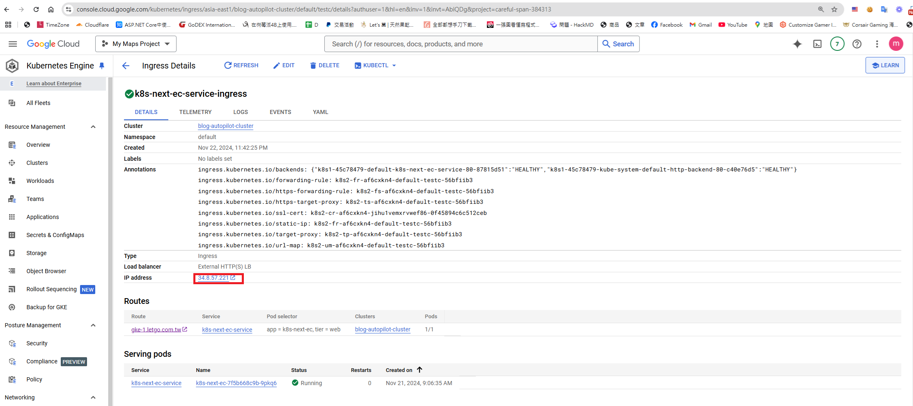
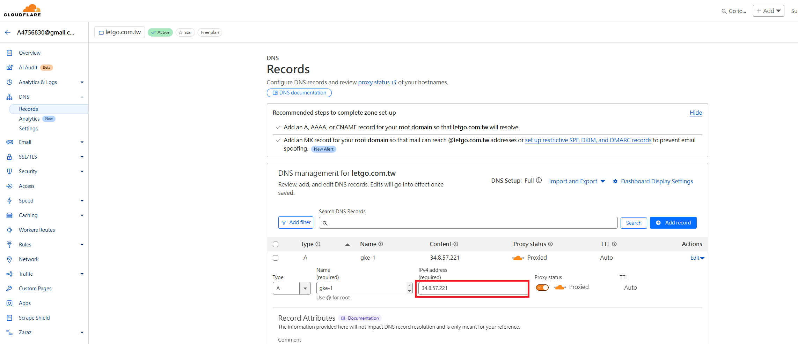
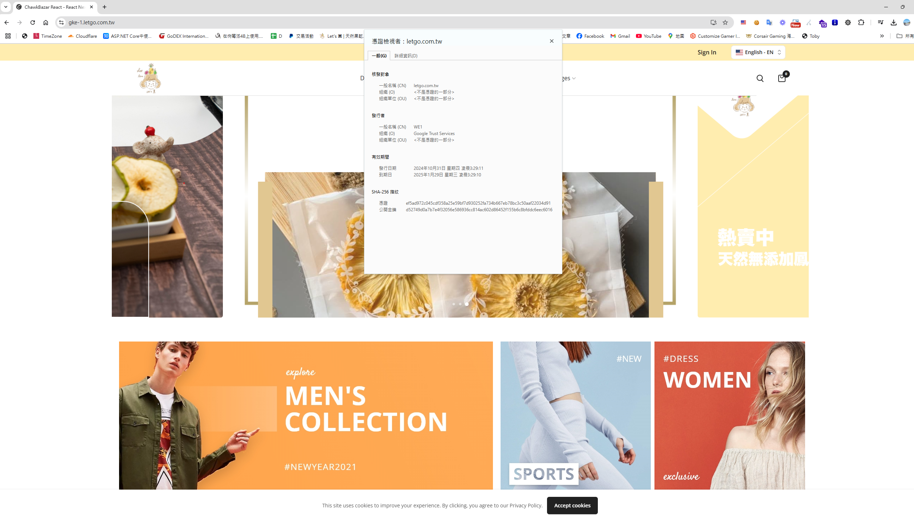

## 什麼是 Ingress ?
Ingress 是 Kubernetes 集群中的一個關鍵組件，主要負責簡化和管理外部流量請求到內部服務的訪問，原則上，Kubernetes 集群屬於一個 **private 網路空間**，外部無法直接訪問集群內的服務或 Pod。因此，需要透過 **Service (LTM)** 或 **Ingress** 來將流量導入集群內部的服務。

## Service(LTM) vs Ingress

在 GKE 中，**Service** 提供的是 **L4 層負載均衡**，無法處理 HTTP 協定的內容，儘管可以透過 DNS 或 CNAME 指向負載平衡的外部IP，並將 Cloudflare 的 SSL 設定為「彈性」來挷定域名，但 Service 無法根據 HTTP 協定或請求內容、路徑來重定向或設定規則。

但**Ingress** 則提供了 **L7 層負載均衡**，能理解 HTTP 協定，並且可以通過 Ingress 規則設定，根據 **Path 或域名** 判斷如何將請求轉發到特定的 Service。

舉例來說
```
www.letgo.com.tw => Service A => Cluster => Pods => Container
```

Ingress 類似於 [Nginx 的域名解析](https://blog.markkulab.net/nginx-https-forwarding/)及流量轉導功能，但功能上更加聚焦於流量管理（Nginx 還提供緩存等網站功能）。透過 Ingress 的域名解析和路徑轉導，讓我們可以輕鬆實現流量分流。

範例：  
```
/blog  => Service A  
/store => Service B
```

## 建立Ingress 
建立 Ingress 有三種方式：透過網頁介面、指令操作，或撰寫 YAML 設定檔。在開始之前，必須先建立 Deployment 和 Service，且需特別注意，此 Service 類型必須設為 ClusterIP，而非 LoadBalancer。本篇範例將示範如何透過網頁介面來建立 Ingress。

1. 回到GCP的Google Kubernetes Engine > Gateways, Services & Ingress > 點擊 SERVICE 頁籤 > 選取你的 Service。


2. 輸入 ingress name


P.S. 選擇 External 類型，會自動生成一個獨立的 IP 地址。  

3. 輸入域名及挷定先前建立的服務(Service)

P.S. 先前建立的 Service Type 必須為 Cluster IP

#### 2. 設定 Cloudflare 憑證  


#### 3. 取得憑證，以Cloudfalre為例，想將域名指向 Ingress IP，以參考以下方法取得Cloudflare 憑證 
登入Cloudflare 後台，SSL/TLS > Overview > Configure > SSL/TLS encryption > 設定成 Full   

SSL/TLS > Origin Server > Create Certificate > Create > Create 


補充  
* 用戶端憑證聚焦於從用戶端到伺服器的認證和加密。 
* 原始伺服器憑證則是 Cloudflare 與您的後端伺服器間的加密保障。

Ingress 建立完，會產生一組獨立的 IP ，此時就能透過 DNS 將域名指向Ingress 的外部 IP  


#### 接新增A記錄在DNS 中，並指向先前建立Ingress 真實IP  


此時，你的網站域名、Https憑證和 Google Kubernetes Engine Ingress 己整合完成了。



## 補充 - 用指令上傳憑證及透過設定檔(yaml)建立ingress 

用 kubectl上傳指令 (憑證像前面一樣，從Cloudfalre 取得 )

```
kubectl create secret tls letgo.com.tw --cert letgo.cert.pem --key  letgo.cert.key
```
建立 ingress.yaml
```
---
apiVersion: "networking.k8s.io/v1"
kind: "Ingress"
metadata:
  name: "k8s-next-ec-service-ingress"
  namespace: "default"
spec:
  tls:
  - secretName: "letgo.com.tw"
  rules:
  - http:
      paths:
      - path: ""
        backend:
          service:
            name: "k8s-next-ec-service"
            port:
              number: 3000
        pathType: "ImplementationSpecific"
    host: "gke-1.letgo.com.tw"
status:
  loadBalancer: {}
```
kubectl apply -f ./ingress.yaml

## 參考資料
*  Mickey 和David 大大的指點
* [採用 Ingress 機制的 Gateway API 更加便利？](https://www.youtube.com/watch?v=nO_aD-2sOMk)
* [Azure DevOps 部署到 GKE (2) — Load Balancer VS Ingress](https://medium.com/chouhsiang/azure-devops-%E9%83%A8%E7%BD%B2%E5%88%B0-gke-2-gke-service-ingress-99bfc79884ad)
* [Kubernetes 那些事 — Ingress 篇（一）](https://medium.com/andy-blog/kubernetes-%E9%82%A3%E4%BA%9B%E4%BA%8B-ingress-%E7%AF%87-%E4%B8%80-92944d4bf97d)
* [Azure DevOps 部署到 GKE (8) —整合Cloudflare](https://medium.com/chouhsiang/azure-devops-%E9%83%A8%E7%BD%B2%E5%88%B0-gke-7-%E6%95%B4%E5%90%88cloudflare-7864906a5b2a)


