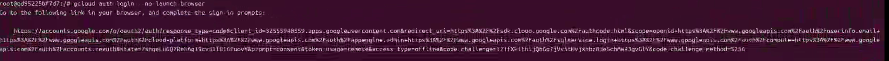
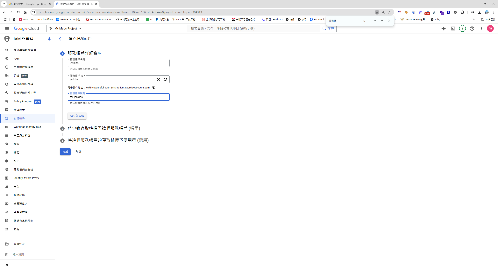
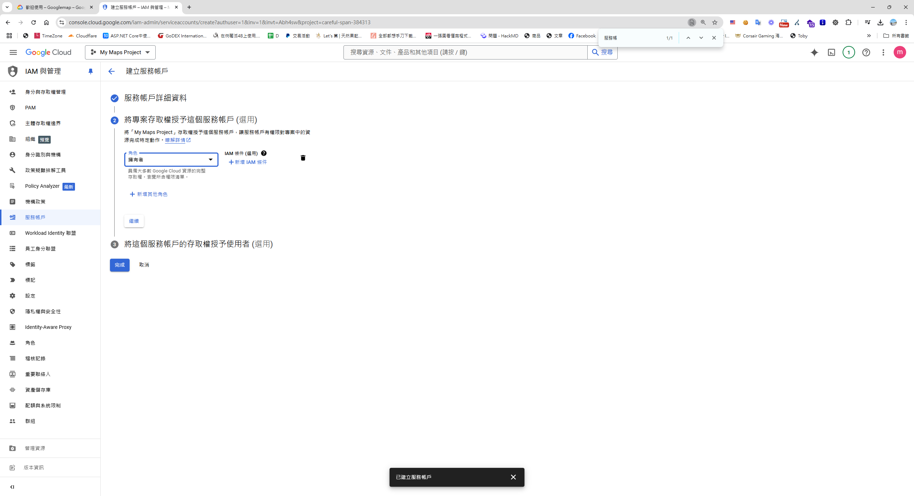
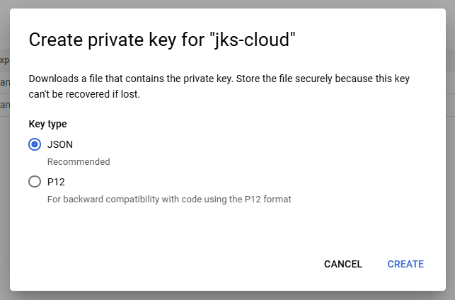
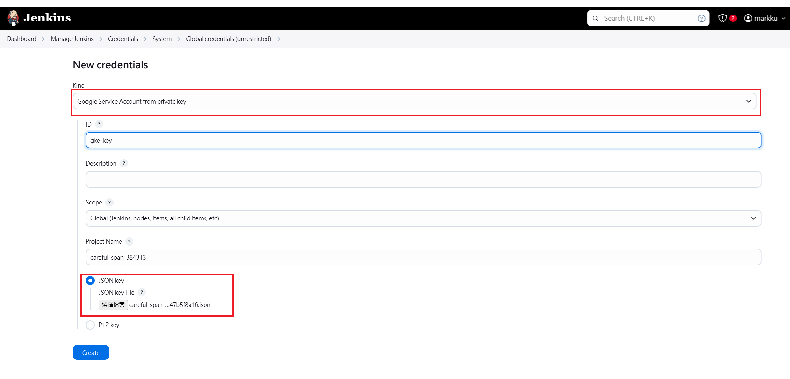
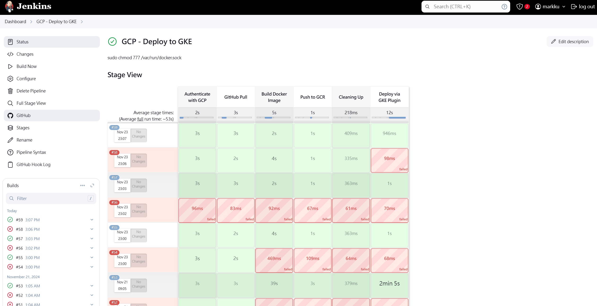
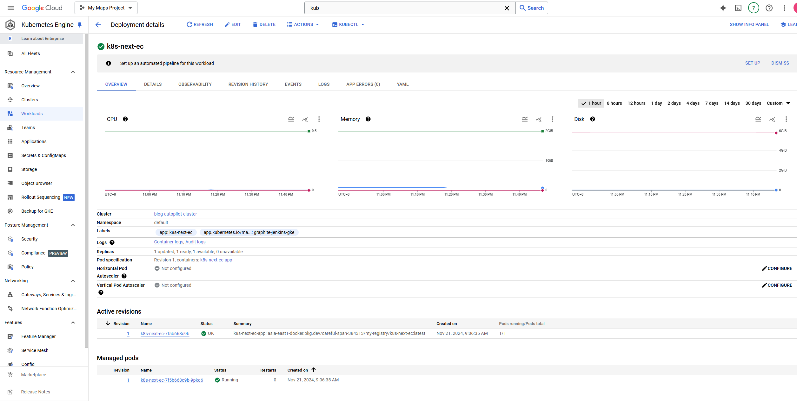

## 前言
接續先前的文件[用Google Cloud SDK 腳本指令部署 GKE](https://blog.markkulab.net/deploy-nextjs-app-to-google-kubernetes-service/)，這次打算透過 Jenkins 實現自動化部署GKE。

## 事先準備
在開始之前，請確保以下環境及資源已準備就緒：
1. **Kubernetes Master Node**：至少一台可用的 K8s Master Node。
2. **Jenkins**：已安裝並運行。
3. **Docker**：用於容器化應用程式。
4. **Google Artifact Registry**：事先在 GCP 中建立好 Artifact Registry 。
5. **Next.js 專案**：專案中需包含已撰寫的 K8s YAML 設定檔。
6. **Github 設定好 webhook ，當有程式異動自動trigger Jenkins Build **

## 安裝 Google Cloud CLI
1. **依據官方教學安裝 Google Cloud CLI**：參考 [Google 官方文件](https://cloud.google.com/sdk/docs/install) 進行安裝。
2. **登入 Google Cloud**：
   執行以下指令：
   ```bash
   gcloud auth login --no-launch-browser
   ```
   系統將生成一個驗證 URL（如下圖所示），可在其他可用瀏覽器的設備上完成登入操作。

   

## 建立 Google 服務帳戶
1. **進入 GCP 後台**：
   - 導航至 **IAM & Admin > 服務帳戶**。
   - 點擊 **建立服務帳戶**。

   

2. **設定角色**：
   - 將角色設定為 **擁有者**。
   - 點擊 **完成**。

   

3. **下載服務帳戶金鑰**：
   - 在 **Service accounts > 選擇服務帳號 > 金鑰 (Key)** 頁籤中：
     - 點擊 **新增金鑰 (Add Key)**，選擇 **JSON 格式**，並下載金鑰。

   

## Jenkins 設定

1. **安裝必要插件**：
   - 在 Jenkins Dashboard 中，導航至 **Manage Jenkins > Plugin Manager**，安裝以下插件：
     - Google Kubernetes Engine Plugin
     - Kubernetes CLI Plugin
     - Pipeline: AWS Steps Plugin
   

2. **新增憑證**：
   - 將下載的 GCP 金鑰上傳到 Jenkins：
     - 導航至 **Dashboard > Manage Jenkins > Credentials > System > Global credentials (unrestricted)**。
     - 點擊 **Add Credentials**，選擇 **Secret file** 類型，並上傳 JSON 金鑰檔案。

   

   **注意**：此處需要上傳兩份金鑰，分別用於：
   - **SSH Username with private key (gke-ssh)**：供 `withCredentials` 使用。
   - **Google Service Account from private key (gke-gsa)**：供 Kubernetes Engine Builder 使用。

## 建立 Jenkins Pipeline
1. **建立新 Pipeline**：
   - 導航至 **Dashboard > New Item**。
   - 選擇 **Pipeline**，命名為 `GCP - Deploy to GKE`。

2. **撰寫 Pipeline 腳本**：
   以下為範例腳本：
   ```groovy
   properties([
       pipelineTriggers([githubPush()])
   ])

   pipeline {
       agent any

       environment {
           TAG = ':latest'
           IMAGE_SHORT_NAME = 'k8s-next-ec'
           IMAGE_NAME = "${IMAGE_SHORT_NAME}${TAG}"
           CONTAINER_NAME = "${IMAGE_SHORT_NAME}-1"
           DOCKERFILE_PATH = './Dockerfile'
           REGISTRY_URL = 'asia-east1-docker.pkg.dev/careful-span-384313/my-registry'
           REGISTRY = "${REGISTRY_URL}/${IMAGE_SHORT_NAME}"
           GCP_PROJECT_ID = 'careful-span-384313'
           GIT_REPO_URL = 'git@github.com:markku636/ec.git'
           GIT_BRANCH = 'main'
           GKE_CLUSTER_NAME = 'blog-autopilot-cluster'
           GKE_LOCATION = 'asia-east1'
           DEPLOYMENT_MANIFEST = './gc-next-js-deployment.yaml'
       }

       stages {
           stage('Authenticate with GCP') {
               steps {
                   withCredentials([file(credentialsId: 'gke-ssh', variable: 'GCLOUD_CREDS')]) {
                       sh '''
                           gcloud version
                           gcloud auth activate-service-account --key-file="$GCLOUD_CREDS"
                           gcloud config set project $GCP_PROJECT_ID
                           gcloud auth configure-docker asia-east1-docker.pkg.dev
                       '''
                   }
               }
           }

           stage("GitHub Pull") {
               steps {
                   git branch: "${GIT_BRANCH}", 
                   credentialsId: 'e85233ad-a3c5-448b-a6ea-9f53e4f9b3f1', 
                   url: "${GIT_REPO_URL}"
               }
           }

           stage('Build Docker Image') {
               steps {
                   sh "docker build -t ${IMAGE_NAME} -f ${DOCKERFILE_PATH} ."
               }
           }

           stage('Push to GCR') {
               steps {
                   sh "docker tag ${IMAGE_NAME} ${REGISTRY}${TAG}"
                   sh "docker push ${REGISTRY}${TAG}"
               }
           }

           stage("Cleaning Up") {
               steps {
                   sh "docker rmi --force ${REGISTRY}${TAG}"
               }
           }

           stage('Deploy via GKE Plugin') {
               steps {
                   step([
                       $class: 'KubernetesEngineBuilder',
                       projectId: "${GCP_PROJECT_ID}",
                       clusterName: "${GKE_CLUSTER_NAME}",
                       location: "${GKE_LOCATION}",
                       manifestPattern: "${DEPLOYMENT_MANIFEST}",
                       credentialsId: 'gke-gsa',
                       verifyDeployments: true
                   ])
                   echo "Deployment Finished ..."
               }
           }
       }
   }
   ```

## 補充：專案資料夾的部署的 YAML 設定檔
以下為 `./gc-next-js-deployment.yaml` 範例內容：
```yaml
apiVersion: apps/v1
kind: Deployment
metadata:
  name: k8s-next-ec
  labels:
    app: k8s-next-ec
spec:
  selector:
    matchLabels:
      app: k8s-next-ec
      tier: web
  template:
    metadata:
      labels:
        app: k8s-next-ec
        tier: web
    spec:
      containers:
      - name: k8s-next-ec-app
        image: asia-east1-docker.pkg.dev/careful-span-384313/my-registry/k8s-next-ec:latest
        imagePullPolicy: Always
        ports:
        - containerPort: 3000            
---

apiVersion: v1
kind: Service
metadata:
  name: k8s-next-ec
  labels:
    app: k8s-next-ec
spec:
  selector:
    app: k8s-next-ec
  type: LoadBalancer
  ports:
    - name: http
      protocol: TCP
      port: 80
      targetPort: 3000  
```

## 最終




## 參考資料
* [Day 17 — Terraform/GCP基礎 — 設定 GCP 服務帳號 (Service Account)](https://ithelp.ithome.com.tw/articles/10332886)
* [How to Deploy application on GKE using Jenkins](https://blog.knoldus.com/how-to-deploy-application-on-gke-using-jenkins/)


