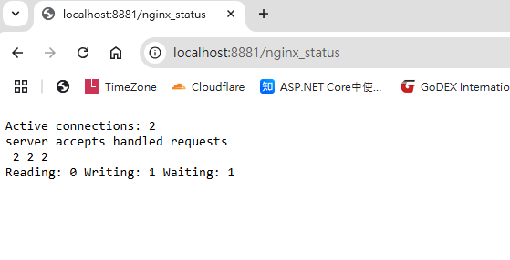
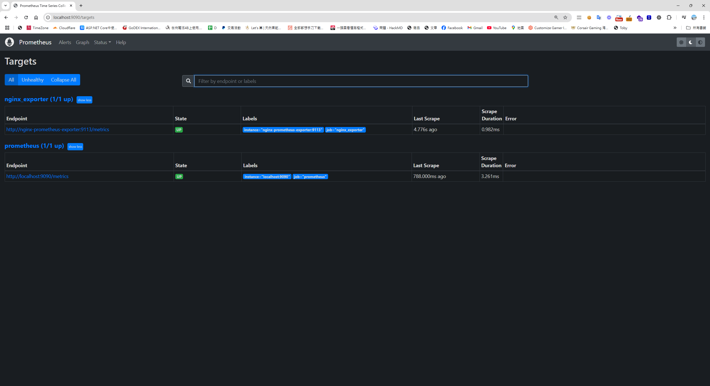
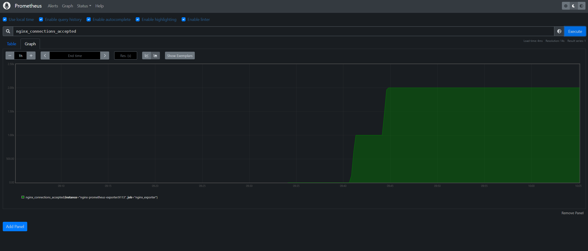
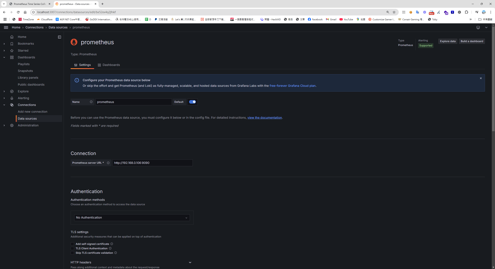
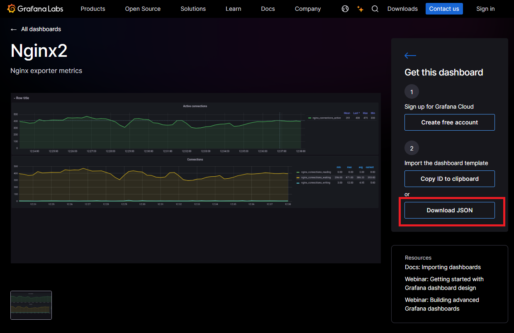
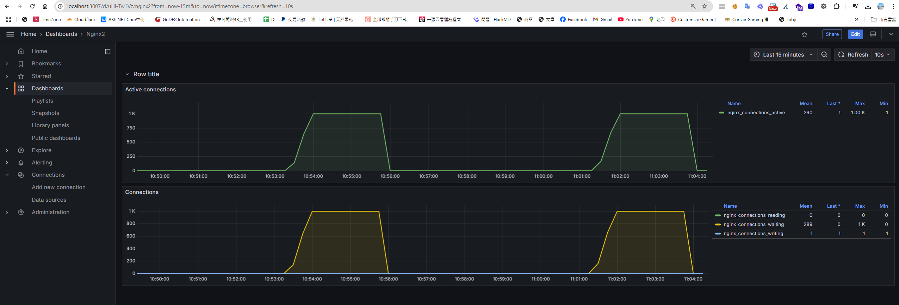

## 前言
Prometheus 和 Grafana 是 Kubernetes 生態系統中的常見組合，這篇文章將展示如何使用 Prometheus 監控 Nginx 請求，並利用 Grafana 進行數據可視化。

## 了解 Nginx 的 `stub_status`

在啟動 Prometheus 監控之前，讓我們先了解 Nginx 的 `stub_status` 模組，它提供了關於 Nginx 運行狀態的基本指標。

### 設定 Dockerfile

首先，創建一個 Dockerfile，基於 Nginx 映像檔進行自訂配置：

```dockerfile
FROM nginx
COPY nginx.conf /etc/nginx/conf.d/default.conf
```

### 建立 `nginx.conf`

接著，編寫 `nginx.conf` 配置文件來啟用 Nginx 的狀態頁面，這將暴露供 Prometheus 爬取：

```nginx
server {
    listen 80;  # 使用本地端口
    server_name localhost;  # 設定為 localhost

    location /nginx_status {
        stub_status on;  # 啟用狀態模組
        access_log off;
        allow all;  # 允許所有 IP 訪問
    }
}
```

### 建置並啟動容器

使用以下命令建置 Docker 映像並啟動容器：

```bash
docker build -t my-nginx:latest .
docker run -d -p 8881:80 --name nginx-prometheus-exporter my-nginx:latest
```

## 訪問 Nginx 狀態頁面

啟動容器後，訪問 `http://localhost:8881/nginx_status`，你會看到類似以下的頁面：



### 解析 Nginx 狀態信息

1. **Active connections: 2**  
   目前有 2 個活動連線。

2. **server accepts handled requests: 2 2 2**  
   - **2**：已接受的連線數。  
   - **2**：已成功處理的連線數。  
   - **2**：總請求數（可能大於連線數，因為每個連線可以處理多個請求）。

3. **Reading: 0 Writing: 1 Waiting: 1**  
   - **Reading: 0**：正在讀取請求的連線數。  
   - **Writing: 1**：正在傳送響應的連線數。  
   - **Waiting: 1**：空閒等待新請求的連線數（使用 HTTP Keep-Alive）。

**總結：** 當前伺服器負載較輕，共有 2 個連線，其中 1 個正在處理請求，1 個處於等待新請求的狀態。

## 容器應用說明
grafana ( 報表呈示 ) ＞ prometheus-exporter ( 主動爬取資料 ) > nginx/nginx-prometheus-exporter (將這些數據暴露給 Prometheus的工具 ) > nginx status  ( 網站服務器，提供網頁伺服器的狀態 )

## 建立及啟動相關容器應用

接下來，我們建立 `deployment.yaml` 文件來部署包含所有服務的 Docker 容器。

### `deployment.yaml` 範例

```yaml
version: "3.8"
services:
  mynginx:
    build: ./nginx/
    container_name: mynginx
    ports:
      - 8885:80

  nginx-prometheus-exporter:
    image: nginx/nginx-prometheus-exporter
    container_name: nginx-prometheus-exporter
    command: -nginx.scrape-uri http://nginx:80/nginx_status
    ports:
      - 9113:9113
    depends_on:
      - nginx

  prometheus:
    image: prom/prometheus:v2.35.0
    container_name: prometheus
    volumes:
      - ./prometheus.yaml:/etc/prometheus/prometheus.yaml
      - ./prometheus_data:/prometheus
    command:
      - "--config.file=/etc/prometheus/prometheus.yaml"
    ports:
      - "9090:9090"

  renderer:
    image: grafana/grafana-image-renderer
    environment:
      BROWSER_TZ: Asia/Taipei
    ports:
      - "8082:8081"

  grafana:
    image: grafana/grafana
    container_name: grafana
    volumes:
      - ./grafana_data:/var/lib/grafana
    environment:
      GF_SECURITY_ADMIN_PASSWORD: pass
      GF_RENDERING_SERVER_URL: http://renderer:8082/render
      GF_RENDERING_CALLBACK_URL: http://grafana:3007/
      GF_LOG_FILTERS: rendering:debug
    depends_on:
      - prometheus
      - renderer
    ports:
      - "3007:3000"
```

### 設置 Prometheus 配置

編寫 `prometheus.yaml` 來配置 Prometheus 如何抓取數據。

```yaml
global:
  scrape_interval: 5s  # 設定抓取頻率
  external_labels:
    monitor: "my-monitor"

scrape_configs:
  - job_name: "prometheus"
    static_configs:
      - targets: ["localhost:9090"]
  - job_name: "nginx_exporter"
    static_configs:
      - targets: ["nginx-prometheus-exporter:9113"]
```
使用 Docker Compose 啟動容器服務：

```bash
docker-compose -f ./deployment.yaml up -d
```

## 查看 Prometheus Targets

在瀏覽器中打開 [http://localhost:9090/targets](http://localhost:9090/targets)，你可以查看 Prometheus 目標狀態。



## 使用 Prometheus 繪製 Nginx 指標圖表

轉到 Prometheus 的 Graph 標籤頁，可以根據 Nginx 的指標繪製即時圖表：



然而，Prometheus 的報表較為簡單。如果你需要更精美的圖表或更多篩選選項，可以使用 Grafana 來展示。

## 設定 Grafana 連接 Prometheus

1. 打開 Grafana 儀表板（[http://localhost:3007/](http://localhost:3007/)）。
2. 進入 "Connection" 部分，點擊 "Add new connection" 並選擇 "Prometheus"。



## 建立 Grafana Dashboard

你可以從 Grafana Dashboard 市集下載現成的模板，來展示 Nginx 的指標。

### 下載 Dashboard 範本

[下載 JSON](https://grafana.com/grafana/dashboards/18144-nginx2/)


## 匯入 Dashboard 模板

回到 Grafana 儀表板，點擊 "New Import" 並導入你下載的 JSON 模板。



## 執行 K6 壓測

撰寫 K6 壓力測試腳本，模擬流量並驗證 Nginx 性能：

```javascript
import http from 'k6/http';
import { check, sleep } from 'k6';

export const options = {
  stages: [
    { duration: '30s', target: 3000 },  // 負載測試從 0 到 3000 個虛擬使用者，持續 30 秒
    { duration: '1m30s', target: 3000 }, // 維持 3000 個虛擬使用者，持續 1 分 30 秒
    { duration: '20s', target: 0 },      // 減少虛擬使用者數量
  ]
};

export default function () {
  const res = http.get('http://192.168.0.88:8885/nginx_status'); // your nginx ip 
  check(res, { 'status was 200': (r) => r.status == 200 });
  sleep(1);
}
```

使用 Docker 版本的 K6，無需額外安裝，直接執行壓力測試：

```
// Windows 腳本
cat script.js | docker run --rm -i grafana/k6 run -
```
## 查看 Grafana 儀表板上的即時數據

進行壓力測試後，Grafana 儀表板將即時顯示 Nginx 的連線數量等指標。



## 相關程式碼
所有程式碼和設定檔都可以在 [GitHub Repo](https://github.com/markku636/Prometheus) 上找到。

## 參考資料
[使用 Prometheus 和 Grafana 打造監控預警系統 (Docker 篇)](https://pin-yi.me/blog/docker/prometheus-grafana-docker/#prometheus)