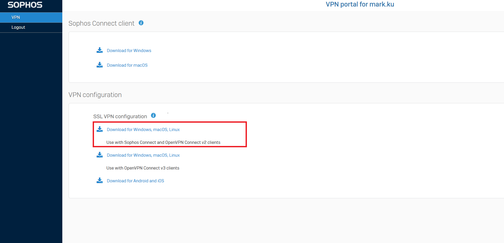

## Download open vpn certificate from your firewall(SOPHOS)




## Copy ssl vpn configuration to “/etc/openvpn”
```
sudo cp sslvpn-mark.ku-client-config.ovpn /etc/openvpn/vpn.ovpn
```

## Create vpn account and password file for open vpn connection

```
sudo vim /etc/openvpn/credentials.txt
```
credentials.txt
```
vpn account
vpn password
```

## Grant permissions

sudo chmod 600 /etc/openvpn/credentials.txt
sudo chown root:root /etc/openvpn/credentials.txt

## Install open vpn

```bash
sudo apt update
sudo apt upgrade
```

```bash
sudo apt install openvpn
``` 

## Test the VPN is working
```
sudo openvpn --config /etc/openvpn/vpn.ovpn --auth-user-pass /etc/openvpn/credentials.txt
```

```bash
sudo vim /etc/systemd/system/openvpn.service
 ```
 
 ```
 [Unit]
Description=OpenVPN client service
After=network.target

[Service]
Type=simple
ExecStart=/usr/sbin/openvpn --config /etc/openvpn/vpn.ovpn --auth-user-pass /etc/openvpn/credentials.txt
ExecStop=/usr/sbin/openvpn --config /etc/openvpn/vpn.ovpn --auth-user-pass /etc/openvpn/credentials.txt --disconnect
Restart=on-failure

[Install]
WantedBy=multi-user.target 
``` 
 
```bash
sudo systemctl enable openvpn.service
sudo systemctl start openvpn.service
sudo systemctl status openvpn.service
```
 
```bash
sudo reboot
```

## Final 
You can try to connect your vpn network's application

