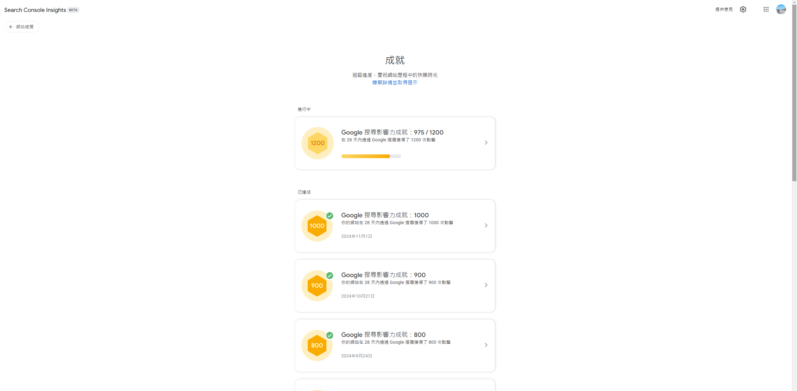
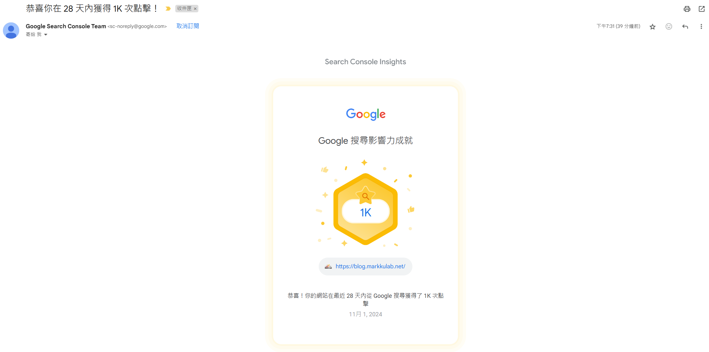
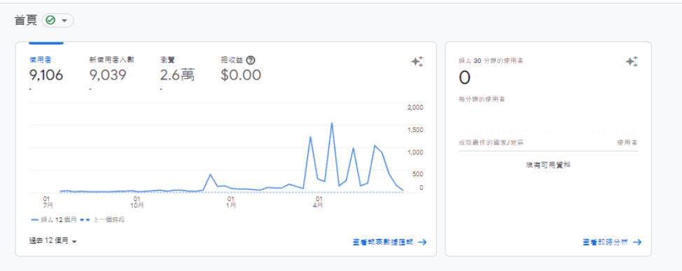
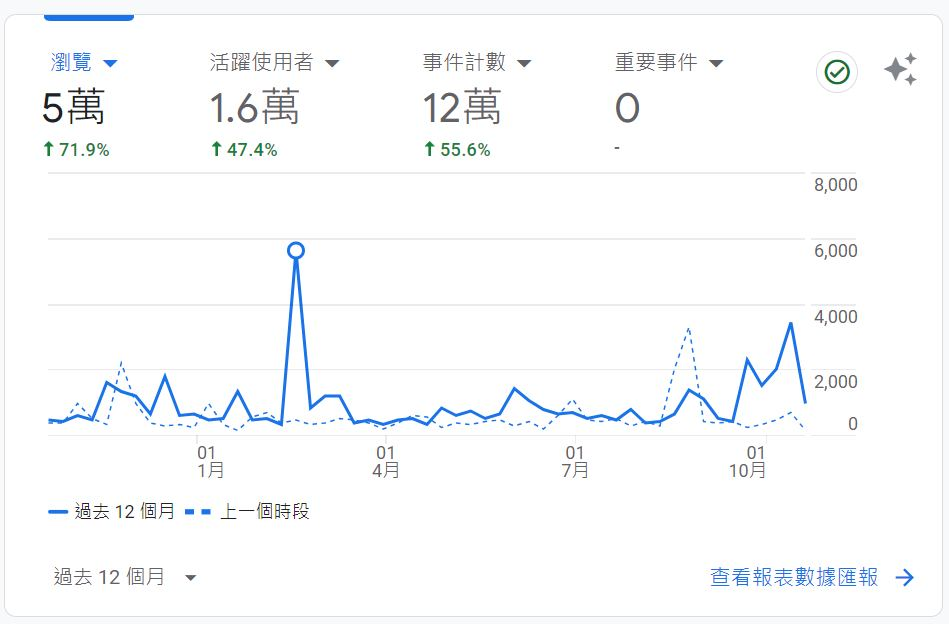

回顧2022年剛開始寫部落格的時候，當時的文筆真的不成熟，現在回頭看，有些文章甚至讓自己看不太懂，兩年下來，已經累積了172篇文章。  

現在每月自然點擊從 350 -> 1000自然點擊，  

從開始經營第1年3萬多流量、第2年5萬多瀏覽，  

經營長文字網站來說，真蠻不容易的，  

過程中試過次AI來寫，後來發現AI 文章充滿機器味，也不好懂，看起來 AI 暫時只能是輔助，  

前幾年技術或框架經驗，隨著時代在變，其實放在腦中，一點價值都沒有，有些終將變成眼淚，當初起心動念，只是想記錄自己做過些什麼，增加自己的溝通彙總能力，並學著怎麼架設及經營網站。  

  

  
