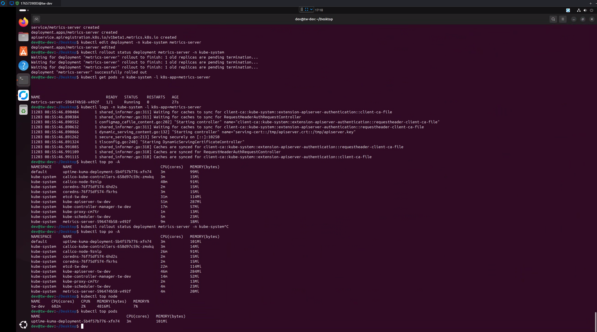

## metrics-server 
## 使用 Kubernetes Metrics Server 管理集群資源

在 Kubernetes 中，`Metrics Server` 是一個重要的組件，它提供集群資源使用情況的即時度量數據。這些度量數據對於管理和調整 Pod、節點資源的使用情況至關重要。本文將介紹如何安裝、配置以及查看 Metrics Server 的數據。

## 1. 安裝 Metrics Server

首先，我們需要安裝 `Metrics Server`。它的安裝配置非常簡單，可以直接通過 Kubernetes 的 YAML 文件進行部署。請運行以下命令來下載並應用最新版本的 Metrics Server 部署配置：

```bash
kubectl apply -f https://github.com/kubernetes-sigs/metrics-server/releases/latest/download/components.yaml
```

這會自動從 GitHub 下載最新的 `metrics-server` 配置並部署到你的 Kubernetes 集群中。

## 2. 配置默認編輯器為 `vim`

在 Kubernetes 中，對於某些命令（例如 `kubectl edit`）會使用預設編輯器進行編輯。如果你習慣使用 `vim`，可以設置 `KUBE_EDITOR` 環境變數來更改默認編輯器。運行以下命令來設置：

```bash
export KUBE_EDITOR=vim
```

這樣，每次執行 `kubectl edit` 命令時，系統就會自動啟動 `vim` 來進行編輯。

## 3. 檢查 Metrics Server 的運行狀態

安裝並部署完 `Metrics Server` 後，可以通過以下命令來檢查其運行狀態：

### 查看 Metrics Server 的日誌：

```bash
kubectl logs -n kube-system -l k8s-app=metrics-server
```

這會顯示 `metrics-server` 的日誌，讓你檢查它是否成功啟動並正常運行。

### 查看集群資源使用情況：

```bash
kubectl top po -A
```

這條命令會顯示所有命名空間中 Pod 的資源使用情況，包括 CPU 和內存的使用量。這有助於你了解集群的整體資源消耗。

## 4. 修改 Metrics Server 配置

有時候，你可能需要修改 `metrics-server` 的配置，例如調整資源限制或修改其他參數。你可以使用以下命令來編輯 Metrics Server 的 Deployment：

```bash
kubectl edit deployment -n kube-system metrics-server
```

這會打開一個編輯器，你可以根據需要修改 YAML 配置。

### 更新後，重啟metrics，並確認部署狀態

修改完成後，使用以下命令來確保修改已經應用並且沒有錯誤：

```bash
kubectl rollout status deployment metrics-server -n kube-system
```

這將顯示 `metrics-server` 的滾動更新狀態，當所有的 Pod 成功更新後，顯示 "deployment "metrics-server" successfully rolled out"。  

檢查 metrics-server 狀態
```bash
kubectl get pods -n kube-system -l k8s-app=metrics-server
```

測試
```
kubectl top get nodes
kubectl top get pods
```


## 總結

Metrics Server 是 Kubernetes 中非常有用的一個組件，能夠幫助你更好地管理集群中的資源使用情況。通過本文，你學會了如何安裝、配置和使用 Metrics Server，以及如何查看和修改它的部署配置。希望這些操作能夠幫助你更高效地管理 Kubernetes 集群中的資源。