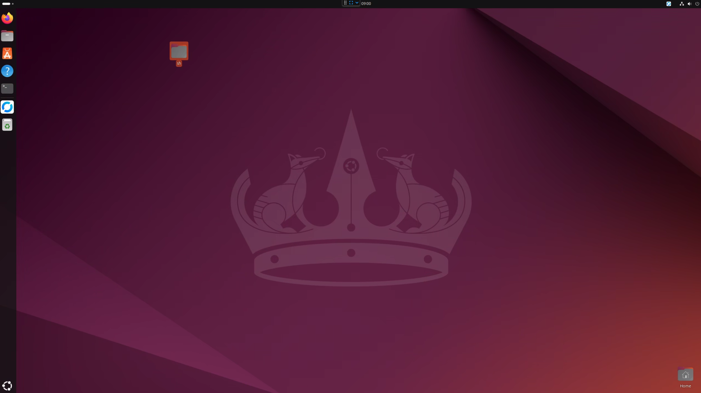

## 為什麼選擇使用 Linux？

Windows 的 Docker Container 主要是通過 WSL 虛擬化 Linux Kernel，由於 Windows 作業系統本身會消耗部分資源，加上虛擬化過程的轉換，效能相較於原生 Linux 顯得不足，目前大多數的容器應用程式都是基於 Linux。

此外，Windows Docker Container 的穩定性也不如 Linux Docker Container，我們經常因Docker Desktop 更新或機房斷電而出現問題，例如容器遺失或 Docker Engine 損壞等情況。    

因此，我決定先將台灣的開發環境，先試著遷到到Linux 的開發環境試試，再逐步替換掉生產環境的 Windows 伺服器。

## [下載](https://ubuntu.com/download/desktop)並安裝帶有 GUI 的 Ubuntu LTS 版本。

為了降低學習與移轉門檻，同時便於維護，我們選擇了帶有圖形介面 (GUI) 的 Ubuntu 版本，讓大家能逐步熟悉 Linux 環境。



## 安裝遠端連線工具 - RestDesk

為了方便管理與維護，我們架設了一套類似 TeamViewer 的遠端管理工具 RestDesk。  
👉 [如何架設 RestDesk](https://blog.markkulab.net/custom-your-remote-tool-like-team-viwer/)

## 使用 Samba 實現 Linux 與 Windows 11 的檔案共享

由於我們的資料庫是 MSSQL，需要將備份檔案從 Windows 傳到 Linux 上。為此，我們設定了 Samba 共享資料夾以便雙向訪問。

👉 [如何設定 Samba](https://blog.markkulab.net/ubuntu-samba-windows11-folder-sharing/)

## 將 Windows 的 MSSQL 遷移到 Linux 容器

MSSQL 其實容器化很久了，Microsoft 提供了[在 Linux 容器中運行 MSSQL 的教學](https://learn.microsoft.com/zh-tw/sql/linux/quickstart-install-connect-docker?view=sql-server-ver16&tabs=cli&pivots=cs1-bash)，以下是主要步驟：

### 啟動並執行 MSSQL
```bash
docker run -e "ACCEPT_EULA=Y" -e "MSSQL_SA_PASSWORD=qwertyyy" \
   --restart always \
   -p 1433:1433 --name sql1 --hostname sql1 \
   -v /var/shared/:/var/opt/mssql/backup \
   -d \
   mcr.microsoft.com/mssql/server:2022-latest
```
📌 **注意**：備份資料夾映射到 `/var/shared/`，備份檔案可透過 SQL Server Management Studio (SSMS) 還原。

### 使用 [SQL Server Management Studio (SSMS) ](https://learn.microsoft.com/en-us/sql/ssms/download-sql-server-management-studio-ssms?view=sql-server-ver16)還原資料庫
SQL Server Management Studio (SSMS) 僅提供 Windows 版本，因此還原操作需在 Windows 上執行。
使用SSMS 連線到資料庫，右鍵Restore，接著並在/var/opt/mssql/backup/找到你的備份檔


## 設定 OpenVPN 連線

由於開發環境需要與其他國家同步資料，我們在 Linux 上配置了 OpenVPN 來實現。  
👉 [如何設定 OpenVPN](https://blog.markkulab.net/ubuntu-automatically-connect-to-openvpn-startup/)

## 設定防火牆

允許指定埠號通過防火牆：
```bash
sudo ufw allow 8080
```

## 配置 Docker 並啟用 2375 埠號

在 Ubuntu 上初始安裝 Docker Desktop 時發現無法啟用 2375 埠號以支援遠端管理。解決方法是完全移除 Docker 後重新安裝並正確配置。  
👉 [詳細設定步驟](https://blog.markkulab.net/enable-docker-2375-port-in-ubuntu22/)

## 安裝 Cloudflare Tunnel 並設定開機自動啟動
為了將一些應用程式給外部使用，因此要安裝 Cloudflare Tunnel，此篇是透過 Docker 配置 Cloudflare Tunnel，以下為操作步驟：

### 執行 Docker 命令啟用 Cloudflare Tunnel
```bash
sudo docker run --restart always cloudflare/cloudflared:latest tunnel --no-autoupdate run --token {{your-token}} --name cloudflared-tunnel
```

### 建立開機啟動設定檔
編輯檔案 `/etc/systemd/system/cloudflared.service`：
```bash
[Unit]
Description=Cloudflared Tunnel Service
After=network.target

[Service]
ExecStart=/usr/bin/docker run --rm --name cloudflared-tunnel cloudflare/cloudflared:latest tunnel --no-autoupdate run --token {{your-token}}
Restart=always
RestartSec=5

[Install]
WantedBy=multi-user.target
```
啟用服務：
```bash
sudo systemctl enable cloudflared.service
sudo systemctl start cloudflared.service
```
## 將一些server script 轉成 linux bash 腳本
就算不熟Linux 指令，透過chatgpt 幫你轉換，其實蠻快速的。

## 心得

逐步將 Windows 替換為 Linux 的過程，不僅提高了系統穩定性與效能，也讓我們深入了解 Linux 的操作邏輯並提升了技術能力。
