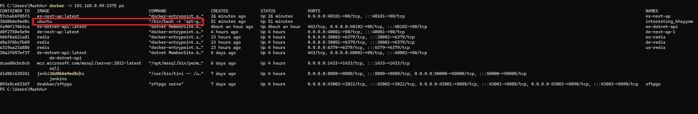
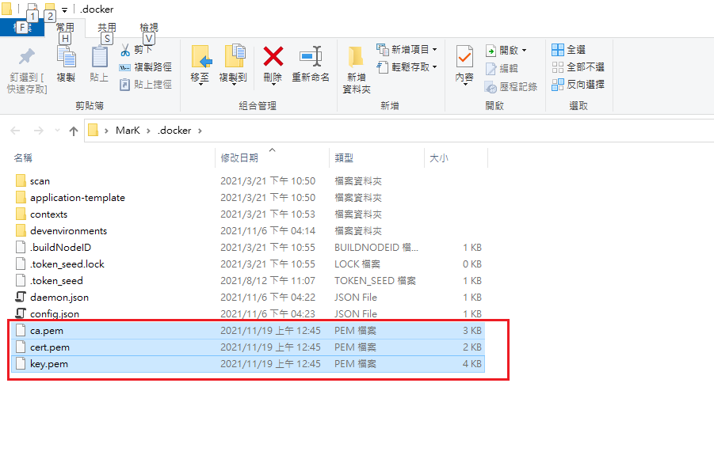
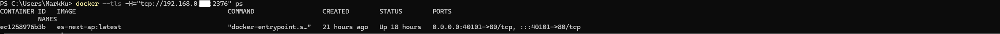

## 前言
最近在台灣的開發環境從 Windows 11 換成 Linux 後，發現網路設備出現異常流量，甚至經常導致公司的內部網路堵塞，嚴重影響工作。  

原本使用 Windows 11 時，微軟已針對蠕蟲和惡意程式提供許多防護措施，使得系統的安全性相對較高，但改用 Linux 後，安全管理需要自行負責，這為系統帶來了潛在風險。

## 問題的初步調查

剛開始以為是安裝了不該裝的軟體，導致 NAT 流量異常，但經過多次移除與交叉測試，問題依舊存在。最終，在 Docker 容器中發現了幾個異常的容器服務，顯然問題出在這裡。

即使在防火牆上限制 TCP/IP 300個連線數，但路由器仍然頻繁被打爆，導致辦公室網路多次癱瘓。

## 發現蠕蟲

經過調查，最後在Docker Host 中發現有多個異常的Ubuntu的容器在運行，進而得知得知，推測，內網可能有人的電腦中了蠕蟲，蠕蟲透過Docker 的遠端管理連接埠，內網的任何人，都能遠端拉取的官方的 Docker 映像檔，並可以連線進容器中做任何的操作，駭客利用這些惡意容器耗盡主機資源，包括網路、CPU 和硬碟，或偷取資料。


## 如何避免類似問題
了解駭客如何利用 Docker 權限過大的漏洞後，在找到蠕蟲或跳板之前，我決定加上 TLS 憑證來強化安全性，防止開發機的 Docker 被駭客劫持。

### 預先準備

- **開發機**：Ubuntu（192.168.0.123），[已開啟遠端管理端口](https://blog.markkulab.net/enable-docker-2375-port-in-ubuntu22/)
- **遠程管理用戶端**：Windows 11
- **環境需求**：在兩台機器上安裝 Docker

## 產生 TLS 憑證的步驟
### 1. 在 Ubuntu Docker Host 主機上生成 CA 金鑰
```bash
openssl genrsa -aes256 -out ca-key.pem 4096
```
> **提示**：輸入密碼時需妥善保存。

生成 CA 憑證：
```bash
openssl req -new -x509 -days 365 -key ca-key.pem -sha256 -out ca.pem
```

### 2. 生成伺服器金鑰與憑證

生成伺服器金鑰：
```bash
openssl genrsa -out server-key.pem 4096
```

生成伺服器憑證簽署請求 (CSR)：
```bash
openssl req -subj "/CN=*" -sha256 -new -key server-key.pem -out server.csr
```

使用 CA 簽署伺服器憑證：
```bash
openssl x509 -req -days 1000 -sha256 -in server.csr -CA ca.pem -CAkey ca-key.pem -CAcreateserial -out server-cert.pem
```

### 3. 生成客戶端金鑰與憑證

生成客戶端金鑰：
```bash
openssl genrsa -out key.pem 4096
```

生成客戶端憑證簽署請求 (CSR)：
```bash
openssl req -subj "/CN=client" -new -key key.pem -out client.csr
```

使用 CA 簽署客戶端憑證：
```bash
openssl x509 -req -days 365 -sha256 -in client.csr -CA ca.pem -CAkey ca-key.pem -CAcreateserial -out cert.pem
```

### 4. 修改 Docker 配置文件

編輯 Docker 服務配置：
```bash
vim /lib/systemd/system/docker.service
```

將 `ExecStart` 修改為以下內容：
```bash
ExecStart=/usr/bin/dockerd --tlsverify --tlscacert=/var/tls/ca.pem --tlscert=/var/tls/server-cert.pem --tlskey=/var/tls/server-key.pem -H tcp://0.0.0.0:2376 -H unix:///var/run/docker.sock
```

### 5. 設置文件權限

設置金鑰和憑證的權限：
```bash
chmod 0400 ca-key.pem server-key.pem key.pem
chmod 0444 ca.pem server-cert.pem cert.pem
```

### 6. 複製憑證到遠程客戶端

使用 SCP 將憑證複製到 Windows 客戶端：
```bash
scp -r mark@192.168.0.123:/var/tls E:\tls
```

Windows 用戶可以將憑證放入 `%USERPROFILE%/.docker` 資料夾中，以便自動使用憑證連線。(ca.pem 和 cert.pem 及 key.pem )



### 7. 重啟 Docker 服務

重載並重啟 Docker：
```bash
systemctl daemon-reload
systemctl restart docker
```

## 測試
沒有 tls 憑證，就不允許管理 Docker 
```
docker  -H="tcp://192.168.0.123:2376" ps
Error response from daemon: Client sent an HTTP request to an HTTPS server.
```
擁有 tls 的憑證，就能遠端管理 Docker 
```
docker --tls -H="tcp://192.168.0.123:2376" ps
```


## 結語
資訊安全真的蠻重要，真的沒想到 2375 ，這麼容易被蠕蟲利用，通過部署 TLS 憑證，有效保障了 Docker 遠程管理的安全性，避免因駭客利用漏洞造成的資源損耗與網路癱瘓。同時，建議定期審核 Docker 容器與映像檔來源，以降低安全風險。


## 參考

