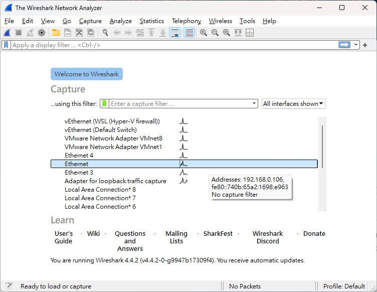
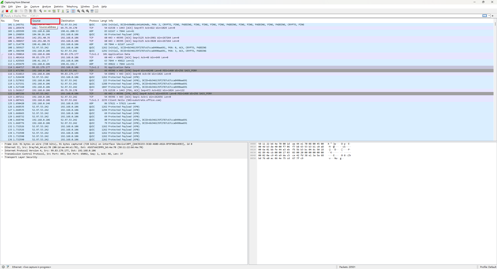
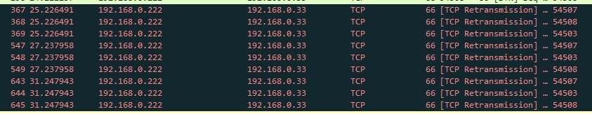
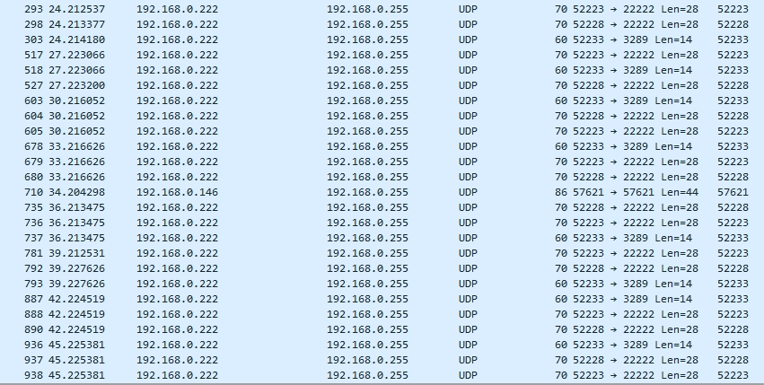

## 時空背景
先前在將 [Windows 開發機轉換為 Linux](https://blog.markkulab.net/migrate-windows-to-linux-development-environment/) 的過程中，發現公司電腦可能中了蠕蟲，因為開發機的 Docker 出現了未知的容器服務，網路共享資料夾（Samba）內也發現了不明的 .exe 檔案，這些跡象讓我們懷疑辦公室的電腦可能遭受蠕蟲感染，隨後，同事使用 Wireshark 找到感染來源的惡意設備，我也趁機向他學習了如何使用 Wireshark。

## 首先，了解什麼是蠕蟲 
蠕蟲是一種惡意軟體，與病毒相似，但其特點是能夠自我複製並通過網路快速傳播，以下是蠕蟲的常見行為特徵：  

我們都知道蠕蟲行為   

1. **自我複製**
   蠕蟲可以自我複製並通過網路傳播到其他設備，它們通常利用網路協議（如電子郵件、文件共享、即時通訊、FTP 等）進行擴散，有些蠕蟲甚至會主動掃描網路，尋找開放的連接埠或存在安全漏洞的設備進行感染。  

2. **利用安全漏洞**
   許多蠕蟲會利用操作系統或應用程式中的已知漏洞來入侵設備。它們的第一步通常是掃描內網中的設備，尋找可以利用的連接埠漏洞。  

3. **消耗資源**
   蠕蟲會占用系統資源（如處理器性能、記憶體、網路頻寬等），導致受害設備或整個網路變慢。在某些情況下，這種資源消耗可能導致網路癱瘓或設備無法運行。  

P.S. 在我們的案例中，上述三項行為都已經發生，並且我們觀察到蠕蟲會通過掃描內網中的所有設備來尋找安全漏洞進行進一步的攻擊。  

## 什麼是 Wireshark
Wireshark 是一個功能強大的網絡協議分析工具，它通過捕獲和分析封包，提供深入的網絡流量可視化，幫助用戶檢測網絡異常行為並排查問題。  

## 使用 Wireshark 分析網絡流量

### 1.下載，並安裝 Wireshark - [連結](https://www.wireshark.org/#downloadLink)

### 2. 首先，選擇網路卡
在 Wireshark 中，首先需要選擇要捕獲流量的網路卡。

### 3. 開始錄製並排序來源
錄製一段時間的網絡流量後，可以點擊 Source 欄位進行排序，找出異常的流量來源。

### 4. 找到異常設備
最後，你就會某些電腦會有異常的網路行為，會去掃每一個 Port，最後將那台電腦重裝。

## 補充
* [有CLI及 GUI的掃 Port 的小工具 - nmap](https://nmap.org/download#windows)
* [網路剪刀手](https://www.soft4fun.net/software/internet/netcut-%e7%b6%b2%e8%b7%af%e5%89%aa%e5%88%80%e6%89%8b.htm)
