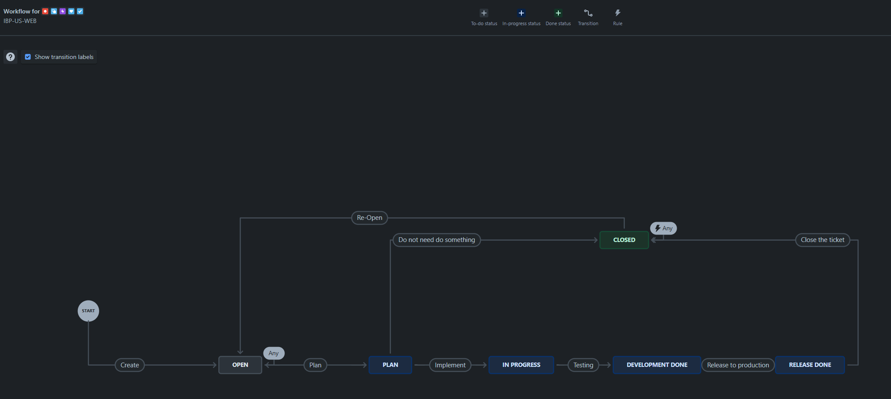

## 時空背景
一年半前我們導入 Jira，在整理筆記時，發現還有一篇未發，就順手整理個筆記。

### **Jira **
**Jira** 是一款專業的專案管理工具，不論是軟體開發還是日常任務管理，都能幫助團隊有效協作，保持專案進度清晰透明。

### **整合 Github Connect**

Jira 與 Github 整合後，就能直接在 Jira 中關聯相關程式碼，提升工作效率。步驟如下：
- 按照官方指引設定：[Integrate with Github](https://support.atlassian.com/jira-cloud-administration/docs/integrate-with-github/)

###  **開發流程與敏捷規劃**
因為我們導入敏捷開發，兩週進行一次 Sprint，並規劃每次迭代的目標與交付內容，依據團隊開發方式定制工作流程圖，並在每天站立會議前，更新JIRA 狀態，籍由看板可以很清楚了解專案目前的進行度。


### **Jira 使用規則**
1. **基本規範**
   - 任務標題需以「單號 + 空白 + 訊息」的格式呈現，例如：
     - 單一任務：`IUW-8 fix xxxx`
     - 多個任務：`IUW-8 IUW-9 fix xxx`
   - 也可利用單號建立分支，Jira 會自動與程式碼關聯。

2. **子任務（Sub-task）原則**
   - 如果任務過於繁重或需多人協作，建議拆分為子任務（Child Issue）。
   - 若任務由單一成員處理，使用 *Check List* 紀錄進度更直觀。
   - 如果模組過於龐大，應建立新任務並透過 *relates to* 關聯主要任務。

3. **Pending 任務處理**
   - 當任務受阻時，務必標記 **Flag** 並清楚註明原因，以便後續處理。

4. **增強型任務（Enhance Type）**
   - 每次優化或導入新技術前，應先與技術主管與 PM 討論，確保計劃清晰後再建任務。
   - 詳細記錄解決方案，方便日後參考。

### **在開發過程中發現，相依性的 BUG 的處理方法**

1. **立即修復**
   - 當 BUG 阻礙進一步開發時，應馬上建立新任務卡，開會提出來討，通知 PM 討論，優先處理。

2. **順便修復**
   - 若 BUG 不直接影響這個Sprint 的時程，可以順手修復，但請建立並通知PM。

3. **延後修復**
   - 無影響當前需求時，應建立新卡片，標註並由 PM 安排後續處理。

### **Jira 常用篩選器範例(JQL)**

#### **個人任務相關**
- **我建立的任務**
  ```
  reporter = currentUser() AND resolution is EMPTY
  ```
- **分配給我的任務**
  ```
  assignee = currentUser() AND resolution is EMPTY
  ```

#### **專案管理相關**
- **超期任務**
  ```
  project = "IBP-US-Web" AND due < now()
  ```
- **過去 30 天完成的任務**
  ```
  project = "IBP-US-Web" and resolved >= startOfDay(-30d)
  ```
- **狀態最近變更的任務**
  ```
  status changed DURING (startOfWeek(-1), endOfWeek(-1))
  ```

### **其他推薦套件工具**

1. **Microsoft Teams 通知**
   - 安裝 Jira Cloud 插件，隨時透過 Teams 接收更新通知：[Teams 插件](https://teams.microsoft.com/l/app/aa183fd9-7104-46c4-af9f-9ee9b81d717e?source=app-details-dialog)

2. **Check List 插件**
   - Jira 並沒有內建的check list，需要進階 Check List 功能時，可使用這款免費插件(每張單20筆上限)：[Checklist for Jira Free](https://marketplace.atlassian.com/apps/1223660/checklist-for-jira-free?tab=overview&hosting=cloud)

## 最後

導入 Jira 不僅能提升團隊效率，更能讓專案管理流程有條不紊，確保每個任務按時交付且清晰可追溯。
藉由上述策略與工具，導入 Jira 不僅能有效提升團隊的協作效率，也能確保專案流程的清晰與高效運行。

