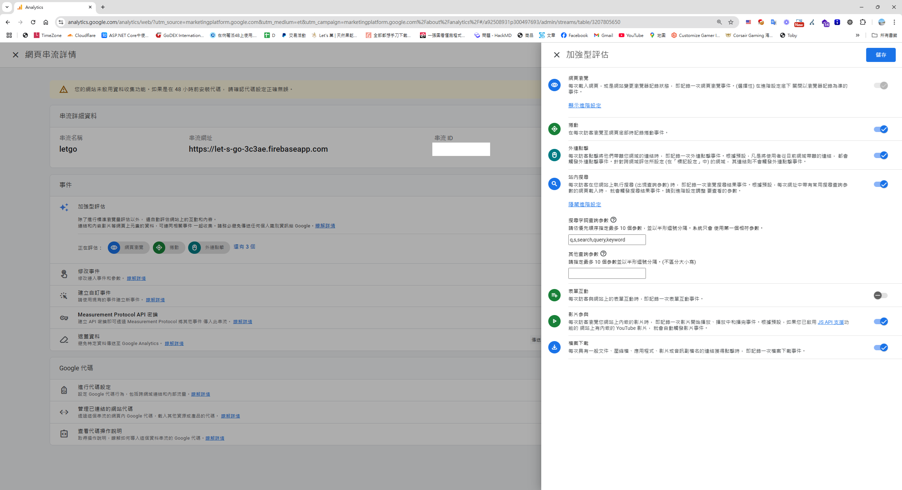
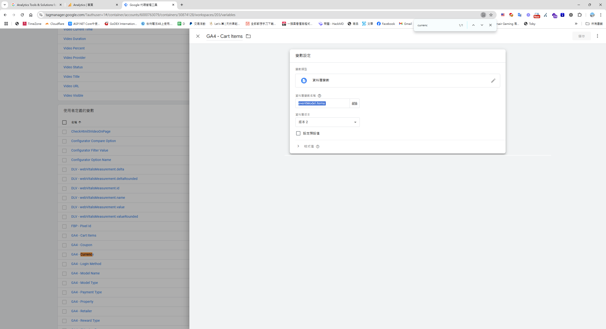

## GA 與  GTM 的關係

### **Google Analytics (GA)**  
GA 是一款網站分析工具，主要用於收集並分析用戶行為數據。透過 GA，您可以深入了解網站訪問量、用戶行為、轉換率等數據。而 GA 的報表數據，通常是透過 Google Tag Manager (GTM) 傳送的。

### **Google Tag Manager (GTM)**  
Google Tag Manager (GTM) 是在 2012 年 10 月 1 日 正式推出的。它是 Google 為了解決網站標籤管理的複雜性而開發的工具，旨在讓行銷人員和網站管理員能更方便地管理追蹤代碼和標籤，而不需要頻繁依賴工程師修改程式碼。

在 GTM 出現之前，若需要新增事件追蹤（例如將數據傳送至 Google Analytics 或嵌入第三方追蹤碼），通常必須請工程師手動編寫並嵌入程式碼。這樣的方式不僅繁瑣，還容易出錯。  
然而，有了 GTM，這些工作變得更加便捷，GTM 讓使用者能在不改動網站原始碼的情況下，直接加入腳本或 HTML，就像為網站開啟了一扇靈活的 JavaScript 後門。

## 首先談到 GA 事件前，我們必須在網站先埋設追蹤代碼 
進入 GA4，按照以下路徑操作：
1. **設定** → **資料收集和修改** → **選擇資料串流**。
2. 點擊 **代碼設定** → **安裝操作說明** → 選擇 **手動安裝**，並將提供的程式碼嵌入網站。


#### **注意** GTM 的容器 ID 和 GA 的測量 ID 很容易混淆。

以下是兩者的比較：

| **特性**         | **GA 測量 ID**                        | **GTM 容器 ID**                   |
|------------------|---------------------------------------|-----------------------------------|
| **功能**         | 用於追蹤和分析數據                  | 用於管理和部署多個標籤            |
| **格式**         | `UA-XXXXXX-Y` / `G-XXXXXXXXXX`       | `GTM-XXXXXXX`                     |
| **直接部署方式** | 嵌入 GA 追蹤代碼                    | 嵌入 GTM 容器代碼                 |
| **靈活性**       | 僅能追蹤單一工具數據                | 支援多個工具的標籤管理            |
| **適用對象**     | 偏向技術人員或需求簡單的網站          | 適合需要頻繁調整標籤的行銷團隊    |


如果你的需求只是單純追蹤 GA 數據，且網站結構簡單，可以直接使用 **GA 測量 ID**；但如果需要管理多個標籤（如 GA、Facebook Pixel、AdWords 等），或經常進行測試與調整，使用 **GTM 容器 ID** 會更靈活。

### **GA4 的事件分類**
GA4 的事件分成三大類，我們可以根據需求選擇適合的事件類型。

#### 1. **預設事件**
- **自動蒐集事件**  
這類事件無需額外設定，只要嵌入 GA4，就會自動開始收集。例如：頁面瀏覽（Page View）。

- **加強型測量事件**  
需要在資料串流中開啟「加強型測量」，啟用後會自動收集常見互動數據，例如：
  - 滑動捲動（Scroll）
  - 外部連結點擊（Outbound Clicks）
  - 站內搜尋（Site Search）> 依據 url 的參數 
  - 影片參與（Video Engagement）
  - 檔案下載（File Download）



#### 2. **建議事件**
建議事件需要依照官方指引進行設定，並透過埋設程式碼將資料送到 GA。例如：
- 登入（Login）
- 登出（Logout）
- 訂購（Order）
- 電子商務事件（Ecommerce Events）

針對電子商務網站，以下是常見的建議事件：
- `view_item_list`: 商品列表瀏覽  
- `view_item`: 商品詳情瀏覽  
- `add_to_cart`: 將商品加入購物車  
- `add_payment_info`: 填寫付款資訊  
- `purchase`: 完成購買  

詳細指引請參考 [官方文件](https://developers.google.com/analytics/devguides/collection/ga4/ecommerce?client_type=gtm&hl=zh-tw#view_item_details)。

#### 3. **自訂事件**
如果預設事件和建議事件無法滿足需求，可以透過自訂事件來蒐集客製化數據，並生成符合業務需求的報表。

自訂事件的應用範例：
- 分析用戶喜歡點擊的按鈕類型。
- 追蹤用戶偏好的登入方式（例如 Google、Facebook、Email）。

## 接著，如何埋設 建議事件/自訂事件，並將資料透過 GTM 打到 GA

只有建議事件和自訂事件需要，主動的埋設程式碼，將程式資料透過GTM 打到GA。

### 1. 前端透過gtag 將商品傳遞參數至 GTM

```
gtag('event', 'add_to_cart', {
  currency: 'USD', // 幣別
  value: 29.99, // 總價值
  items: [
    {
      item_name: 'Gaming Keyboard', // 商品名稱
      item_id: 'SKU12345', // 商品 ID
      price: 29.99, // 商品價格
      quantity: 1, // 商品數量
      item_brand: 'HYTE', // 品牌
      item_category: 'Peripherals', // 類別
      item_variant: 'Black', // 商品變體
    },
  ],
});
```
### 2. 設定變數 -> 變數 -> 新增 

### 3. 設定觸發條件 -> 觸發條件 -> 新增 

### 4. 至代碼管理工具 -> 代碼 -> 新增 


P.S. 在看GA4 範例時，會看到 gtag 與 dataLayer ，其實 dataLayer 是 gtag.js 的基礎，gtag.js 的運作基於 dataLayer，當你呼叫 gtag() 函數時，它實際上是將參數推送到 dataLayer 中，並傳遞到相關的 Google 工具。

## GTＭ　事件除錯

如果你想確認 JavaScript 是否正確傳送到 GTM，可以使用 **[Tag Assistant](https://tagassistant.google.com/)** 進行除錯。  

Tag Assistant 是一個由 Google 提供的工具，用於檢測和診斷 GTM 和 GA 標籤是否正確執行。在排查事件追蹤問題時，它是非常實用的工具。

## 如果是自訂事件，接著回到 GA ，透過自訂維度，將事件接起來，這樣就可以在自訂報表中使用。

管理(左下角) > 資料顯示 > 自行訂義  > 建立自訂維度> 


## GA 除錯
回到GA > Analytic Debug view  -> 側邊欄 -> 管理(左下角) -> debugView 


## 額外補充 - 透過 GTM 加載第三方JS Clarity JS
**Microsoft Clarity** 是一個免費的用戶行為分析工具，能夠幫助你了解用戶如何與網站互動。以下是如何透過 GTM 加載 Clarity JS 的步驟：

### 步驟 1： 觸發條件 > 新增
在 GTM 中，建立一個觸發條件，例如「所有網頁」，或依據需求設定特定條件。如下圖所示：


### 步驟 2： 代碼 > 新增


```html
<script type="text/javascript">
(function(c,l,a,r,i,t,y){
    c[a]=c[a]||function(){
        (c[a].q=c[a].q||[]).push(arguments)
    };
    t=l.createElement(r); t.async=1; 
    t.src="https://www.clarity.ms/tag/"+i;
    y=l.getElementsByTagName(r)[0];
    y.parentNode.insertBefore(t,y);
})(window, document, "clarity", "script", "h6t6k0bky81");
</script>
```

注意：將 `h6t6k0bky81` 替換為你自己的 Clarity 專案 ID。

### **步驟 3：提交並發佈**
完成觸發條件和標籤設定後，進行以下操作：
1. 點擊 GTM 的 **提交** 按鈕。
2. 在變更說明中填寫「新增 Clarity 標籤」。
3. 發佈變更。
