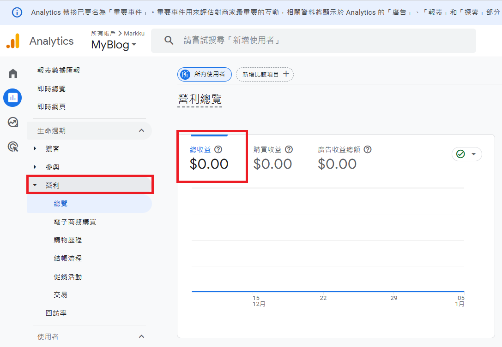
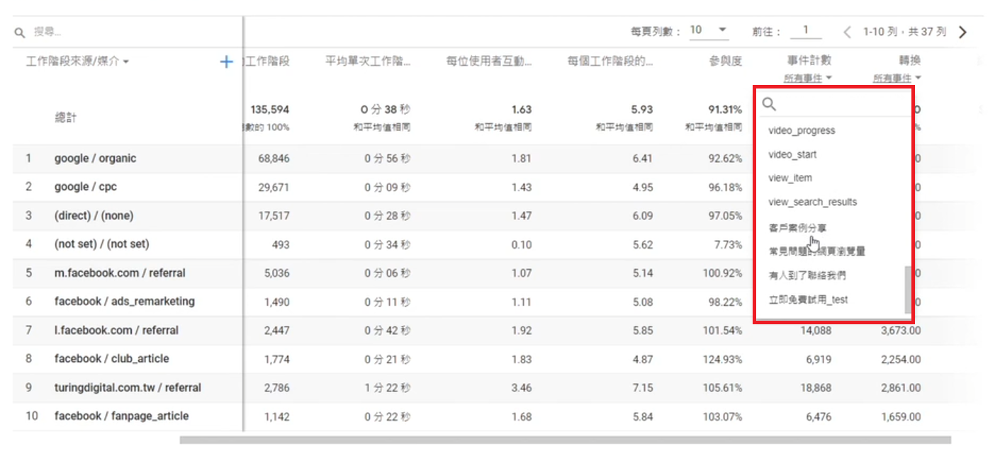

## 數據的價值
- **數據無用，洞察有用**：數據本身沒有價值，真正關鍵在於從中發現問題，並轉化為提升業績或轉換率的策略。
- **短期數據只能當參考，觀注長期趨勢**：單一數據點往往難以揭示全貌，唯有長期趨勢才能展現價值。

## GA4 報表概述

GA4 提供以下四個核心區塊的報表：

1. **客戶開發**：了解使用者如何進入網站。
2. **參與度**：分析使用者在網站上的行為與互動。
3. **營利**：追蹤網站營收情況（需要工程師埴入進階電子商務程式碼）。
4. **回訪**：分析新者與舊客的比例。

## 報表解讀指南

### 了解熱銷商品

- 每日熱銷商品的銷售表現。
- 高銷量但低利潤的商品清單。
- 對比銷售率和觀看率，找出問題。

### 流量來源分析

- 廣告引流效果。
- 社群媒體與論壇等外部網站流量貢獻。
- 自然流量的趨勢。
- 根據來源數據，挖掘不同國家和地區的來客表現，辨識高潛力市場，以進行重點推廣。

### 電子商務報表

如果發現 GA4 預設營利金額為 0，則需要工程師實作電子商務事件，將訂單資訊傳送到 GTM，並將資料轉送到GA。



### 計算訂單轉換率

轉換率是電子商務網站衡量效能的重要指標，用來衡量訪問者完成目標行為的比例。

公式：

轉換率 = 轉換次數 / 總訪問次數

**範例：**

- 訂單數：3834
- 工作階段（訪問次數）：347311

```
3834 / 347311 = 0.011
```

除了訂單轉換率，還可關注以下指標：

- 購買轉換率
- 註冊轉換率
- 點擊轉換率
- 頁面轉換率
- 加入購物車轉換率

### 電商重點觀察

#### **電子商務轉換 - 放棄情況**

- **經紀放棄**：開始經紀但未完成購買的用戶比例。
- **購物車放棄**：將商品加入購物車但未購買的用戶比例。

#### **回頭客分析**

- 高價值回頭客 vs. 低價值回頭客
- 僅交易一次的新客

#### **高價值行為**

- 觀看影片但未購買的用戶。
- 搜尋商品但未購買的用戶。
- 點擊內部促銷但未購買的用戶。

## 自訂事件與目標設置

GA4 提供強大的自訂功能，使用者可以針對特定行為與轉換需求設置目標，包括：

- **追蹤用戶行為**：如點擊按鈕、觀看影片、提交表單等。
- **溝道轉換分析**：自訂事件可幫助構建轉換溝道，分析各階段用戶流失情況。
- **內容互動量測量**：追蹤文章讀及完成度、滑動深度等，用於優化內容策略。
- **網頁流量監測**：如提供促銷頁面和關注商品頁面的訪問情況。
- **目標自動化監視**：將自訂事件設為目標，實現關鍵轉換行為的自動化報表。
- **多平臺數據整合**：統一追蹤 App 和網站上相似事件，以實現跨平臺分析。

### 針對特定網址設置目標

- **目標**：了解某單位網址或特定頁面的效果。
- 設置自訂事件，追蹤特定頁面的訪問次數。

**範例：**



## 廣告效益指標

### 重要指標解讀

- **CPC (Cost Per Click)**：每次點擊成本，用於衡量引流成本。
- **CPA (Cost Per Action)**：每次行為成本，關注轉換成本。
- **CTR (Click Through Rate)**：點擊率，反映廣告吸引力。
- **ROAS (Return on Ad Spend)**：廣告支出回報率。

ROAS 是個相當重要的指標，這個數字代表，我投資了一塊廣告，賺了幾塊錢回來。

**範例**：

- 廣告支出：$10,000
- 廣告收入：$50,000
```
50,000 / 10,000  = 5
```

## 最後，自訂報表成果
我們針對不同的業務需求，設計了一系列自訂報表，幫助深入了解客戶行為與網站表現：

1. **購物車遺棄率分析**  
   探索購物車被遺棄的情況及其原因，找出優化機會。
   
2. **捲動深度追蹤**  
   瞭解用戶在網站上的互動程度，評估內容吸引力。

3. **高跳出率頁面排名**  
   找出用戶最常離開的頁面，並分析改善方向。

4. **客戶搜索行為報表**  
   追蹤客戶在網站上的搜索記錄，掌握熱門關鍵詞。

5. **時段訂單分析**  
   識別銷售高峰時段，為營銷策略提供依據。

6. **訂單轉換率追蹤**  
   評估轉化效率，優化銷售流程。

7. **登入方式偏好分析**  
   了解客戶偏好的登入方式（例如：Normal 、Discoard、Google）。

8. **熱門遊戲偏好報表**  
   分析客戶最感興趣的遊戲，為遊戲推薦提供指引。

## 補充說明
- **(not set)**：當 "Session source / medium" 顯示為 "(not set)" 時，表示 GA4 無法確定用戶的來源和媒介，可能是由於直接輸入網址或其他原因。
- **數據限制**：啟用 Google 信號且日期範圍內使用者數量偏低，可能導致報表或探索資料無法顯示。


