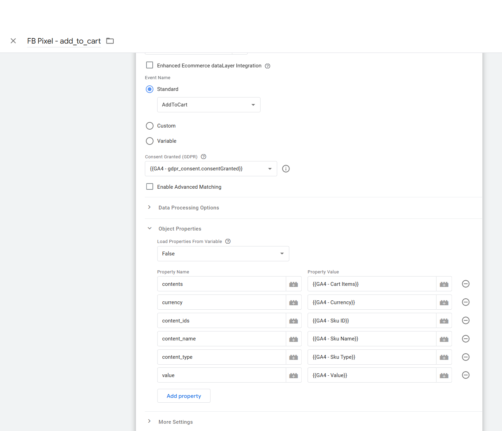
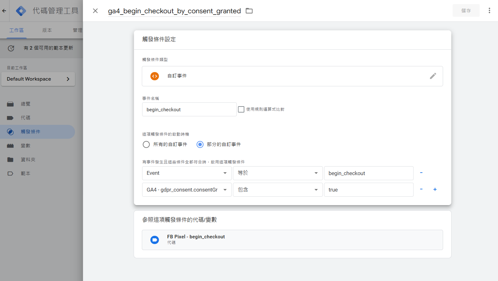

## 前言

如果你經營的網站主要服務歐美市場，而且使用了多個第三方追蹤工具，那就必須注意 GDPR（歐盟《通用資料保護法》）的符合規定要求 ，在 2024 年歐盟《數字市場法》（Digital Markets Act, DMA）上路後，追蹤使用者數據必須在獲得明確同意後才能進行。

本篇文章會教你如何用 Google 標籤管理工具（Google Tag Manager, GTM）來設定 **Consent Mode**，讓網站在使用者按下「同意」後，才能傳送 GA4 電子商務事件的參數傳送到 Facebook Pixel，確保追蹤行為符合GDPR規範。

## 為什麼需要了解 DMA？

《數字市場法》（Digital Markets Act, DMA）是歐盟為了規範科技巨頭（如 Google、Apple、Meta 等）而推出的法規，2024 年正式生效。  
對於在歐美經營的網站來說，這項法規要求網站必須清楚告知用戶如何使用他們的個人資料，並且獲得他們的同意後才能進行數據追蹤。

這對網站有什麼影響？  
如果你的網站服務歐美用戶，例如電商或 SaaS 平台，就需要符合這些規範，否則可能面臨高額罰款。

## 如何實現 GDPR 符合規定的用戶追蹤？

### 方法選擇

1. **使用現成的 Cookie 管理工具**  
   現在市面上有很多工具可以幫助你快速實現符合規定，比如 Cookiebot。這種工具不需要寫程式，價格每年大約 7,000 元新台幣，適合中小型企業。

2. **自行開發**  
   自行開發的方式雖然需要技術支持，但能更靈活地根據需求設計使用者介面和功能，本篇教學採用這方式，並透過 GTM 和程式實作來實現。

## 教學步驟

### 事前準備

1. 確保你的 GA4 電子商務事件已經設定完成。這些事件會用來傳遞資料到 Facebook Pixel。
2. 在 GTM 中新增一個變數，用來保存 Facebook Pixel 的追蹤 ID。

    

3. 設定 GTM 事件模板，確保事件能正確傳送。
    
	因為先前有串接GA電子商務事件，因此可以透過 GA 的事件的屬性轉送到 Facebook Pixel。	
	
	
	
		

### 前端實作：傳遞同意事件

當使用者按下「同意」按鈕時，可以用以下程式碼將同意事件和屬性透過 data layer值傳遞到GTM 

```typescript
export function acceptConsentGranted(isAllow: boolean = false) {
    if (!window || !window.dataLayer) {
        return;
    }

    window.dataLayer.push({
        event: 'consent_update',
        gdpr_consent: {
            consentGranted: isAllow, // true 或 false
            timestamp: new Date().toISOString(),
        },
    });
}
```
P.S. dataLayer 是 gtag.js 的基礎，gtag.js 的運作基於 dataLayer，

### 在 GTM 中完成設定

#### 1. 建立變數  
新增一個變數，用來接收 `gdpr_consent` 的值。 
  
  

#### 2. 修改觸發條件  
設定 GTM 中的觸發條件，讓事件僅在 `gdpr_consent.consentGranted` 為 `true` 時執行。以下是幾個範例：

- **FB Pixel - Add to Cart**  
  

- **FB Pixel - Begin Checkout**  
  

- **FB Pixel - Page View**  
  

- **FB Pixel - Purchase**  
  

### 測試與驗證

完成設定後，可以使用 [Tag Assistant](https://tagassistant.google.com/) 進行測試：

1. **模擬未按下「同意」的狀況**  
   確認此時沒有觸發任何追蹤行為。  
   

2. **模擬按下「同意」的狀況**  
   確認所有追蹤事件成功觸發並傳送資料。  
   

## 結論
GDPR 可能會使廣告投放越來越不精準，但實現 GDPR 符合規定不僅僅是遵守法律，對消費者來說，也是一種保障，通過正確配置 GTM 和實作 **Consent Mode**，你可以在保護用戶隱私的同時，繼續獲取商業所需的數據。

### 參考資料
- [Google Consent Mode 官方教學](https://inboundmarketing.com.tw/google-consent-mode-v2/)

