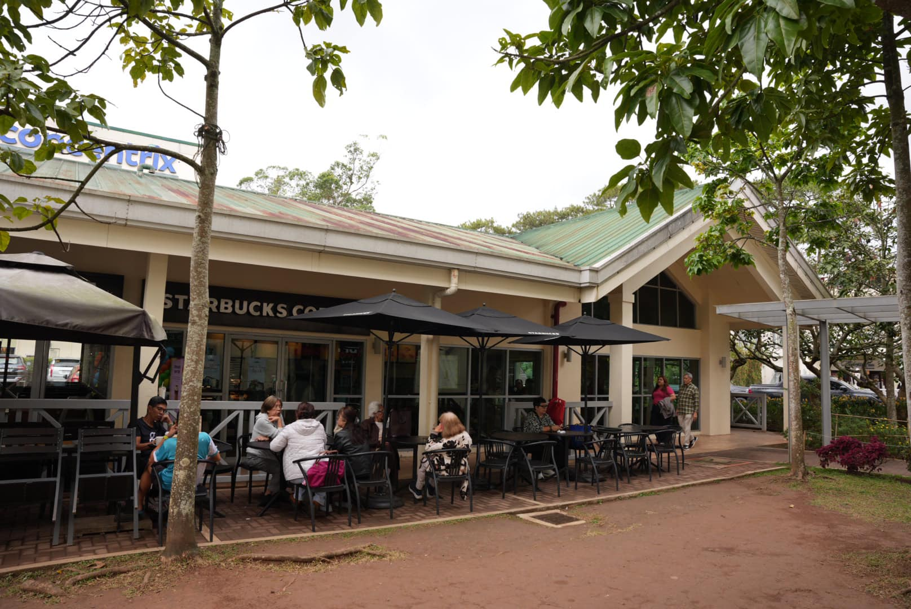
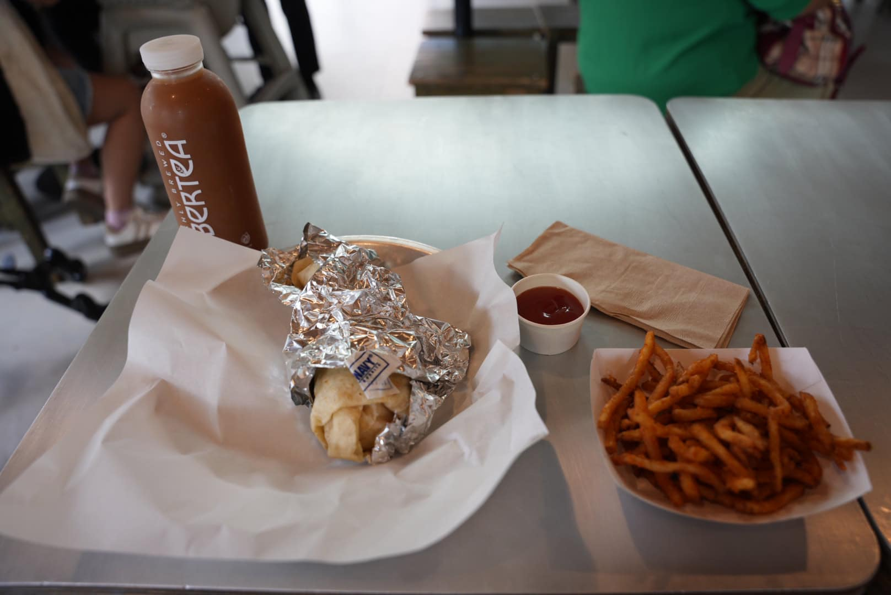
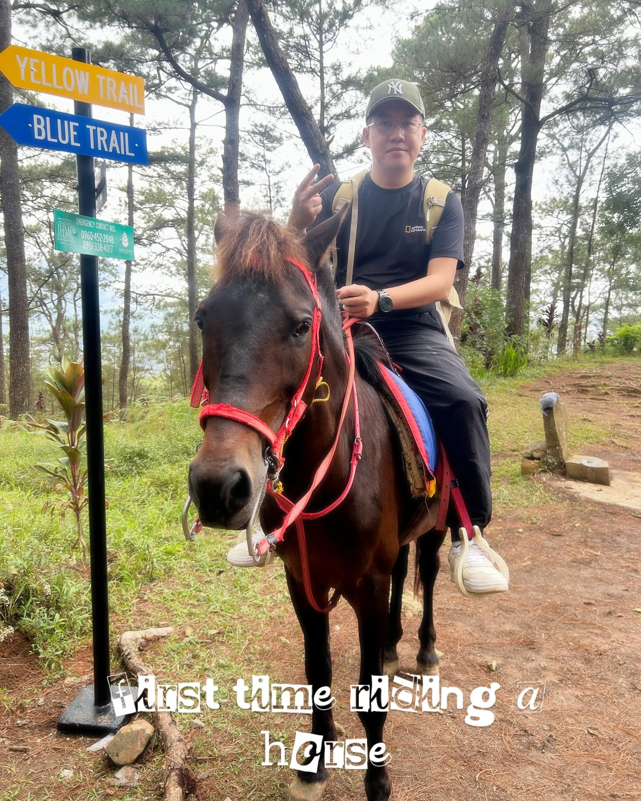

Camp John Hay used to be an American camp in Baguio, but it has since been turned into a resort.

And one more important thing—the food is amazing!

Thank God! The food is delicious!

I wanted to try horse riding since it’s very affordable. It costs just 300 PHP for 30 minutes.

This was my first time riding a horse.

My horse’s name was Chocolate.

He was very gentle!

I rode Chocolate up the hill for 60 minutes. During the ride, he pooped once and peed twice and a lot!

For the first time, I felt like a horse was actually obeying me.

At one point, I asked, "Why not stop here?"

The horse trainer said, "He’s peeing," and then I heard the sound.

That’s when I truly understood what wee-wee and poop-poop meant.

I was worried it might get on me!

Luckily, everything was fine. Nothing happened.

After that, I visited the Camp John Hay cabins (the soldiers' houses).

Next time, I probably won’t try hiking activities or golf.

