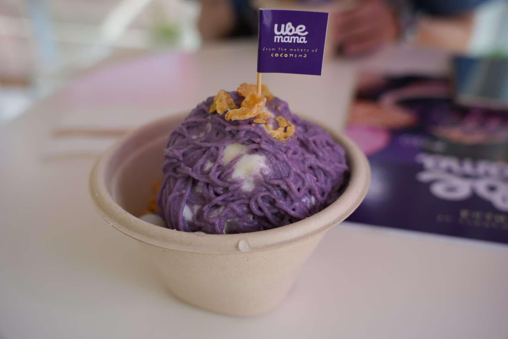

I have been studied at Pines Academy in Baguio for two weeks now, and I’m getting used to the food here. However, Baguio’s weather changes a lot sometimes it’s cold, sometimes it’s hot. My nose often gets runny, so I have to take cold medicine occasionally.  

Recently, I noticed that my blood pressure has dropped by about 20, and my belly has become smaller. I hope I can lose 10 kg while staying in Baguio and I didn't need take any pressure blood medicine when I go back to Taiwan.  

On Saturday, I went traveling alone. I visited the Flower Festival, North Haven Massage Shop, Rainbow Valley, and a strawberry farm.  

When I got back to school, my Korean classmate told me she had a stomachache and couldn’t eat dinner. So, I got a free bibimbap for dinner, and in exchange, I gave her some stomachache medicine and a few strawberries.  

On Monday, I went to the Yellow Trail in Camp John Hay with my classmate.  

The beginning of the Yellow Trail was the same place where I rode a horse last week. There was a lot of horse manure, and it didn’t smell very good.  

After that, we went back to school to study English and wrote a diary.  

Finally I met my Japanese roommate. I hope we can get along well.  

### Pictures

