## Introduction
when I arrive here baguio I feel a little boring ,because most of activties in baguio are drink something and hiking.
I am interested in hiking more then the drink something ,and I have height blood presssure,so I cannot drink too more.
but don't worried my healthy is improving.

## Action 
Since just studied at school was very boring,so I started collecting about Mount Ulap and tried to invite classmates to join me. 
I discovered that some of classmate also insterested in hiking, and I got a Jpanese roomate, then we formed a team to cliumb Mount Ulap.   

## MT.Ulap Information 

Mt. Ulap, located in Benguet, Philippines, is a popular hiking destination known for its stunning landscapes and breathtaking views. The trail spans approximately 8 kilometers and typically takes 7 to 8 hours for a round trip, depending on your pace.  

### **Highlights:**  
- **Gungal Rock:** A thrilling spot for adventurous photos, offering spectacular views.  
- **Grassland Scenery:** Picturesque rolling hills that resemble a mini New Zealand.  
- **Sea of Clouds:** Best experienced in the early morning under ideal weather conditions.  
- **Pride Rock:** A rock formation reminiscent of the iconic scene from *The Lion King*.  

### **Details:**  
- **Elevation:** 1,847 feet tall
- **Difficulty:** Suitable for beginners and intermediate hikers. 

### **Transportation**  

Since the tour guides are located at Ampucao Elementary School in Itogon, we have two options to get there, aiming to arrive around 5 to 6 a.m.:  

1. **Jeepney from Itogon Jeepney Terminal to Ampucao Elementary School**  
   - The first jeepney trip departs at 6 a.m.  
   - This is a budget-friendly option but may require an early wait.  
   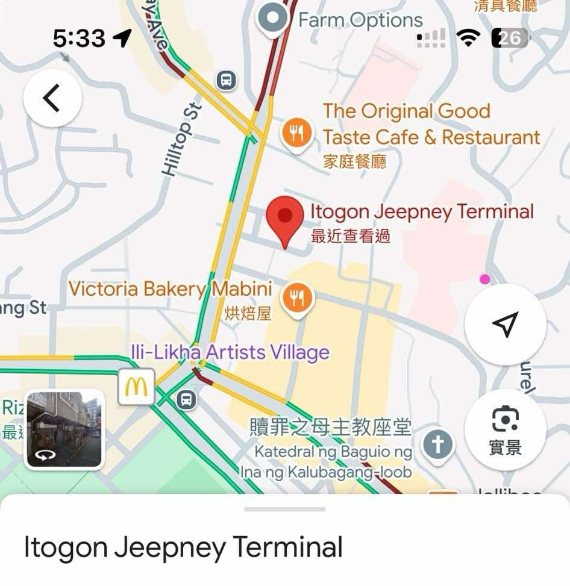  

2. **Taxi to Ampucao Elementary School**  
   - A more convenient choice if we need to arrive earlier or prefer a direct route.  

P.S. Taxi in Baguio operate for 24 hours,and grab can't support taking too fa

### Schedule & Time
We decieded to set off on Saturday based on Windy forecast, and most senior said the tour gides will started climbing the mountain around 7 a.m. and we need to wake up early at 4:00 am ,and depart from the lobby at 4:30 am,and we must submit request to academy in advance.

### Risk 
1. Weather - The weather that we cannot control. if it's raining heavily, we will cancelled. 
2. Transportation - The transportation was unpredictable. Jeepneys didn’t have a schedule, and sometimes we could find a taxi.
3. Condition - The weather changes a lot. if you feel unwell because the hiking trail is too long, you will uncomfortable, please stay in the school.
4. Step on the poop - There are a few cow over there, so you can see the poop everywhere,and you have to be careful where you step

### Mentions
1. Remember bring your guys ID card,for we can get a discount from your tour guide and foreign entrace fee 
2. Prepare some change for taking the Jeepey
3. Raincoat
4. Two bottle of water 
5. Set alarm at 4:00 am

## D-Day
We were worried about finding a taxi, but it turned out to be easy in the morning.   
We took a taxi to the Itogon Jeepney Terminal, but when we arrived, we found out the first trip was at 6 a.m., not 5 a.m.   
So, we asked the driver to take us directly to Ampucao Elementary School.  
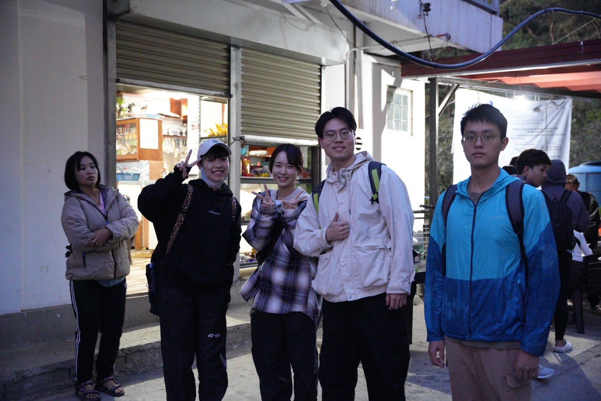

Walking and walking, we were so lucky to witness the sunrise
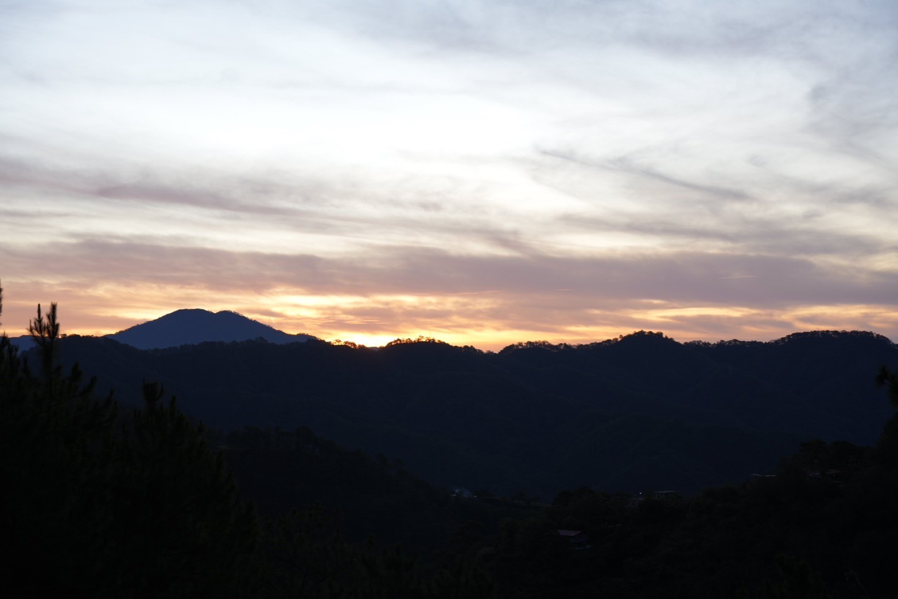

When we found a tour guide and paid all the fees, we started hiking.
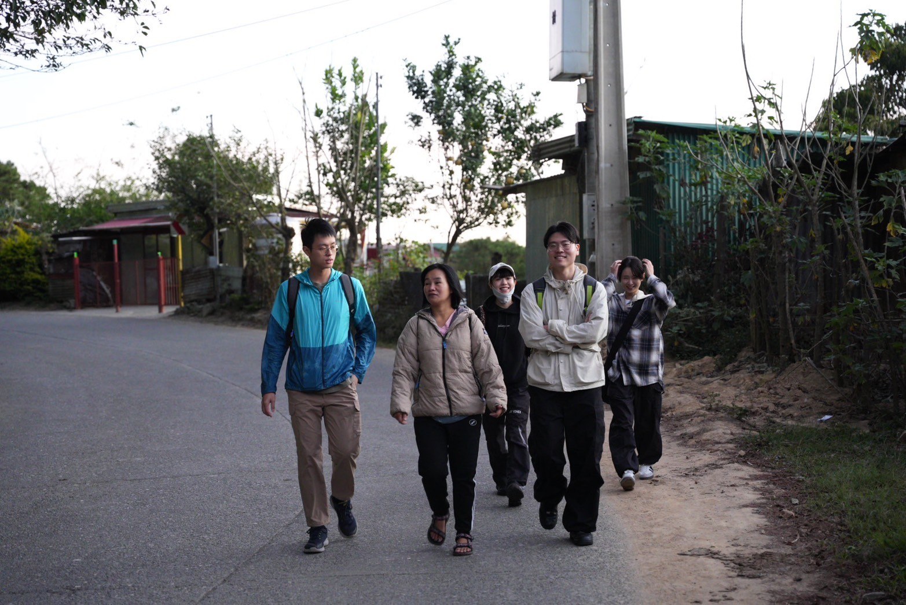

We passed by stones like Lion king's pride rock, but there were too many people, so we had to use p-pictures later.
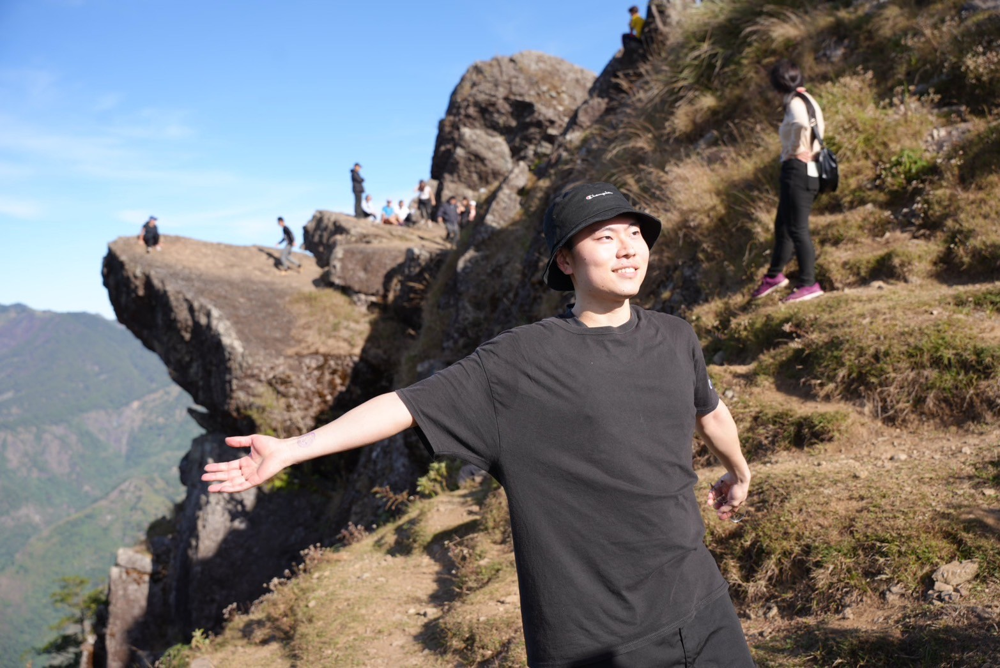
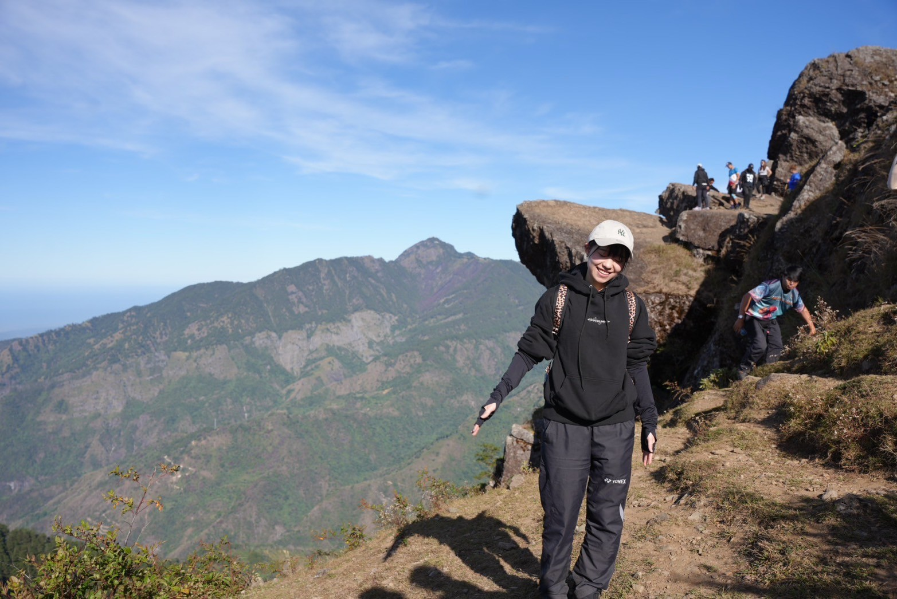

We have walked many difficult roads
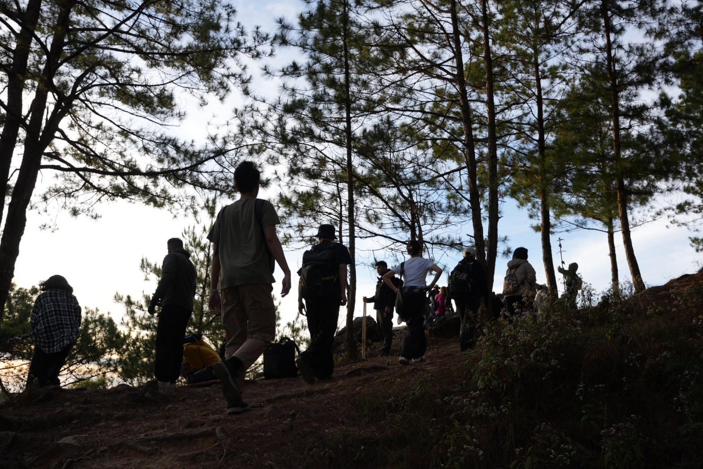
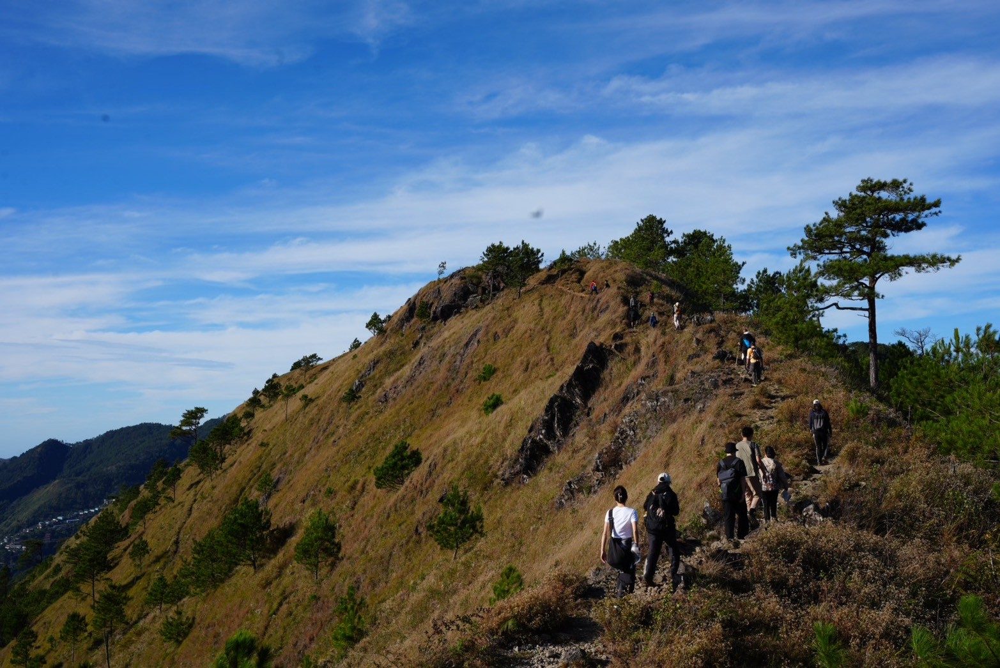
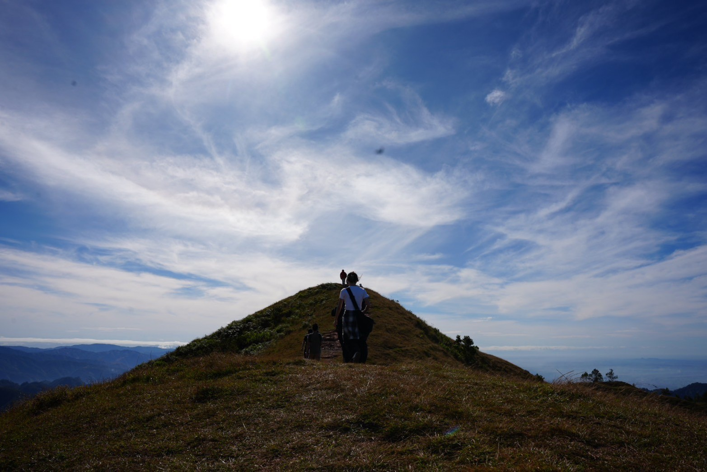

Then we arrived at the summit of Mt. Ulap. 
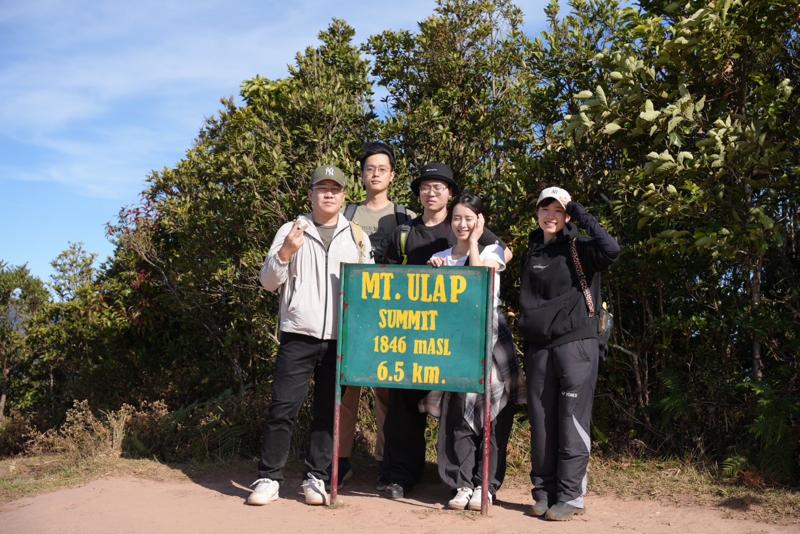

Finally, We hiked like a super-fast train, taking only 4 hours and 30 minutes! , and we are all got home safely.
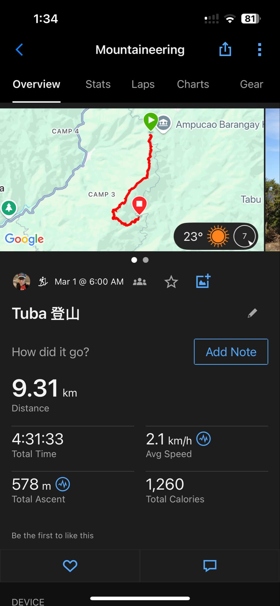

### **Total Traveling Fee**  

| **Expense**                           | **Cost**               | **Per Person**        |  
|--------------------------------------|------------------------|-----------------------|  
| Taxi Fare (City Hall to Ampucao Elementary School) | ₱1,000 / 5 persons | ₱200 per person      |  
| Tour Guide Fee                        | ₱1,050 / 5 persons     | ₱210 per person       |  
| Foreign Student Fee                   | ₱150 per person        | ₱150 per person       |  
| Taxi Fare (Final to Ampucao Elementary School) | ₱400 / 5 persons  | ₱80 per person       |  
| Jeepney Fare                          | ₱50                    | ₱50 per person        |  
**Total Cost Per Person:** ₱690  

