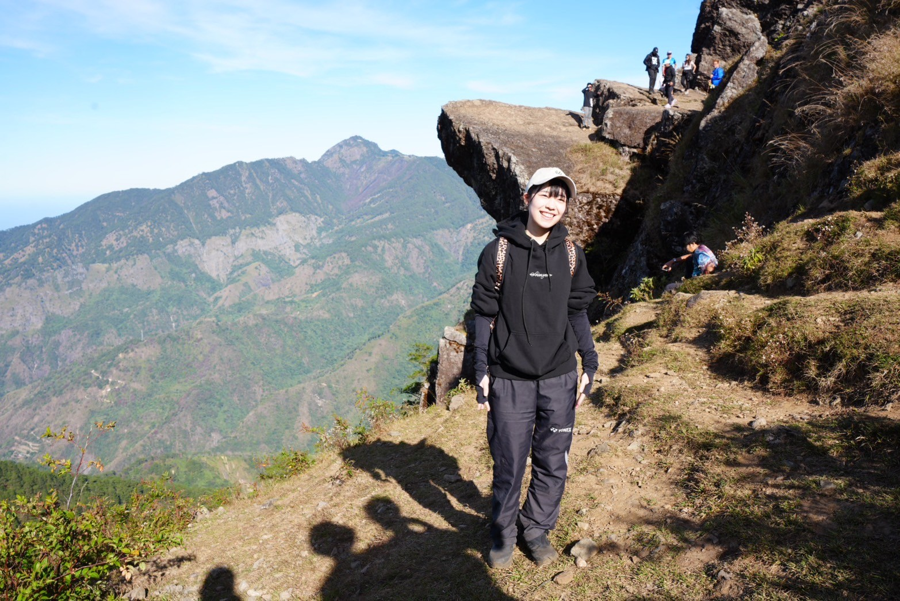

featured: true
author: Mark Ku
category: travel
thumbnail: mt-ulap-1.jpg
tags:
  -  pines
  -  baguio
## Introduction

Since I just started studying at a language school in Baguio, it felt a little bit boring on weekends because aside from studying, we could usually go hiking and drinking alcohol,so I began researching Mount Ulap and tried to invite classmates to join me. Finally, I discovered that some of my classmates are also insterested in hiking, and I got a Japanese roomate. Together, we formed a team to climb Mount Ulap.   

## About Mt. Ulap

Mt.Ulap, located in Benguet, Philippines, is a popular hiking destination known for its stunning landscapes and breathtaking views. The trail spans about 8 kilometers and typically takes 7 to 8 hours for a round trip, depending on your pace.  

### **Highlights:**  
- **Gungal Rock:** A thrilling spot for adventurous photos, offering spectacular views.  
- **Grassland Scenery:** Picturesque rolling hills that resemble a mini New Zealand.  
- **Sea of Clouds:** Best experienced in the early morning under ideal weather conditions.  
- **Pride Rock:** A rock formation reminiscent of the iconic scene from *The Lion King*.  

### **Details:**  
- **Elevation:** 1,847 feet tall
- **Difficulty:** Suitable for beginners and intermediate hikers. 

### **Transportation Options**  

Since the tour guides are located at Ampucao Elementary School in Itogon, we have two options to get there, we must arrive around 5 to 6 a.m. 

1. **Jeepney from Itogon Jeepney Terminal to Ampucao Elementary School**  
   - The first jeepney trip departs at 6 a.m.  
   - This is a budget-friendly option but may require an extra waiting time.  
     

2. **Taxi to Ampucao Elementary School**  
   - A more convenient choice if we need to arrive earlier or prefer a direct route.  

P.S. Taxi in Baguio operate for 24 hours,and grab can't support long distance location.

### Schedule & Time
We decieded to set off on Saturday based on Windy forecast, and more experienced people said the tour gides will started climbing the mountain around 7 a.m. and we need to wake up early at 4:00 am ,and depart from the lobby at 4:30 am,and we must submit request to academy in advance.

### Risks and Precautions
1. Weather - The weather that we cannot control. If it's raining heavily, it will be cancelled. 
2. Transportation - The transportation was unpredictable. Jeepneys didn’t have a schedule, and sometimes we could find a taxi.
3. Your Condition - The weather changes a lot in Baguio. If you feel unwell because the hiking trail is too long, you will be uncomfortable.  Please stay in the school.
4. Step on the poop - There are a few cow over there, so you can see the poop everywhere,and you have to watch out your way.

### Important Reminders for Your Trip
* Bring Your Student ID Card – Make sure to bring your ID card, as it will help you get a discount from your tour guide and a reduced foreign entrance fee.
* Prepare Small Change – Have some spare change ready for taking the jeepney.
* Pack a Raincoat – Be prepared for unpredictable weather with a raincoat.
* Bring Two Bottles of Water – Stay hydrated by bringing at least two bottles of regular bottled water.
* Set an Alarm for 4:00 AM – Ensure you wake up early by setting an alarm at 4:00 AM.(depends on your location)

## D-Day
We were worried about finding a taxi, but it turned out to be easy in the morning.   
We took a taxi to the Itogon Jeepney Terminal, but when we arrived, we found out the first trip was at 6 a.m., not 5 a.m.   
So, we asked the driver to take us directly to Ampucao Elementary School.  

Walking and walking, we were so lucky to witness the sunrise

When we found a tour guide and paid all the fees, we started hiking.

We passed by stones like Lion king's pride rock, but there were too many people, so we had to use p-pictures later.

Because there were so many people standing on Pride Rock taking pictures, we gave up waiting in line, but I have no regrets! Thanks to technology, we've all virtually been to Pride Rock.

Then we have walked many difficult roads

Then we arrived at the summit of Mt. Ulap. 

Finally, We hiked like a super-fast train, taking only 4 hours and 30 minutes! , and we are all got home safely.  
The scenery at Mt.Ulap is very beautiful, so I highly recommend hiking there.

### **Total Traveling Fee**  

| **Expense**                           | **Cost**               | **Per Person**        |  
|--------------------------------------|------------------------|-----------------------|  
| Taxi Fare (City Hall to Ampucao Elementary School) | ₱1,000 / 5 persons | ₱200 per person      |  
| Tour Guide Fee                        | ₱1,050 / 5 persons     | ₱210 per person       |  
| Foreign Student Fee                   | ₱150 per person        | ₱150 per person       |  
| Taxi Fare (Final to Ampucao Elementary School) | ₱400 / 5 persons  | ₱80 per person       |  
| Jeepney Fare                          | ₱50                    | ₱50 per person        |  
**Total Cost Per Person:** ₱690  

