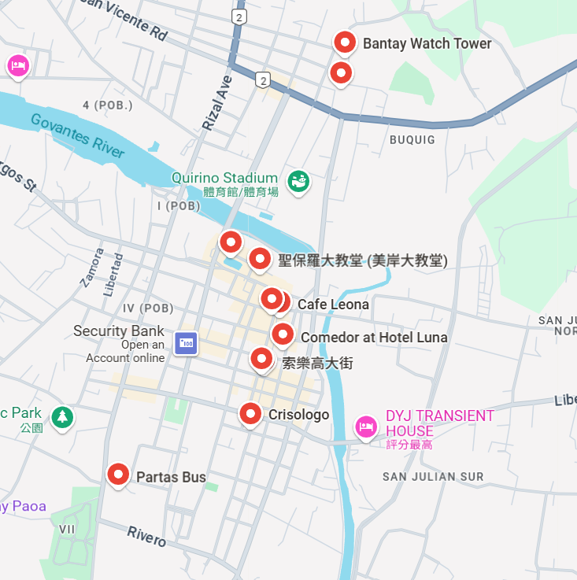

## Introduction  
**After visiting most of the attractions in Baguio, I wanted to find something new to do on the weekends.**  
在參觀完碧瑤的大部分景點後，我想找點新的事情來充實週末。  

**That’s when I discovered Vigan and the Banaue Rice Terraces — both are UNESCO World Heritage sites.**  
就在那時，我發現了維甘和巴拿威梯田——兩個都是聯合國教科文組織的世界文化遺產。  

**This trip was also my first time taking a long-distance bus in the Philippines, which turned out to be quite an experience!**  
這趟旅程也是我第一次在菲律賓搭長途巴士，結果真的是一場難忘的體驗！  

## Vigan  
**Vigan is a historic city in Ilocos Sur, Philippines, famous for its well-preserved Spanish colonial architecture.**  
維甘是位於菲律賓伊羅戈斯南省的一座歷史名城，以保存完好的西班牙殖民時期建築聞名。  

**Its cobblestone streets, horse-drawn kalesas, and heritage houses create a charming, old-world atmosphere.**  
它的鵝卵石街道、馬車(kalesa)和古老的傳統房屋，營造出迷人的舊世界氛圍。  

**It felt like stepping back in time.**  
走在裡面，就好像穿越回過去一樣。  

## Schedule Map

## Risks and Reminder  
**Early Departure: We had to wake up at 2 a.m. and set off from Pines's lobby by 2:30 a.m.**  
**(早起出發)** 我們得在凌晨2點起床，2點半從Pines學校的大廳出發。  

**Long Journey: The bus ride was long, so bringing a regular-sized bottle of water was essential.**  
**(長途跋涉)** 巴士車程很長，所以帶上一瓶正常大小的水非常重要。  

**Temperature: It was freezing on the bus (around 14-15°C). A jacket was a must!**  
**(低溫挑戰)** 巴士裡冷得像冰庫（大約14-15°C），一定要帶外套保暖！  

**Weather Contrast: Vigan greeted us with intense heat, so lightweight clothing was also necessary.**  
**(溫差反差)** 維甘迎接我們的是猛烈的熱浪，所以輕便的衣服也得備好。  

**Bus Schedules: There are various bus schedules. It’s best to visit the station in advance and ask the clerk for the latest information.**  
**(班次資訊)** 巴士班次很多種，建議提前去車站詢問櫃檯最新的時刻表資訊。  

## D-Day: Exploring Vigan  
**We left school at 2 a.m. and bought our tickets an hour before departure.**  
我們凌晨2點離開學校，提前一個小時買好了車票。  

**When we boarded the bus, we didn’t expect the air conditioning to be set to 15°C — it felt like a freezer!**  
我們上車後完全沒想到冷氣開到15°C，簡直像進了冷凍庫！ 

**After a six-hour bus ride, we finally arrived in Vigan. The heat was intense, a total contrast to the icy bus.**  
經過六個小時的車程，我們終於抵達維甘。天氣熱得像火爐，跟車上的冷凍空間形成了超大反差。  

**Our first stop was a local restaurant to refuel.**  
我們的第一站是當地一家餐館，先補充點能量再說。  

**Unfortunately, the church we planned to visit was under maintenance.**  
很不幸的是，我們原本計劃去參觀的教堂正在維修。  

**Still, we made the most of it by exploring other sights like the iconic lighthouse and wandering through Vigan’s beautiful streets.**  
但我們還是抓住機會，去了地標性的燈塔，還在維甘美麗的街道上閒逛探索。  

**I also tried a local delicacy — the famous Vigan empanada. It was delicious!**  
我還嚐了當地的特色美食——著名的維甘餡餅(empanada)，真的超級好吃！  

**However, one thing I couldn’t ignore was the strong smell from the horse-drawn carriages.**  
但有一點我實在無法忽視，就是馬車散發出的濃烈味道。  

**Sadly, it seemed like the horses didn’t get a bath every day.**  
可惜的是，看起來那些馬似乎不是每天都有洗澡。  

**On the way back, the journey felt even longer.**  
回程時，旅途感覺比來的時候還要漫長。  

**The air conditioning was still blasting at 16°C, and one of my Korean classmates ended up getting motion sickness.**  
冷氣依舊狂吹在16°C，其中一位韓國同學最後還暈車了。  

**It was quite the adventure, to say the least.**  
說實話，這趟旅程真的是跌宕起伏。  

## Helpful Encounters  
**The security guard at the bus station was incredibly kind.**  
巴士站的保安人員非常熱心。  

**He gave me useful tips and directions, which made the trip a lot smoother.**  
他給了我許多有用的建議和指引，讓這趟旅程順暢了不少。  

**Sometimes, a little kindness makes all the difference.**  
有時候，一點點善意真的能改變整趟旅程的感受。  

## Must-See Attractions  
- **Tricycle rides:** A fun and affordable way to explore the city.  
  **(三輪車)** 便宜又有趣的市區探索方式。  

- **Local restaurants:** The food is a must-try — especially Vigan empanada.  
  **(當地美食)** 一定要試試這裡的美食，特別是維甘餡餅！  

- **Carriage rides:** Though charming, prepare for the smell.  
  **(馬車)** 雖然很有情調，但要有心理準備迎接氣味轟炸。  

- **Historic church:** If it’s not under maintenance, it’s worth a visit.  
  **(古老教堂)** 如果沒在維修，絕對值得一看。  

- **Lighthouse:** A great spot for photos and a nice view.  
  **(燈塔)** 很適合拍照，還能欣賞美景。  

- **Starbucks:** For those who need a taste of home amidst the historic setting.  
  **(星巴克)** 如果你想在歷史古城裡喝一杯熟悉的咖啡，這裡有！  

**This trip was unforgettable — from freezing buses to the sweltering heat, from historic streets to delicious food.**  
這趟旅程真讓人難忘——從冰冷的巴士到炙熱的街頭，從古色古香的街道到美味的食物。  

**Vigan is truly a place where history and adventure collide.**  
維甘真的是個歷史與冒險交織的地方。  

**Would I brave the cold bus again for this experience? Absolutely!**  
我會為了這次經歷再忍受一次冷到發抖的巴士嗎？當然會！  

