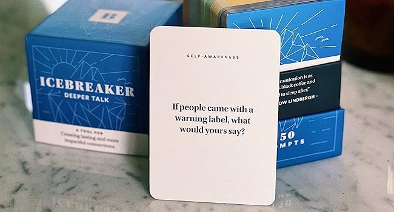

## Learning speaking journey / 口說的學習旅程
Two years ago, I went on a business trip to the U.S., but I couldn't say anything. So, I started learning English.  
二年前，我去美國出差，但我一句話也說不出來，所以我開始學英文

### **Stage 1: Single Words**  
At the first stage, I could only use simple single words to answer the question.  
從一開始只能用單字拼湊回答，  

### **Stage 2: Thinking and Translating**  
Then, I was improved, I could translate into English from Chinese thinking while speaking.   
接著慢慢進步到腦中用中文思考邊翻譯邊回答，  

### **Stage 3: Speaking with Mistakes**  
In the next stage, I could directly express ideas using multiple sentences with English thinking or another way describe answer, but I often lost grammar and conjunctions.  
再接著，可以用英文思考，回答也變得比較直覺，只能用很多句子很直覺地去表達一件事，但也常常忘了時態、文法及連接詞，  

### **Stage 4: Stuck and Stopping**  
After studying at a language school for a while, I realized my speaking progress have bottleneck.  
到了語言學校一陣子後，發現口說的進步停滯不前，  

### **Stage 5: Better Answers**  
So, I told with my teacher and adjusted my learning approach.  
於是我和老師調整了學習方式，  

Instead of focusing on the number of answers,  
不再只專注於回答問題的數量，  

I began practicing how to give more complete, content-rich, and natural responses.  
而是練習如何說出更完整、更有內容、更自然的回答。  

This article organizes the thinking structure, conjunction types, and common question examples I’ve gathered along the way.  
這篇文章整理了我在學習過程中總結的思考架構、連接詞分類，以及常見問題範例，  

I hope it helps you, too, break through your speaking bottleneck!  
希望也能幫助正在學英文的你，一起突破口說瓶頸！  

Because many of them are still in my photos, I will organize and upload them.  
因為很多還存在我的相片，我會逐步整理上來  

## Useful tools for exploring deeper English speaking / 這裡有幾個能幫助你深入練習英文口說的實用工具：
ICEBREAKER's deep talk cards has many kinds of English questions. Since I completed some of the lessons early, we used the Deep Talk cards to train in answering questions more deeply, and it's very helpful for speaking with english.   
ICEBREAKER 的 Deep Talk 卡片有很多種英文的問題，由於

我提前完成了一些課程，我們用這些 Deep Talk 卡片來練習更深入地回答問題，對提升英文口說非常有幫助。

## How to Structure Your Answer / 如何組織你的回答
1. **Point / 重點 **:  
   - Identify the key point of the topic and state your main idea clearly.  
   - **確定話題的關鍵點，清楚表達你的主要觀點。**  
2. **Consider / 思考**:  
   - Think about the reasons behind the topic, its causes, and its possible effects.  
   - **思考話題背後的原因、影響，讓回答更全面。**  
3. **Reason /理由**:  
   - Explain why you hold this opinion or why the point matters.  
   - **解釋你為什麼這樣認為，讓回答有說服力。**  
4. **Example /例子**:  
   - Provide a specific, relatable example to support your idea.  
   - **舉具體、生活化、過去經驗的例子來支撐你的觀點，讓回答更有說服力。**  

5. **Conjunctions / 連接詞**:  
   - Use appropriate conjunctions to make your sentences flow smoothly and sound more natural.  
   - **使用適當的連接詞，讓句子更順暢、更自然。**  

## Common Questions / 常見問題分類整理  
## 1. Ask You Question (Hobby / Opinion / Thinkigs)  

### What kind of food do you like? / 你喜歡什麼食物？  
I love Xiao Long Bao because it looks good, it's delicious, and easy to eat. The meat inside is fresh and juicy. When I eat Xiao Long Bao, I feel really happy. Furthermore, I could eat it every day for a whole week!  

我喜歡小籠包，因為它看起來很好吃，味道又美味，而且很方便吃。裡面的肉餡很鮮嫩，每次吃小籠包我都覺得很開心。而且我可以連續吃一個星期！  

### Could you show me how to eat the soup dumpling? 
Of course, the first step is to place the soup dumpling on your spoon.    
當然！第一步是把湯包放在湯匙上。  

Then, poke it to let the soup flow out.    
接著，戳破它讓湯流出來。  

Sip the hot soup carefully, and finally, enjoy the dumpling.    
小心地啜飲熱湯，最後再享用湯包。    

In addition, It’s also delicious with a bit of soy sauce and shredded ginger.    
搭配一點醬油和薑絲也很好吃喔！  

### What kind of sport do you like? / 你喜歡什麼運動？  
I love doing triathlons because the challenge keeps me healthy. Moreover, triathlons help me find balance in life. When I’m training, I learn to manage my time and push my limits.  

我喜歡鐵人三項，因為這個挑戰讓我保持健康，而且，它讓我在生活中找到平衡，每次訓練時，我學會管理時間，挑戰自己的極限，  

### How does fashion affect our lives? / 時尚如何影響我們的生活？  
Fashion is like a silent language. It lets you express your personality without saying a word. Dressing stylishly can make you feel more confident. Even if you wear a sweatsuit, it still reflects your mood. For example, bright and deep colors can make people feel calm, while light colors feel energetic.  

時尚就像一種無聲的語言，讓你不用開口也能展現個性，穿得時尚會讓人更有自信，即使是運動服，也能反映你的心情，例如，亮色或深色讓人感到平靜，淺色則讓人感覺充滿活力，  

### Are you a shopping addict? / 你是購物狂嗎？  
Not really, but when my stress level is too high, I tend to overspend. For example, after working overtime during a system launch, I bought a lot of unnecessary stuff.  

不算是，但當我壓力太大時，就會忍不住大買特買，例如，每次系統上線後加班，我就會買一堆沒必要的東西，  

### What do you think of body piercing and tattoos? / 你對刺青和穿洞有什麼看法？  
I don't like either, but if someone gets a tattoo or piercing, it's none of my business. People used to think tattoos meant someone was a gangster, but now it's the opposite. More young people see tattoos as a form of fashion. Personally, I agree with this.  

我不喜歡刺青和穿洞，但如果別人做了，那是他們的事，以前大家覺得有刺青的人像流氓，但現在完全相反，越來越多年輕人把刺青當作時尚，我個人也認同這個觀點，  

### Did you grow with pets with pet in your home ? 
When I was child, I was living in countryside, I had fed two dogs and a few japanese chicken. 
Sometime the chicken hatch eggs for my breakfast. I love my dogs because they were clingy and they easly understood my commands,
However I can't take any animal because I am living in the city  

### How was your weekend ? / 你週末過得怎麼樣？
I had a relaxing weekend, I went to San Juan to surf alone for two days and one night,The Ocean is very clean, and I never saw any garbage waste in the beach. I hire a surfing instructor, It was my first time to try surfing. 
On my first day,The wave was very big, so I drink a little sea water. even though it like mess, it's still very nice experience. 
According to my surfing instructor, the best time to surf is around 7 a.m., so even though I was experiencing muscle pain, I still went surfing because it’s really exciting.
I still went surfing because it's really exciting. Finally, when I went back to my dormitory ,my roomate was gone, 
but they removed my name instead my roommate's name on my domitry. I immediately told my manager, and so funny. 

### Do you think the 7 wornder  of the world deserve their ranking ?  / 你認為世界七大奇蹟配得上它們的排名嗎？
Yes, I partially agree that the official list is important because it makes me curious why the attraction is included in the 7 wonders.  
For example, I visited Vigan. Actually, the building is magnificent since I knew Vigan was included in the 7 wonders. But I think sometimes not everyone likes it.    
是的，我部分同意官方名單很重要，因為它讓我好奇為什麼這個景點會被選入世界七大奇蹟之一，例如，我去過維甘城（Vigan），其實，當我知道維甘被列入七大奇蹟後，覺得那裡的建築真的很壯觀，但我認為有時候不是每個人都會喜歡它。

### Do you think the manner are afftected  by income and social status
I agree manner will affected by income and social status. Actually, everyone prefer to get along with person with manner.
When you can make good relation ship with everyone, it's easier to get success in your career.  
when you communicate with another people with manner,it's easier to build long term friendship. 

### How is reality different from virtual reality ? 現實與虛擬實境有何不同

In reality, we can touch,smell and taste everything. However, in virtual reality,
anyting is virtual , so we need to use the technogy in performing something, 
In addition,it's impossible to touch it 

### How will new innovations change the way people live,work, and interact in the future? 新的創新將如何改變人們未來的生活、工作和互動方式？

In my opinion, before we try to made a 3D show room, we met bottleneck for iphone maximum memory and downling the 3D model file take longer time. 
Because the memory and network limit, we reduce the detail,I think in future, iphone remove the limit and network speed become faster, the virutal reality become popular.  
In the future, people will be able to see similar products online before buying them 

## 2. Comparison Question / 比較型問題   
### Do you prefer renting a house in the countryside or an apartment in the city? （你比較喜歡在鄉下租房子還是在城市租公寓？）  
I prefer living in the city because it offers more opportunities. Moreover, life in the city is more convenient. However, living in the countryside has its perks, like peace and space.  

我比較喜歡住在城市，因為有更多機會，生活也比較方便，不過，鄉下也有它的好處，比如安靜和空間大，  

## 3. Agree or Disagree Question / 同意 or 不同意問題  

### Do you think experience is the best teacher? / 你認為經驗是最好的老師嗎？  
I agree. When I started my first job, I learned more from mistakes than from training. Experience teaches you lessons that books can’t.  

我同意，當我開始第一份工作時，從錯誤中學到的比訓練還多，經驗教的課，是書本學不到的，    

## Watching tv  is waste of time. Do you agree or disgree? 
Right now, I agree with the idea. the watching tv is waste a lot of time because I have more priority
things to do, For example,Learning english or AI and do excise are more important for me, 
and watching tv the topic always focus on the political, it's really helpful, but I still watching movie on internet, the movie makes me relaxed and give me a opportunity English.
However, when I was child the wathcing tv help me killing the time. 

### Which would you prefer to see, human or natural 7 wonder? / 你比較想看人類建築7大奇觀還是自然7大奇觀？

I prefer to see the natural wonder because when I go hiking, it makes me relaxed. Even though I have visited many times, they have a different vibe based on the weather.
Moreover, when you visit at different times, you could see the beauty of sunrise or sunset and the sea of clouds.
In my country, we have a mountain Yushen included in the 7 natural wonders. When I went to Yushen, the black clouds followed us. When we arrived at the woodhouse, it started raining.  

While human wonders are also deserving to be visited by tourist because 
we can know the culture and life style people from historical attractions.

我比較喜歡看自然奇觀，因為當我去爬山時，它讓我感到放鬆，即使我去過很多次，不同的天氣也會帶來不同的氛圍，此外，在不同的時間去，你還可以看到日出、日落和壯觀的雲海之美，在我的國家，有一座叫玉山的山被列入了七大自然奇觀之一，我去玉山的時候，烏雲一路跟著我們，等我們到達山上的木屋時，雨就開始下了。

## 4. Look at the Picture and Describe /看圖故事   

### What do you see in this picture? / 你在這張圖片裡看到什麼？  
###  Please describe this situation

On a Sunny day , the mother took her son to sm mall to buy clothes.  

While the mother was busy watching the colthes, her son went to the toy store,  

After few minutes, her son noticed that he was lost the road.  

,so he was crying and looking for his monther.  

Her son went to the font desk and reported he was looking for his monther.  

Then,front desk announced that the child was missing.  

Finally the mother immediately went to the front desk to get her son.  

  
(todo)  

## Common Conjunctions / 常用連接詞分類整理
### **Cause and Effect / 因果關係的連接詞）**
- Because（因為）
- Since（因為 / 自從）
- As（由於 / 當...時）
- So（所以）
- Therefore（因此）
- Consequently（結果）

### **Adding Conjunctions / 補充說明的連接詞**
- Moreover（此外）
- Furthermore（而且）
- In addition（另外）
- Not only... but also...（不僅...還...）
- What's more（更重要的是）
- Besides（此外 / 除此之外）

### **Opposite Conjunctions（對比連接詞）**
- However（然而）
- On the other hand（另一方面）
- While（雖然 / 同時）
- But（但是）
- Yet（然而）
- Although / Though / Even though（雖然）
- Despite / In spite of（儘管）
- Whereas（然而 / 相反地）
- Nevertheless / Nonetheless（儘管如此）
- Conversely（相反地）
- Instead（反而）
- Rather（而是）

### **Examples / 舉例的連接詞 **
- For example（例如）
- For instance（舉例來說）
- Such as（比如）
- Like（像是）

### **Experience 經驗 / 看法 連接詞**
- In my opinion（依我看來）
- For me（對我來說）
- From my point of view（從我的角度來看）
