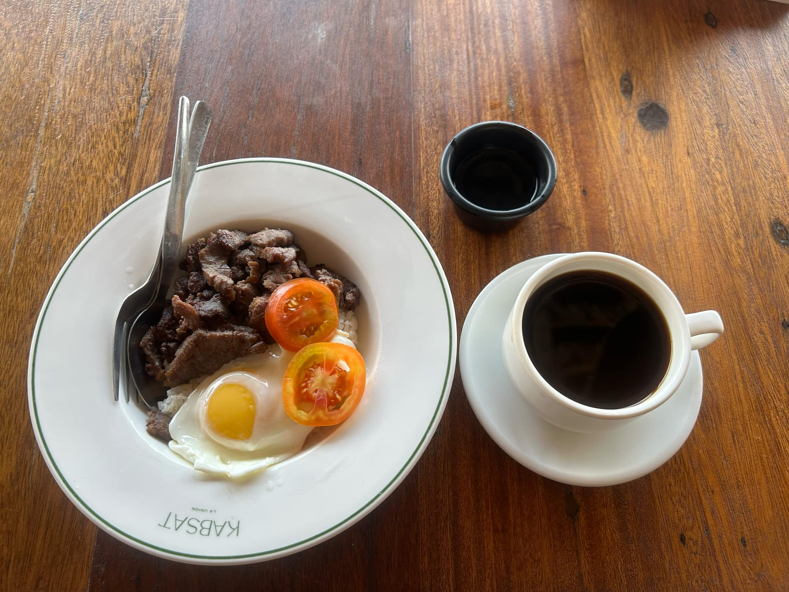

## Purpose / 目的  
This weekend, I’m planning to go surfing in San Juan. I’ve taken the Partas bus before, so riding it again feels easy for me. The trip from Baguio to San Juan takes about two hours. In addition, it’s a great chance for me to practice my English!  

這週末我打算去衝浪，且我之前搭過Partas巴士，所以再搭一次對我來說很輕鬆，從碧瑤到三灣的車程大約需要兩個小時，且讓我有機會練習使用英文。  

## About Urbiztondo Beach, San Juan, La Union / 關於三灣的Urbiztondo海灘  
Urbiztondo Street is located in San Juan, La Union, Philippines. It's famous for surfing, drawing many visitors to enjoy the beach and sunset. The area has many resorts, restaurants, and cafés, creating a laid-back vibe.  
Urbiztondo街位於菲律賓拉烏尼翁省的三灣，以衝浪聞名，吸引了許多遊客來享受海灘和日落，且附近有許多度假村、餐廳和咖啡館，氣氛悠閒放鬆。  

## Transportation / 交通  
The main bus line to San Juan is Partas. You didn’t need to buy tickets in advance, so you could just buy them about an hour before departure.    
到三灣的主要巴士路線是Partas巴士，不用提前買票，只要在發車前一小時買票即可。  

There were many schedules available, and buses heading to Vigan and Laoag also pass through San Juan.  
班次很多，前往Vigan和Laoag的巴士也會經過三灣。  

### Departure / 去程  
I mainly took the Partas bus to San Juan.  
我主要搭Partas巴士前往三灣。  

### Return / 回程  
I took a tricycle to the Partas station for my return trip, and Partas bus has a lot of bus schedule around 2 pm to 7 pm.  
回程我搭三輪車到Partas車站，Partas有很多巴士行程在下午2點在7點間  

## D-Day / 出發日  
On the first day, I set off from Baguio at 7 a.m. , and arrived at the San Juan 7-11 around 9 a.m.  
第一天，我早上7點從碧瑤出發，大約9點抵達三灣的7-11。  

Since there weren’t any coin lockers, I had to rent a room to store my stuff.   
因為沒有寄物櫃，我只好租個房間放東西。

I highly recommend the burger shop and berry drink in font of the 7-11. They were very tasty!  
我強烈推薦那家在超商對面的漢堡店和莓果飲料，超好吃！

When I got to the beach, the ocean was so clean, and I didn’t see any sea trash.  
當我到海灘時，海水超乾淨，一點垃圾都沒有。  

Then, I hired a surfing instructor for Php 600 /hour. It was my first time trying surfing. Even though the waves were big and fast, I felt really excited.  
我請了一位衝浪教練（一小時600披索）。這是我第一次嘗試衝浪，雖然浪又大又快，但我覺得超刺激！  

After surfing, I went back to the hotel to take a nap.  
衝浪完，我回到飯店小睡了一下。

Around 5 pm, I returned to the beach to watch the sunset. it's was mesmerizing   
大約下午5點，我又回到海灘看日落,日落真是令人著迷，

On the second day, the instructor said the best time to surf was around 7 am Even though my muscles were sore all over, I still went surfing again and it was totally worth it.
根據教練說早上7點左右是最佳衝浪時間。雖然全身肌肉痠痛，但我還是再次下水，真的超值得！  

Then I went to a popular restaurant Kabsat La Union for breakfast. The view was terrific and made me feel very relaxed, but the food was just ok.  

When I got back to school, I found out my roommate had moved to the IELTS campus,but academy even replaced my name on the dorm list with my roommate’s name.    
回到學校後，我發現室友搬到IELTS校區了，連宿舍門上的名字也被換成他的了。  

I thought, "Maybe I should move to the IELTS campus too that would be funny."  
我心想：「要不我也搬過去好了，感覺會很好笑。」

Overall, I had a great weekend to relax to recharge. Next time,I will go there again. 
總的來說，這週末我玩得很開心，放鬆又充電，下次有機會我還會再來

## Common Phrases / 旅行常用句子  
- I want a ticket to go to San Juan. / 我要一張去三灣的車票。  
- I think this price is unreasonable. Can you give me a discount? / 我覺得這個價格不合理，可以打折嗎？
- How much does it usually cost to get there? / 通常到那裡要多少錢？
- How much do people usually pay to get there? / 一般人到那裡通常花多少錢？
- What’s the average cost to get there? / 到那裡的平均費用是多少？
- Excuse me, could I ask you, how can I get there? / 不好意思，請問我要怎麼去那裡？ 

