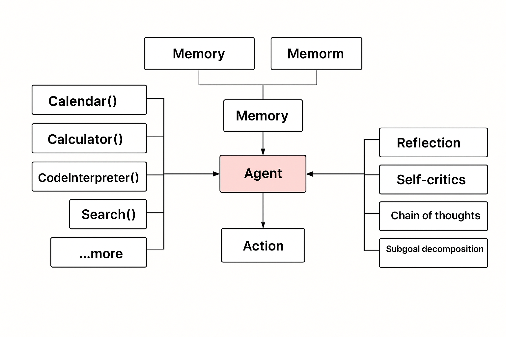

## 談談AI 的演進
深度學習 1.0 > 大型語言模型 2.0  > 具身智能 3.0（Embodied Intelligence）

作為開發者，我們應該持續關注 AI 3.0 技術的演進，尤其是以下兩大方向：

## 值得觀注
在我去語言學校進修的這段期間，AI 的發展一刻不停，以下這兩項技術在這段時間內快速竄紅，值得深入了解：

* **MCP（Model Context Protocol）**
MCP 是一種由 Anthropic 提出的開放標準協議，旨在為大型語言模型（LLMs）提供一個統一的介面，使其能夠與各種外部系統與工具進行連接與互動。  
它就像 AI 應用中的 USB-C 接口：安全、標準化地讓 AI 模型能夠存取外部資料與工具，進一步拓展模型的能力與應用場景。

* **AI Agent（智慧代理人）**
AI Agent 是結合大型語言模型與工具操作能力的智能系統。它不只回應使用者輸入，而是能理解任務、規劃步驟、自主執行，甚至具有記憶與學習能力。

換句話說，AI Agent 會漸漸具備目標導向與行動能力的 AI，可以主動完成任務，而不只是被動回應。

## 我的實驗起點：用 4070 Super 玩開源大模型

2024 年，我入手了一張 **NVIDIA 4070 Super** 顯示卡，開始嘗試在家裡跑開源的大語言模型。這張卡雖然算是高階家用卡，但受到顯存限制，只能跑像 \*\*7B（70 億參數）\*\*這類「閹割版」的小模型。  

P.S.  
* 7B 模型大致能應付文字生成
* 13B 模型則勉強可用來寫程式碼

雖然在本地離線查詢上，這樣的顯示卡還算堪用，但離真正商用或訓練模型仍有距離，這類家用卡的應用，侷限於小型場景，像是開發測試、個人學習用途等等。  

## 關鍵轉捩點：個人 AI 超級電腦登場

就在 2025 年 3 月 22 日，NVIDIA 在 GTC 大會上發表了革命性的產品——**個人 AI 超級電腦 DGX Spark**。

這款設備搭載 NVIDIA 與聯發科合作開發的 **GB10 超級晶片**，擁有 **128GB 記憶體**，體積僅約一支 iPhone 的長寬，外型香檳金十分吸睛，售價約新台幣 **13 萬元**，並已開放預購。

這台機器的問世，有望**突破傳統家用或工作站顯示卡顯存不足的瓶頸**，可直接支援大型模型，為 **AI Agent 的發展加速鋪路**。

## 軟體工作的未來 - 從寫程式到訓練智慧代理人

當每間企業都能在自己的環境中部署相對大型的語言模型，不只能做推論，甚至能進行模型微調與訓練，**軟體工作的定義將被重新改寫**。

AI Agent 利用大型語言模型作為核心，結合任務規劃、工具操作、記憶系統等模組，目前 AI Agent 主要是 回應式，而在未來有更多機會能主動處理、決策與行動。

軟體工作，從過去的「維護系統」，將逐步轉型為「建構與維護智慧代理人」，將AI深度整合進每個產業，重構工作流程與服務型態。

