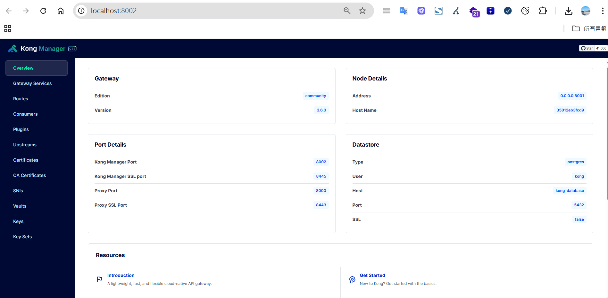
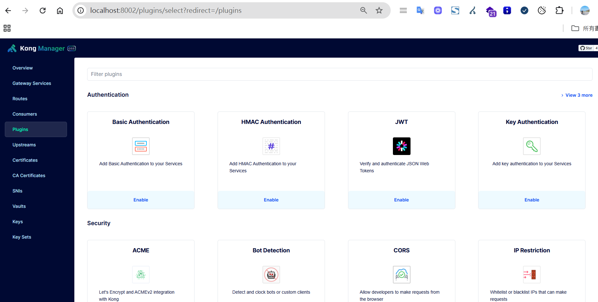

# 💡 Kong 是什麼？

Kong 是一套基於 Nginx 和 OpenResty 的高效能 API Gateway，核心以 Lua 編寫，具備反向代理、API 管理與插件擴充等功能。Kong 可搭配 PostgreSQL 作為設定儲存，也支援無資料庫（DB-less）模式，透過靜態 YAML 或 JSON 檔直接載入配置。

📌 **DB-less 模式說明**：Kong 在啟動時從設定檔載入所有設定（如路由、服務、插件），不需資料庫即可運行，適合部署在 CI/CD 環境中。


---

# 🔧 Kong 可以做什麼？

* 🔁 負載平衡（反向代理）
* 🚪 統一 API 進入點（API Gateway）
* 🚀 支援多環境與版本部署
* 📊 API 使用統計與計費
* 🔐 安全驗證（API Key、JWT、OAuth2 等）


---

# 🌟 核心特性

* 管理與部署 RESTful API 變得簡單高效
* 支援 API 版本控管與權限驗證
* 可依使用者等級設定請求限制（Rate Limiting）
* 變更設定時，基於 Nginx 架構無須重啟服務
* 強大的插件機制，可擴充功能或自訂開發


---

# 🌐 官方文件

<https://docs.konghq.com/gateway/latest/>


---

# 🛠️ 類似工具比較

* **Apache APISIX**
* **Tyk**
* **NGINX Plus（商用）**


---

# 🚀 安裝 Kong（Docker  with  db 版）

```yaml
version: '3.8'

services:
  kong-database:
    image: postgres:13
    container_name: kong-database
    environment:
      POSTGRES_USER: kong
      POSTGRES_DB: kong
      POSTGRES_PASSWORD: kong
    ports:
      - "5432:5432"

  kong-migrations:
    image: kong:3.6.0
    command: kong migrations bootstrap
    environment:
      KONG_DATABASE: postgres
      KONG_PG_HOST: kong-database
      KONG_PG_PASSWORD: kong
    depends_on:
      - kong-database

  kong:
    image: kong:3.6.0
    container_name: kong
    environment:
      KONG_DATABASE: postgres
      KONG_PG_HOST: kong-database
      KONG_PG_PASSWORD: kong
      KONG_ADMIN_LISTEN: 0.0.0.0:8001
      KONG_ADMIN_GUI_URL: http://localhost:8002
      KONG_ADMIN_GUI_API_URL: http://localhost:8001
    ports:
      - "8000:8000"   # Proxy
      - "8443:8443"   # Proxy SSL
      - "8001:8001"   # Admin API
      - "8002:8002"   # Kong Dashboard
    depends_on:
      - kong-database
      - kong-migrations
```

啟動指令：

```bash
docker-compose up -d
```

開啟 Dashboard: <http://localhost:8002>


預設就安裝了很多方便套件，不夠時也能自己做擴充


---

# 🧭 常用 Port 說明

| Port | 用途 | 協定 | 描述 |
|----|----|----|----|
| `8000` | Proxy (HTTP) | HTTP | 外部 API 請求入口 |
| `8443` | Proxy (HTTPS) | HTTPS | 加密請求入口 |
| `8001` | Admin API | HTTP | 管理路由、服務、插件等 |
| `8002` | Kong Dashboard | HTTP | 圖形化管理介面 |


---

# ✅ 快速測試 - 建立反向代理

建立服務：

```bash
POST http://localhost:8001/services
Content-Type: application/json

{
  "name": "my-service",
  "url": "https://blog.markkulab.net/"
}
```

建立路由：

```bash
POST http://localhost:8001/services/my-service/routes
Content-Type: application/json

{
  "paths": ["/blog"]
}
```

測試結果：

```
http://localhost:8000/blog -> https://blog.markkulab.net/
```


---

# 🔄 負載平衡策略

| 策略名稱 | 說明 | 開源支援 |
|----|----|----|
| Round-robin | 輪詢分配請求 | ✅ |
| Weighted round-robin | 按權重分配請求 | ✅ |
| Least-connections | 連線數最少優先 | ❌（需企業版） |

🔍 **補充**：

* 支援健康檢查，自動排除故障節點
* 支援 DNS 動態發現 target


---

# 📈 請求速率限制（Rate Limiting）

透過 Consumer 與 Key Auth 搭配 Rate Limiting 插件，可根據用戶等級設定頻率。

| 等級 | 限制 |
|----|----|
| 基礎會員 | 每分鐘 5 次 |
| 銅級 | 每秒 5 次 |
| 銀級 | 每秒 10 次 |
| 金級 | 每秒 30 次 |
| 白金級/專案 | 每秒 50 次 |

基本流程：


1. 建立 Consumer
2. 建立 key-auth 憑證
3. 套用 rate-limiting 插件

範例：

```bash
POST /consumers
{ "username": "gold" }

POST /consumers/gold/key-auth

POST /consumers/gold/plugins
{
  "name": "rate-limiting",
  "config": {
    "second": 30,
    "policy": "local"
  }
}
...
```

API 請求時帶上 key：

```bash
GET /your-api
apikey: <your-key>
```


---

# 🧪 性能與壓力測試

📌 官方實測：單台 8 vCPU 機器，QPS 可達 10\~20 萬，延遲低於 10ms。

🔗 詳細報告：[Kong Gateway Performance Benchmark](https://docs.konghq.com/gateway/latest/production/performance/performance-testing/)

📌 更大流量場景建議考慮硬體設備（如 F5）。


---

# 🛡️ 高可用架構（HA）

```
     ┌──────────────┐
     │ LoadBalancer │
     └─────┬────────┘
      ┌────┴───────┐
 ┌────▼────┐   ┌────▼────┐
 │ Kong #1 │...│ Kong #N │
 └────┬────┘   └────┬────┘
      └────┬────┬───┘
           │    │
       ┌─────────────┐
       │ PostgreSQL  │
       └─────────────┘
```


---

# 📊 壓測工具：K6

安裝：

```bash
npm install -g k6
```

測試腳本：

```js
import http from 'k6/http';
import { sleep } from 'k6';

export default function () {
  http.get('http://localhost:8000/v1/users');
  sleep(1);
}
```

執行：

```bash
k6 run script.js
```


---

# 📌 導入評估建議


1. **API 管理需求**
   * API 數量、類型（REST、GraphQL、gRPC）
   * 是否需版本控制、文件生成
2. **安全需求**
   * 認證方式（OAuth2、JWT、API Key）
   * 權限控管與法規遵循（如 GDPR、PCI）
3. **流量需求**
   * 是否需負載平衡
   * 速率限制與流量整形


---

# 📚 延伸閱讀與資源

* [Kong Kubernetes Ingress Controller](https://docs.konghq.com/kubernetes-ingress-controller/latest/)
* [CSDN：Kong實戰教學](https://blog.csdn.net/zhangshenglu1/article/details/145325419)


