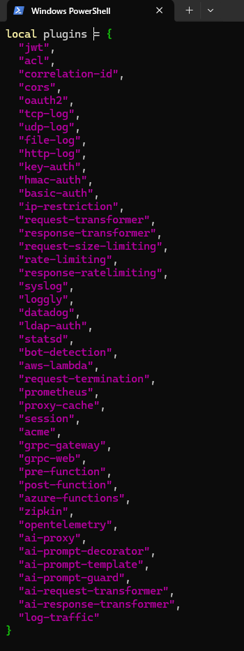
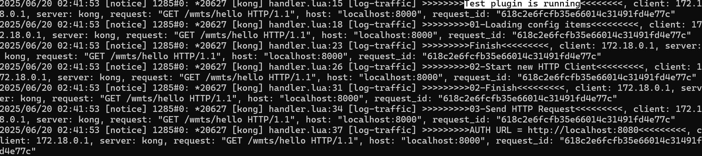

## 撰寫套件腳本

在 Kong 的**自訂套件開發**中，`handler.lua` 和 `schema.lua` 是兩個**核心檔案**，負責定義套件的**邏輯行為**與**設定結構**。

- **handler.lua**：寫套件的「行為邏輯」，定義套件怎麼攔截或處理 API 請求和回應
- **schema.lua**：定義套件的「設定格式」，告訴 Kong 套件需要哪些參數、型態和規則

### 撰寫 handler.lua

```lua
-- 導入必要的 Kong 模組
local kong_meta = require "kong.meta"
local cjson = require "cjson.safe"

-- 定義套件的基本資訊
-- PRIORITY: 執行優先級，數字越大優先級越高
-- VERSION: 套件版本號
local CustomHandler = {
  PRIORITY = 990,
  VERSION = "1.0",
}

-- 套件的主要處理函數
-- 在 access 階段執行，用於處理請求前的邏輯
function CustomHandler:access(plugin_conf)
  kong.log(">>>>>>>> 套件開始執行 <<<<<<<<")

  -- 從套件配置中提取參數
  kong.log(">>>>>>>>> 步驟1: 載入配置參數 <<<<<<<<<")
  local METHOD = plugin_conf.method
  local HEADERS = plugin_conf.headers
  local BODY = plugin_conf.body
  kong.log(">>>>>>>>> 配置載入完成 <<<<<<<<<")

  -- 記錄配置資訊到日誌
  kong.log(">>>>>>>>> 步驟2: 記錄配置資訊 <<<<<<<<<")
  kong.log(">>>>>>>>> 請求方法 = ", cjson.encode(METHOD), "<<<<<<<<<")
  kong.log(">>>>>>>>> 請求頭部 = ", cjson.encode(HEADERS), "<<<<<<<<<")
  kong.log(">>>>>>>>> 請求體 = ", cjson.encode(BODY), "<<<<<<<<<")
  kong.log(">>>>>>>>> 配置記錄完成 <<<<<<<<<")
  
  -- access 階段不需要返回值，請求會繼續向下處理
  -- 如果需要修改請求，可以在這裡設定 header 或其他屬性
end

return CustomHandler
```

### 撰寫 schema.lua

```lua
local typedefs = require "kong.db.schema.typedefs"

return {
  name = "log-traffic",
  fields = {
    { protocols = typedefs.protocols_http },
    { config = {
        type = "record",
        -- 此處根據 handler.lua 檔案中的配置，來新增指定欄位
        fields = {
          { method = { type = "string", default = "GET"} },
          { headers = {
            type = "map",
            keys = typedefs.header_name {
              match_none = {
                {
                  pattern = "^[Hh][Oo][Ss][Tt]$",
                  err = "cannot contain 'Host' header",
                },
                {
                  pattern = "^[Cc][Oo][Nn][Tt][Ee][Nn][Tt]%-[Ll][Ee][nn][Gg][Tt][Hh]$",
                  err = "cannot contain 'Content-Length' header",
                },
              },
            },
            values = {
              type = "string",
              referenceable = true,
            },
          }},
          { body = {
            type = "map",
            keys = {
              type = "string",
              referenceable = true,
            },
            values = {
              type = "string",
              referenceable = true,
            },
          }},
        },
      },
    },
  },
}
```
P.S. vs code emmyLua 可以加速開發

## 部署自訂套件

Kong 官方建議將自訂 Plugin 放在 Kong 的 Lua 路徑下，或是 Docker 映像檔的 `/usr/local/share/lua/5.1/kong/plugins/` 目錄。不過，在開發階段，放在專案資料夾內管理即可，部署時再複製到正確位置或用 Docker volume 掛載。

### 複製套件到容器

```bash
docker cp log-traffic kong:/usr/local/share/lua/5.1/kong/plugins
```

### 進入 Kong 容器

```bash
docker exec -it -u root kong /bin/sh
```

### 安裝編輯器

```bash
apt update && apt install -y vim
```

### 編輯套件清單

```bash
vim /usr/local/share/lua/5.1/kong/constants.lua
```

在 plugin 清單裡加上自己的套件名稱 `"log-traffic"`



### 設定 Kong 配置

| 檔案位置 | 說明 |
|---------|------|
| `/etc/kong/kong.conf.default` | 預設範本，不能直接修改 |
| `/etc/kong/kong.conf` | 正式用的設定檔（自己從 default 複製來的） |

新建/修改 `/etc/kong/kong.conf`：

```bash
vim /etc/kong/kong.conf
```

加入以下設定：

```bash
plugins = bundled,log-traffic  # 指定了要載入的套件 
# lua_package_path = /kong/plugins/?.lua;; # 指定了自訂套件的目錄
```

## 重啟 Docker 容器

```bash
docker restart kong
```

### 修改 vim /usr/local/share/lua/5.1/kong/constants.lua ，並加上自己的客製套件的名稱  “log-traffic”


### 檢查客製套件是否載入成功

重啟後，檢查客製的套件是不是有在支援清單中：

<http://localhost:8001/plugins/enabled>

### 將套件套用在服務或路由上

套用到服務：

```bash
POST http://localhost:8001/services/{service}/plugins
Content-Type: application/json

{
  "name": "log-traffic"
}
```

套用到路由：

```bash
POST http://localhost:8001/routes/{route}/plugins
Content-Type: application/json

{
  "name": "log-traffic"
}
```

查看已套用的套件：<http://localhost:8001/plugins/>

### 驗證功能

查看 Docker 日誌來確認套件是否正常運作：

```bash
docker logs kong
```



## 常見開發與除錯技巧

### 1. Plugin 熱重載（Hot Reload）技巧

Kong 本身不支援 Lua Plugin 的熱重載，每次修改 Plugin 內容後都需要重啟 Kong 容器。開發時建議：

- 使用 Docker volume 掛載 plugin 目錄，這樣只要重啟容器就能載入新程式碼。
- 可以寫一個簡單的 shell script，自動重啟 Kong 並 tail log，提升開發效率。

### 2. Plugin 日誌與除錯

- 使用 `kong.log.inspect()` 可以更方便地輸出 table 結構，便於除錯。
- 也可以用 `print()`，但建議還是用 `kong.log` 相關 API，這樣 log 會出現在 Kong 的標準日誌中。

範例：
```lua
kong.log.inspect(plugin_conf)
```

### 3. Plugin 生命週期（Lifecycle）

Kong Plugin 支援多個執行階段（phase），常見有：

- `access`：處理請求前
- `header_filter`：處理回應 header
- `body_filter`：處理回應 body
- `log`：請求結束後

你可以根據需求實作不同階段的函數，例如：

```lua
function CustomHandler:header_filter(conf)
  kong.response.set_header("X-My-Plugin", "active")
end
```

### 4. Plugin 測試

- 建議用 Postman 或 curl 測試 API，觀察 plugin 是否正確攔截與處理請求。
- 可以用 Kong 的 Admin API 查詢 plugin 狀態與日誌。

### 5. Plugin 配置參數驗證

- schema.lua 可以設定參數的預設值、必填、型態、正則驗證等，減少錯誤發生。
- 若參數驗證失敗，Kong 會自動回傳 400 錯誤。

## 進階應用

### 1. 與資料庫互動

如果 plugin 需要存取資料庫，可以使用 Kong 提供的 DAO（Data Access Object）API，例如存取 Postgres：

```lua
local dao = kong.db.your_custom_table
local row, err = dao:select({ id = some_id })
```

### 2. 外部 API 呼叫

可以用 Lua 的 http client（如 `resty.http`）在 plugin 內呼叫外部 API：

```lua
local http = require "resty.http"
local httpc = http.new()
local res, err = httpc:request_uri("https://api.example.com", { method = "GET" })
```

## 常見問題 FAQ

**Q: Plugin 沒有生效怎麼辦？**  
A:  
- 檢查 plugin 是否有加到 `/usr/local/share/lua/5.1/kong/plugins/` 目錄
- 檢查 `/etc/kong/kong.conf` 是否有加到 plugins 列表
- 檢查 schema.lua 與 handler.lua 是否語法正確
- 查看 Kong 日誌，尋找錯誤訊息

**Q: 如何管理多個自訂 Plugin？**  
A:  
- 建議每個 plugin 一個資料夾，方便維護
- 可以寫 Makefile 或 shell script 自動部署到 Docker

## 相關資源
* [官方範例客製套件範本](https://github.com/Kong/kong-plugin.git)
* [開源的套件網站 - Lua Rock](https://luarocks.org/)
