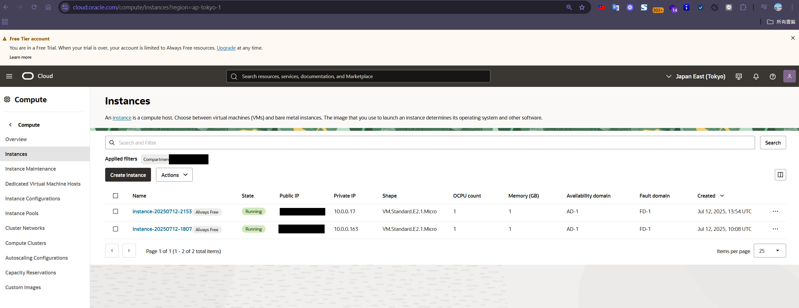

## 前言

Oracle Cloud 提供業界少見的「永久免費方案」（Always Free Tier），不僅能申請雲端主機，還能用於多種應用場景，對於開發者、學生、SOHO 族、小型企業來說，是最划算的雲端入門選擇。

### 免費資源亮點
- 2 台 VM.Standard.E2.1.Micro（1 OCPU / 1GB RAM，x86 架構）
- 4 OCPU / 24GB RAM 的 Arm VM（A1.Flex，可彈性分配）
- 100GB 區塊儲存、10GB 物件儲存
- 每月 10TB 外部流量
- 免費資料庫、負載平衡、監控等服務

> 這些資源「永久免費」，只要帳號不違規就能一直使用！

---

## 如何申請 Oracle Cloud 免費帳號？

1. 前往 [Oracle Cloud 官網](https://www.oracle.com/cloud/free/)，點選「Start for free」
2. 填寫基本資料、驗證 Email、設定密碼
3. 輸入信用卡（僅用於驗證，不會扣款，建議使用實體卡）
4. 完成手機驗證，等待審核（通常 5-30 分鐘）

> 若遇到信用卡驗證失敗，請更換卡片或確認卡片支援國際交易。

## 如何建立 Oracle Cloud 免費 VM 主機？

1. 登入 Oracle Cloud 控制台（Console）
2. 在左上角選單選擇「Compute」→「Instances」
3. 點選「Create Instance」建立新主機
4. 輸入主機名稱，選擇「Image and shape」：
   - Image：建議選擇「Oracle Linux」或「Ubuntu」
   - Shape：選擇「VM.Standard.E2.1.Micro」或「Arm Ampere A1」免費方案
5. 設定 SSH 公鑰（可用現有金鑰或產生新金鑰）
6. 其他設定可保持預設，點選「Create」開始建立
7. 幾分鐘後 VM 建立完成，可在「Public IP」看到主機的公開 IP
8. 使用 Xshell 連線到主機：
   - 開啟 Xshell，新增一個連線
   - 主機（Host）：填入你的 Public IP
   - 用戶名稱（User Name）：Oracle Linux 輸入 opc，Ubuntu 輸入 ubuntu
   - 認證方式：選擇「Public Key」並載入你的私鑰，或用「Password」方式
   - 點選「連線」即可登入主機

> **小提醒：**  
> Oracle Cloud 預設分配的 Public IP 為「臨時（Ephemeral）」型態，重啟 VM 可能會更換 IP。建議在主機建立後，進入「Resources」→「Attached VNICs」→ 點選 VNIC → 「IPv4 Addresses」→ 將 Public IP 設為「保留（Reserved）」型態，確保 IP 不會變動，方便日後連線與服務部署。

---

## 免費 Linux 主機可以做什麼？

### 1. 架設 frps 內網穿透伺服器
- 免費 VM 非常適合架設 [frps](https://blog.markkulab.net/2021/07/21/frps/) 伺服器，讓家中或公司內網服務可被外部安全存取。
- 步驟：
  1. 在 VM 上安裝 frps
  2. 設定防火牆，開放對應 port
  3. 客戶端（frpc）連回 Oracle VM
- 適合遠端桌面、NAS、IoT、Web 服務等穿透需求

### 2. 架設遠端桌面服務（[RestDesktop](https://blog.markkulab.net/custom-your-remote-tool-like-team-viewer/)）
- 利用免費 VM 架設遠端桌面（如 RestDesktop、Windows RDP、VNC 等）服務
- RestDesktop 是一款遠端連線軟體，適合遠端操作、協作、技術支援等場景
- 步驟：
  1. 在 VM 上安裝 RestDesktop 或其他遠端桌面伺服器（如 xrdp、VNC、NoMachine 等）
  2. 設定防火牆，開放對應連線埠（如 3389、5900 等）
  3. 從本地端使用 RestDesktop 客戶端或對應軟體連線 Oracle VM
- 適合遠端辦公、教學、跨地區協作等需求

### 3. 架設個人網站 / 部落格
- 安裝 Nginx/Apache + WordPress、Hugo、Gatsby 等
- 免費 SSL 憑證（Let's Encrypt）
- 適合個人作品集、部落格、Landing Page

### 4. 其他應用
- VPN / Proxy 伺服器（自用科學上網）
- Nextcloud 私有雲
- 小型爬蟲、Bot、定時任務
- 學習 Linux、練習自動化部署 / CI/CD

---

## 結語：Oracle Cloud 免費層，雲端應用無限可能

Oracle Cloud 永久免費層不僅能省下主機費，更能滿足多元開發、測試、學習、架站、內網穿透等需求。只要善用資源，0 元也能玩出專業級雲端解決方案！

有任何問題或想法，歡迎在下方留言討論，一起交流更多實戰經驗！ 