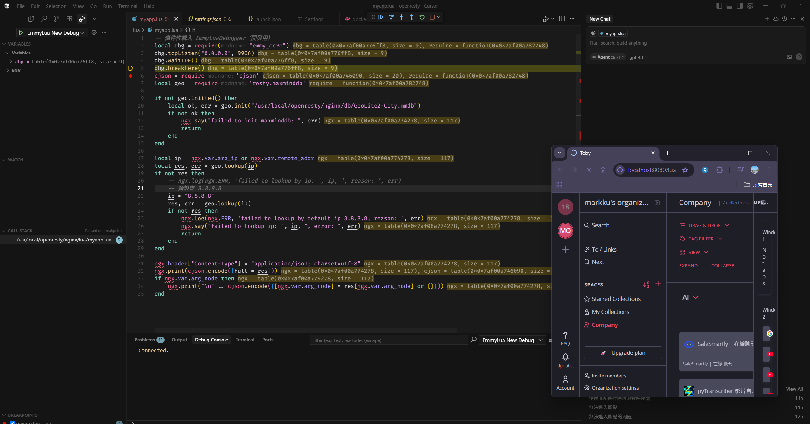

# VSCode 下 Lua 除錯全攻略（含 OpenResty 實例）

## 為什麼要學 Lua 除錯？

Lua 常用於嵌入式、遊戲、Nginx/OpenResty 等高效能場景。寫 Lua 雖然輕巧，但遇到 bug 沒有好工具很痛苦。這篇教你用 VSCode 打造現代化 Lua 除錯環境，讓你能設斷點、單步執行、即時觀察變數，效率大提升！

---

## 必裝 VSCode 擴充套件

- [EmmyLua](https://marketplace.visualstudio.com/items?itemName=tangzx.emmylua)：Lua 智慧提示與斷點除錯

---

## VSCode + Docker 下 Lua 除錯最佳實踐（以 OpenResty 為例）

本專案實際採用 VSCode + Docker + EmmyLua 進行 Lua 斷點除錯，以下是完整實戰流程與設定：

### 1. 專案結構與重要檔案

- `docker-compose.yml`：定義 openresty 服務、埠號對應、volume 掛載
- `conf/nginx.conf`：Nginx 與 OpenResty 設定
- `lua/myapp.lua`：主要 Lua 業務邏輯與偵錯入口
- `lua/.vscode/launch.json`：VSCode 偵錯設定

### 2. Docker 埠號與 Volume 設定

`docker-compose.yml` 需包含：

```yaml
version: '3.8'
services:
  openresty:
    build: .
    container_name: openresty-dev
    ports:
      - "8080:80"      # HTTP
      - "8081:443"     # HTTPS
      - "9966:9966"    # EmmyLua Debugger (Lua 除錯)
    volumes:
      - ./conf/nginx.conf:/usr/local/openresty/nginx/conf/nginx.conf:ro
      - ./lua:/usr/local/openresty/nginx/lua
      - ./logs:/usr/local/openresty/nginx/logs
      - ./db/GeoLite2-City.mmdb:/usr/local/openresty/nginx/lua/GeoLite2-City.mmdb:ro
    environment:
      TZ: Asia/Taipei
    restart: unless-stopped 
```

- `8080:80`：對外 HTTP 服務
- `8081:443`：對外 HTTPS 服務（如有設定 SSL）
- `9966:9966`：Lua 除錯（EmmyLua Debugger 連接埠）
- `TZ: Asia/Taipei`：設定容器時區，方便日誌對時
- `restart: unless-stopped`：自動重啟容器，除非手動停止
- 其餘 volume 掛載請依實際專案路徑調整

### 2.5 Dockerfile 範例

以下為本專案用於 OpenResty + Lua 除錯的 Dockerfile 範例，已內建 lua-resty-maxminddb、EmmyLua Debugger、GeoLite2-City 資料庫等：

```dockerfile
FROM openresty/openresty:alpine-fat

# 安裝必要套件與工具
RUN apk add --no-cache \
    git \
    build-base \
    cmake \
    libmaxminddb-dev \
    perl \
    libmaxminddb \
    wget \
    tar \
    unzip \
    luarocks

# 安裝 lua-resty-maxminddb
RUN luarocks install lua-resty-maxminddb

# 設定時區
ENV TZ=Asia/Taipei

# 建立資料夾結構
RUN mkdir -p /usr/local/openresty/nginx/lua \
    && mkdir -p /usr/local/openresty/nginx/logs \
    && mkdir -p /usr/local/openresty/nginx/db

# 下載最新 MaxMind GeoLite2-City 資料庫
RUN wget -O /tmp/GeoLite2-City.tar.gz "https://download.maxmind.com/app/geoip_download?edition_id=GeoLite2-City&license_key=<YOUR_LICENSE_KEY>&suffix=tar.gz" \
    && tar -xzf /tmp/GeoLite2-City.tar.gz -C /tmp \
    && find /tmp -name "GeoLite2-City.mmdb" -exec cp {} /usr/local/openresty/nginx/db/ \; \
    && rm -rf /tmp/GeoLite2-City.tar.gz /tmp/GeoLite2-City_*

# === 下載並編譯 emmy_core.so ===
WORKDIR /tmp
RUN git clone https://github.com/EmmyLua/EmmyLuaDebugger.git \
    && cd EmmyLuaDebugger \
    && mkdir build && cd build \
    && cmake .. -DCMAKE_BUILD_TYPE=Release -DLUA_INCLUDE_DIR=/usr/local/openresty/luajit/include/luajit-2.1 \
    && make \
    && find . -name emmy_core.so -exec cp {} /usr/local/openresty/lualib/emmy_core.so \; \
    && cd / && rm -rf /tmp/EmmyLuaDebugger

# 設定 Lua 模組路徑
ENV LUA_PATH="/usr/local/openresty/lualib/?.lua;;"
ENV LUA_CPATH="/usr/local/openresty/lualib/?.so;;"

# 預設啟動
CMD ["/usr/local/openresty/bin/openresty", "-g", "daemon off;"]
```

> **注意：**
> - `license_key=<YOUR_LICENSE_KEY>` 請至 [MaxMind 官網](https://www.maxmind.com/) 註冊帳號並取得專屬金鑰。
> - 此金鑰屬於個人授權，請勿公開於網路或版本控制系統。
> - 若未填寫正確金鑰，GeoLite2-City 資料庫將無法下載。

### 3. Lua 程式碼中啟用偵錯

在 `lua/myapp.lua` 最前面加上：

```lua
local dbg = require("emmy_core")
dbg.tcpListen("0.0.0.0", 9966)  -- 讓容器內偵錯器監聽所有網卡
dbg.waitIDE()                   -- 等待 IDE 連線才繼續執行
dbg.breakHere()                 -- 進入斷點
```

### 4. VSCode 偵錯設定

在 `lua/.vscode/launch.json` 中加入：

```json
{
    "version": "0.2.0",
    "configurations": [
        {
            "type": "emmylua_new",
            "request": "attach",
            "name": "Attach by process id",
            "pid": 0,
            "processName": "",
            "captureLog": false,
            "host": "localhost",
            "port": 9966,
            "cwd": "${workspaceFolder}/lua",
            "ext": [".lua", "lua.txt", ".lua.bytes"]
        }
    ]
}
```
> `host` 請設為 `localhost`，因為我們已將 9966 埠號從容器映射到主機。

### 5. 啟動與除錯流程

1. 重新啟動 openresty 容器（`docker-compose restart openresty`）。
2. 在 VSCode 裡啟動偵錯（F5），選擇剛剛的 attach 設定。
3. 觸發對應的 HTTP 請求（如 `http://localhost:8080/`），程式會自動停在斷點。
4. 開始快樂地單步除錯！

---

## [實作範例] 用 myapp.lua 進行 Lua 除錯

以 `lua/myapp.lua` 為例，示範如何設置斷點與觀察變數：

```lua
local dbg = require("emmy_core")
dbg.tcpListen("0.0.0.0", 9966)
dbg.waitIDE()
dbg.breakHere()

local cjson = require 'cjson'
local geo = require 'resty.maxminddb'
geo.init("/usr/local/openresty/nginx/lua/GeoLite2-City.mmdb")

-- 假設這裡有一個函式要查詢 IP 位置
local function get_country(ip)
    local res, err = geo.lookup(ip)
    if not res then
        ngx.log(ngx.ERR, "Geo lookup error: ", err)
        return nil
    end
    return res
end

local ip = ngx.var.arg_ip or ngx.var.remote_addr
local country_info = get_country(ip)
ngx.say(cjson.encode(country_info))
```
> 只要在 myapp.lua 開頭插入偵錯程式碼，就能用 VSCode 斷點、單步追蹤每個變數！

---

## [Nginx 設定範例] 將請求導向 myapp.lua

接下來，需在 nginx.conf 中設定路由，讓 OpenResty 能將請求導向剛剛的 myapp.lua：

```nginx
location /lua {
    default_type 'text/plain';
    content_by_lua_file /usr/local/openresty/nginx/lua/myapp.lua;
}
```

> 這樣設定後，當你訪問 http://localhost:8080/lua 時，Nginx 會將請求導向 myapp.lua 處理，並回應結果。

---

> 當用戶端（如瀏覽器或 curl）請求 http://localhost:8080/lua 時，Nginx 會將該請求交給 myapp.lua 處理，並將結果回傳給用戶端。你也可以依需求調整路由。



---

## Lua 除錯常見技巧與除錯

1. **看 Error Log**  
   `/usr/local/openresty/nginx/logs/error.log`  
   初步除錯問題必看。
2. **開 Debug Log**  
   - OpenResty：`nginx.conf` 設 `error_log ... debug;`
3. **Lua 腳本加 log**  
   `ngx.log(ngx.ERR, "Debug info: ", cjson.encode(var))`
4. **API 測試**  
   用 Postman/curl 打 API 看回應。
5. **VSCode 偵錯 attach 失敗？**  
   - 確認 `dbg.tcpListen("0.0.0.0", 9966)`，不是 `localhost`。
   - `docker-compose.yml` 有沒有 `9966:9966`。
   - VSCode 的 `host` 設定為 `localhost`。
   - 檢查防火牆或安全軟體有無阻擋埠號。
6. **看不到日誌？**  
   - 檢查 `/usr/local/openresty/nginx/logs/error.log`。
   - Lua 腳本可用 `ngx.log(ngx.ERR, "debug info")` 輔助。

---

## 容器（Docker）裡怎麼遠端 debug？

| 方法 | 指令/說明 |
|------|-----------|
| 進容器看日誌 | `docker exec -it openresty-dev /bin/sh`<br/>`tail -f /usr/local/openresty/nginx/logs/error.log` |
| 直接看容器 log | `docker logs -f openresty-dev` |
| 掛本地目錄 | `docker run -v /your/local/logs:/usr/local/openresty/nginx/logs ... openresty` |
| 抓封包看流量 | `sudo tcpdump -i docker0 port 8080` |
| VSCode Remote | 直接用 VSCode 編輯、debug 容器裡的檔案 |

