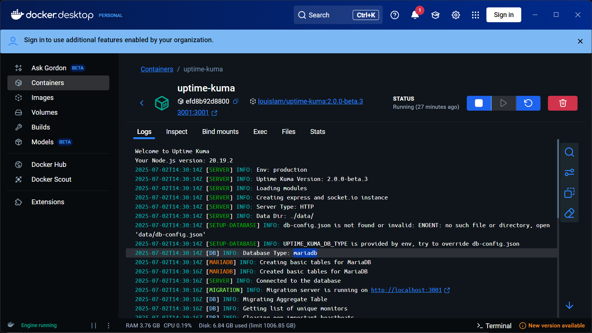

## 前言：省錢又實用的監控方案

這篇文章記錄我用 Uptime Kuma 實際部署、升級 MariaDB 和串接 Uptime Kuma Admin API 的經驗，讓你也能輕鬆自架、節省監控成本。

## 為什麼選 Uptime Kuma（省錢、開源）

- 商業監控軟體一年動輒好幾萬
- Uptime Kuma 完全開源、免費，功能也很夠用
- 架設超簡單，自己用 Docker 跑就好
- 社群活躍，遇到問題很容易找到解答
- 想要自訂、加功能也很彈性

---
## Uptime Kuma 軟體架構簡介

- **後端**：Node.js + SQLite ，採用 sequelize ORM（也可以換成 MariaDB，效能更好）
- **前端**：Vue.js 製作的網頁介面
- **通訊**：用 WebSocket 即時更新監控狀態
- **特色**：自架超簡單、輕量、彈性高，想怎麼玩都可以

---

## 遇到的效能瓶頸（深入分析）

### 初期效能問題

- SQLite 預設資料庫，監控數量一多（800 個監控左右）就會卡
- 換成 MariaDB，效能直接提升，穩定很多

### 大規模監控的挑戰

經過深入分析 Uptime Kuma 的程式碼後，我們發現了一些有趣的現象。原本以為效能問題主要來自於 SQLite 的高頻資料庫讀寫，但實際測試後發現，即使升級到 MariaDB，當監控數量超過 1000 個 API 時，後台畫面仍然會出現載入困難的情況。

經過程式碼分析，我們發現問題可能不在於資料庫層面，而是前端的程式設計沒有充分考量到大規模監控的使用情境。這導致在大量監控項目時，前端渲染和資料處理會成為效能瓶頸。

### 效能優化建議

對於需要監控大量 API 的場景，建議考慮以下方案：
- 將監控項目分組管理
- 考慮使用多個 Uptime Kuma 實例分散負載
- 定期清理歷史資料以減輕資料庫負擔

---

## 為什麼需要 Uptimekuma RESTful API？

有時候想要客製 public status page 或自動化新增管理監控，這時就需要 RESTful API 來幫忙。

### 主動監控的選擇

在規劃監控系統時，我們選擇了開源的 Uptime Kuma 作為主動監控的解決方案。不過預設的 Uptime Kuma 並不支援 RESTful API，這對於自動化管理來說是個限制。

後來找到了 `medaziz11/uptimekuma_restapi` 這個開源套件，它巧妙地解決了這個問題。這個套件的工作原理是透過 WebSocket 模擬使用者登入，然後將這些操作封裝成 RESTful API。

這樣的設計讓我們能夠在明年第二階段上架時，實現建立監控 API 功能的自動化，大大提升了管理效率。

---

## 如何開啟 RESTful API

Uptime Kuma 官方本來沒有提供 RESTful API，只有網頁操作和 WebSocket 通訊。不過你可以用第三方的 `medaziz11/uptimekuma_restapi` 容器（上面 docker-compose.yml 已經有加），就能用 HTTP 輕鬆自動化管理監控。

### 這個 API 套件的原理是什麼？

- 套件會自動用你設定的管理員帳號密碼，登入 Uptime Kuma 的網頁後台
- 「模擬人操作」呼叫內部 WebSocket API，把這些功能包裝成 RESTful API
- 你只要對這個容器發送 HTTP 請求（像下面 curl 範例），它就會幫你轉成 Uptime Kuma 能懂的指令
- 所以你不用自己寫 WebSocket 程式，也不用研究 Uptime Kuma 的內部 API

### 技術實現細節

這個套件的巧妙之處在於它採用了「模擬使用者操作」的方式。具體來說：

1. **WebSocket 模擬登入**：套件會使用提供的管理員帳號密碼，透過 WebSocket 協議登入 Uptime Kuma 的後台
2. **API 封裝**：將原本需要透過 WebSocket 進行的操作，封裝成標準的 RESTful API 介面
3. **自動化整合**：這樣的設計讓我們能夠輕鬆地將監控系統整合到現有的自動化流程中

這種方法雖然看起來有點「繞路」，但實際上是一個非常實用的解決方案，特別是在需要與現有系統整合的場景下。

---

## Docker Compose 範例

```yaml
services:
  kuma:
    image: louislam/uptime-kuma:2.0.0-beta.3
    ports:
      - "3001:3001"
    environment:
      - UPTIME_KUMA_DB_TYPE=mariadb
      - UPTIME_KUMA_DB_HOSTNAME=mariadb
      - UPTIME_KUMA_DB_PORT=3306
      - UPTIME_KUMA_DB_NAME=kuma
      - UPTIME_KUMA_DB_USERNAME=kuma
      - UPTIME_KUMA_DB_PASSWORD=G7p9x2Qw!s
    depends_on:
      mariadb:
        condition: service_healthy
    volumes:
      - uptime-kuma:/app/data

  mariadb:
    image: mariadb:10.11
    environment:
      - MYSQL_ROOT_PASSWORD=R4t8z1Lm@v
      - MYSQL_DATABASE=kuma
      - MYSQL_USER=kuma
      - MYSQL_PASSWORD=G7p9x2Qw!s
    volumes:
      - mariadb-data:/var/lib/mysql
    ports:
      - "3307:3306"
    healthcheck:
      test: ["CMD", "mariadb-admin", "ping", "-h", "localhost", "-u", "root", "-pR4t8z1Lm@v"]
      timeout: 10s
      retries: 10
      interval: 10s
      start_period: 30s

  api:
    image: medaziz11/uptimekuma_restapi
    environment:
      - KUMA_SERVER=http://kuma:3001
      - KUMA_USERNAME=admin
      - KUMA_PASSWORD=G7p9x2Qw!s
      - ADMIN_PASSWORD=F5n3c7Vb$e
    depends_on:
      - kuma
    ports:
      - "8000:8000"
    volumes:
      - api:/db

volumes:
  uptime-kuma:
  mariadb-data:
  api:
```

> 帳號密碼要和 docker-compose 設定一致，API 服務才會正常連線！

---

## 最常用的 RESTful API 指令

### 1. 查詢所有監控

```bash
curl -X GET 'http://localhost:8000/api/monitors' -H 'Content-Type: application/json'
```

### 2. 新增一個監控

```bash
curl -X POST 'http://localhost:8000/api/monitors' \
  -H 'Content-Type: application/json' \
  -d '{
    "friendly_name": "我的網站",
    "type": "http",
    "url": "https://example.com",
    "interval": 300
  }'
```

## 驗證是否成功遷移到MariaDB資料庫

---

## 結論

Uptime Kuma 真的超省錢，自己架設也不難，換成 MariaDB 後效能穩定，還能用 API 自動化管理。推薦給所有想省錢又想自己掌控監控的朋友！

> 小提醒：如果你的監控數量超過 1000 個，Dashboard 就會開始卡，可能需要考慮使用多個 Uptime Kuma 實例來分散負載，或者等待官方在未來版本中改善大規模監控的效能問題。

### 未來規劃

基於我們的使用經驗和效能分析，我們計劃在明年的第二階段中：

1. **自動化監控建立**：利用 RESTful API 實現監控項目的自動化建立和管理
2. **效能優化**：考慮實施多實例架構來處理大規模監控需求
3. **監控策略優化**：根據實際使用情況調整監控頻率和資料保留策略

這樣的規劃讓我們能夠在保持成本效益的同時，提供穩定可靠的監控服務。

