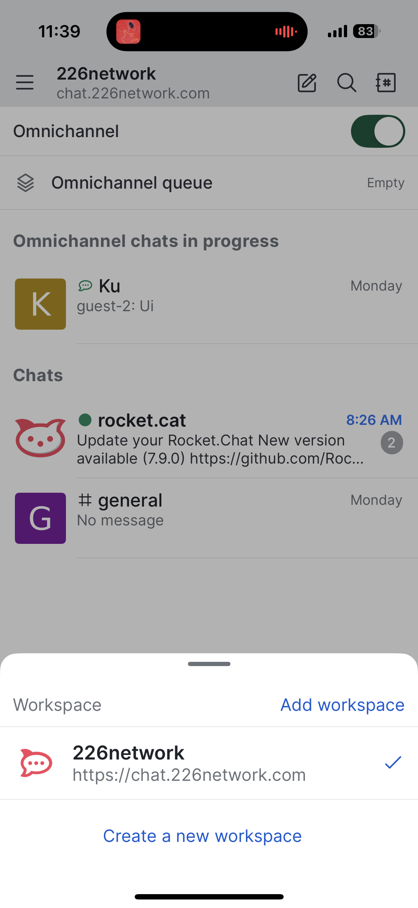
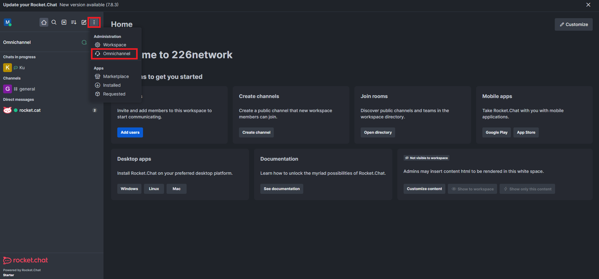
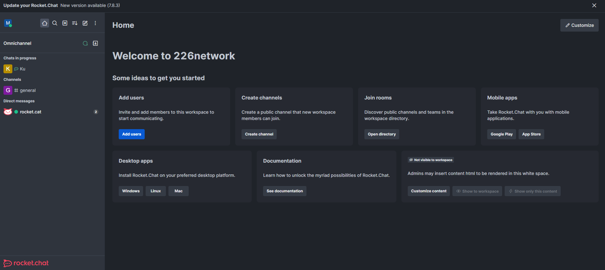
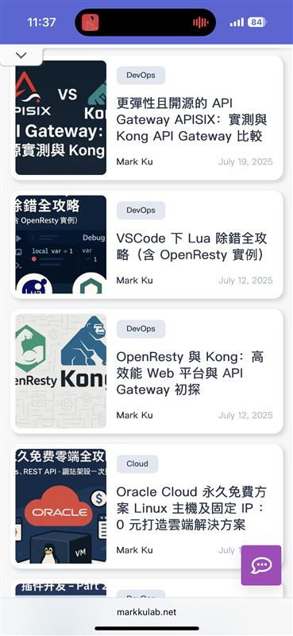
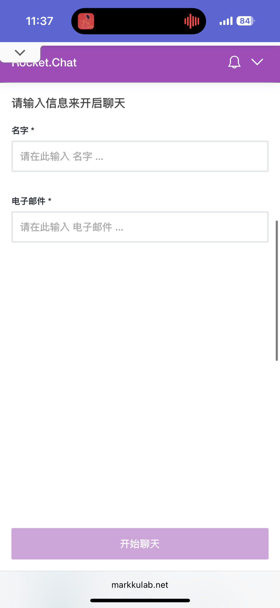

## 多通路聊天整合的挑戰

現在客戶都希望透過各種管道跟企業即時溝通，特別是網站聊天功能，幾乎每個企業都需要。但是管理這麼多通訊系統真的很麻煩：

客戶體驗不一致、客服效率低、資料分散、成本又高，而且傳統聊天工具很難跟網站完美整合。

## 為什麼選擇 Rocket.Chat Omnichannel？

Rocket.Chat 的 Omnichannel 功能就是為了解決這些問題。它提供統一平台，讓企業可以統一管理所有通訊管道，智能路由分配對話，完整記錄客戶互動，還能即時分析客服績效。最重要的是它是開源的，完全免費使用。

### 支援的通訊管道

支援網站聊天、手機 App、WhatsApp、Facebook Messenger、Telegram、電子郵件、簡訊等各種管道，還能透過 API 整合其他系統。

### 免費版功能說明

Rocket.Chat 提供 Starter 方案免費版，包含智能路由等進階功能。免費版有智能路由、多隊列處理、讀取回執、無限推播通知，但限制最多 50 個使用者和每月 100 個活躍聯絡人。適合小型團隊或個人使用。


## 📱 Rocket.Chat App：隨時隨地接收訊息

Rocket.Chat 提供完整的行動應用程式，讓客服人員可以隨時隨地接收和回覆訊息：


### 🎯 App 核心功能

有即時訊息通知、完整聊天功能、Omnichannel 整合、團隊協作功能。支援文字、語音、圖片、檔案分享，還能處理所有管道訊息，智能路由分配客服。

### 📲 下載與安裝

Android 版本從 Google Play Store 下載，iOS 版本從 App Store 下載，桌面版本支援 Windows、macOS、Linux。

### 🔧 App 設定指南

設定伺服器連線、通知設定、個人化設定。可以選擇主題、字體大小、語言、時區等。

### 💼 企業應用場景

適用於客服團隊、遠端工作團隊、緊急應變等場景。可以 24/7 客服、跨時區協作、緊急通知等。

### 🔒 安全性與隱私

提供端到端加密、本地儲存加密、SSL/TLS 安全連線、多重身份驗證。支援單一登入、權限管理、稽核日誌、資料備份等企業級安全功能。

### 📊 App 使用統計

根據官方統計，超過 1000 萬活躍用戶，支援 50+ 種語言，下載次數超過 500 萬次，平均 4.5 星評價。

### 🎯 使用建議

建議定期更新 App、備份設定、確保網路穩定。效能優化可以清除快取、關閉背景程式。遇到問題可以重新登入、清除資料或重新安裝。


## Docker 部署架構

採用微服務架構部署 Rocket.Chat，包含 App Server、MongoDB 資料庫、Livechat Widget、Omnichannel Dashboard、Analytics 等組件。


## Docker Compose 設定

以下是完整的 `docker-compose.yaml` 設定檔：

```yaml
version: '3.8'

services:
  rocketchat:
    image: registry.rocket.chat/rocketchat/rocket.chat:latest
    restart: always
    volumes:
      - ./uploads:/app/uploads
      - ./custom:/app/custom
    environment:
      - PORT=3000
      - ROOT_URL=https://chat.226network.com
      - MONGO_URL=mongodb://mongodb:27017/rocketchat
      - DEPLOY_METHOD=docker
      - DEPLOY_PLATFORM=linux/amd64
      - ENABLE_OMNICHANNEL=true
      - ENABLE_LIVECHAT=true
      - ENABLE_LIVECHAT_ANALYTICS=true
      - CACHE_SIZE=100
      - CACHE_TTL=600
    ports:
      - 30047:3000

  mongodb:
    image: mongo:6.0
    restart: always
    volumes:
      - mongodb_data:/data/db
    environment:
      - MONGO_INITDB_ROOT_USERNAME=admin
      - MONGO_INITDB_ROOT_PASSWORD=password123
      - MONGO_INITDB_DATABASE=rocketchat
    ports:
      - "27017:27017"
    command: mongod --auth

  redis:
    image: redis:6-alpine
    restart: always
    volumes:
      - redis_data:/data
    command: redis-server --appendonly yes

volumes:
  mongodb_data:
  redis_data:
```

## 部署步驟

### 1. 準備環境
```bash
mkdir rocket-chat
cd rocket-chat
mkdir uploads
mkdir custom
mkdir mongodb-data
```

### 2. 啟動服務
```bash
docker-compose up -d
docker-compose ps
docker-compose logs -f rocketchat
```

### 3. 初始設定
訪問 `http://localhost:30047`，建立管理員帳號，設定組織資訊。


## Omnichannel 功能配置

### 1. 啟用 Omnichannel 功能

進入管理後台設定 Omnichannel，建立 agent 和部門，啟用 Livechat 功能。



## 🚀 網站聊天功能：打造完美的客戶互動體驗

網站聊天功能是 Rocket.Chat Omnichannel 的核心功能，讓網站訪客即時與客服團隊溝通，提升客戶滿意度和轉換率。

### 🎯 網站聊天的重要性

網站聊天很重要，因為可以即時回應、提升轉換率、降低跳出率、收集潛在客戶、24/7 服務。優勢包括無縫整合、響應式設計、多語言支援、智能路由、完整記錄。

### 2. 網站 Livechat 整合

#### React 組件嵌入程式碼

```tsx
'use client';

import React, { useEffect } from 'react';

declare global {
  interface Window {
    RocketChat: any;
  }
}

const RocketChatLivechat: React.FC = () => {
  useEffect(() => {
    // 檢查是否已經載入過，避免重複載入
    if (window.RocketChat) {
      return;
    }

    // 初始化 RocketChat
    window.RocketChat = function(c: any) { 
      window.RocketChat._.push(c); 
    };
    window.RocketChat._ = [];
    window.RocketChat.url = 'https://chat.226network.com/livechat';

    // 動態載入 RocketChat livechat script
    const script = document.createElement('script');
    script.type = 'text/javascript';
    script.async = true;
    script.src = 'https://chat.226network.com/livechat/rocketchat-livechat.min.js?_=201903270000';

    // 腳本載入完成後的回調
    script.onload = () => {
      setTimeout(() => {
        addMobileStyles();
      }, 1200);
    };
    
    // 找到第一個 script 標籤並在其之前插入
    const firstScript = document.getElementsByTagName('script')[0];
    if (firstScript?.parentNode) {
      firstScript.parentNode.insertBefore(script, firstScript);
    } else {
      document.head.appendChild(script);
    }

    // 添加手機版樣式的函數
    const addMobileStyles = () => {
      const existingStyle = document.querySelector('#rocket-chat-mobile-styles');
      if (existingStyle) {
        existingStyle.remove();
      }

      const style = document.createElement('style');
      style.id = 'rocket-chat-mobile-styles';
      style.textContent = `
        @media (max-width: 768px) {
          #app > div[class*="screen__"]:not([class*="minimized"]) {
            bottom: 0px !important;
          }
          .rocketchat-widget[data-state="closed"] {
            bottom: 60px !important;
          }
        }
      `;
      document.head.appendChild(style);

      // 設定按鈕位置
      const setChatButtonBottom = () => {
        if (window.innerWidth > 768) return;
        const btn = document.querySelector('#app > button[aria-label="Rocket.Chat"]');
        if (btn && btn instanceof HTMLElement) {
          btn.style.setProperty('bottom', '60px', 'important');
        }
      };

      setChatButtonBottom();
      window.addEventListener('resize', setChatButtonBottom);
    };

    // 清理函數
    return () => {
      const existingScript = document.querySelector('script[src*="rocketchat-livechat.min.js"]');
      if (existingScript) {
        existingScript.remove();
      }
      const customStyle = document.querySelector('#rocket-chat-mobile-styles');
      if (customStyle) {
        customStyle.remove();
      }
    };
  }, []);

  return null;
};

export default RocketChatLivechat;
```

#### 使用方式

```tsx
// 在您的 React 應用中使用
import RocketChatLivechat from './components/RocketChatLivechat';

function App() {
  return (
    <div>
      <h1>我的網站</h1>
      <RocketChatLivechat />
    </div>
  );
}
```

#### 客製化說明

這個 React 組件可以輕鬆客製化：

- **修改伺服器 URL**：更改 `window.RocketChat.url` 為您的 Rocket.Chat 伺服器
- **調整手機版樣式**：修改 `style.textContent` 中的 CSS 來改變聊天視窗外觀
- **自訂載入時機**：調整 `setTimeout` 的時間來控制樣式套用時機
- **添加事件處理**：在 `script.onload` 中加入自訂的初始化邏輯

#### 結果畫面



### 🎨 網站聊天進階功能

包含智能觸發機制、個人化聊天體驗、聊天分析與優化、多語言聊天支援等功能。可以根據頁面停留時間、滾動行為、退出意圖觸發聊天，還能個人化歡迎訊息、客服專長、聊天樣式。


## Webhook 整合：輕鬆連接各種社群聊天工具

Rocket.Chat 提供完整的 Webhook API，可以輕鬆整合各種社群聊天工具到統一的 Omnichannel 平台。支援 Incoming Webhooks、Outgoing Webhooks、REST API、Real-time API。常見整合場景包括社群媒體（WhatsApp、Facebook Messenger、Telegram）、企業工具（Slack、Microsoft Teams、Discord）、客服系統（Zendesk、Freshdesk、Intercom）等。

## 智能路由與工作流程

### 1. 自動路由設定

可以根據關鍵字、客戶等級、語言等條件自動路由對話到適當的部門或客服人員。

### 2. 自動回覆設定

設定歡迎訊息、忙碌時自動回覆、下班時間回覆等自動回覆規則。

## 資料分析與報表

### 1. 客服績效分析

提供客服績效分析、管道使用分析、客戶滿意度分析等功能。

### 2. 即時監控儀表板

提供即時監控功能，可以即時查看客服狀態、新對話、對話結束等資訊。

## 進階功能與整合

### 1. CRM 系統整合

可以同步客戶資料、記錄對話到 CRM、獲取客戶歷史記錄等。

### 2. AI 智能助手整合

提供智能回覆建議、情感分析、自動分類等功能。

### 自訂開發與擴展

支援建立自訂主題、開發自訂 App、API 擴展等功能。

## 總結

Rocket.Chat 的 Omnichannel 功能為企業提供強大的多通路客服解決方案，網站聊天功能和行動 App 是核心亮點。透過統一平台管理各種通訊管道，企業可以提升客戶體驗、提高客服效率、降低營運成本、獲得深度洞察。

### 🎯 核心功能價值

網站聊天功能提供即時客戶互動、提升轉換率、智能客戶服務、完整數據分析、多語言支援。行動 App 功能提供隨時隨地服務、即時推播通知、完整聊天體驗、團隊協作整合、企業級安全。

### 免費版 vs 付費版選擇

Starter 免費版適合小型團隊，付費版適合大型企業，Community 開源版適合有技術能力的團隊。


## 相關資源
- [Rocket.Chat 官方文件](https://docs.rocket.chat/)
- [Omnichannel 功能指南](https://docs.rocket.chat/guides/omnichannel/)
- [API 參考文件](https://developer.rocket.chat/)
- [社群論壇](https://forums.rocket.chat/)
- [GitHub 專案](https://github.com/RocketChat/Rocket.Chat)

