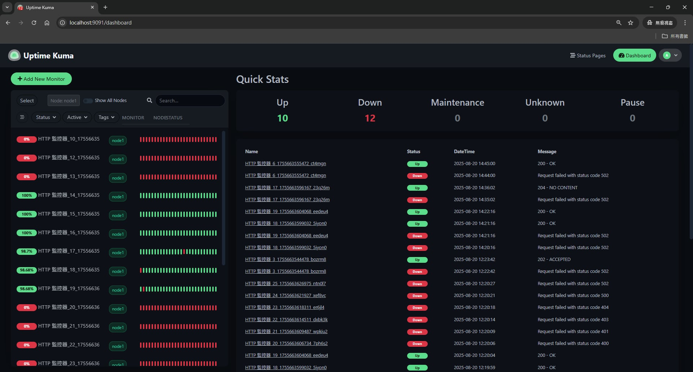
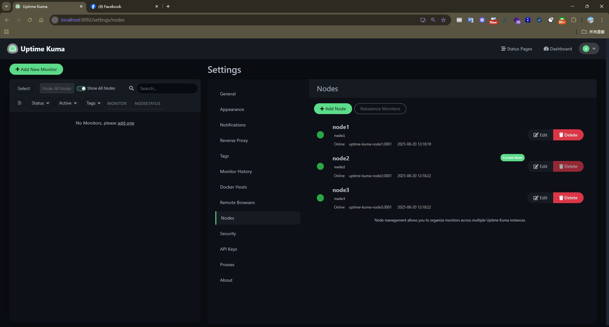
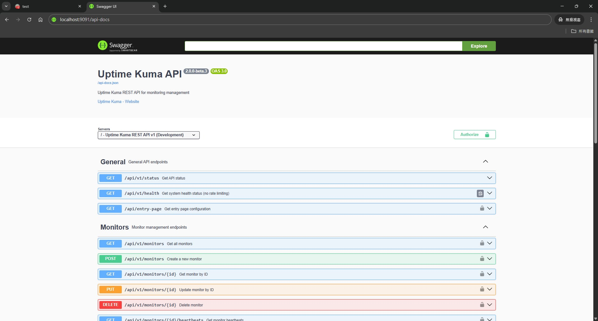

## 前言

Uptime Kuma 本來就很好用，但如果你要監控超過 1000 個以上的 API，單個實體運行，其實會開始卡卡的。這篇我想用 **Vibe Coding** 的方式，帶大家一步步把 Uptime Kuma 升級成支援 **分片 (Sharding)** 跟 **Cluster** 的版本，還會加上 API 讓它更方便自動化。

## 為什麼要搞集群？

先講需求。
Uptime Kuma 是開源監控軟體，[之前我已經分享過怎麼改成用 MariaDB 當後端](https://blog.markkulab.net/uptime-kuma-mariadb-restful-api/)。我們將預設的 SQLite 替換為 MariaDB，並獨立部署為 `kuma-mariadb` 服務，以支援更高的併發讀寫。

然而，當監控規模超過 1000 個 API 之後，效能就會明顯下降。實際測試下來，數量一多就開始卡頓。此外，開源的 Uptime Kuma 不支援 RESTful API，且對於需要實現「API 自動化上架即監控」的場景來說非常不方便。為了減少額外容器的部署成本，我們自行擴充了 RESTful API 功能，直接整合到 Uptime Kuma 中。

且因為我們的需求，對需要依據服務水準 (SLA) 付費的服務來說非常危險，因為只要監控斷掉，就可能直接違約賠錢，這個時候就能證明當下是正常的狀態。

因為我們部徶系統的需求有4000隻API ，所以單個Uptime kuma 肯定不夠了，這時候就要往 **Cluster 架構** 走，確保：

* **容錯 / 自動移轉**：節點掛掉也能自動切換，不怕中斷
* **負載分散**：多台一起跑，效能更穩
* **高可用**：避免單點失效，數據透明可靠
* **自動化**：能用 API 自動建監控，方便 DevOps

## 拆解需求，整理思路，請用 Vibe Coding 規劃及實作

用 Vibe Coding 的精神，把需求拆細，然後一段一段做，通常較大複雜的專案，會請AI 撰寫計劃或規範指引，在不斷覆盤 AI 寫的計畫，最後在請AI 執行


### 1. 分片 (Sharding) 支援

不同的監控器要分散到不同節點去跑：

* 可以新增 / 修改 / 刪除節點
* 清楚標示每個監控器是跑在哪個節點
* 容器啟動時會自動註冊節點到資料庫

### 2. 健康檢查 (Health Check)

用 **Nginx / OpenResty + Lua (`health_check.lua`)** 做節點健康檢查：

#### Nginx Job 機制

OpenResty 提供了強大的定時任務機制，可以輕鬆利用 **`ngx.timer.at()`** 來實作週期性的健康檢查：

* **`init_worker_by_lua_block`**：在每個 worker 進程啟動時執行，初始化健康檢查的定時器
* **`ngx.timer.at(delay, callback)`**：創建一個一次性定時器，在指定延遲後執行回調函數
* **遞迴定時器**：在 `health_check_worker` 回調函數中，執行完健康檢查後再次調用 `ngx.timer.at()`，形成週期性循環
* **避免重複執行**：使用 `ngx.shared.DICT` 或標記變數確保每個 worker 只啟動一個健康檢查任務

這樣的設計讓健康檢查完全在 Nginx worker 內部運行，不需要額外的外部進程或 cron job，既高效又可靠。

#### 健康檢查流程

* 由 OpenResty 的 worker 週期性呼叫 `health_check_worker`，固定間隔執行 `run_health_check`
* 針對每個節點呼叫 `/api/v1/health` 進行 HTTP 健康檢查
* 連續多次失敗 → 將該節點在 DB `node` 表中的狀態改成 `offline`
* 連續多次成功 → 將 `node.status` 更新回 `online`，並啟動「監控還原」流程

### 3. 容錯移轉 (Failover)

節點掛了，監控任務要自動轉移，這一塊由 `health_check.lua` 搭配資料庫完成：

* 在 DB 加上專門的 `node` 表與與節點相關欄位，紀錄每個節點的 `status`、`last_seen`
* 監控資料表 `monitor` 會記錄每個監控目前的 `node_id`（以及必要時的 `assigned_node`）
* 當某個節點連續數次健康檢查失敗：
  * health_check 會把該節點標記為 `offline`
  * 呼叫 `redistribute_monitors_from_node(node_id)`，把原本由這個節點負責的監控平均分配到其他 `online` 節點上
* 當節點恢復健康（連續幾次檢查成功）：
  * health_check 會把節點標記為 `online`
  * 呼叫 `revert_monitors_to_node(node_id)`，把先前自動轉移出去的監控搬回原節點，避免長期失衡

### 4. 節點復原 (Recovery)

節點恢復之後要能自動回來：

* 重啟後自動註冊，狀態改 `online`
* 系統會把移轉走的監控器搬回來
* 確保不會重複執行，避免資料衝突
* 也提供 **手動復原**，讓管理員自己決定要不要搬回去

### 5.Restful API 擴充

自動化擴充 (RESTful API Extension)：由於原生的 Uptime Kuma 缺乏對外的 API 介面，為了實現「服務一上線即監控」的自動化目標，我們自行擴充了 RESTful API 功能，讓日後上架API 時，自動監控。

Uptime Kuma 其實內建不少邏輯，只是沒開放 API，都是透過Web socket 去調用，既然知道這些，我們可以請AI把 Service 暴露成 API，讓自動化更方便。


## 系統架構圖

```
系統架構圖

                              ┌────────────────────────────┐
                              │   OpenResty (Nginx + Lua)  │
                              │  ─ 負載平衡 (monitor_router) │
                              │  ─ 健康檢查 (health_check)   │
                              └─────────┬──────────────────┘
                                        │
                     ┌──────────────────┼────────────────────┐
                     │                  │                    │
          ┌───────────▼─────────┐ ┌─────▼────────────┐ ┌─────▼────────────┐
          │   Uptime Kuma       │ │   Uptime Kuma    │ │   Uptime Kuma    │
          │   Node 1            │ │   Node 2         │ │   Node 3         │
          │   (Port 3001)       │ │   (Port 3001)    │ │   (Port 3001)    │
          │   (Host: 9091)      │ │   (Host: 9092)   │ │   (Host: 9093)   │
          └─────────┬───────────┘ └─────┬────────────┘ └──────┬───────────┘
                    │                   │                     │
                    └───────────────────┼─────────────────────┘
                                        │
                              ┌─────────▼─────────┐
                              │     MariaDB       │
                              │   (Port 3306)     │
                              │   (Host: 9090)    │
                              └───────────────────┘
```

這裡有幾個重點元件：

- **OpenResty / Nginx**：只在 `nginx.conf` 裡定義一個虛擬的 `upstream uptime_kuma_cluster`，實際的節點選擇交給 Lua。
- **`monitor_router.lua`**：在 `balancer_by_lua_block` 中被呼叫，提供 `pick_node_for_request()`，依據每個節點目前「正在執行的監控數量」動態挑選最空閒的節點，並透過 `ngx.balancer.set_current_peer()` 導流到對應的 `uptime-kuma-nodeX` 容器。
- **`health_check.lua`**：定期掃描各節點健康狀態，更新 DB `node` 表，並在節點故障/恢復時觸發監控任務的自動移轉與還原。

## 流程圖

### 1. 負載平衡與路由流程（monitor_router.lua）

```
請求流程

Client Request
      │
      ▼
Nginx / OpenResty
  (location /, /api/, /socket.io/ → proxy_pass 到 uptime_kuma_cluster)
      │
      ▼
balancer_by_lua_block
  呼叫 monitor_router.pick_node_for_request()
      │
      ▼
查詢 DB：
  SELECT n.node_id, COUNT(m.id) AS monitor_count
  FROM node n
  LEFT JOIN monitor m ON m.node_id = n.node_id AND m.active = 1
  WHERE n.status = 'online'
  GROUP BY n.node_id
  ORDER BY monitor_count ASC, node_id ASC
      │
      ▼
選出監控數量最少的 online 節點 (例如 node2)
      │
      ▼
組合 upstream：uptime-kuma-node2:3001
      │
      ▼
ngx.balancer.set_current_peer("uptime-kuma-node2", 3001)
      │
      ▼
請求實際被轉發到對應的 Uptime Kuma 節點處理
```

### 2. 健康檢查與 Failover / Recovery 流程（health_check.lua）

```
健康檢查與自動移轉流程

健康檢查 worker 週期性執行 run_health_check()
      │
      ▼
查詢 DB 取得所有節點 (node 表)
      │
      ▼
逐一對每個節點呼叫 /api/v1/health
      │
      ├── 健康：更新 node.status = 'online'，重置失敗次數；連續多次成功時觸發 revert_monitors_to_node(node_id)
      │
      └── 失敗：累積失敗次數；達到門檻時將 node.status = 'offline'，並觸發
                 redistribute_monitors_from_node(node_id)，把監控平均分配到其他 online 節點
      │
      ▼
健康狀態與統計資訊寫入 DB + ngx.shared.health_checker
      │
      ▼
透過 /health、/api/health-status、/lb/health、/lb/capacity 等 API 對外暴露目前整體狀態
```

## 成果展示





最後和主管討論，因取之於社群用之於社群，所以公開相關的程式碼：

[Uptime Kuma Cluster GitHub 相關程式碼](https://github.com/markku636/uptime-kuma-cluster)


## 心得
AI 時代雖然讓生產力可能提升了5~10 倍，不用再手敲程式碼，但事後維護時卻發現對程式碼的熟悉度不足。這讓我深刻體會到，無論工具如何進化，最終還是需要有人真正理解並維護這些程式碼，技術深度與理解力仍然是不可或缺的。

## 延伸資源
* [Uptime Kuma 官方文件](https://github.com/louislam/uptime-kuma)
* [Docker Compose 官方文件](https://docs.docker.com/compose/)
* [OpenResty 官方文件](https://openresty.org/)
* [MariaDB 官方文件](https://mariadb.org/)
* [Lua 程式語言](https://www.lua.org/)

