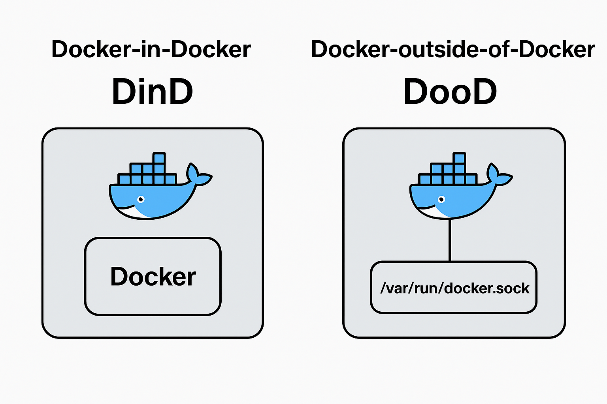
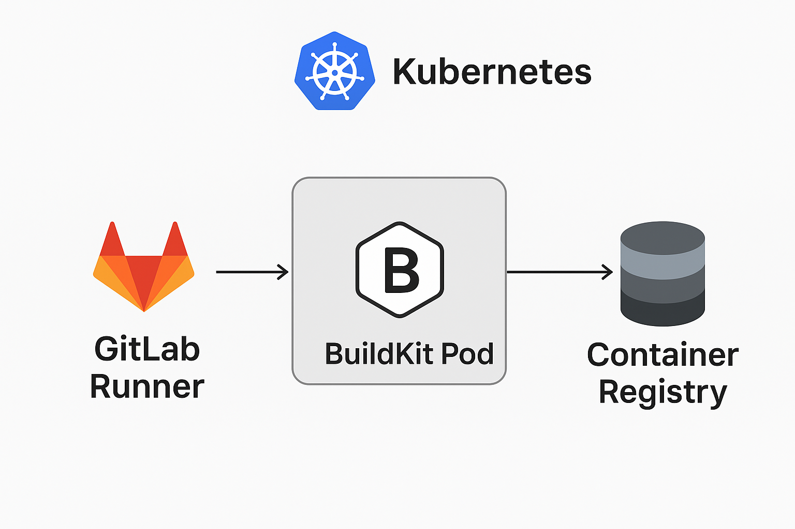

## Docker CI/CD 工具比較與部署指南
本文快速比較 DinD、DooD、Kaniko、BuildKit、Buildah 的差異，並提供在 GitLab Runner on K8s 的最小可用配置與常見踩雷排解。
> TL;DR：在 K8s 上建置映像，如果你追求相容性與安全性，優先選 Kaniko；追求效能與快取，選 BuildKit；DinD/DooD 僅在受信任環境或暫時性需求下使用。


## 工具比較表

| 工具 | 是否需 daemon | 是否需 privileged | 效能 | 相容性 | 適合場景 |
|----|----|----|----|----|----|
| **DinD** | ✅ | ✅ | 中 | 高 | 小團隊快速 CI |
| **DooD** | ✅ (宿主) | ✅ | 高 | 高 | 內部自用 CI |
| **Kaniko** | ❌ | ❌ | 中 | 高 | 雲原生 CI/CD |
| **BuildKit** | ✅ (buildkitd) | ✅/rootless | 高 | 高 | 需要快取/效能 |
| **Buildah** | ❌ | ❌ (可 rootless) | 中 | 高 | OpenShift / Red Hat 系統 |

## 工具說明 DinD vs DooD

 

### DinD (Docker-in-Docker)

* CI/CD pipeline 中，不需要掛載 docker.sock
* 可以透過 TCP 連線
* 適合隔離環境的 CI/CD

優點：
- 設定簡單、相依關係清楚，與 Docker 指令完全相容
- 容器內部隔離，方便一次性測試

缺點：
- 必須 privileged，風險較高
- 效能中等，nested cgroups 帶來額外開銷
- 在雲端受管 K8s/VM 上常遇到網路與權限限制

### DooD (Docker-outside-of-Docker)

* 容器內不運行自己的 Docker
* 直接掛載宿主機的 Docker socket (`/var/run/docker.sock`) 給容器使用
* 效能較好，但安全性較低

優點：
- 效能最佳，重用宿主 Docker cache
- 啟動速度快

缺點：
- 等同把宿主 Docker 權限暴露給容器，不適合多租戶
- 與節點相依，K8s 可攜性與彈性較差

## 常見問題與解決方案

### Docker 版本相容性問題

#### 為什麼選擇 Docker 20.10？

* **20.10 是長期穩定版 (LTS)**
  * Docker Engine 20.10 在 2020 年底發布
  * 長時間都有安全更新與 bugfix
  * 許多 Linux 發行版（Ubuntu 20.04、Debian Bullseye）把它當成內建版本
  * 生態系支援最好
  * 很多 CI/CD 工具（GitLab Runner、Drone、Jenkins plugin）最早都是針對 20.10 測試與穩定運行

#### 新版本變動問題

* 從 Docker 23.x 開始，很多功能被抽出到 Moby
* 一些 API 或 default 設定有變動，導致老舊的 CI 範例直接掛掉
* 例如：rootless mode、BuildKit 默認啟用等
* 在 K8s 或 GitLab Runner 上可能出現「image build 不起來」的情況

#### 環境相容性問題

* 自架的 K8s 與雲端 VM 架的 K8s 行為不一致
* 雲端環境和地端環境可能存在相容性問題
* 大多數 CI 工具都是針對 Docker 20.10 運行

### 可行的解決方法

1. **Kaniko** - 無需 Docker daemon，相容性最好
2. **在宿主主機直接裝 GitLab Runner**
3. **Windows 安裝 GitLab Runner**
4. **Docker in docker 走 2375 port**

### Kaniko 適用與限制

優點：
- 不需 Docker daemon 或 privileged，在受管 K8s 上相容性極佳
- 支援常見 Dockerfile 指令，易於遷移

限制：
- 初次 build 較慢，cache 需要正確配置到共享儲存或 registry
- 某些 BuildKit 專屬進階特性不支援

### BuildKit 適用與限制

優點：
- 高效能並行構建，強大 cache（inline/registry）
- 支援秘密管理、ssh 轉傳、前端（e.g. Dockerfile frontend）
- 支援多架構（buildx）

限制：
- 需要 buildkitd（或透過 Docker Engine 啟用），部署複雜度較高
- 權限模型需額外設計（rootless/Pod 安全性）

### Buildah 適用與限制

優點：
- 完全無 daemon，原生支援 rootless
- 與 OCI 規範高度一致，OpenShift 友善

限制：
- 社群與文件在 CI/CD 例子上相對分散
- Dockerfile 相容性不如 Docker/BuildKit 生態

## 部署指南
### 1. K8s DinD 部署（GitLab Runner 需設定 privileged=true）

試了蠻多遍的，在 k8s 中 DinD，我並沒成功建置映像檔。

### 2. K8s DooD 部署

需要掛載 `/var/run/docker.sock`，共享宿主的 Docker daemon

#### 預先準備

在宿主主機安裝 Docker

#### GitLab CI 配置

```yaml
stages:
  - build

variables:
  IMAGE: $CI_REGISTRY_IMAGE/$CI_BUILD_REF_NAME:$CI_PIPELINE_ID     
  K8S_NAMESPACE: "kong-api-gateway"
  KONG_SECRET_NAME: "kong-api-gateway-secret"
  DOCKER_TLS_CERTDIR: ""
  DOCKER_DRIVER: overlay2
 
build:
  stage: build
  image: docker:20.10
  services:
    - name: docker:20.10
  before_script:
    - docker login -u $CI_REGISTRY_USER -p $CI_REGISTRY_PASSWORD $CI_REGISTRY
  script:
    - echo "=== 建置 Kong API Gateway Docker 映像檔 (使用 DooD) ==="
    - echo "目標映像檔:${IMAGE}"
    - echo "建構上下文:${CI_PROJECT_DIR}"
    - docker build -f Dockerfile.kong -t "${IMAGE}" "${CI_PROJECT_DIR}"
    - docker push "${IMAGE}"
  only:
    - main
  tags:
    - K8s-Runner
```

#### GitLab Runner（Helm Values）

```yaml
gitlabUrl: https://gitlab.com
runnerRegistrationToken: "xxx"
unregisterRunners: true

fullnameOverride: "k8s-cd-gitlab-runner"

serviceAccount:
  create: true
  name: gitlab-runner

runners:
  privileged: true
  tags: "deploy"
  config: |
    [[runners]]
      [runners.kubernetes]
        image = "docker:20.10"
        service_account = "gitlab-runner"
        service_account_overwrite_allowed = ".*"
        [runners.kubernetes.pod_security_context]
          run_as_non_root = false
          run_as_user = 0
        [runners.kubernetes.container_security_context]
          privileged = true
        [runners.kubernetes.resources]
          limits = { "cpu" = "1000m", "memory" = "2Gi" }
          requests = { "cpu" = "500m", "memory" = "1Gi" }
        [runners.kubernetes.environment]
          DOCKER_OPTS = "--insecure-registry 192.168.50.57:30000"
        [[runners.kubernetes.volumes.host_path]]
          name = "docker-socket"
          mount_path = "/var/run/docker.sock"
          host_path = "/var/run/docker.sock"
          mount_propagation = "HostToContainer"

securityContext:
  allowPrivilegeEscalation: true
  readOnlyRootFilesystem: false
  runAsNonRoot: false
  privileged: true
  capabilities:
    add: ["SYS_ADMIN"]

podSecurityContext:
  runAsUser: 0
  fsGroup: 0
```

#### RBAC 配置

```yaml
# gitlab-runner-rbac.yaml
apiVersion: v1
kind: ServiceAccount
metadata:
  name: gitlab-runner
  namespace: k8s-cd-gitlab-runner
---
apiVersion: rbac.authorization.k8s.io/v1
kind: Role
metadata:
  namespace: k8s-cd-gitlab-runner
  name: gitlab-runner-role
rules:
- apiGroups: [""]
  resources: ["pods", "pods/attach", "pods/exec", "pods/log", "pods/portforward", "pods/proxy", "pods/status"]
  verbs: ["get", "list", "watch", "create", "update", "patch", "delete"]
- apiGroups: [""]
  resources: ["secrets", "configmaps", "persistentvolumeclaims", "services", "endpoints"]
  verbs: ["get", "list", "watch", "create", "update", "patch", "delete"]
- apiGroups: [""]
  resources: ["events"]
  verbs: ["get", "list", "watch", "create", "update", "patch"]
- apiGroups: [""]
  resources: ["namespaces"]
  verbs: ["get", "list", "watch"]
- apiGroups: ["apps"]
  resources: ["deployments", "statefulsets", "daemonsets"]
  verbs: ["get", "list", "watch", "create", "update", "patch", "delete"]
- apiGroups: ["batch"]
  resources: ["jobs", "cronjobs"]
  verbs: ["get", "list", "watch", "create", "update", "patch", "delete"]
- apiGroups: ["extensions"]
  resources: ["deployments", "statefulsets", "daemonsets"]
  verbs: ["get", "list", "watch", "create", "update", "patch", "delete"]
---
apiVersion: rbac.authorization.k8s.io/v1
kind: RoleBinding
metadata:
  name: gitlab-runner-rolebinding
  namespace: k8s-cd-gitlab-runner
subjects:
- kind: ServiceAccount
  name: gitlab-runner
  namespace: k8s-cd-gitlab-runner
roleRef:
  kind: Role
  name: gitlab-runner-role
  apiGroup: rbac.authorization.k8s.io
```

#### 部署命令

```bash
# 部署
helm repo add gitlab https://charts.gitlab.io
helm repo update
kubectl create namespace k8s-cd-gitlab-runner
kubectl apply -f ./rbac.yaml 
helm install gitlab-runner -f values.yaml gitlab/gitlab-runner --namespace k8s-cd-gitlab-runner --create-namespace

# 更新
helm upgrade gitlab-runner -f values.yaml gitlab/gitlab-runner --namespace k8s-cd-gitlab-runner
```

P.S. 這個方法在地端自架的 K8s 可行，但在 GCP 開 VM 架設時常不可行

### 3. Kaniko 部署

#### Helm Values 配置

```yaml
gitlabUrl: https://gitlab.com/
runnerRegistrationToken: ""  # 在 GitLab -> Settings -> CI/CD -> Runners 裡看到的 token
unregisterRunners: true

fullnameOverride: "k8s-cd-gitlab-runner"

serviceAccount:
  create: false
  name: gitlab-runner

runners:
  privileged: false
  tags: "K8s-Runner"
  config: |
    [[runners]]
      [runners.kubernetes]
        image = "gcr.io/kaniko-project/executor:debug"
        service_account = "gitlab-runner"
        service_account_overwrite_allowed = ".*"
        privileged = false
```

#### 部署命令

```bash
helm install gitlab-runner -f values.yaml gitlab/gitlab-runner --namespace k8s-cd-gitlab-runner --create-namespace
```

#### GitLab CI 配置

```yaml
stages:
  - build

variables:
  IMAGE: $CI_REGISTRY_IMAGE/$CI_BUILD_REF_NAME:$CI_PIPELINE_ID
  K8S_NAMESPACE: "kong-api-gateway"
  KONG_SECRET_NAME: "kong-api-gateway-secret"

build:
  stage: build
  image: gcr.io/kaniko-project/executor:debug
  variables:
    DOCKER_CONFIG: /kaniko/.docker
  before_script:
    - mkdir -p /kaniko/.docker
    - echo "{\"auths\":{\"$CI_REGISTRY\":{\"username\":\"$CI_REGISTRY_USER\",\"password\":\"$CI_REGISTRY_PASSWORD\"}}}" > /kaniko/.docker/config.json
  script:
    - echo "=== 建置 Kong API Gateway Docker 映像檔 (使用 Kaniko) ==="
    - echo "目標映像檔:${IMAGE}"
    - echo "建構上下文:${CI_PROJECT_DIR}"
    - /kaniko/executor --context "${CI_PROJECT_DIR}" --dockerfile "Dockerfile.kong" --destination "${IMAGE}" --cache=true --cleanup
  only:
    - main
  tags:
    - K8s-Runner

create-secret:
  stage: create-secret
  image:
    name: bitnami/kubectl:latest
  script:
    - echo "=== 準備目標命名空間與鏡像拉取密鑰 ==="
    - kubectl get namespace ${K8S_NAMESPACE} || kubectl create namespace ${K8S_NAMESPACE}
    - kubectl delete secret ${KONG_SECRET_NAME} -n ${K8S_NAMESPACE} --ignore-not-found=true || true
    - kubectl create secret docker-registry ${KONG_SECRET_NAME} \
        --docker-server=$CI_REGISTRY \
        --docker-username=$CI_REGISTRY_USER \
        --docker-password=$CI_REGISTRY_PASSWORD \
        --docker-email=none \
        -n ${K8S_NAMESPACE}
  only:
    - main
  tags:
    - K8s-Runner
```

### 4. BuildKit 部署

BuildKit 有兩種常見模式：

#### 模式 1: DinD BuildKit

只要設定環境變數：

```yaml
variables:
  DOCKER_BUILDKIT: "1"
  BUILDKIT_PROGRESS: plain
```

#### 模式 2: GitLab Runner + BuildKit Pod

* 在 K8s 裡部署一個 buildkitd DaemonSet 或 Deployment
* 每個 runner job 透過 buildctl CLI，呼叫 cluster 內的 buildkitd 服務去 build
* 不需要 mount `/var/run/docker.sock`，安全性比 DinD 高

## 部署建議

### 選擇建議

1. **小團隊快速 CI**: 使用 DinD
2. **內部自用 CI**: 使用 DooD
3. **雲原生 CI/CD**: 使用 Kaniko
4. **需要快取/效能**: 使用 BuildKit
5. **OpenShift/Red Hat 系統**: 使用 Buildah

### 若是安全性考量

* DinD 和 DooD 需要 privileged 模式，安全性較低
* Kaniko 和 BuildKit 不需要 privileged 模式，安全性較高
* 建議在生產環境使用 Kaniko 或 BuildKit

#### 進階：moby/BuildKit
設定有點複雜，需要額外部署 buildkitd Pod 或使用 DinD / Kaniko 等方案。

## 參考資料

* [GitLab Runner 無法呼叫 host 的 docker](https://johnnyexplores.medium.com/gitlab-runner%E7%84%A1%E6%B3%95%E5%91%BC%E5%8F%ABhost%E7%9A%84docker-e82dd3f5ae27)