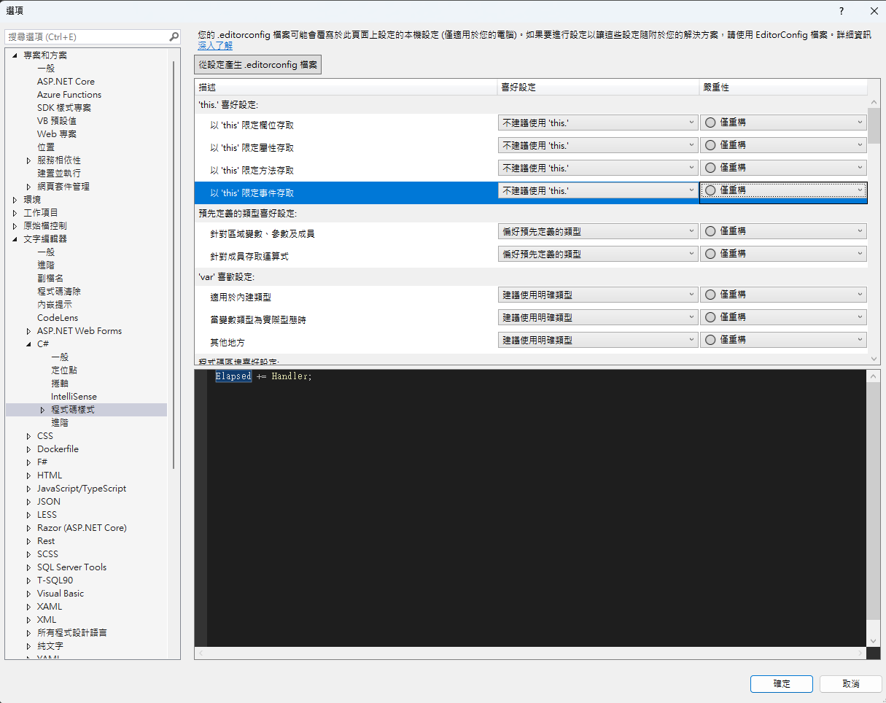
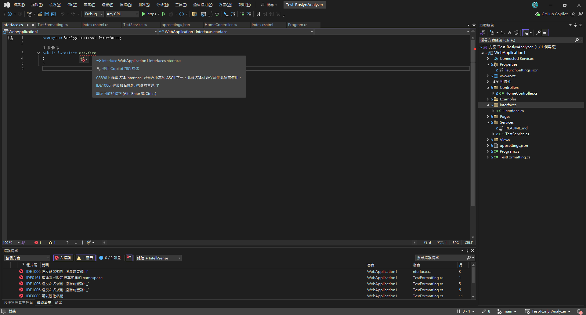
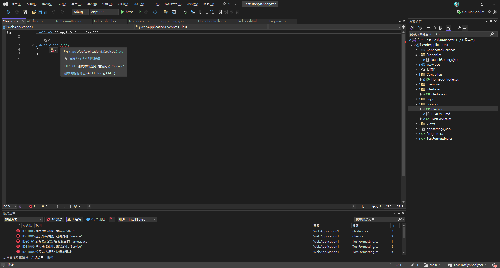
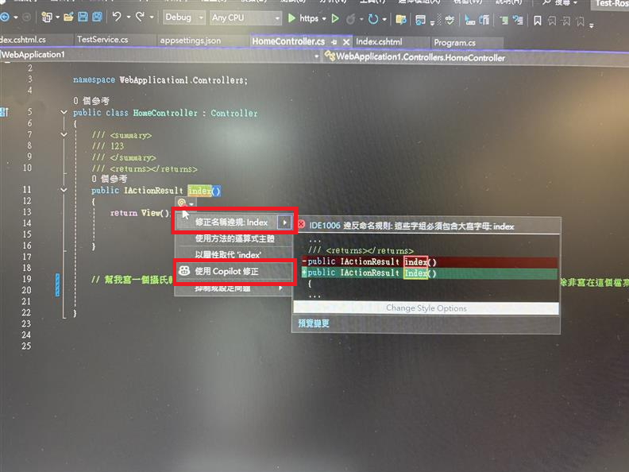
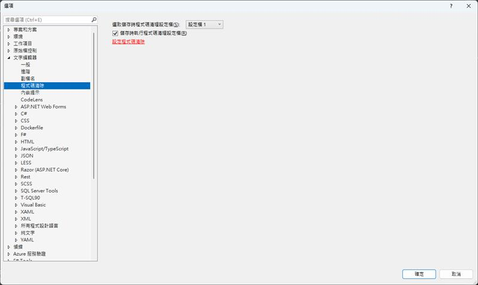
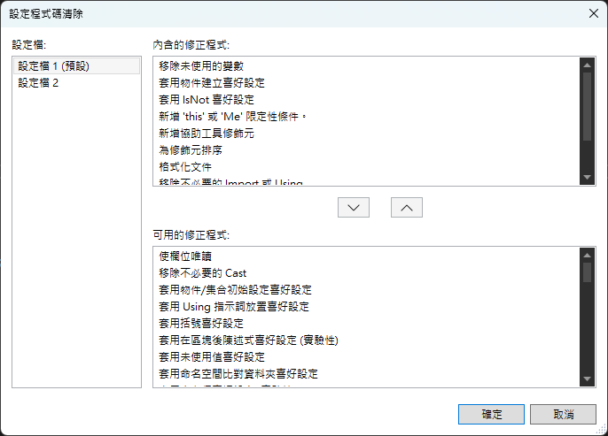
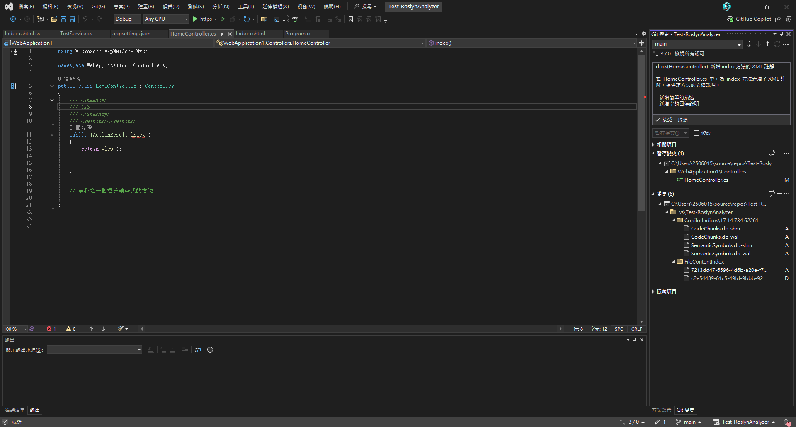
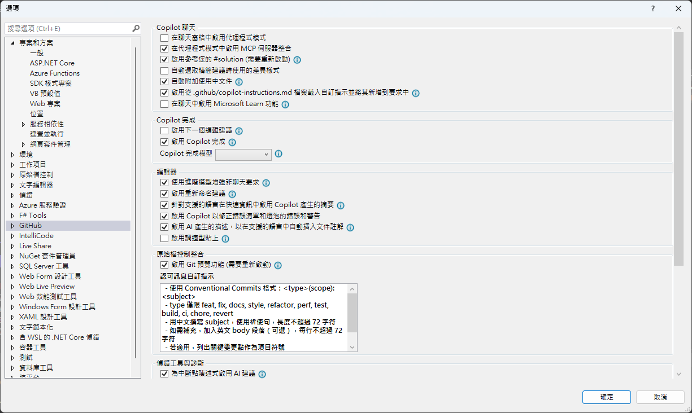

## 前言
在軟體專案規模不斷擴大的今天，程式碼品質往往比功能本身更影響專案的可維護性與團隊效率，不一致的命名、雜亂的格式、缺乏規範的程式碼，很容易在日後維護或交接時成為隱形成本。

本篇文章將以 Visual Studio 為核心，整理出一套常見且實用的程式碼品質管理方法，從內建工具 Roslyn Analyzer 與 .editorconfig 的規範設定，到 Code Cleanup 的自動化格式化，再到 GitHub Copilot 的 AI 輔助開發與程式碼審查。

透過這些工具與流程的搭配，讓開發團隊能，  

在撰寫程式碼的同時就及早發現問題，  

以自動化方式維持一致的程式碼風格，  

善用 AI 減少重複性工作，專注在真正的設計與邏輯。

## 預先安裝
* Github copilot
* Visual studio 2022 以上

## 1️⃣ Roslyn Analyzer（免安裝）

Roslyn Analyzer 是 .NET 內建程式碼分析工具，類似 JavaScript 的 ESLint，可在編譯時檢查程式碼品質。

### 結合 .editorconfig 設定

在專案根目錄建立 `.editorconfig`：

```ini
root = true

[*]
charset = utf-8
end_of_line = crlf
insert_final_newline = true
trim_trailing_whitespace = true
indent_style = space
indent_size = 4
max_line_length = 120

dotnet_style_qualification_for_field = false:error
dotnet_style_qualification_for_property = false:error
dotnet_style_qualification_for_method = false:error
dotnet_style_qualification_for_event = false:error

[*.cs]
csharp_style_var_for_built_in_types = false
dotnet_diagnostic.IDE0008.severity = error
csharp_style_namespace_declarations = file_scoped:error
```

### 也可以透 Visual Studio UI 調整 .editorconfig 設定

* 開啟 `工具 > 選項 > 文字編輯器 > C# > 程式碼樣式`
* Visual Studio 2022 版本內建支援 EditorConfig，重新載入專案即可生效


---

### 修改專案檔 `WebApplication1/WebApplication1.csproj`：

```xml
<Project Sdk="Microsoft.NET.Sdk.Web">
  <PropertyGroup>
    <TargetFramework>net8.0</TargetFramework>
    <Nullable>enable</Nullable>
    <ImplicitUsings>enable</ImplicitUsings>

    <!-- 啟用 .NET 分析器 -->
    <EnableNETAnalyzers>true</EnableNETAnalyzers>
    <EnforceCodeStyleInBuild>true</EnforceCodeStyleInBuild>
    <TreatWarningsAsErrors>true</TreatWarningsAsErrors>
  </PropertyGroup>
</Project>
```
此時建置專案，會就出現規則錯誤




---

### 修正錯誤
* 錯誤清單視窗 (`檢視 > 錯誤清單`)
* 編輯器波浪線提示錯誤
* 快速修正：`Ctrl+.` → 選擇建議方案


### 補充說明，也可以透過命令列 (CLI 去執行驗證規則，方便整合在CICD上)

```bash
# 建置並顯示警告
dotnet build --verbosity normal

# 僅執行程式碼分析
dotnet build --no-restore --verbosity normal

# 將警告視為錯誤
dotnet build /p:TreatWarningsAsErrors=true
```
P.S. 如果要更複雜的邏輯，可以自己客製 NamingConventionAnalyzer，這就得自己寫程式
---

## 2️⃣ 存檔時自動格式化程式碼樣式（程式碼清除功能）

### Visual Studio 設定

* 開啟 `工具 > 選項 > 文字編輯器 > C#`
* 勾選：

  * `在儲存時自動格式化文件`
  * `在儲存時移除並排序 using`

### 程式碼清除設定

* 開啟 `工具 > 選項 > 文字編輯器 > 程式碼清除 > 設定程式碼清除`


* 選擇要執行的規則，設定快捷鍵 `Ctrl+K, Ctrl+E`


**比較麻煩的事，團隊得人工同步設定**：
* Windows: `%USERPROFILE%\AppData\Local\Microsoft\VisualStudio\<version>\CodeCleanupProfiles.json`
* Mac: `~/Library/Preferences/VisualStudio/<version>/CodeCleanupProfiles.json`
---

### 範例：自動格式化效果

**格式化前**：

```csharp
namespace WebApplication1
{
    public class TestFormatting
    {
        private string fieldName;
        private int fieldValue;

        public TestFormatting()
        {
            this.fieldName = "test";
            this.fieldValue = 42;
        }
    }
}
```
**存檔後，自動格式化後的結果**：

```csharp
namespace WebApplication1;

public class TestFormatting
{
    private string fieldName;
    private int fieldValue;

    public TestFormatting()
    {
        fieldName = "test";
        fieldValue = 42;
    }
}
```

## 3️⃣ GitHub Copilot 自動生成 Commit Message（範例與做法）

[可參考延伸閱讀中的「定義 Git 提交訊息產生的自訂指令」，在 Copilot 的自訂指令中加入 Commit 規範（如 Conventional Commits），或在工作流程中加入範例結構，協助自動產生更一致的訊息。](https://blog.miniasp.com/post/2024/12/27/GitHub-Copilot-Cookbook-Define-Custom-Instructions-for-Generating-Git-Commit-Messages)


---

## 4️⃣ 依據 Coding Rules 生成程式碼（Copilot 自訂規則）

### 使用 GitHub Copilot 與自訂規則

GitHub Copilot 是強大的 AI 程式碼助手，可透過設定指令生成符合團隊規範的程式碼。

#### 設定 Copilot 指令

在新的visual studio 在工具>選項 > Github Copilot 預設會啟用參考 github/copilot-instructions 指引及規則做生成相關的程式


所以我們只要，在專案根目錄建立 `.github/copilot-instructions.md`：

```markdown
程式註解一律使用繁體中文
變數、函數、類別名稱使用英文
函數名稱尾巴加上 123
程式碼最上方加註：由 GitHub Copilot 產生
變數名稱全部大寫並使用底線分隔
```
現在只要打開Copliot Chat，就會依據開發指引來生成程式碼，但 Visual Studio IntelliSense 與自動完成不會遵循這些規則。

---

## 5️⃣ GitHub Copilot Code Review

GitHub Copilot 不僅協助生成程式碼，也能進行程式碼審查。透過 AI 協助，可以快速檢查程式碼品質、發現潛在問題並提供改進建議。

> ⚠️ 注意：此功能需 GitHub Copilot Enterprise 訂閱，預設關閉，開啟後才能使用。

---

## 延伸閱讀

- [EditorConfig 官方文件](https://editorconfig.org/)
- [Roslyn Analyzers 文件](https://docs.microsoft.com/en-us/dotnet/fundamentals/code-analysis/)
- [GitHub Copilot 最佳實踐](https://github.com/features/copilot)
- [Visual Studio 程式碼清除功能](https://docs.microsoft.com/en-us/visualstudio/ide/code-styles-and-code-cleanup)
- [讓程式碼更一致：使用 GitHub Copilot 自訂提示的技巧與設定](https://dotblogs.com.tw/anyun/2024/11/23/160548)
- [Git 提交訊息產生的自訂指令](https://blog.miniasp.com/post/2024/12/27/GitHub-Copilot-Cookbook-Define-Custom-Instructions-for-Generating-Git-Commit-Messages)


## 附錄：完整 .editorconfig 範例

以下提供完整可複製的 `.editorconfig` 範例：

```ini
# Editor configuration, see https://editorconfig.org
# 編輯器配置文件，詳見 https://editorconfig.org
root = true

# =============================================================================
# 通用排版規則 - 適用於所有文件類型
# =============================================================================
[*]
# 適用於所有文件的通用設置
charset = utf-8
# 字符編碼設置為 UTF-8
end_of_line = crlf
# 行尾符號使用 CRLF (Windows 風格)
insert_final_newline = true
# 文件結尾自動插入換行符
trim_trailing_whitespace = true
# 自動移除行尾空白字符
indent_style = space
# 縮進樣式使用空格而不是 Tab

### Indentation and spacing
### 縮進和間距設置
indent_size = 4
# 縮進大小為 4 個空格
tab_width = 4
# Tab 寬度為 4 個空格
max_line_length = 120
# 最大行長度為 120 字符

# =============================================================================
# 存檔時自動排版設置
# =============================================================================
# 啟用存檔時自動格式化
dotnet_style_qualification_for_field = false:error
# 字段不需要 this 限定符
dotnet_style_qualification_for_property = false:error
# 屬性不需要 this 限定符
dotnet_style_qualification_for_method = false:error
# 方法不需要 this 限定符
dotnet_style_qualification_for_event = false:error
# 事件不需要 this 限定符

# 強制執行一致的代碼格式
dotnet_diagnostic.IDE0055.severity = error # Remove unnecessary import
# 移除不必要的 import，違反時顯示錯誤
dotnet_diagnostic.IDE0100.severity = error # Remove unnecessary equality operator
# 移除不必要的相等運算子，違反時顯示錯誤
dotnet_diagnostic.IDE0055.severity = error # Fix formatting
# 修復格式化問題，顯示為錯誤

# =============================================================================
# 命名規則 - 根據命名規範精簡版
# =============================================================================
# 強制執行命名規則 (IDE1006) 作為建置錯誤
dotnet_diagnostic.IDE1006.severity = error
# 命名規則違反時顯示錯誤

# =============================================================================
# GitHub Copilot 設置
# =============================================================================
# GitHub Copilot Chat commit message generation instructions
# GitHub Copilot Chat 提交訊息生成指令
github.copilot.chat.commitMessageGeneration.instructions = |
  - 使用 Conventional Commits 格式：<type>(scope): <subject>
  - type 僅限 feat, fix, docs, style, refactor, perf, test, build, ci, chore, revert
  - 用中文撰寫 subject，使用祈使句，長度不超過 72 字符
  - 如需補充，加入英文 body 段落（可選），每行不超過 72 字符
  - 若適用，列出關鍵變更點作為項目符號
  - 若有重大變更，加入 BREAKING CHANGE: 說明
  - 僅根據實際 diff 與變更檔案撰寫，不要捏造內容

# =============================================================================
# C# 特定規則
# =============================================================================
[*.cs]
# 適用於所有 C# 文件的設置

# 縮進和括號設置
csharp_use_continuous_indent_inside_parens = true
# C# 在括號內使用連續縮進

# var 關鍵字使用規則
csharp_style_var_for_built_in_types = false
# 對於內建類型不使用 var 關鍵字
dotnet_diagnostic.IDE0008.severity = error # var preferences
# var 偏好設置，違反時顯示錯誤

# 命名空間規則
dotnet_style_namespace_match_folder = true
# 命名空間結構應與資料夾結構匹配
dotnet_diagnostic.IDE0130.severity = suggestion # namespace structure not match folder
# 命名空間結構不匹配資料夾時顯示建議
csharp_style_namespace_declarations = file_scoped:error
# 偏好使用檔案範圍的命名空間宣告
dotnet_diagnostic.IDE0161.severity = error # prefer file_scoped, otherwise show error
# 偏好檔案範圍命名空間，否則顯示錯誤

# using 語句規則
csharp_prefer_simple_using_statement = true
# 偏好使用簡單的 using 語句
dotnet_diagnostic.IDE0063.severity = error # prefer to use simple using statment
# 偏好使用簡單的 using 語句，違反時顯示錯誤

# 文檔註解設置
dotnet_diagnostic.CS1591.severity = none # ignore documentation missing before rosly fix #41640
# 忽略缺少文檔註解的警告（在 Roslyn 修復 #41640 之前）

# =============================================================================
# 命名規則 - 根據命名規範精簡版
# =============================================================================

# 強制執行命名規則 (IDE1006) 作為建置錯誤
dotnet_diagnostic.IDE1006.severity = error
# 命名規則違反時顯示錯誤

# 命名空間規則 - 使用 PascalCase
dotnet_style_namespace_match_folder = true
# 命名空間結構應與資料夾結構匹配

# 類型命名規則 - 使用 PascalCase
dotnet_naming_rule.types_should_be_pascal_case.severity = error
dotnet_naming_rule.types_should_be_pascal_case.symbols = types
dotnet_naming_rule.types_should_be_pascal_case.style = pascal_case_style

dotnet_naming_symbols.types.applicable_kinds = class, struct, interface, enum, delegate
dotnet_naming_symbols.types.applicable_accessibilities = public, internal, private, protected, protected_internal, private_protected
dotnet_naming_symbols.types.required_file_paths = **/*.cs
dotnet_naming_symbols.types.excluded_file_paths = **/Service/**, **/Services/**, **/Controller/**, **/Controllers/**, **/Dto/**, **/DTO/**, **/Dtos/**, **/DTOS/**, **/Query/**, **/Queries/**

dotnet_naming_style.pascal_case_style.required_prefix = 
dotnet_naming_style.pascal_case_style.required_suffix = 
dotnet_naming_style.pascal_case_style.word_separator = 
dotnet_naming_style.pascal_case_style.capitalization = pascal_case

# 介面命名規則 - 以 I 開頭
dotnet_naming_rule.interface_types_should_be_prefixed_with_i.severity = error
dotnet_naming_rule.interface_types_should_be_prefixed_with_i.symbols = interface_types
dotnet_naming_rule.interface_types_should_be_prefixed_with_i.style = interface_naming_style

dotnet_naming_symbols.interface_types.applicable_kinds = interface
dotnet_naming_symbols.interface_types.applicable_accessibilities = public, internal, private, protected, protected_internal, private_protected

dotnet_naming_style.interface_naming_style.required_prefix = I
dotnet_naming_style.interface_naming_style.required_suffix = 
dotnet_naming_style.interface_naming_style.word_separator = 
dotnet_naming_style.interface_naming_style.capitalization = pascal_case

# 私有欄位命名規則 - 以 _ 開頭
dotnet_naming_rule.private_fields_should_be_prefixed_with_underscore.severity = error
dotnet_naming_rule.private_fields_should_be_prefixed_with_underscore.symbols = private_fields
dotnet_naming_rule.private_fields_should_be_prefixed_with_underscore.style = private_field_naming_style

dotnet_naming_symbols.private_fields.applicable_kinds = field
dotnet_naming_symbols.private_fields.applicable_accessibilities = private

dotnet_naming_style.private_field_naming_style.required_prefix = _
dotnet_naming_style.private_field_naming_style.required_suffix = 
dotnet_naming_style.private_field_naming_style.word_separator = 
dotnet_naming_style.private_field_naming_style.capitalization = camel_case

# 常數命名規則 - 使用 PascalCase
dotnet_naming_rule.constants_should_be_pascal_case.severity = error
dotnet_naming_rule.constants_should_be_pascal_case.symbols = constants
dotnet_naming_rule.constants_should_be_pascal_case.style = pascal_case_style

dotnet_naming_symbols.constants.applicable_kinds = field
dotnet_naming_symbols.constants.required_modifiers = const

# 枚舉命名規則 - 以 Enum 結尾
dotnet_naming_rule.enum_types_should_end_with_enum.severity = error
dotnet_naming_rule.enum_types_should_end_with_enum.symbols = enum_types
dotnet_naming_rule.enum_types_should_end_with_enum.style = enum_naming_style

dotnet_naming_symbols.enum_types.applicable_kinds = enum
dotnet_naming_symbols.enum_types.applicable_accessibilities = public, internal, private, protected, protected_internal, private_protected

dotnet_naming_style.enum_naming_style.required_prefix = 
dotnet_naming_style.enum_naming_style.required_suffix = Enum
dotnet_naming_style.enum_naming_style.word_separator = 
dotnet_naming_style.enum_naming_style.capitalization = pascal_case

# 方法參數和區域變數命名規則 - 使用 camelCase
dotnet_naming_rule.parameters_and_locals_should_be_camel_case.severity = error
dotnet_naming_rule.parameters_and_locals_should_be_camel_case.symbols = parameters_and_locals
dotnet_naming_rule.parameters_and_locals_should_be_camel_case.style = camel_case_style

dotnet_naming_symbols.parameters_and_locals.applicable_kinds = parameter, local
dotnet_naming_symbols.parameters_and_locals.applicable_accessibilities = public, internal, private, protected, protected_internal, private_protected

dotnet_naming_style.camel_case_style.required_prefix = 
dotnet_naming_style.camel_case_style.required_suffix = 
dotnet_naming_style.camel_case_style.word_separator = 
dotnet_naming_style.camel_case_style.capitalization = camel_case

# =============================================================================
# 特定資料夾的命名規則
# =============================================================================

# Service 資料夾下的類型命名規則 - 以 Service 結尾
dotnet_naming_rule.service_folder_types_should_end_with_service.severity = error
dotnet_naming_rule.service_folder_types_should_end_with_service.symbols = service_folder_types
dotnet_naming_rule.service_folder_types_should_end_with_service.style = service_naming_style

dotnet_naming_symbols.service_folder_types.applicable_kinds = class, struct, interface
dotnet_naming_symbols.service_folder_types.applicable_accessibilities = public, internal, private, protected, protected_internal, private_protected
dotnet_naming_symbols.service_folder_types.required_file_extensions = cs
dotnet_naming_symbols.service_folder_types.required_file_paths = **/Service/**, **/Services/**

dotnet_naming_style.service_naming_style.required_prefix = 
dotnet_naming_style.service_naming_style.required_suffix = Service
dotnet_naming_style.service_naming_style.word_separator = 
dotnet_naming_style.service_naming_style.capitalization = pascal_case

# Controller 資料夾下的類型命名規則 - 以 Controller 結尾
dotnet_naming_rule.controller_folder_types_should_end_with_controller.severity = error
dotnet_naming_rule.controller_folder_types_should_end_with_controller.symbols = controller_folder_types
dotnet_naming_rule.controller_folder_types_should_end_with_controller.style = controller_naming_style

dotnet_naming_symbols.controller_folder_types.applicable_kinds = class, struct, interface
dotnet_naming_symbols.controller_folder_types.applicable_accessibilities = public, internal, private, protected, protected_internal, private_protected
dotnet_naming_symbols.controller_folder_types.required_file_extensions = cs
dotnet_naming_symbols.controller_folder_types.required_file_paths = **/Controller/**, **/Controllers/**

dotnet_naming_style.controller_naming_style.required_prefix = 
dotnet_naming_style.controller_naming_style.required_suffix = Controller
dotnet_naming_style.controller_naming_style.word_separator = 
dotnet_naming_style.controller_naming_style.capitalization = pascal_case

# DTO 資料夾下的類型命名規則 - 以 Dto 結尾
dotnet_naming_rule.dto_folder_types_should_end_with_dto.severity = error
dotnet_naming_rule.dto_folder_types_should_end_with_dto.symbols = dto_folder_types
dotnet_naming_rule.dto_folder_types_should_end_with_dto.style = dto_naming_style

dotnet_naming_symbols.dto_folder_types.applicable_kinds = class, struct, interface
dotnet_naming_symbols.dto_folder_types.applicable_accessibilities = public, internal, private, protected, protected_internal, private_protected
dotnet_naming_symbols.dto_folder_types.required_file_extensions = cs
dotnet_naming_symbols.dto_folder_types.required_file_paths = **/Dto/**, **/DTO/**, **/Dtos/**, **/DTOS/**

dotnet_naming_style.dto_naming_style.required_prefix = 
dotnet_naming_style.dto_naming_style.required_suffix = Dto
dotnet_naming_style.dto_naming_style.word_separator = 
dotnet_naming_style.dto_naming_style.capitalization = pascal_case

# Query 資料夾下的類型命名規則 - 以 Query 結尾
dotnet_naming_rule.query_folder_types_should_end_with_query.severity = error
dotnet_naming_rule.query_folder_types_should_end_with_query.symbols = query_folder_types
dotnet_naming_rule.query_folder_types_should_end_with_query.style = query_naming_style

dotnet_naming_symbols.query_folder_types.applicable_kinds = class, struct, interface
dotnet_naming_symbols.query_folder_types.applicable_accessibilities = public, internal, private, protected, protected_internal, private_protected
dotnet_naming_symbols.query_folder_types.required_file_extensions = cs
dotnet_naming_symbols.query_folder_types.required_file_paths = **/Query/**, **/Queries/**

dotnet_naming_style.query_naming_style.required_prefix = 
dotnet_naming_style.query_naming_style.required_suffix = Query
dotnet_naming_style.query_naming_style.word_separator = 
dotnet_naming_style.query_naming_style.capitalization = pascal_case

# =============================================================================
# 通用命名規則 (適用於不在特定資料夾中的檔案)
# =============================================================================

# 類型命名規則 - 使用 PascalCase (不包含特定後綴)
dotnet_naming_rule.general_types_should_be_pascal_case.severity = error
dotnet_naming_rule.general_types_should_be_pascal_case.symbols = general_types
dotnet_naming_rule.general_types_should_be_pascal_case.style = general_pascal_case_style

dotnet_naming_symbols.general_types.applicable_kinds = class, struct, interface
dotnet_naming_symbols.general_types.applicable_accessibilities = public, internal, private, protected, protected_internal, private_protected
dotnet_naming_symbols.general_types.required_file_extensions = cs
dotnet_naming_symbols.general_types.required_file_paths = **/*.cs
dotnet_naming_symbols.general_types.excluded_file_paths = **/Service/**, **/Services/**, **/Controller/**, **/Controllers/**, **/Dto/**, **/DTO/**, **/Dtos/**, **/DTOS/**, **/Query/**, **/Queries/**

dotnet_naming_style.general_pascal_case_style.required_prefix = 
dotnet_naming_style.general_pascal_case_style.required_suffix = 
dotnet_naming_style.general_pascal_case_style.word_separator = 
dotnet_naming_style.general_pascal_case_style.capitalization = pascal_case

# =============================================================================
# 其他文件類型規則
# =============================================================================
[*.{json,js,ts,jsx,tsx}]
# JavaScript/TypeScript 文件規則
indent_size = 2
# JavaScript/TypeScript 使用 2 空格縮進

[*.{xml,html,cshtml}]
# XML/HTML 文件規則
indent_size = 2
# XML/HTML 使用 2 空格縮進

[*.{css,scss,less}]
# CSS 文件規則
indent_size = 2
# CSS 使用 2 空格縮進

[*.md]
# Markdown 文件規則
trim_trailing_whitespace = false
# Markdown 文件保留行尾空白（用於換行）
max_line_length = off
# Markdown 不限制行長度
```

