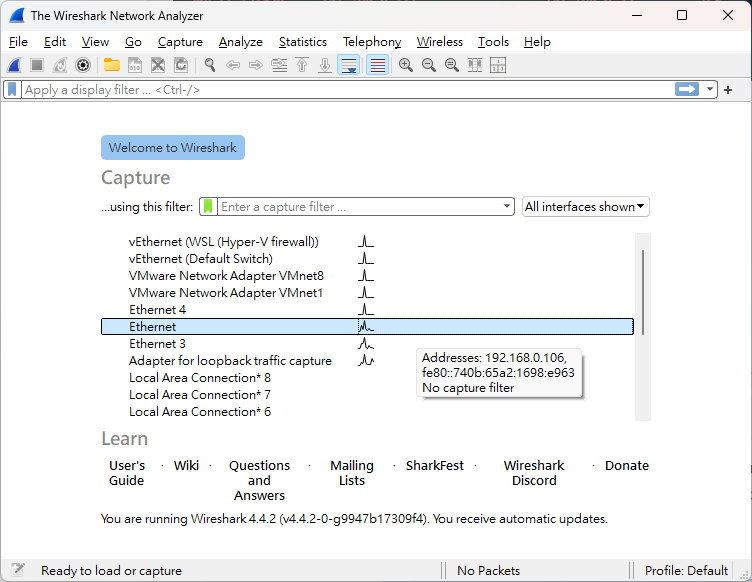
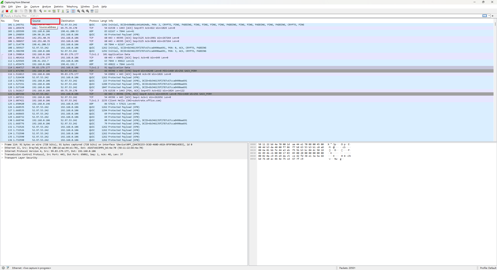
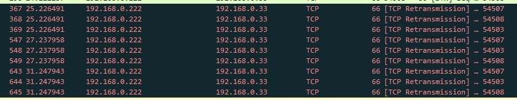
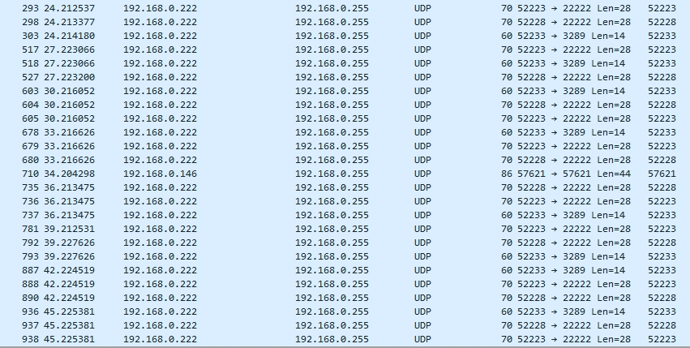

## 前言
前情提要，在將windows 開發機轉Linux時發現，因網路分享資料夾(Samba)發現不明exe ，Docker 跑出未知得的容器服務，猜測辦公室的的電腦可能中毒蠕蟲，同事用Wireshark 找到惡意的機器，就順便和他學了一下 Wireshark。

## 什麼是蠕蟲 
蠕蟲（Worm）的行為通常指的是它們在電腦或網路中運作的方式，蠕蟲是一種惡意軟體，與病毒類似，但它們的特點是能夠自行複製並在網路中快速傳播，以下是蠕蟲常見的行為特徵：

我們都知道蠕蟲行為 

1. 自我複製
蠕蟲能夠自我複製，並透過網路傳播到其他設備。
它通常會利用網路協議（如電子郵件、文件共享、即時通訊、FTP 等）來擴散，有些蠕蟲甚至會主動掃描網路，尋找開放的端口或安全漏洞的設備進行感染。

2. 利用安全漏
許多蠕蟲會利用操作系統或應用程式中的已知漏洞來入侵設備。

3. 消耗資源
蠕蟲會占用系統資源（如處理器性能、記憶體、網路頻寬等），導致受害設備或整個網路變慢，在某些情況下，這種資源消耗可能會導致網路癱瘓或設備無法運行。

## 什麼是 Wireshark
Wireshark 是一個網絡協議分析工具，通過捕獲和分析封包，提供深入的網絡流量可視化。以下是 Wireshark 的運作原理及其工作方式：

## 下載 Wireshark - [連結](https://www.wireshark.org/#downloadLink)

## 首先，選擇網路卡

## 錄製一段時間後，在點擊Source 排序

## 最後，你就會某些電腦會有異常的網路行為，會去掃每一個 Port，最後將那台電腦重裝。

## 補充
* [有CLI及 GUI的掃 Port 的小工具 - nmap](https://nmap.org/download#windows)

