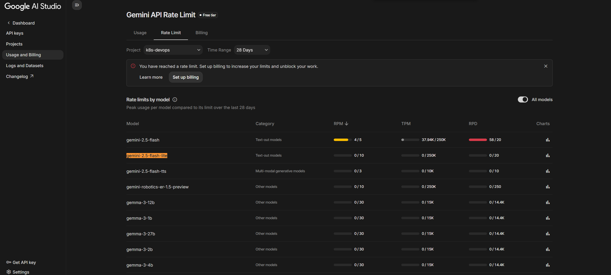

## 前言

以前管 Kubernetes 都是 `kubectl` 或 Dashboard，出門在外還要 VPN、記指令，超麻煩。這次我直接把 KubeWizard 改造成 LINE Bot Agent API，讓你用手機聊天就能查資源、看 log、重啟服務，還能自動化、擴充工具，維運體驗直接升級。

主要功能：
- 文字互動管 K8s（查資源 / 看 Logs / 重啟）
- REST API 事件入口（Prometheus / GitOps / Webhook）
- 工具可擴充，AI 輔助、自動化腳本隨你加
- 多人獨立記憶 + 智能上下文

模型我選 Google Gemini，因為：
- 有 Free Tier，夠用
- 跟 Python / FastAPI / LangChain 整合很順
- 多語系理解力不錯，維運場景很夠用

Gemini API Rate limits 詳細請看官方：[Gemini API Rate limits](https://ai.google.dev/gemini-api/docs/rate-limits)


---

## 用 LINE + Agent 管 K8s 有什麼好處？

### ✅ 隨時隨地
- 不用 VPN、不用 Terminal，手機就能搞定
- 多人 session 各自記憶，互不干擾

### 🔗 事件入口整合
- REST API 可接 Prometheus、GitLab、Argo CD、AlertManager Webhook
- 告警來了直接回 LINE 回覆診斷、給操作選項

### 🧠 智能擴充
- Tools 模式：查 K8s、Pipeline、Jira、Log 分析、Search、HTTP call 其他 API
- AI 幫你生 YAML、摘要錯誤、給修復建議

### 🎯 對話記憶
- Redis 存上下文 + Token Buffer 自動摘要
- 使用者分流，互不干擾

---

## 架構總覽

整體流程：使用者訊息 → LINE → Webhook → Agent → 工具 → 回覆


架構分四層：

| 層級 | 角色 | 說明 |
|------|------|------|
| 介面層 | LINE Bot / REST API | 多入口、Webhook、告警/事件注入 |
| 智能層 | Agent + LLM | 決策要不要用工具、整合輸出、維持上下文 |
| 工具層 | KubeTool / Search / RequestsGet / 人工介入 | 插拔式設計，擴充容易、權限隔離 |
| 狀態層 | Redis / Kubernetes SDK | 對話記憶、叢集操作、資源快照 |

---

## 為什麼用 Python Kubernetes SDK 不直接呼叫 kubectl？

| 面向 | Python SDK | 直接 kubectl |
|------|------------|--------------|
| 安全性 | 避免字串注入 | 需特別處理指令拼接 |
| 錯誤處理 | 結構化例外 | 文字解析困難 |
| 體積 | 輕量映像 | 需額外安裝 CLI |
| 程式化能力 | 物件操作、易封裝 | 需解析輸出字串 |
| RBAC 整合 | 原生憑證/SA | 需掛載 kubeconfig |

自動偵測環境：
```python
def load_k8s_config():
    if os.path.exists("/var/run/secrets/kubernetes.io/serviceaccount/token"):
        config.load_incluster_config()
    else:
        config.load_kube_config()
```

常見映射：`kubectl get pods -n X` → `v1.list_namespaced_pod(namespace=X)`。

---

## Step 1：建立 LINE Bot（前置準備）

1. 前往 LINE Developers：  
   https://developers.line.biz/console/

2. 建立 Provider

3. 建立 Messaging API Bot

4. 取得 Channel 設定並寫入 `.env`：
```env
LINE_CHANNEL_SECRET=你的_channel_secret
LINE_CHANNEL_ACCESS_TOKEN=你的_access_token
```

5. 設定 Webhook URL，例如：

```
https://your-domain.com/linebot/callback
```


Webhook 測試可以用 ngrok 讓本地端公開測試。

### Webhook Settings 建議設定

| 項目 | 設定值 |
|-------|------------|
| Webhook URL | `https://example.com/linebot/callback` |
| Use webhook | ✅ 啟用 |

> 需使用 HTTPS。成功後請點擊 Verify 確認。

---

## Step 2：改造成「LINE Bot Agent API」核心元件

預設 KubeWizard 只能問一句答一句，要變成真正好用的 Agent，必須加上記憶、工具判斷、多入口。

### 核心設計概念

| 元件 | 功能 | 技術實現 |
|------|--------|----------|
| Agent | 分析訊息與決策是否使用 Tools | LangChain OpenAI Tools Agent |
| Tools | 以插件形式提供功能（K8s、Pipeline、AI 等） | LangChain BaseTool |
| Memory | 使用 Redis 儲存上下文與使用者狀態 | RedisChatMessageHistory + ConversationTokenBufferMemory |
| API | 提供 REST API 與 LINE Webhook | FastAPI |

### 功能模組化（Tools）

每個功能都獨立成 Tool，擴充超方便。以下是 KubeTool 實作：

```python
from langchain_core.tools import BaseTool
from kubernetes import client, config
from pydantic import BaseModel, Field

class KubeInput(BaseModel):
    """Kubernetes 工具的參數模型"""
    commands: str = Field(
        ...,
        example="kubectl get pods",
        description="要執行的 kubectl 相關命令"
    )

class KubeTool(BaseTool):
    """Kubernetes 工具 - 使用 Python SDK 執行 K8s 操作"""
    
    name: str = "KubeTool"
    description: str = """在 Kubernetes 集群上執行 k8s 相關命令的工具。
    支援 get/describe/logs/list 等操作。
    特別功能：
    - 使用 'kubectl list all' 快速查看所有 namespace 和 pods 概覽
    - 使用 'kubectl list namespaces' 查看所有 namespace
    - 使用 'kubectl list pods' 按 namespace 分組查看所有 pods
    """
    args_schema: Type[BaseModel] = KubeInput
    
    def __init__(self, **kwargs):
        super().__init__(**kwargs)
        # 自動判斷環境並載入配置
        try:
            config.load_incluster_config()  # Pod 內環境
            logger.info("使用集群內配置 (Pod 環境)")
        except:
            config.load_kube_config()  # 本地環境
            logger.info("使用本地 kubeconfig 配置")
        
        self.v1 = client.CoreV1Api()
        self.apps_v1 = client.AppsV1Api()
    
    def _run(self, commands: str) -> str:
        """執行 kubectl 命令並返回結果"""
        # 解析命令並轉換為 SDK API 調用
        # 例如：kubectl get pods -n default
        # 轉換為：self.v1.list_namespaced_pod(namespace="default")
        ...
```

### Agent 判斷邏輯

```python
# Agent 初始化
from langchain.agents import create_openai_tools_agent, AgentExecutor
from langchain_google_genai import ChatGoogleGenerativeAI

# 定義可用工具
tools = [
    KubeTool(),
    SearchTool(),
    RequestsGet(),
    human_console_input()
]

# 創建 Agent
agent = create_openai_tools_agent(
    llm=ChatGoogleGenerativeAI(model="gemini-2.0-flash"),
    tools=tools,
    prompt=system_prompt
)

agent_executor = AgentExecutor(
    agent=agent,
    tools=tools,
    memory=memory,
    verbose=True
)

# 執行流程：使用者問題 → Agent 分析 → 選擇工具 → 執行 → 回傳結果
result = agent_executor.invoke({"input": "列出所有 pods"})
```

## 我的「Vibe Coding」迭代心得（真實踩雷記錄）

這次不是先寫一堆設計文件，而是邊做邊調整，用我自己說的「Vibe Coding」節奏在迭代，大概是這樣玩：

1. 先跑得起來再說：先做一個最小版的 `KubeAgent`，只接一個 `KubeTool`，可以在 CLI 回「列出 pods」就算過關。
2. 觀察模型的「個性」：看它會不會亂講、會不會該用工具卻不去查，如果會，就在 Prompt 裡補一句「先分析問題再決定要不要查詢」。
3. 一次只加一個能力：例如先加 `search`，就專心測 2～3 個情境，確認它真的會用到，再加下一個 `RequestsGet`、`human_console_input`。
4. 危險操作另外處理：發現刪除 / 重啟這種指令不太能完全交給模型後，才拆出一個 `KubeToolWithApprove`，一定要有人按確認才會執行。
5. 對話越來越長才加記憶：一開始不用急著上 Redis，等真的感覺「聊一聊會忘記前面說什麼」了，再接入 Redis + Token Buffer，順便看一下 Token 用量有沒有變穩定。
6. 真的遇到痛點再優化：例如 API 變慢、K8s 查太多次，才加「關鍵字判斷才查整體狀態」這種最佳化，而不是一開始就把所有情境腦補完。
7. 最後才收斂成 Helm：等單機 Docker / Compose 都跑穩，再把環境變數、Secrets、RBAC 打包成 Helm Chart，變成可以丟到任何叢集的模板。

整體心法很簡單：

- 先有用，再變漂亮。
- 每次迭代都只解一個真實問題（例如：記憶混在一起、回覆太長、誤刪資源）。
- 用 log 看 Agent 在幹嘛：該用工具沒用、用錯工具，通常代表 Prompt / 工具描述可以再調一下。
- 能用 SDK 的地方就不要再硬拼字串，之後要維護會輕鬆很多。

## 技術亮點、挑戰與解法（白話版）

這段就當成「我在實作中真的遇到的坑」，挑幾個代表性的來說：

1. **不用直接跑 `kubectl`，改用 Python SDK**  
  - 問題：用字串組 `kubectl`，很容易踩到 shell 注入、錯誤訊息也難處理，鏡像還要再裝一個 CLI。  
  - 做法：把常用指令（例如 `kubectl get pods -n default`）用程式解析後，映射到 Python SDK 的呼叫，像是 `v1.list_namespaced_pod(namespace="default")`，最後再自己排版成表格。  
  - 好處：輸出可控、安全性比較高，也比較好封裝成 Tool。實作在 `tools/kubetool_sdk.py`。

2. **同一套程式，要能在本機跟 K8s 裡都跑**  
  - 問題：本機要讀 `kubeconfig`，丟進叢集裡又要用 ServiceAccount，如果寫死，很容易哪邊忘記改。  
  - 做法：啟動時檢查 Pod 裡的 ServiceAccount token 存不存在，存在就用 `load_incluster_config()`，沒有就退回 `load_kube_config()`。  
  - 好處：同一份程式碼，開發、測試、上線都可以共用。實作集中在 `utils/k8s_config.py`。

3. **對話記憶會一直長大，要控制 Token 成本**  
  - 問題：跟 Bot 聊一陣子之後，歷史訊息會變很長，回應變慢、Token 費用也會一起飆。  
  - 做法：用 Redis 存每個人的對話，再用 `ConversationTokenBufferMemory` 控制長度，超過一定筆數就用模型幫忙總結，把舊訊息收斂成一段摘要。  
  - 好處：使用者感覺還是有「記憶」，但後端不會被整包歷史拖垮。相關邏輯在 `agents/kube_agent.py`。

4. **多人一起用，記憶不能混在一起**  
  - 問題：如果大家都寫進同一個 session，Bot 會記錯人，上一句問的是 A，下一句卻接 B 的上下文。  
  - 做法：Redis 的 key 裡面帶 `user_id`，每個人一個獨立的對話空間。  
  - 好處：LINE 上每個人看到的 Bot 都像是自己的小助理，不會互相干擾。實作一樣在 `agents/kube_agent.py`。

5. **危險操作一定要「剎車」**  
  - 問題：像刪 Pod、重啟 Deployment 這種動作，如果模型自己決定就去做，風險很大。  
  - 做法：把工具拆兩種：查詢用的 `KubeTool`（安全），以及需要人按確認的 `KubeToolWithApprove`。真的要動手之前，會先問一次。  
  - 好處：日常查狀態很順，真要改動叢集時還是會經過人眼。實作在 `tools/kubetool_sdk.py`。

6. **不要每一題都查整個叢集**  
  - 問題：如果每個問題都把所有 namespace / pods 狀態查一輪，既慢又浪費資源。  
  - 做法：只有遇到像「列出」「全部」「有哪些」這種關鍵字，才幫忙加上整體快照；一般追問就只查跟上一題有關的東西。  
  - 好處：回應速度比較穩，也比較不會打爆 API / K8s。邏輯在 `kube_agent.py` 的輸入前處理。

7. **RBAC 權限盡量縮小**  
  - 問題：給到 cluster-admin 很方便，但風險也最大。  
  - 做法：預設用 Namespace Scoped 的 Role 就夠用，需要跨 namespace 再改成 ClusterRole，這兩種模式都透過 Helm 的 `values.yaml` 控制。  
  - 好處：先從安全一點的設定起步，有需求再往外放權限。相關範例在 `helm/values.yaml` 與 RBAC 節。

8. **回覆要讓「維運的人」好讀**  
  - 問題：如果只丟一大段原始輸出給使用者，手機上很難看。  
  - 做法：在 Prompt 裡固定要求輸出格式，例如簡單表格＋重點提示，盡量讓最重要的資訊（哪個 Pod 爆、哪個 Service 沒後端）一眼就看到。  
  - 好處：不用再自己眼力掃 log，直接可以做下一步判斷。格式提示寫在 `agents/kube_agent.py` 的 system prompt 裡。

這些其實都不是什麼高深的「AI 技術」，比較像是：把一個會講話的 Bot，慢慢調整到真的能在維運現場派上用場。

## RBAC 權限設定（建議）

以下為建議的最小必要權限，支援 **Namespace Scoped** 和 **Cluster Wide** 兩種模式。

### Namespace Scoped（推薦，最小權限原則）

**適用場景：**
- 只需要管理特定 namespace 的資源
- 不需要 cluster-admin 權限即可部署
- 更安全、更符合企業安全規範

```yaml
apiVersion: v1
kind: ServiceAccount
metadata:
  name: kubewizard-bot
  namespace: default
---
apiVersion: rbac.authorization.k8s.io/v1
kind: Role
metadata:
  name: kubewizard-bot-role
  namespace: default
rules:
  # Core 資源
  - apiGroups: [""]
    resources: ["pods", "services", "endpoints", "events", "configmaps", "secrets", "persistentvolumeclaims"]
    verbs: ["get", "list", "watch", "create", "update", "patch"]
  
  # Pod logs（只需讀取權限）
  - apiGroups: [""]
    resources: ["pods/log"]
    verbs: ["get", "list"]
  
  # Apps 資源
  - apiGroups: ["apps"]
    resources: ["deployments", "replicasets", "statefulsets", "daemonsets"]
    verbs: ["get", "list", "watch", "create", "update", "patch"]
  
  # Batch 資源
  - apiGroups: ["batch"]
    resources: ["jobs", "cronjobs"]
    verbs: ["get", "list", "watch", "create", "update", "patch"]
  
  # Networking 資源
  - apiGroups: ["networking.k8s.io"]
    resources: ["ingresses", "networkpolicies"]
    verbs: ["get", "list", "watch", "create", "update", "patch"]
---
apiVersion: rbac.authorization.k8s.io/v1
kind: RoleBinding
metadata:
  name: kubewizard-bot-binding
  namespace: default
subjects:
  - kind: ServiceAccount
    name: kubewizard-bot
    namespace: default
roleRef:
  kind: Role
  name: kubewizard-bot-role
  apiGroup: rbac.authorization.k8s.io
```

### Cluster Wide（進階用）

**適用場景：**
- 需要跨 namespace 管理資源
- 需要查看 nodes、namespaces 等集群級別資源
- 需要 cluster-admin 權限來部署

```yaml
apiVersion: v1
kind: ServiceAccount
metadata:
  name: kubewizard-bot
  namespace: default
---
apiVersion: rbac.authorization.k8s.io/v1
kind: ClusterRole
metadata:
  name: kubewizard-bot-cluster-role
rules:
  # Namespace 級別資源（所有 namespace）
  - apiGroups: [""]
    resources: ["pods", "services", "endpoints", "events", "configmaps", "secrets", "persistentvolumeclaims"]
    verbs: ["get", "list", "watch", "create", "update", "patch"]
  
  - apiGroups: [""]
    resources: ["pods/log"]
    verbs: ["get", "list"]
  
  - apiGroups: ["apps"]
    resources: ["deployments", "replicasets", "statefulsets", "daemonsets"]
    verbs: ["get", "list", "watch", "create", "update", "patch"]
  
  - apiGroups: ["batch"]
    resources: ["jobs", "cronjobs"]
    verbs: ["get", "list", "watch", "create", "update", "patch"]
  
  - apiGroups: ["networking.k8s.io"]
    resources: ["ingresses", "networkpolicies"]
    verbs: ["get", "list", "watch"]
  
  # Cluster 級別資源（只讀）
  - apiGroups: [""]
    resources: ["nodes", "namespaces", "persistentvolumes"]
    verbs: ["get", "list", "watch"]
---
apiVersion: rbac.authorization.k8s.io/v1
kind: ClusterRoleBinding
metadata:
  name: kubewizard-bot-cluster-binding
subjects:
  - kind: ServiceAccount
    name: kubewizard-bot
    namespace: default
roleRef:
  kind: ClusterRole
  name: kubewizard-bot-cluster-role
  apiGroup: rbac.authorization.k8s.io
```

### Helm Chart 配置（推薦）

專案已包含完整的 Helm Chart，可透過 `values.yaml` 輕鬆配置：

```yaml
# values.yaml

# RBAC 配置
rbac:
  # 是否創建 RBAC 資源
  create: true
  
  # 使用 Role (false) 或 ClusterRole (true)
  # 設為 false 可避免需要 cluster-admin 權限
  clusterWide: false
  
  # 自定義 RBAC 規則
  rules:
    - apiGroups: [""]
      resources: ["pods", "services"]
      verbs: ["get", "list", "watch"]
```

**部署方式：**

```bash
# 1. Namespace Scoped 部署（推薦）
helm install kubewizard ./helm \
  --set rbac.clusterWide=false \
  --set secrets.AI_GOOGLE_API_KEY="your-api-key" \
  --namespace default

# 2. Cluster Wide 部署
helm install kubewizard ./helm \
  --set rbac.clusterWide=true \
  --set secrets.AI_GOOGLE_API_KEY="your-api-key" \
  --namespace default

# 3. 驗證 RBAC 權限
kubectl auth can-i list pods \
  --as=system:serviceaccount:default:kubewizard-bot \
  -n default
```

## Demo 示範（文字版）

### 範例 1：查詢 Pods 狀態

**你：** 幫我看 default namespace 的 Pods  
**Bot：** 
```
📦 Namespace: default
================================
NAME                         READY   STATUS              RESTARTS   AGE
nginx-deployment-7d8f...     1/1     Running            0          2d
redis-master-0               1/1     Running            0          5d
payment-service-abc123       0/1     CrashLoopBackOff   5          10m

總計: 3 pods (2 Running, 0 Pending, 1 CrashLoopBackOff)
⚠️ 發現問題: payment-service-abc123 處於 CrashLoopBackOff 狀態
需要查看 Logs 嗎？
```

**你：** 看一下那個 Crash 的 Log  
**Bot：** 
```
🔍 payment-service-abc123 的最近日誌：

2025-11-22 10:30:15 [ERROR] Failed to connect to database
2025-11-22 10:30:15 [ERROR] Connection refused: mysql:3306
2025-11-22 10:30:15 [FATAL] Application startup failed

💡 可能原因：
1. MySQL Service 不存在或無法訪問
2. 環境變數配置錯誤（DB_HOST）
3. 網絡策略阻擋連線

建議檢查：
- kubectl get svc -n default | grep mysql
- 確認 Pod 的環境變數設定
```

**你：** 幫我重啟看看  
**Bot：** 
```
🔄 正在重啟 Deployment: payment-service

✅ 已執行：kubectl rollout restart deployment/payment-service -n default
⏳ 等待新 Pod 啟動中...

📊 更新狀態：
- 舊版 Pods: 正在終止
- 新版 Pods: 正在創建
- 預計完成時間: ~30 秒

我會持續監控狀態，稍後回報結果。
```

### 範例 2：診斷網路問題

**你：** 為什麼我的 Ingress 無法訪問？  
**Bot：** 讓我幫你診斷 Ingress 問題。

```
🔍 診斷步驟：

1️⃣ 檢查 Ingress 資源
✅ Ingress 'my-app' 已存在
✅ Ingress Controller 正常運行

2️⃣ 檢查 Service
✅ Service 'my-app-svc' 已存在 (ClusterIP: 10.96.1.100)

3️⃣ 檢查 Pod
⚠️ 問題發現：Service 後端沒有可用的 Pod！

EndpointSlice 資訊：
- my-app-svc: 0/3 endpoints ready

📋 建議解決方案：
1. 檢查 Deployment 的 selector 是否與 Service 匹配
2. 檢查 Pod 的 labels 是否正確
3. 執行：kubectl describe service my-app-svc -n default

需要我幫你執行這些檢查嗎？
```

### 範例 3：智能上下文記憶

**你：** 列出所有 namespace  
**Bot：** 
```
📋 所有 Namespaces：
1. default
2. kube-system
3. kube-public
4. production
5. staging
6. monitoring

總計: 6 個 namespaces
```

**你：** production 裡面有什麼？  
**Bot：** *(智能記憶前一句的 "production" namespace)*
```
📦 Namespace: production
================================

Deployments:
- api-gateway (3/3 Ready)
- user-service (2/2 Ready)
- order-service (5/5 Ready)

Services:
- api-gateway-svc (LoadBalancer)
- user-service-svc (ClusterIP)
- order-service-svc (ClusterIP)

總計: 3 Deployments, 3 Services, 10 Pods (全部正常)
```

**你：** 重啟 api-gateway  
**Bot：** *(記得我們在談論 production namespace 的 api-gateway)*
```
確認要重啟 production namespace 的 api-gateway 嗎？
這會導致短暫的服務中斷。

[已確認]

🔄 正在執行：kubectl rollout restart deployment/api-gateway -n production
✅ 重啟成功！新 Pods 已啟動並就緒。
```


---

## 結語

這篇筆記示範怎麼把 KubeWizard 整合到 LINE Bot，打造出能聊天管 K8s 的助理，重點：

### 📚 參考資料

- [快速開始指南](https://github.com/markku636/kubewizard/blob/main/QUICKSTART.md)
- [LINE Bot 整合文檔](https://github.com/markku636/kubewizard/blob/main/kubewizard_linebot/LINE_BOT_README.md)
- [Kubernetes 配置說明](https://github.com/markku636/kubewizard/blob/main/docs/K8S_CONFIG_GUIDE.md)
- [Helm Chart 部署指南](https://github.com/markku636/kubewizard/blob/main/helm/DEPLOYMENT.md)

### 特別感謝以下開源專案：
- [LangChain](https://python.langchain.com/) - 強大的 LLM 應用框架
- [Google Gemini](https://ai.google.dev/) - 優秀的 AI 模型
- [Kubernetes Python Client](https://github.com/kubernetes-client/python) - 官方 Python SDK
- [FastAPI](https://fastapi.tiangolo.com/) - 現代化的 Web 框架


