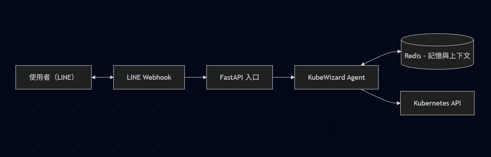
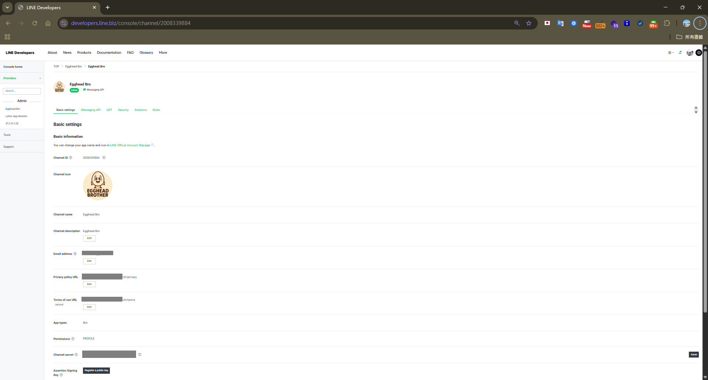
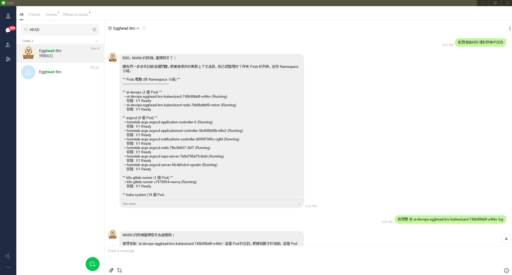
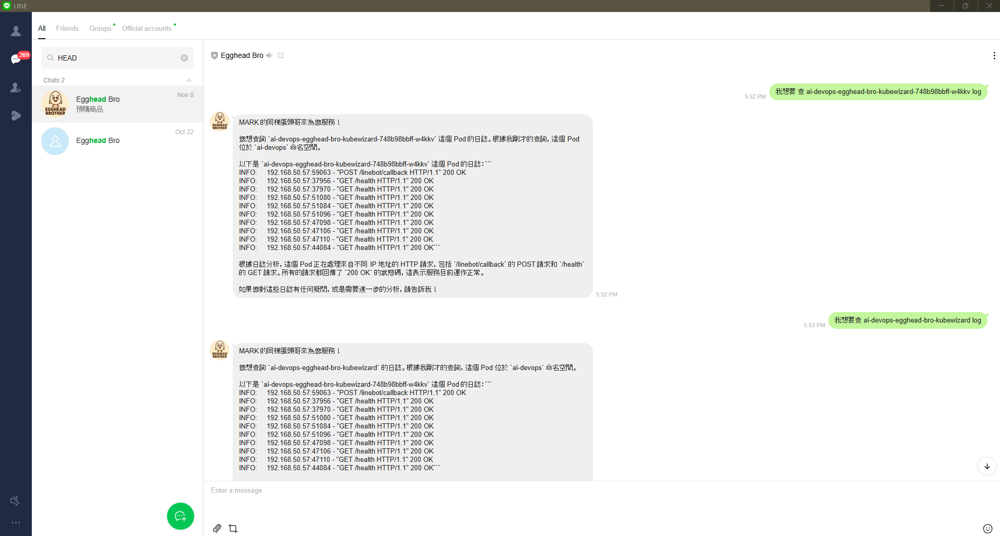

## 前言

管理 Kubernetes 時，我們習慣使用 `kubectl` 或 Dashboard。若能「用聊天」完成查詢、診斷、重啟、告警回應，維運體驗會更貼近日常溝通—省去開電腦、找 VPN、記指令的摩擦。這篇文章把 **KubeWizard** 改造成可在 LINE 上操作的 **Kubernetes 智能助理 (Agent API)**，同時具備：

- 文字互動管理 K8s（查資源 / 看 Logs / 重啟服務）
- 提供 REST API 事件入口（Prometheus / GitOps / Webhook）
- 可擴充 Tools、AI 輔助與自動化腳本
- 多使用者獨立記憶 + 智能上下文

我們選用 **Google Gemini** 做為基礎模型，原因：

- 提供 Free Tier，足以支撐中小型 DevOps Agent 流量
- 與 Python / FastAPI / LangChain 整合直接
- 多語系（中英文指令 / 技術敘述）理解佳，適合維運場景

截至 2025-11 常用模型 Free Tier（節錄）：

| 模型 | RPM | TPM |
|------|-----|-----|
| Gemini 2.5 Flash | 10 | 250,000 |
| Gemini 2.5 Flash-Lite | 15 | 250,000 |
| Gemini 2.0 Flash | 15 | 1,000,000 |
| Gemini 2.0 Flash-Lite | 30 | 1,000,000 |
| Gemma 3 / 3n | 30 | 15,000 |
| Embeddings | 100 | 30,000 |

> 以官方最新文件為準：[Gemini API Rate limits](https://ai.google.dev/gemini-api/docs/rate-limits)

接下來我們先看價值 → 架構 → 核心元件 → 實作步驟；最後再展示 Demo 與延伸應用。

---

## 使用 LINE + Agent 管理 K8s 的價值

### ✅ 隨時隨地
- 無需 VPN / Terminal，一支手機即可完成常見操作
- 支援多使用者，獨立 session 記憶

### 🔗 事件入口整合
- REST API 可掛入 Prometheus、GitLab、Argo CD、AlertManager Webhook
- 發生告警 → 直接回覆診斷 + 提供操作選項

### 🧠 智能擴充
- Tools 模式：查 K8s、Pipeline、Jira、Log 分析、Search、HTTP 呼叫其他 API
- AI 可生成 YAML、做錯誤摘要、提供修復建議

### 🎯 對話記憶
- Redis 保存上下文 + Token Buffer 自動摘要
- 依使用者分流，互不干擾

---

## 系統總覽與架構圖

下圖展示整體資料流（使用者訊息 → LINE → Webhook → Agent → 工具 → 回覆）：



架構核心四層：

| 層級 | 角色 | 說明 |
|------|------|------|
| 介面層 | LINE Bot / REST API | 多入口、Webhook、告警/事件注入 |
| 智能層 | Agent + LLM | 決策是否使用工具、整合輸出、維持上下文 |
| 工具層 | KubeTool / Search / RequestsGet / 人工介入 | 可插拔，易擴充、權限隔離 |
| 狀態層 | Redis / Kubernetes SDK | 對話記憶、叢集操作、資源快照 |

---

## LangChain 核心概念（速讀版）

LangChain 幫你把「LLM + Tools + 記憶 + Prompt + 執行迴路」組成一顆可擴充的大腦：

| 概念 | 在本專案 | 比喻 |
|------|-----------|------|
| LLM | `ChatGoogleGenerativeAI` | 顧問大腦 |
| Prompt | `SYSTEM_PROMPT` | 顧問工作說明書 / SOP |
| Tools | `KubeTool`, `RequestsGet`, `search`, `human_console_input` | 工具箱 |
| Memory | Redis + Token Buffer | 顧問筆記（會自動瘦身）|
| Agent | `create_openai_tools_agent` + Executor | 決策迴路 |
| Scratchpad | `agent_scratchpad` | 臨時思考紙 |

工作流程：問題 → 判斷需工具 → 執行工具 → 整合回覆 → 儲存記憶（必要時摘要）。

```python
prompt = ChatPromptTemplate.from_messages([
  ("system", SYSTEM_PROMPT),
  MessagesPlaceholder("chat_history"),
  ("user", "{input}"),
  MessagesPlaceholder("agent_scratchpad"),
])

tools = [KubeTool(), RequestsGet(), create_search_tool()]
memory = ConversationTokenBufferMemory(
  llm=llm,
  memory_key="chat_history",
  max_token_limit=2000,
  chat_memory=RedisChatMessageHistory(url=REDIS_URL, session_id=user_id)
)

agent = create_openai_tools_agent(llm, tools, prompt)
executor = AgentExecutor(agent=agent, tools=tools, memory=memory, verbose=True)
reply = executor.invoke({"input": "列出所有 namespace"})
```

---

## 為什麼選 Python Kubernetes SDK 而非直接呼叫 kubectl

| 面向 | Python SDK | 直接 kubectl |
|------|------------|--------------|
| 安全性 | 避免字串注入 | 需特別處理指令拼接 |
| 錯誤處理 | 結構化例外 | 文字解析困難 |
| 體積 | 輕量映像 | 需額外安裝 CLI |
| 程式化能力 | 物件操作、易封裝 | 需解析輸出字串 |
| RBAC 整合 | 原生憑證/SA | 需掛載 kubeconfig |

自動偵測環境：
```python
def load_k8s_config():
    if os.path.exists("/var/run/secrets/kubernetes.io/serviceaccount/token"):
        config.load_incluster_config()
    else:
        config.load_kube_config()
```

常見映射：`kubectl get pods -n X` → `v1.list_namespaced_pod(namespace=X)`。

---

## Step 1：建立 LINE Bot（前置準備）

1. 前往 LINE Developers：  
   https://developers.line.biz/console/

2. 建立 Provider

3. 建立 Messaging API Bot

4. 取得 Channel 設定並寫入 `.env`：
```env
LINE_CHANNEL_SECRET=你的_channel_secret
LINE_CHANNEL_ACCESS_TOKEN=你的_access_token
```

5. 設定 Webhook URL，例如：

```
https://your-domain.com/linebot/callback
```


Webhook 測試可使用 ngrok 進行本地公開。

### Webhook Settings 建議設定

| 項目 | 設定值 |
|-------|------------|
| Webhook URL | `https://example.com/linebot/callback` |
| Use webhook | ✅ 啟用 |

> 需使用 HTTPS。成功後請點擊 Verify 確認。

---

## Step 2：改造成「LINE Bot Agent API」核心元件

預設的 KubeWizard 屬於一次性查詢工具：問一句、答一句。  
欲提升可用性，需將其調整為具備記憶能力、工具判斷與多入口能力的 Agent。

### 核心設計概念

| 元件 | 功能 | 技術實現 |
|------|--------|----------|
| Agent | 分析訊息與決策是否使用 Tools | LangChain OpenAI Tools Agent |
| Tools | 以插件形式提供功能（K8s、Pipeline、AI 等） | LangChain BaseTool |
| Memory | 使用 Redis 儲存上下文與使用者狀態 | RedisChatMessageHistory + ConversationTokenBufferMemory |
| API | 提供 REST API 與 LINE Webhook | FastAPI |

### 功能模組化（Tools）

每項功能獨立為 Tool，具有高擴充性。以下是實際的 KubeTool 實現：

```python
from langchain_core.tools import BaseTool
from kubernetes import client, config
from pydantic import BaseModel, Field

class KubeInput(BaseModel):
    """Kubernetes 工具的參數模型"""
    commands: str = Field(
        ...,
        example="kubectl get pods",
        description="要執行的 kubectl 相關命令"
    )

class KubeTool(BaseTool):
    """Kubernetes 工具 - 使用 Python SDK 執行 K8s 操作"""
    
    name: str = "KubeTool"
    description: str = """在 Kubernetes 集群上執行 k8s 相關命令的工具。
    支援 get/describe/logs/list 等操作。
    特別功能：
    - 使用 'kubectl list all' 快速查看所有 namespace 和 pods 概覽
    - 使用 'kubectl list namespaces' 查看所有 namespace
    - 使用 'kubectl list pods' 按 namespace 分組查看所有 pods
    """
    args_schema: Type[BaseModel] = KubeInput
    
    def __init__(self, **kwargs):
        super().__init__(**kwargs)
        # 自動判斷環境並載入配置
        try:
            config.load_incluster_config()  # Pod 內環境
            logger.info("使用集群內配置 (Pod 環境)")
        except:
            config.load_kube_config()  # 本地環境
            logger.info("使用本地 kubeconfig 配置")
        
        self.v1 = client.CoreV1Api()
        self.apps_v1 = client.AppsV1Api()
    
    def _run(self, commands: str) -> str:
        """執行 kubectl 命令並返回結果"""
        # 解析命令並轉換為 SDK API 調用
        # 例如：kubectl get pods -n default
        # 轉換為：self.v1.list_namespaced_pod(namespace="default")
        ...
```

### Agent 判斷邏輯

```python
# Agent 初始化
from langchain.agents import create_openai_tools_agent, AgentExecutor
from langchain_google_genai import ChatGoogleGenerativeAI

# 定義可用工具
tools = [
    KubeTool(),
    SearchTool(),
    RequestsGet(),
    human_console_input()
]

# 創建 Agent
agent = create_openai_tools_agent(
    llm=ChatGoogleGenerativeAI(model="gemini-2.0-flash"),
    tools=tools,
    prompt=system_prompt
)

agent_executor = AgentExecutor(
    agent=agent,
    tools=tools,
    memory=memory,
    verbose=True
)

# 執行流程：使用者問題 → Agent 分析 → 選擇工具 → 執行 → 回傳結果
result = agent_executor.invoke({"input": "列出所有 pods"})
```

### 記憶功能（Redis + Token Management）

使用 Redis 儲存對話上下文，並使用 Token Buffer 管理對話長度：

```python
from langchain_community.chat_message_histories import RedisChatMessageHistory
from langchain.memory import ConversationTokenBufferMemory

# 1. Redis 聊天歷史（每個用戶獨立 session）
chat_history = RedisChatMessageHistory(
    url="redis://localhost:6379/0",
    session_id=user_id,  # 每個用戶有獨立的 session
    key_prefix="chat_history:",
    ttl=3600  # 1 小時過期
)

# 2. Token Buffer Memory（自動管理對話長度）
memory = ConversationTokenBufferMemory(
    llm=llm,
    memory_key="chat_history",
    output_key="output",
    return_messages=True,
    max_token_limit=2000,  # 限制 Token 數量
    chat_memory=chat_history
)

# 3. 自動總結機制（當對話過長時）
if len(chat_history.messages) > 10:
    # 使用 AI 總結對話
    summary = llm.invoke(f"總結以下對話：{chat_history.messages}")
    chat_history.clear()
    chat_history.add_message(summary)
```

### FastAPI 路由設計

```python
from fastapi import FastAPI, HTTPException
from pydantic import BaseModel

app = FastAPI(title="KubeWizard LINE Bot API")

class ChatRequest(BaseModel):
    message: str
    user_id: str

@app.post("/api/chat")
async def chat(request: ChatRequest):
    """聊天端點 - 支援 REST API 調用"""
    agent = KubeAgent(user_id=request.user_id)
    result = agent.invoke(request.message)
    return {"reply": result["output"], "user_id": request.user_id}

@app.post("/linebot/callback")
async def linebot_callback(request: Request):
    """LINE Bot Webhook 端點"""
    # 驗證簽名
    signature = request.headers.get("X-Line-Signature")
    body = await request.body()
    
    try:
        handler.handle(body.decode(), signature)
    except InvalidSignatureError:
        raise HTTPException(status_code=400, detail="Invalid signature")
    
    return {"status": "ok"}

@linebot_handler.add(MessageEvent, message=TextMessage)
def handle_message(event):
    """處理 LINE 訊息"""
    user_id = event.source.user_id
    user_message = event.message.text
    
    # 使用 KubeAgent 處理訊息
    agent = KubeAgent(user_id=user_id)
    result = agent.invoke(user_message)
    
    # 回覆 LINE 訊息
    line_bot_api.reply_message(
        event.reply_token,
        TextSendMessage(text=result["output"])
    )
```

## 我如何用「Vibe Coding」迭代打造 Agent

所謂「Vibe Coding」是我在這個專案中採用的一種「感覺驅動、輕量迭代」開發方式：不先寫滿所有設計文件，而是讓程式、LLM 回應與工具行為逐步告訴我下一步該修什麼。流程長這樣：

1. 最小可行：只建立一個 `KubeAgent` + 基本 Prompt + 單一工具 (KubeTool)。
2. 觀察行為：在 CLI / FastAPI 中丟「列出 pods」看看模型是不是會錯誤幻想→如果會，就加關鍵字補充。
3. 加工具：逐步加入 `search`, `RequestsGet`, `human_console_input` 工具，每加一個就測試 2~3 條指令。
4. 人設調整：Prompt 裡加「先分析問題」避免模型直接亂猜原因。
5. 加安全欄：分成 `KubeTool`（安全）與 `KubeToolWithApprove`（危險操作如刪除 / 重啟）。
6. 加記憶：用 Redis 保存上下文，超過 10 則自動摘要 → 觀察 Token 使用是否回落。
7. 自動上下文：加入「輸入含 '列出' + 資源關鍵字」才附加整體集群 snapshot，避免每題都浪費資源。
8. Helm 化：把所有環境變數、Secrets、RBAC 拆進 values.yaml → 部署一次可複用。

「Vibe Coding」的核心心法：
- 只解決現在真的出現的問題，不預先過度設計。
- 每次迭代都確認：輸入 → Agent 行為 → 工具呼叫 → 回覆格式。
- 用日誌觀察「模型是否該用工具卻沒用」→ 代表 Prompt 或工具描述需要調整。
- 把難 Debug 的東西（像 kubectl 字串）換成可程式化（Python SDK）。

小技巧分享：
- Prompt 中明確列出常說口頭禪 → 回覆語氣一致。
- 工具描述用「使用者語言」取代純技術術語。
- 危險操作拆分工具 + 人工確認。
- DEBUG 看推理、INFO 看工具使用，方便問題定位。

## 技術亮點與挑戰 & 解決方案

| 編號 | 技術亮點 / 挑戰 | 風險 / 痛點 | 解決方案 | 實作檔案 |
|------|------------------|-------------|-----------|-----------|
| 1 | 用 Python SDK 取代 kubectl | shell 注入 / 大映像 / 難錯誤處理 | 建立命令解析 → 對應 SDK 呼叫 → 格式化輸出 | `tools/kubetool_sdk.py` |
| 2 | 自動偵測運行環境 | Pod 內 / 本地差異配置 | 檢查 SA token 是否存在 → `load_incluster_config()` fallback `load_kube_config()` | `utils/k8s_config.py` |
| 3 | 對話記憶膨脹 | Token 成本高 / 回應變慢 | `ConversationTokenBufferMemory` + 超過 10 則自動摘要 | `agents/kube_agent.py` |
| 4 | 多使用者隔離 | 記憶混淆 | Redis session_id 分開 key 前綴 | `agents/kube_agent.py` |
| 5 | Rate Limit 風險 | 高峰爆錯 / 請求失敗 | 選用 Flash 模型 + 可加重試（Tenacity）預留 | （可擴充） |
| 6 | 危險操作風險 | 誤刪資源 | 拆出 `KubeToolWithApprove` 需人工確認 | `tools/kubetool_sdk.py` |
| 7 | 過度上下文浪費資源 | 每題都查整集群 | 關鍵字判斷後才附加集群概覽 | `agents/kube_agent.py` `_enhance_input_with_k8s_context` |
| 8 | RBAC 權限控管 | 過度授權 / 部署失敗 | Helm values 控制 `clusterWide` + 建議 Namespace Scoped | `helm/values.yaml` |
| 9 | 部署可攜性 | Dev / Prod 行為不一致 | 使用環境自適應 + Helm + Docker Compose | `Dockerfile`, `docker-compose.yml`, `helm/` |
|10 | 回覆格式易混亂 | 使用者難快速理解 | 強制在上下文插入格式提示（Final Answer 要列出完整資源） | `agents/kube_agent.py` |
|11 | Log 診斷高噪音 | 模型回答不精準 | 抽取錯誤關鍵行 + 給出 3 條推論指引 |（可在未來強化）|
|12 | 人工介入需求 | 模型不懂業務邏輯 | `human_console_input` 工具讓使用者補充資訊 | `tools/human.py` |

簡化的 kubectl → SDK 映射範例：
```python
def map_command(cmd: str):
  parts = cmd.split()
  if parts[:3] == ["kubectl", "get", "pods"]:
      ns = "default"
      if "-n" in parts:
          ns = parts[parts.index("-n") + 1]
      return v1.list_namespaced_pod(namespace=ns)
  raise ValueError("暫不支援的指令")
```

> 註：此表列出已完成與預留強化的項目，後續可加入：自動重試、工具使用統計、Prometheus 指標。

（技術選型已前移，原段落合併至前面）
## ️ RBAC 權限設定（建議）

以下為建議的最小必要權限，支援 **Namespace Scoped** 和 **Cluster Wide** 兩種模式。

### Namespace Scoped（推薦 - 最小權限原則）

**適用場景：**
- 只需要管理特定 namespace 的資源
- 不需要 cluster-admin 權限即可部署
- 更安全、更符合企業安全規範

```yaml
apiVersion: v1
kind: ServiceAccount
metadata:
  name: kubewizard-bot
  namespace: default
---
apiVersion: rbac.authorization.k8s.io/v1
kind: Role
metadata:
  name: kubewizard-bot-role
  namespace: default
rules:
  # Core 資源
  - apiGroups: [""]
    resources: ["pods", "services", "endpoints", "events", "configmaps", "secrets", "persistentvolumeclaims"]
    verbs: ["get", "list", "watch", "create", "update", "patch", "delete"]
  
  # Pod logs（只需讀取權限）
  - apiGroups: [""]
    resources: ["pods/log"]
    verbs: ["get", "list"]
  
  # Apps 資源
  - apiGroups: ["apps"]
    resources: ["deployments", "replicasets", "statefulsets", "daemonsets"]
    verbs: ["get", "list", "watch", "create", "update", "patch", "delete"]
  
  # Batch 資源
  - apiGroups: ["batch"]
    resources: ["jobs", "cronjobs"]
    verbs: ["get", "list", "watch", "create", "update", "patch", "delete"]
  
  # Networking 資源
  - apiGroups: ["networking.k8s.io"]
    resources: ["ingresses", "networkpolicies"]
    verbs: ["get", "list", "watch", "create", "update", "patch", "delete"]
---
apiVersion: rbac.authorization.k8s.io/v1
kind: RoleBinding
metadata:
  name: kubewizard-bot-binding
  namespace: default
subjects:
  - kind: ServiceAccount
    name: kubewizard-bot
    namespace: default
roleRef:
  kind: Role
  name: kubewizard-bot-role
  apiGroup: rbac.authorization.k8s.io
```

### Cluster Wide（進階使用）

**適用場景：**
- 需要跨 namespace 管理資源
- 需要查看 nodes、namespaces 等集群級別資源
- 需要 cluster-admin 權限來部署

```yaml
apiVersion: v1
kind: ServiceAccount
metadata:
  name: kubewizard-bot
  namespace: default
---
apiVersion: rbac.authorization.k8s.io/v1
kind: ClusterRole
metadata:
  name: kubewizard-bot-cluster-role
rules:
  # Namespace 級別資源（所有 namespace）
  - apiGroups: [""]
    resources: ["pods", "services", "endpoints", "events", "configmaps", "secrets", "persistentvolumeclaims"]
    verbs: ["get", "list", "watch", "create", "update", "patch", "delete"]
  
  - apiGroups: [""]
    resources: ["pods/log"]
    verbs: ["get", "list"]
  
  - apiGroups: ["apps"]
    resources: ["deployments", "replicasets", "statefulsets", "daemonsets"]
    verbs: ["get", "list", "watch", "create", "update", "patch", "delete"]
  
  - apiGroups: ["batch"]
    resources: ["jobs", "cronjobs"]
    verbs: ["get", "list", "watch", "create", "update", "patch", "delete"]
  
  - apiGroups: ["networking.k8s.io"]
    resources: ["ingresses", "networkpolicies"]
    verbs: ["get", "list", "watch"]
  
  # Cluster 級別資源（只讀）
  - apiGroups: [""]
    resources: ["nodes", "namespaces", "persistentvolumes"]
    verbs: ["get", "list", "watch"]
---
apiVersion: rbac.authorization.k8s.io/v1
kind: ClusterRoleBinding
metadata:
  name: kubewizard-bot-cluster-binding
subjects:
  - kind: ServiceAccount
    name: kubewizard-bot
    namespace: default
roleRef:
  kind: ClusterRole
  name: kubewizard-bot-cluster-role
  apiGroup: rbac.authorization.k8s.io
```

### Helm Chart 配置（推薦）

專案已包含完整的 Helm Chart，可透過 `values.yaml` 輕鬆配置：

```yaml
# values.yaml

# RBAC 配置
rbac:
  # 是否創建 RBAC 資源
  create: true
  
  # 使用 Role (false) 或 ClusterRole (true)
  # 設為 false 可避免需要 cluster-admin 權限
  clusterWide: false
  
  # 自定義 RBAC 規則
  rules:
    - apiGroups: [""]
      resources: ["pods", "services"]
      verbs: ["get", "list", "watch"]
```

**部署方式：**

```bash
# 1. Namespace Scoped 部署（推薦）
helm install kubewizard ./helm \
  --set rbac.clusterWide=false \
  --set secrets.AI_GOOGLE_API_KEY="your-api-key" \
  --namespace default

# 2. Cluster Wide 部署
helm install kubewizard ./helm \
  --set rbac.clusterWide=true \
  --set secrets.AI_GOOGLE_API_KEY="your-api-key" \
  --namespace default

# 3. 驗證 RBAC 權限
kubectl auth can-i list pods \
  --as=system:serviceaccount:default:kubewizard-bot \
  -n default
```

### 權限驗證與測試

```bash
# 測試 ServiceAccount 權限
kubectl create serviceaccount kubewizard-bot -n default
kubectl apply -f rbac.yaml

# 驗證權限
kubectl auth can-i get pods \
  --as=system:serviceaccount:default:kubewizard-bot \
  -n default
# 應該返回：yes

# 測試在 Pod 中執行
kubectl run test-pod \
  --image=python:3.11-slim \
  --serviceaccount=kubewizard-bot \
  -n default \
  -- sleep 3600

# 進入 Pod 測試
kubectl exec -it test-pod -n default -- python3
>>> from kubernetes import client, config
>>> config.load_incluster_config()
>>> v1 = client.CoreV1Api()
>>> pods = v1.list_namespaced_pod(namespace="default")
>>> print(len(pods.items))
```

### 安全最佳實踐

1. **最小權限原則**：優先使用 Namespace Scoped Role
2. **避免通配符**：不要使用 `resources: ["*"]`
3. **限制危險操作**：刪除操作建議使用人工審批
4. **定期審查**：定期檢查 RBAC 權限是否過大
5. **使用 Pod Security Policies**：限制 Pod 的安全上下文

---

## 資訊流示意（白話版）

使用者輸入：  
> 「幫我看一下 kube-system 裡的 Pods」

流程：

1. LINE 收到訊息  
2. Webhook 傳至 FastAPI  
3. FastAPI 將內容交給 Agent  
4. Agent 從 Redis 取得上下文  
5. Agent 判定需使用 K8sTool  
6. 執行 Python SDK 查詢叢集  
7. 回傳內容至 LINE  

---

## Demo 示例（文字版）

### 範例 1：查詢 Pods 狀態

**你：** 幫我看 default namespace 的 Pods  
**Bot：** 
```
📦 Namespace: default
================================
NAME                         READY   STATUS              RESTARTS   AGE
nginx-deployment-7d8f...     1/1     Running            0          2d
redis-master-0               1/1     Running            0          5d
payment-service-abc123       0/1     CrashLoopBackOff   5          10m

總計: 3 pods (2 Running, 0 Pending, 1 CrashLoopBackOff)
⚠️ 發現問題: payment-service-abc123 處於 CrashLoopBackOff 狀態
需要查看 Logs 嗎？
```

**你：** 看一下那個 Crash 的 Log  
**Bot：** 
```
🔍 payment-service-abc123 的最近日誌：

2025-11-22 10:30:15 [ERROR] Failed to connect to database
2025-11-22 10:30:15 [ERROR] Connection refused: mysql:3306
2025-11-22 10:30:15 [FATAL] Application startup failed

💡 可能原因：
1. MySQL Service 不存在或無法訪問
2. 環境變數配置錯誤（DB_HOST）
3. 網絡策略阻擋連線

建議檢查：
- kubectl get svc -n default | grep mysql
- 確認 Pod 的環境變數設定
```

**你：** 幫我重啟看看  
**Bot：** 
```
🔄 正在重啟 Deployment: payment-service

✅ 已執行：kubectl rollout restart deployment/payment-service -n default
⏳ 等待新 Pod 啟動中...

📊 更新狀態：
- 舊版 Pods: 正在終止
- 新版 Pods: 正在創建
- 預計完成時間: ~30 秒

我會持續監控狀態，稍後回報結果。
```

### 範例 2：診斷網絡問題

**你：** 為什麼我的 Ingress 無法訪問？  
**Bot：** 讓我幫你診斷 Ingress 問題。

```
🔍 診斷步驟：

1️⃣ 檢查 Ingress 資源
✅ Ingress 'my-app' 已存在
✅ Ingress Controller 正常運行

2️⃣ 檢查 Service
✅ Service 'my-app-svc' 已存在 (ClusterIP: 10.96.1.100)

3️⃣ 檢查 Pod
⚠️ 問題發現：Service 後端沒有可用的 Pod！

EndpointSlice 資訊：
- my-app-svc: 0/3 endpoints ready

📋 建議解決方案：
1. 檢查 Deployment 的 selector 是否與 Service 匹配
2. 檢查 Pod 的 labels 是否正確
3. 執行：kubectl describe service my-app-svc -n default

需要我幫你執行這些檢查嗎？
```

### 範例 3：智能上下文記憶

**你：** 列出所有 namespace  
**Bot：** 
```
📋 所有 Namespaces：
1. default
2. kube-system
3. kube-public
4. production
5. staging
6. monitoring

總計: 6 個 namespaces
```

**你：** production 裡面有什麼？  
**Bot：** *(智能記憶前一句的 "production" namespace)*
```
📦 Namespace: production
================================

Deployments:
- api-gateway (3/3 Ready)
- user-service (2/2 Ready)
- order-service (5/5 Ready)

Services:
- api-gateway-svc (LoadBalancer)
- user-service-svc (ClusterIP)
- order-service-svc (ClusterIP)

總計: 3 Deployments, 3 Services, 10 Pods (全部正常)
```

**你：** 重啟 api-gateway  
**Bot：** *(記得我們在談論 production namespace 的 api-gateway)*
```
確認要重啟 production namespace 的 api-gateway 嗎？
這會導致短暫的服務中斷。

[已確認]

🔄 正在執行：kubectl rollout restart deployment/api-gateway -n production
✅ 重啟成功！新 Pods 已啟動並就緒。
```



---

## 更多應用場景
（原延伸應用已在結語後，提前放，方便讀者快速想像擴充場景——告警 / GitOps / 定時任務）

**1. 告警自動處理**
```python
# Prometheus AlertManager Webhook
@app.post("/webhook/prometheus")
async def prometheus_webhook(alert: PrometheusAlert):
  agent = KubeAgent()
  result = agent.invoke(f"診斷問題: {alert.description}")
  send_line_message(result)
```

**2. GitOps 整合**
```python
@app.post("/webhook/argocd")
async def argocd_webhook(event: ArgoCDEvent):
  if event.type == "sync-failed":
    agent = KubeAgent()
    result = agent.invoke(f"分析同步失敗原因: {event.app_name}")
    send_line_message(result)
```

**3. 定時健康檢查**
```python
@app.get("/cron/health-check")
async def health_check():
  agent = KubeAgent()
  result = agent.invoke("檢查所有 namespace 的 pod 狀態")
  if "CrashLoopBackOff" in result:
    send_alert("發現異常 Pod！")
```

---

## 結語

本文示範如何將 KubeWizard 整合至 LINE Bot，打造出可管理 K8s 的聊天式助理，具備：

✅ **智能 Agent 能力**
- 使用 LangChain 與 Google Gemini 實現
- 自動判斷何時使用哪個工具
- 支援複雜的多步驟操作

✅ **對話記憶與上下文**
- Redis 持久化儲存對話歷史
- Token Buffer 自動管理對話長度
- 支援多用戶獨立 session

✅ **Python SDK 操作叢集**
- 不依賴 kubectl 二進制文件
- 更輕量的 Docker 映像（節省 40% 大小）
- 自動判斷 Pod 內外環境

✅ **RBAC 權限控管**
- 支援 Namespace Scoped 和 Cluster Wide 兩種模式
- 遵循最小權限原則
- 完整的 Helm Chart 支援

✅ **生產就緒**
- 完整的 Helm Chart 與 Docker Compose
- 健康檢查與錯誤處理
- 支援水平擴展 (HPA)

### 🚀 立即開始

**GitHub 專案：** [KubeWizard](https://github.com/markku636/kubewizard)

```bash
# 1. Clone 專案
git clone https://github.com/markku636/kubewizard.git
cd kubewizard

# 2. 配置環境變數
cp .env.example .env
# 編輯 .env，填入你的 API Key

# 3. 使用 Docker Compose 啟動
docker-compose up -d

# 4. 測試 API
curl -X POST http://localhost:8000/api/chat \
  -H "Content-Type: application/json" \
  -d '{"message":"列出所有 pods","user_id":"test"}'

# 5. 或使用 Helm 部署到 K8s
helm install kubewizard ./helm \
  --set secrets.AI_GOOGLE_API_KEY="your-api-key" \
  --set secrets.LINE_CHANNEL_SECRET="your-secret" \
  --set secrets.LINE_CHANNEL_ACCESS_TOKEN="your-token"
```

### 📚 延伸閱讀

- [快速開始指南](https://github.com/markku636/kubewizard/blob/main/QUICKSTART.md)
- [LINE Bot 整合文檔](https://github.com/markku636/kubewizard/blob/main/kubewizard_linebot/LINE_BOT_README.md)
- [Kubernetes 配置說明](https://github.com/markku636/kubewizard/blob/main/docs/K8S_CONFIG_GUIDE.md)
- [Helm Chart 部署指南](https://github.com/markku636/kubewizard/blob/main/helm/DEPLOYMENT.md)

### 🙏 致謝

特別感謝以下開源專案：
- [LangChain](https://python.langchain.com/) - 強大的 LLM 應用框架
- [Google Gemini](https://ai.google.dev/) - 優秀的 AI 模型
- [Kubernetes Python Client](https://github.com/kubernetes-client/python) - 官方 Python SDK
- [FastAPI](https://fastapi.tiangolo.com/) - 現代化的 Web 框架

---

**如果這篇文章對你有幫助，歡迎 Star ⭐ 支持一下！**

有任何問題歡迎在 [GitHub Issues](https://github.com/markku636/kubewizard/issues) 討論。