## 前言

管理 Kubernetes，大多數人會使用 `kubectl` 或開啟 Dashboard。  
然而，若能透過聊天的方式管理 K8s，是否會更直覺、更便利？

本文將示範如何將 **KubeWizard** 打造成可在 LINE 上操作的 **Kubernetes 管理助理**：

- 可直接傳訊息查叢集狀態、查看 Logs、重啟服務
- 同時支援 REST API，可作為事件入口
- 支援擴充工具（Tools）、自動化與 AI 協助

在 AI 模型的選擇上，本文示範使用的是 **Google Gemini**：

- Gemini 有提供 **免費額度（Free Tier）**，對於開發這類 DevOps Agent、聊天助理與實驗性專案來說，流量通常非常充足
- API 介面簡單，容易與 FastAPI、Python SDK 等元件整合
- 對多語系（包含中英文技術文件、指令說明）理解能力不錯，適合處理維運情境的自然語言互動

以下是截至 2025-11 的部分 **標準 API Free Tier 上限**（實際數值請以官方文件為準）：

| 模型 | Free Tier 每分鐘請求數（RPM） | Free Tier 每分鐘 Token 數（TPM） |
|------|-------------------------------|-----------------------------------|
| Gemini 2.5 Flash | 10 | 250,000 |
| Gemini 2.5 Flash-Lite | 15 | 250,000 |
| Gemini 2.0 Flash | 15 | 1,000,000 |
| Gemini 2.0 Flash-Lite | 30 | 1,000,000 |
| Gemma 3 / 3n | 30 | 15,000 |
| Embeddings（Gemini Embedding） | 100 | 30,000 |

> 註：上表僅節錄與本文情境較相關的模型／數值，未列出的模型與最新限制請參考官方說明。

更多詳情可參考官方文件：

- [Gemini API Rate limits 官方文件](https://ai.google.dev/gemini-api/docs/rate-limits)

透過此方式，你無須開啟終端機，在通勤、外出或休息時即可完成許多維運工作。

---

## 為什麼用 LINE 來做 K8s 聊天助理

以下是此模式能帶來的主要價值：

### ✅ 隨時隨地可用

- 不需 VPN、不需 Terminal
- 一支手機即可完成常見維運操作

### 🔗 支援 API Gateway

KubeWizard 可同時提供 **REST API**，可整合各種事件來源，例如：

- Prometheus 告警觸發後通知 LINE 並提供操作選項
- GitLab Pipeline 成功/失敗通知與相關指令建議
- Argo CD Drift 監控並詢問是否自動同步

### 🧠 可擴充成 DevOps 助理

支援以插件形式擴充工具，例如：

- 查詢 GitLab Pipeline 狀態
- 查詢 Jira Ticket 狀態
- 執行維運自動化 Script
- AI 協助分析 Log 或產生 YAML

---

## Step 1：建立 LINE Bot

1. 前往 LINE Developers：  
   https://developers.line.biz/console/

2. 建立 Provider

3. 建立 Messaging API Bot

4. 取得 Channel 設定並寫入 `.env`：
```env
LINE_CHANNEL_SECRET=你的_channel_secret
LINE_CHANNEL_ACCESS_TOKEN=你的_access_token
```

5. 設定 Webhook URL，例如：

```
https://your-domain.com/linebot/callback
```


Webhook 測試可使用 ngrok 進行本地公開。

### Webhook Settings 建議設定

| 項目 | 設定值 |
|-------|------------|
| Webhook URL | `https://example.com/linebot/callback` |
| Use webhook | ✅ 啟用 |

> 需使用 HTTPS。成功後請點擊 Verify 確認。

---

## Step 2：將 KubeWizard 改造成「LINE Bot Agent API」

預設的 KubeWizard 屬於一次性查詢工具：問一句、答一句。  
欲提升可用性，需將其調整為具備記憶能力、工具判斷與多入口能力的 Agent。

### 核心設計概念

| 元件 | 功能 |
|------|--------|
| Agent | 分析訊息與決策是否使用 Tools |
| Tools | 以插件形式提供功能（K8s、Pipeline、AI 等） |
| Memory | 使用 Redis 儲存上下文與使用者狀態 |

### 功能模組化（Tools）

每項功能獨立為 Tool，具有高擴充性：

```python
class K8sTool(BaseTool):
    name = "k8s_pods"
    description = "查詢 Kubernetes Pods"

    def run(self, namespace: str):
        return kube_client.list_pods(namespace)
```
### Agent 判斷邏輯

```python
Agent → 分析訊息 → 選擇 Tool → 執行 → 回傳結果
```

### 記憶功能（Redis）

使用 Redis 儲存對話上下文，使 Bot 能理解前後語意：

```python
from langchain_community.chat_message_histories import RedisChatMessageHistory

chat_history = RedisChatMessageHistory(
    url="redis://localhost:6379/0",
    session_id=user_id,
    key_prefix="chat_history",
    ttl=3600
)

messages = chat_history.messages
chat_history.add_message(new_message)
```

---

### 為什麼選 Python SDK 而非 kubectl？（可支援 Pod 內外）

KubeWizard 使用 **Kubernetes Python SDK** 操作叢集，而非呼叫 `kubectl` 指令。

**優點：**

- 不依賴 CLI，安全性較高
- 避免因字串解析導致風險與維護問題
- 可搭配 RBAC 精準控管權限

Python SDK 在 **Pod 內與外部皆可使用**：

| 運行環境 | 載入方式 | 用途 |
|---------|--------|--------|
| 叢集內（Pod） | `load_incluster_config()` | 正式部署與權限控管 |
| 外部（本地/VM） | `load_kube_config()` | 開發與測試 |
自動偵測範例：

```python
from kubernetes import client, config
import os

def load_k8s_config():
    if os.path.exists("/var/run/secrets/kubernetes.io/serviceaccount/token"):
        config.load_incluster_config()
    else:
        config.load_kube_config()

load_k8s_config()
```

---

## 系統架構圖

```mermaid
flowchart LR
    User[使用者（LINE）] <--> LINEWebhook[LINE Webhook]
    LINEWebhook --> FastAPI[FastAPI 入口]
    FastAPI --> Agent[KubeWizard Agent]
    Agent <--> Redis[(Redis - 記憶與上下文)]
    Agent --> K8s[Kubernetes API]
```



---

## 🛡️ RBAC 権限設定（建議）

以下為建議的最小必要權限。

### Namespace Scoped（推薦）

```yaml
apiVersion: rbac.authorization.k8s.io/v1
kind: Role
metadata:
  name: kubewizard-bot-role
  namespace: default
rules:
  - apiGroups: [""]
    resources: ["pods", "services", "endpoints", "events", "configmaps", "secrets", "persistentvolumeclaims"]
    verbs: ["get", "list", "watch", "create", "update", "patch", "delete"]

  - apiGroups: ["apps"]
    resources: ["deployments", "replicasets", "statefulsets", "daemonsets"]
    verbs: ["get", "list", "watch", "create", "update", "patch", "delete"]

  - apiGroups: ["batch"]
    resources: ["jobs", "cronjobs"]
    verbs: ["get", "list", "watch", "create", "update", "patch", "delete"]

  - apiGroups: ["networking.k8s.io"]
    resources: ["ingresses", "networkpolicies"]
    verbs: ["get", "list", "watch", "create", "update", "patch", "delete"]
```

---

## 資訊流示意（白話版）

使用者輸入：  
> 「幫我看一下 kube-system 裡的 Pods」

流程：

1. LINE 收到訊息  
2. Webhook 傳至 FastAPI  
3. FastAPI 將內容交給 Agent  
4. Agent 從 Redis 取得上下文  
5. Agent 判定需使用 K8sTool  
6. 執行 Python SDK 查詢叢集  
7. 回傳內容至 LINE  

---

## Demo 示例（文字版）

**你：** 幫我看 default namespace 的 Pods  
**Bot：** 共 12 個 Pods（3 個 Running、1 個 CrashLoopBackOff...）需看 Logs 嗎？  
**你：** 看一下剛剛那個 Crash 的 Log  
**Bot：** （顯示 Logs 並提供可能原因）  
**你：** 幫我重啟看看  
**Bot：** 已重啟 Deployment `payment-service`，更新後狀態回報中。  


---

## 結語

本文示範如何將 KubeWizard 整合至 LINE Bot，打造出可管理 K8s 的聊天式助理，具備：

- Agent 模型能力
- 記憶與上下文
- Python SDK 操作叢集
- RBAC 權限控管