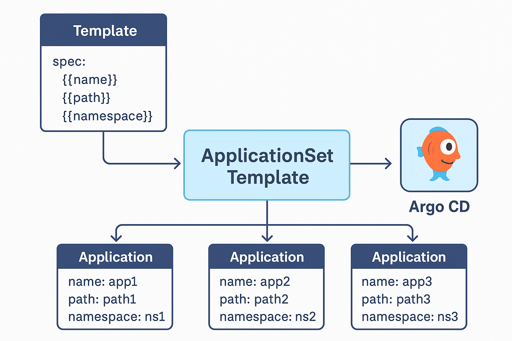
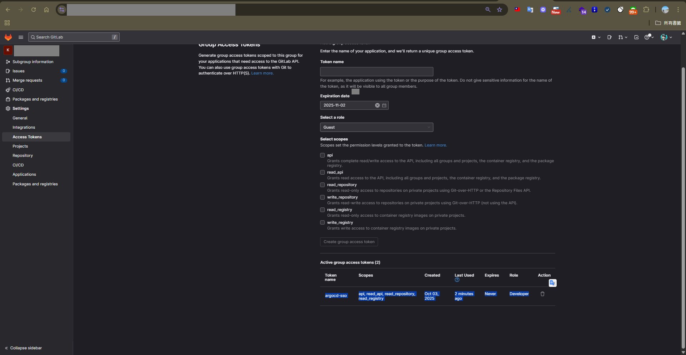
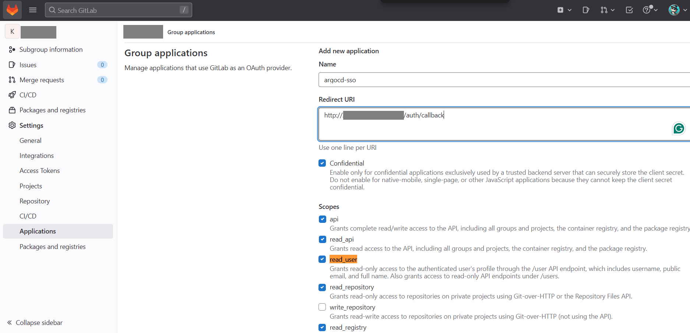
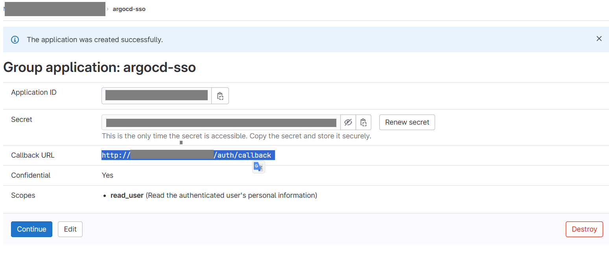
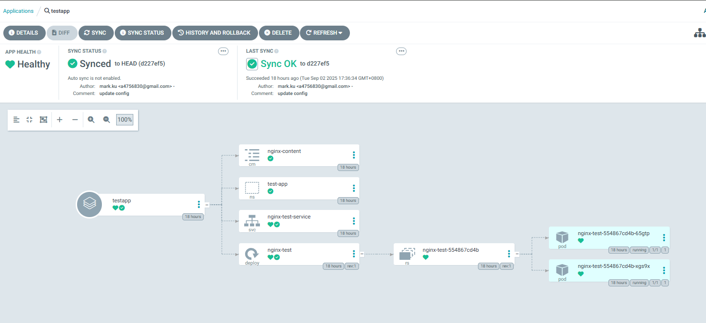

## 前言

當你同時管理 **10～20 個 Kubernetes 集群**時，使用 kubectl 手動部署不僅耗時，也容易出錯。就像要在 20 台手機上安裝同一個 App，逐一操作遲早會漏掉某一台。

**Argo CD** 搭配 **GitOps** 可以解決這個問題，但學習曲線確實比 kubectl 陡峭。你需要理解：

- GitOps 的宣告式思維與單一真相來源概念
- Argo CD 的 Application、Project、Sync 運作機制
- Helm、OAuth、Registry、RBAC 等整合技術

不過，一旦掌握這些知識，多叢集與多環境的維運效率將大幅提升。

本文將帶你完成以下三個目標：

1. 理解 Argo CD 在 GitOps 架構中的定位
2. 使用 Helm 安裝與配置 Argo CD
3. 整合 GitLab SSO 實現安全的登入與權限管理

---

## 核心概念

### 什麼是 GitOps？

**GitOps** 是一種以 Git 為中心的運維方法論：

- **Git 作為唯一真相來源**：所有 Kubernetes 設定檔都存放在 Git 倉庫中
- **自動同步機制**：系統自動將 Git 中的設定套用到所有環境
- **版本可追溯**：每次變更都有完整的 Git 歷史記錄，出錯時可快速回滾

比喻來說，Git 就像一本標準食譜，而 GitOps 工具會確保所有廚房（集群）都按照同一份食譜烹飪。

### Argo CD 的角色


Argo CD 是 GitOps 的實踐工具，負責：

- 持續監控 Git 倉庫的變更
- 自動將變更同步到 Kubernetes 集群
- 確保實際狀態與 Git 定義保持一致
- 透過 UI 和 Git 歷史記錄追蹤所有變更

其核心價值在於讓基礎設施管理變得**更安全、更一致、更易於維護**。

### 理解 GitLab Token 類型

在 Argo CD 與 GitLab 的整合中，常用兩種 Token：

#### Personal Access Token (PAT)
- **綁定對象**：個人帳號
- **權限範圍**：繼承使用者權限
- **適用場景**：個人實驗、PoC、小型專案

#### Group Access Token
- **綁定對象**：GitLab Group
- **權限範圍**：僅限該 Group 的 `read_repository`、`read_api` 等
- **適用場景**：團隊協作、生產環境

**安全性比較**：

- PAT 如同「個人萬用鑰匙」，外洩時影響範圍大
- Group Access Token 如同「專案服務鑰匙」，可獨立管理與輪替，不綁定個人帳號

本文採用 **Group Access Token**，讓 Argo CD 讀取整個 Group 的倉庫，維護更簡潔且符合團隊使用情境。
---

## 安裝流程

### Step 1：準備 Helm 環境

加入 Argo CD 的 Helm repository 並匯出預設設定檔：

```bash
# 新增 Helm repository
helm repo add argo https://argoproj.github.io/argo-helm
helm repo update

# 匯出預設 values 供修改使用
helm show values argo/argo-cd --version 8.3.2 > values.yaml
```

### Step 2：建立 GitLab OAuth Application

前往 GitLab 設定 SSO 整合：

1. 登入 GitLab → 點選右上角頭像 → `Settings → Applications`
2. 點選 **New Application** 並填寫：
   - **Name**：`ArgoCD SSO`
   - **Redirect URI**：`http://<your-node-ip>:32009/api/dex/callback`
   - **Scopes**：勾選 `openid`, `read_user`, `email`
3. 儲存後取得 **Application ID** 和 **Secret**

> ⚠️ 請妥善保存 Client ID 和 Secret，不要提交到 Git 倉庫中。

### Step 3：建立 GitLab Group Access Token

為 Argo CD 建立倉庫讀取權限：

1. 前往 GitLab Group → `Settings → Access Tokens`
2. 建立新 Token：
   - **Name**：`argocd-group-readonly`
   - **Scopes**：勾選 `read_repository` 和 `read_api`
   - **Role**：選擇 `Reporter`
3. 儲存後複製 Token（只會顯示一次）

### Step 4：配置 values.yaml

編輯 `values.yaml`，整合所有設定：

```yaml
configs:
  cm:
    # Argo CD 對外 URL
    url: http://<your-node-ip>:32009
    
    # GitLab SSO 設定
    dex.config: |
      connectors:
        - type: gitlab
          id: gitlab
          name: GitLab
          config:
            baseURL: https://gitlab.example.com
            clientID: <your-gitlab-oauth-client-id>
            clientSecret: <your-gitlab-oauth-client-secret>
            redirectURI: http://<your-node-ip>:32009/api/dex/callback
    
  # GitLab Repository 認證（使用 Group Access Token）
  credentialTemplates:
    gitlab-group-token:
      url: https://gitlab.example.com
      username: oauth2
      password: <your-gitlab-group-access-token>
      
  # 預先註冊的 Repository
  repositories:
    kong-api-gateway:
      url: https://gitlab.example.com/your-group/kong-api-gateway.git
      type: git
    argocd-deployment:
      url: https://gitlab.example.com/your-group/argocd-deployment.git
      type: git

# Server 網路設定
server:
  service:
    type: NodePort
    nodePortHttp: 32009
    nodePortHttps: 32010
  
  # 允許 HTTP（僅開發環境使用）
  extraArgs:
    - --insecure
```

> 💡 **生產環境建議**：使用 Ingress + TLS 取代 NodePort，並移除 `--insecure` 參數。

### Step 5：執行安裝

套用設定檔並安裝 Argo CD：

```bash
# 安裝 Argo CD
helm upgrade --install homelab-argo argo/argo-cd \
  --version 8.3.2 \
  -f values.yaml \
  -n argocd --create-namespace

# 等待 Pod 就緒
kubectl wait --for=condition=ready pod \
  -l app.kubernetes.io/name=argocd-server \
  -n argocd --timeout=300s

# 取得初始 admin 密碼
kubectl -n argocd get secret argocd-initial-admin-secret \
  -o jsonpath="{.data.password}" | base64 -d
```

登入後請立即修改 admin 密碼。

---

## 權限管理

### Step 6：設定 RBAC 與 AppProject

安裝完成後，需要配置 AppProject 來管理應用程式的權限範圍。

建立 `argocd-projects.yaml`：

```yaml
apiVersion: v1
kind: List
items:
# Default Project - 基本權限
- apiVersion: argoproj.io/v1alpha1
  kind: AppProject
  metadata:
    name: default
    namespace: argocd
  spec:
    # 允許所有來源 repo
    sourceRepos:
    - '*'
    
    # 允許部署到所有叢集與 namespace
    destinations:
    - namespace: '*'
      server: '*'
    
    # 允許操作集群級資源
    clusterResourceWhitelist:
    - group: '*'
      kind: '*'
    
    # 允許操作命名空間級資源
    namespaceResourceWhitelist:
    - group: '*'
      kind: '*'

# 自訂 Project - 依需求調整
- apiVersion: argoproj.io/v1alpha1
  kind: AppProject
  metadata:
    name: your-project
    namespace: argocd
  spec:
    description: 你的專案描述
    
    sourceRepos:
    - 'https://gitlab.example.com/your-group/*'
    
    destinations:
    - namespace: '*'
      server: https://kubernetes.default.svc
    
    # 集群級資源白名單
    clusterResourceWhitelist:
    - group: ''
      kind: Namespace
    - group: 'rbac.authorization.k8s.io'
      kind: ClusterRole
    - group: 'rbac.authorization.k8s.io'
      kind: ClusterRoleBinding
    - group: 'apiextensions.k8s.io'
      kind: CustomResourceDefinition
    
    # 命名空間級資源白名單
    namespaceResourceWhitelist:
    - group: ''
      kind: ConfigMap
    - group: ''
      kind: Secret
    - group: ''
      kind: Service
    - group: ''
      kind: ServiceAccount
    - group: 'apps'
      kind: Deployment
    - group: 'apps'
      kind: StatefulSet
    - group: 'batch'
      kind: Job
    - group: 'batch'
      kind: CronJob
    - group: 'networking.k8s.io'
      kind: Ingress

# Argo CD Controller 額外的 RBAC 權限（支援 metrics-server 等）
- apiVersion: rbac.authorization.k8s.io/v1
  kind: ClusterRole
  metadata:
    name: argocd-application-controller-auth-delegator
    labels:
      app.kubernetes.io/component: application-controller
      app.kubernetes.io/name: argocd-application-controller
      app.kubernetes.io/part-of: argocd
  rules:
  # Auth delegation for metrics-server
  - apiGroups: ["authentication.k8s.io"]
    resources: ["tokenreviews"]
    verbs: ["create"]
  - apiGroups: ["authorization.k8s.io"]
    resources: ["subjectaccessreviews"]
    verbs: ["create"]
  # API Services management
  - apiGroups: ["apiregistration.k8s.io"]
    resources: ["apiservices"]
    verbs: ["get", "list", "watch", "create", "update", "patch", "delete"]

- apiVersion: rbac.authorization.k8s.io/v1
  kind: ClusterRoleBinding
  metadata:
    name: argocd-application-controller-auth-delegator
  roleRef:
    apiGroup: rbac.authorization.k8s.io
    kind: ClusterRole
    name: argocd-application-controller-auth-delegator
  subjects:
  - kind: ServiceAccount
    name: argocd-application-controller
    namespace: argocd
```

### 套用設定

```bash
# 套用 AppProject 與 RBAC 設定
kubectl apply -f argocd-projects.yaml -n argocd

# 驗證 Project 是否建立成功
kubectl get appprojects -n argocd

# 驗證 RBAC 是否建立成功
kubectl get clusterrole | grep argocd
kubectl get clusterrolebinding | grep argocd
```

### 理解權限架構

Argo CD 與 GitLab 整合涉及三層權限管理：

**1. SSO 登入（GitLab OAuth）**
- 控制使用者身分驗證與授權
- 決定誰可以存取 Argo CD UI 及可見的 Application 範圍
- 本文已在 Step 4 的 `values.yaml` 中完成設定

**2. Repository 存取（Group Access Token）**
- 讓 Argo CD 讀取 GitLab 倉庫的程式碼與 Helm Chart
- 採用 Group Access Token 統一管理整個 Group 的權限
- 已在 Step 4 的 `credentialTemplates` 中完成設定

**3. Container Registry（選用）**
- 若使用 GitLab Container Registry 拉取映像檔，需額外設定
- 可使用 Deploy Token 建立 `imagePullSecrets`



> 💡 **簡單記憶**：SSO 管「人」，Group Token 管「程式碼」，Registry Token 管「映像檔」。

---

## 選用配置

以下是一些替代方案與進階設定，如果您在前面的步驟中已經透過 `values.yaml` 完成設定，可以跳過這些章節。

### 方案 A：使用 UI 設定 SSO（替代 Step 4 的 values.yaml 設定）

若安裝時未在 `values.yaml` 中設定 OAuth，可透過 UI 介面補充：

1. 登入 Argo CD UI → `Settings → SSO / OAuth`
2. 選擇 GitLab 並填寫：
   - **Client ID**：GitLab OAuth Application ID
   - **Client Secret**：GitLab OAuth Secret
   - **Redirect URI**：`http://<your-node-ip>:32009/api/dex/callback`
3. 儲存設定




### 方案 B：使用 CLI 管理 Repository（替代 Step 4 的 credentialTemplates 設定）

若偏好使用 CLI 而非 `values.yaml` 管理倉庫：

```bash
# 建立 Kubernetes Secret
kubectl create secret generic argocd-gitlab-group-token \
  --from-literal=username=oauth2 \
  --from-literal=password=<your-gitlab-group-access-token> \
  -n argocd

# 使用 Argo CD CLI 新增倉庫
argocd repo add https://gitlab.example.com/your-group/your-repo.git \
  --username oauth2 \
  --password <your-gitlab-group-access-token>
```

### 方案 C：配置 GitLab Container Registry

若需從 GitLab Container Registry 拉取映像檔：

**1. 建立 Deploy Token**

前往 GitLab Project → `Settings → Repository → Deploy Tokens`：
- Scope：勾選 `read_registry`
- 記錄 Username 和 Token

**2. 建立 Kubernetes Secret**

```bash
kubectl create secret docker-registry gitlab-registry \
  --docker-server=registry.gitlab.com \
  --docker-username=<Deploy-Token-Username> \
  --docker-password=<Deploy-Token> \
  --docker-email=<your-email@example.com> \
  -n <namespace>
```

**3. 在 Deployment 中引用**

```yaml
spec:
  template:
    spec:
      containers:
        - name: my-app
          image: registry.gitlab.com/<group>/<project>/<image>:<tag>
      imagePullSecrets:
        - name: gitlab-registry
```

---

## 實戰範例

### 應用程式狀態總覽

圖表說明 

這張圖片是 [Argo CD](https://argo-cd.readthedocs.io/en/stable/) 的應用程式狀態畫面，用來管理 Kubernetes 應用程式的部署狀態：


* **應用程式名稱：** `testapp`
* **APP HEALTH（健康狀態）：** ✅ **Healthy** → 代表應用程式目前的所有資源都運作正常。
* **SYNC STATUS（同步狀態）：** ✅ **Synced to HEAD (d227ef5)** → 表示 Git 倉庫裡的設定檔已成功同步到叢集，沒有偏差。
* **LAST SYNC：** ✅ **Sync OK** → 最近一次同步成功，是在 `18 hours ago`（18 小時前）由 `mark.ku` 完成的。 → 提交備註為 `update config`。
* **Auto sync：** ❌ **未啟用自動同步**（Auto sync is not enabled）


---

### 🌳 應用程式資源架構圖解

這是以 GitOps 模式部署的 Kubernetes 應用資源樹狀圖：


1. **testapp（應用程式）**
   * **nginx-content（ConfigMap）**
   * **test-app（Namespace）**
   * **nginx-test-service（Service）**
   * **nginx-test（Deployment）**
     * **nginx-test-554867cd4b（ReplicaSet）**
       * **nginx-test-554867cd4b-65gtp（Pod）**
       * **nginx-test-554867cd4b-xgs9x（Pod）**

📌 所有資源右上角都有 ✅，表示部署成功、狀態正常。

---

## 常用指令參考

### Helm 相關

```bash
# 安裝 Helm（Windows）
choco install kubernetes-helm

# 安裝/升級 Argo CD
helm upgrade --install argocd argo/argo-cd \
  --namespace argocd --create-namespace \
  -f values.yaml

# 匯出當前設定
helm get values argocd -n argocd -o yaml > current-values.yaml
```

### Kubernetes 相關

```bash
# 查詢 Argo CD Service
kubectl get svc argocd-server -n argocd

# 將 Service 改為 NodePort
kubectl patch svc argocd-server -n argocd -p '{
  "spec": {
    "type": "NodePort",
    "ports": [
      {
        "port": 80,
        "targetPort": 8080,
        "nodePort": 32009
      }
    ]
  }
}'

# 取得初始 admin 密碼
kubectl -n argocd get secret argocd-initial-admin-secret \
  -o jsonpath="{.data.password}" | base64 -d

# 匯出 AppProject 設定
kubectl get appprojects -n argocd -o yaml > argocd-projects.yaml
```

> ⚠️ 取得 admin 密碼後，請立即登入並修改密碼以確保安全。

---

## 總結

透過本文，您已經完成：

1. ✅ 理解 GitOps 與 Argo CD 的核心概念
2. ✅ 使用 Helm 完整安裝與配置 Argo CD
3. ✅ 整合 GitLab SSO 實現安全的身分驗證
4. ✅ 使用 Group Access Token 管理倉庫存取權限
5. ✅ 設定 RBAC 與 AppProject 控制資源權限

**下一步建議**：

- 建立您的第一個 Application，實際體驗 GitOps 工作流程
- 啟用自動同步功能，實現完全自動化部署
- 整合 CI/CD Pipeline，建立完整的 DevOps 流程
- 在生產環境中配置 Ingress + TLS，提升安全性

## 參考資料

- [Argo CD 官方文件](https://argo-cd.readthedocs.io/)
- [Argo CD Helm Chart](https://github.com/argoproj/argo-helm)
- [GitLab OAuth 設定](https://docs.gitlab.com/ee/integration/oauth_provider.html)
- [Argo CD 實作範例](https://blog.csdn.net/cr7258/article/details/122028096)
- [GitOps 最佳實踐](https://ithelp.ithome.com.tw/articles/10266761)