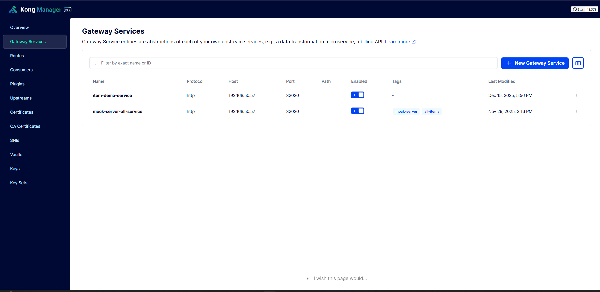
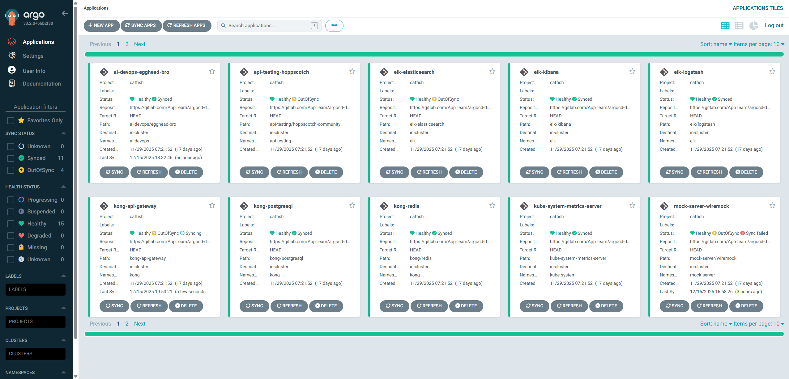
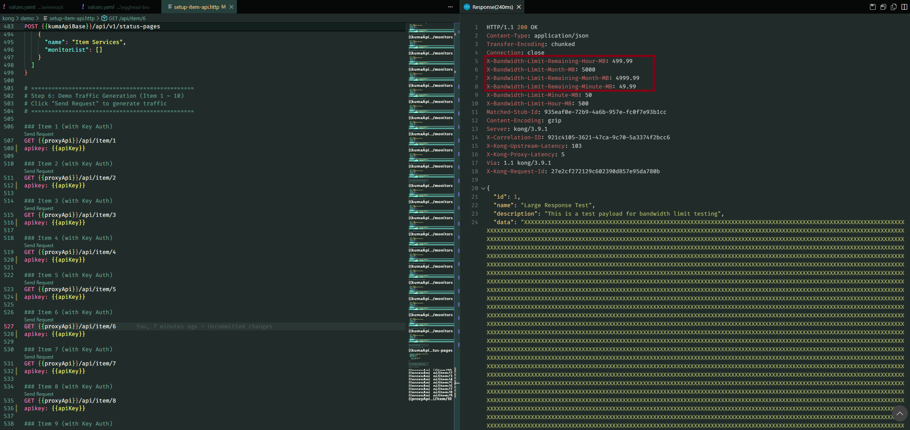
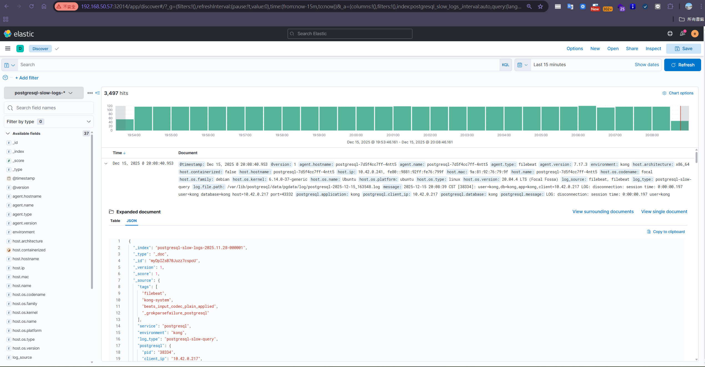
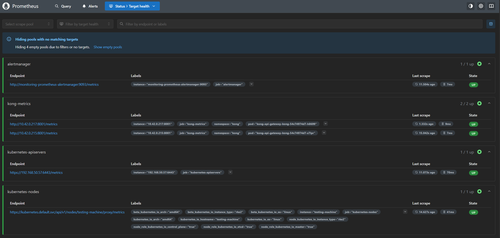
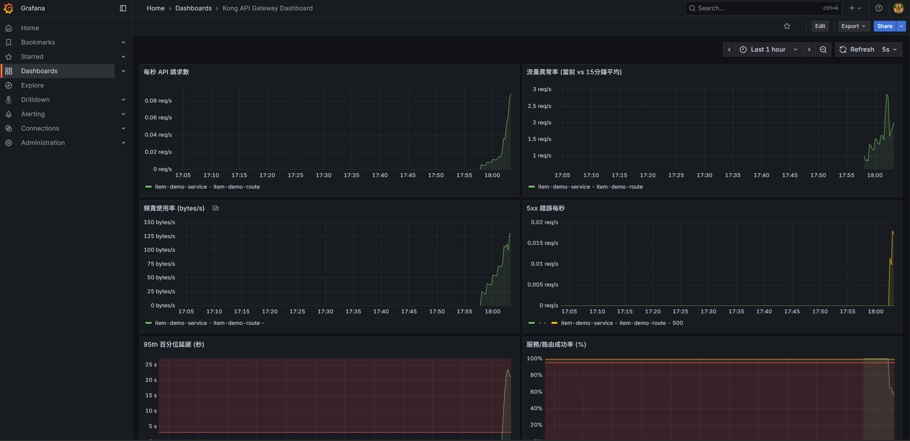
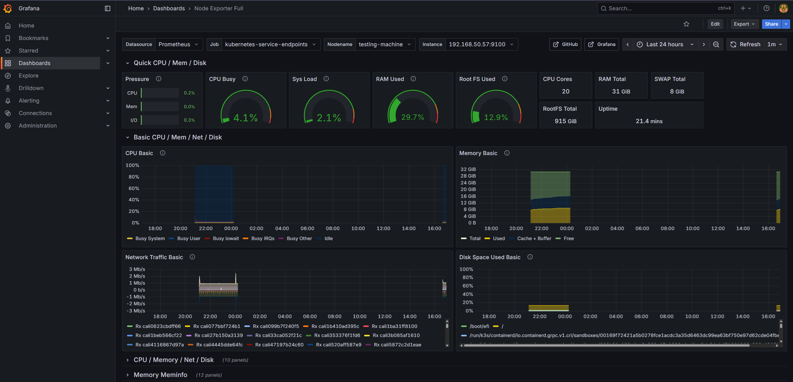
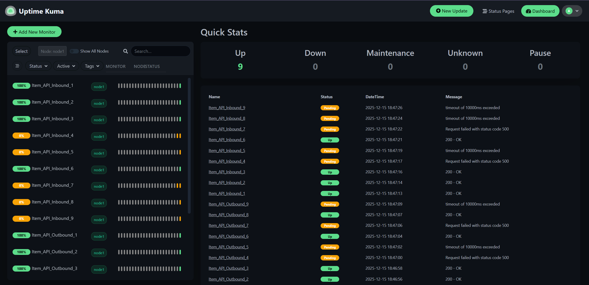
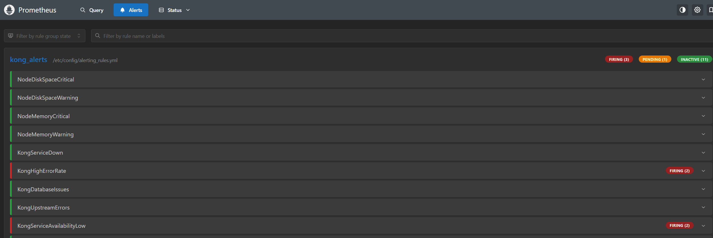
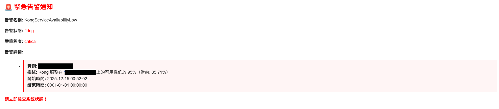

在過去半年，我實際參與了一個中大型系統專案第一期的建置，主要負責 API Gateway 的架構評估與 PoC 驗證。

這件事不只是把服務架起來而已，真正的挑戰在於，要怎麼幫一堆不同性質的服務，設計一個同時兼顧安全性、可觀測性跟高可用性的對外入口。


## 專案背景與客戶意圖

這次的專案是協助一個**擁有大量 API 服務**的單位進行架構升級。過去這些 API 主要供內部系統使用，但隨著數位轉型與開放資料的趨勢，客戶希望能將這些 API **對外開放並商業化**，創造新的營收來源。

**客戶的核心意圖：**
- 將既有的 API 轉型為**可販售的數位產品**
- 建立**自助式的 API 租賃平台**，讓外部開發者能快速申請使用
- 透過**用量計費**的商業模式，讓 API 服務能自給自足

## 客戶的痛點

在導入 API Gateway 之前，客戶面臨以下挑戰：

### 1. 申請流程繁瑣，效率低落
- 外部開發者需要**填寫紙本申請單**，經過多層簽核才能取得 API 金鑰
- 從申請到核發平均需要 **1-2 週**，嚴重影響開發者體驗
- 金鑰的發放、更新、撤銷都仰賴人工作業，容易出錯且難以追蹤

### 2. 用量無法追蹤，計費困難
- 沒有統一的流量監控機制，**不知道誰在用、用了多少**
- 無法區分不同等級的用戶（免費試用 vs 付費客戶）
- 想推動計費制度，卻**缺乏用量數據**作為依據

### 3. 安全性與穩定性風險
- API 直接暴露在網路上，缺乏統一的**身份驗證與授權機制**
- 沒有流量控制，單一用戶可能**吃掉所有資源**，影響其他人
- 出問題時難以快速定位是哪個 API、哪個用戶造成的

### 4. 多系統整合困難
- 後端有十幾個不同團隊開發的子系統，API 規格、認證方式各不相同
- 外部開發者需要對接多個端點，學習成本高
- 缺乏統一的 API 文件與入口

## 線上化 API 租賃的價值

導入 API Gateway 後，我們協助客戶實現：

### 對客戶的價值
- **自助式申請**：開發者線上註冊後即可立即取得 API Key，**從 2 週縮短到 5 分鐘**
- **透明的用量統計**：即時查看 API 調用次數、頻寬使用量，支援計費決策
- **彈性的分級方案**：可依用量設計免費、基本、進階等不同方案
- **完整的生命週期管理**：金鑰的建立、更新、停用、撤銷全面線上化

### 對開發者的價值
- **統一入口**：一個 Gateway 存取所有 API，不用記多個端點
- **即時開通**：申請後立即可用，加速開發流程
- **清楚的配額**：知道自己的額度用了多少，避免超額

### 對維運的價值
- **集中監控**：所有 API 流量一目了然，異常快速定位
- **自動化防護**：Rate Limiting、ACL 等機制自動運作
- **降低人工成本**：不用再手動處理金鑰申請與核發

## 1. 核心架構：為什麼選擇 Kong？

在評估階段，我們需要一個能夠處理高並發請求、支援豐富插件且能與 Kubernetes 原生整合的解決方案。最終我們選用了 **Kong API Gateway** 搭配 **Redis** 與 **PostgreSQL** 作為核心架構。

根據我們的架構規劃：
* **流量入口**：所有的外部請求（Request）都由 Kong 統一接管。

* **狀態管理**：使用 **Redis** 處理 Kong 的 Cache 與 Rate Limiting 狀態。
* **配置儲存**：使用 PostgreSQL 儲存路由與插件配置，確保資料持久化。
* **GitOps 流程**：透過 GitLab CI/CD 與 ArgoCD 將設定檔同步至 K8s 環境。



### 基礎設施環境 (Infrastructure)
這次的架構驗證環境我們選擇部署於 **Google Cloud Platform (GCP)** 的虛擬機器 (VM) 上，使用 **RKE（Rancher Kubernetes Engine）** 自行架設 **Kubernetes Cluster** 進行測試。RKE 是 Rancher 推出的 Kubernetes 安裝與管理工具，主打快速、標準化地在現有主機上部署 Kubernetes 叢集，這讓我們能更彈性地模擬地端機房的網路限制與資源調度情境。

### 自動化部署策略 (Helm & Helmfile)
我們採用 **Helmfile** 來管理多個 Helm Releases（包含 Kong, Redis, Postgres 等）。為了讓架構更穩健並符合資安要求，我們採取了**狀態分離**的部署策略：

*   **Stateless 服務自動化**：Application 層級的元件（如 Kong Gateway, Kuma）完全交由 GitOps 自動同步。
*   **Stateful 與機敏資料手動化**：考量到資料安全性與持久化需求，**Secret (敏感資訊)** 與 **PersistentVolume (PV/PVC)** 均從 Helm Chart 中抽離。這些資源由維運人員**手動部署** (Manual Apply)，確保不會因為 CI/CD pipeline 的誤操作導致資料遺失或金鑰外洩。

## 2. API 管理機制的實作 (API Management)

進行 API Gateway 架構驗證的首要目標，是將既有的子系統 API 納入統一管理。

### 路由與服務配置
我們利用 **Kong Manager** 進行了標準化的配置工作，重點如下：

*   **Gateway Services**：統一定義後端服務的轉發目標，涵蓋多種 API 服務協定。
*   **突破插件限制 (Plugin Limitation)**：由於 Kong 的機制限制單一路由無法重複掛載相同類型的插件（例如無法對同一 Route 同時設定兩組不同的 Rate Limiting 規則），我們採用 **拆分路由 (Route Splitting)** 的策略來解決。針對同一個 Backend Service，依據 URL 特徵拆分出多個 Route，以便分別掛載針對性的流量控制插件，實現更細粒度的管理。

    **舉例說明**：假設後端有一個電商服務 `ecommerce-service`，我們可以依據 Route Prefix 拆分成多條路由：

    | Route Name | Path Prefix | Rate Limit | 用途 |
    |------------|-------------|------------|------|
    | `product-list` | `/api/v1/products/*` | 1000 req/min | 商品列表查詢 |
    | `order-create` | `/api/v1/orders/*` | 100 req/min | 訂單建立（高運算） |
    | `payment-process` | `/api/v1/payments/*` | 50 req/min | 金流處理（敏感操作） |

    透過這種方式，不僅能針對不同 API 設定差異化的流量限制，還能**利用 Route Prefix 分別統計各類 API 的用量**，便於後續進行用量分析、計費與資源規劃。

*   **Routes 與 Rewrite**：設定精確的路徑轉發規則。針對舊版 API，我們靈活運用 **Request Transformer** 插件搭配正規表達式 (Regex) 進行 URI Rewrite（例如將 `~/(wms|wmts)/(?<path>api/item/1)$` 轉發），確保新舊系統能無縫接軌。

> 💡 **這過程中的重要體悟**：
> 進行 API Gateway 架構驗證時，強烈建議**優先進行 API 正規化 (Normalization)**。
> 如果後端 API 的 URL 結構混亂、命名不統一，雖然靠 Gateway 的 Regex Rewrite 勉強能轉發，但這會導致路由設定變得極度複雜且難以維護。長痛不如短痛，先梳理好 API 規範，整合起來才會事半功倍。

### 分級流量控制 (Tiered Rate Limiting)
為了合理分配運算資源，我們不採用單一限制，而是依據**服務資源消耗**（如輕量 API vs 重量級 3D Tiles）與**用戶等級**設計了分級策略。

我們的流量分流策略如下：

1.  **頻次控制 (Rate Limit)**：針對一般 API 與高負載服務，分別設定「基礎」與「高頻次」通道，以滿足不同應用場景的需求。
2.  **頻寬控制 (Bandwidth Limit)**：針對大檔案傳輸，由於 Kong（即便是付費版）原生並未支援以「流量大小」為基準的精細控制，因此我們額外**開發了客製化插件**來實作寬限策略，避免因單檔過大而誤觸限制。

為了支援多節點 (Multi-Node) 的水平擴展，我們將 Rate Limiting 的策略改為 **Redis 模式 (Redis Mode)**。所有的計數與狀態皆統一儲存於 **Redis** 中，確保數據在不同節點間的一致性，避免單機計數導致的誤差。




### 客製化頻寬限制 (Custom Bandwidth Limiting)
除了基礎的請求次數限制 (Rate Limiting)，針對大檔案或高頻寬需求的服務，我們開發了客製化的 Kong Lua 插件：
* **多維度頻寬控制**：支援從「秒」到「年」的六種時間維度，並自動將 MB 轉換為 Bytes 進行精確運算。
* **高可靠性架構**：實作了 **Redis 緩存優化**與**故障轉移 (Fault Tolerance)** 機制。當 Redis 發生故障時，插件會自動降級為本地計數策略，防止單點故障影響 API 可用性。
* **智慧回滾機制**：在流量超限被攔截時，會自動執行 **Rollback** 扣除該次請求的計數，確保配額計算精確無誤。

### 精細的權限管控 (ACL & Consumer Groups)
針對付費與敏感資料，我們利用 **ACL (Access Control Lists)** 插件建立了嚴格的權限模型：
* 建立了 `backend_service`, `mobile_app` 等 Consumers。
* 將 Consumer 加入特定群組 (如 `business-tier-gold`)。

## 3. 打造全方位的監控體系 (Observability)

完善的監控是 Gateway 穩定運行的基石。這半年我們投入了大量心力整合 **ELK** 與 **Prometheus** 生態系，實現從「日誌查詢」到「指標儀表板」的全方位可觀測性。

### Log 分析 (ELK Stack & Custom Lua)

為了確保日誌中能紀錄使用者的真實 IP（而非 Load Balancer IP），我們在 **UDP Log** 插件中注入了客製化 Lua 腳本：

```lua
custom_fields_by_lua = {
  remote_addr = "return kong.client.get_forwarded_ip()",
  real_ip = "return ngx.var.realip_remote_addr",
  x_forwarded_for = "return kong.request.get_header('x-forwarded-for')"
}
```

這段配置讓我們能精準分析流量來源與使用行為，對業務決策提供了關鍵數據。同時，我們採用 **Sidecar 模式** 部署 Filebeat，直接讀取 `/var/log/kong` 下的 access/error log 並轉發至 Elasticsearch，建立 `kong-logs-YYYY.MM.DD` 索引。



### 指標監控 (Prometheus & Grafana)
利用 Kong 的 Prometheus 插件，我們收集了詳細的流量指標，並在 **Grafana** 建立了專屬儀表板：

* **Kong API Gateway Dashboard**：即時顯示 Request Rate、Latency（延遲）、Bandwidth（頻寬）等關鍵指標。

* **Kubernetes Node 硬體監控**：透過 Node Exporter 整合，可直接在 Grafana 檢視各 K8s 節點的硬體狀態（CPU、記憶體、Disk I/O、Network Traffic），便於掌握基礎設施的健康度。



### 服務可用性監控 (Uptime Kuma Clustering)

**Uptime Kuma** 是一款開源的自架式監控工具，類似於 Uptime Robot，但可以完全部署在自己的伺服器上。它提供了直覺的 Web UI，支援多種監控類型（HTTP、TCP、Ping、DNS 等），並能透過 Telegram、Slack、Email 等管道發送告警通知。對於需要監控大量內部服務且不想依賴外部 SaaS 的團隊來說，是個很好的選擇。

為了克服原生 Uptime Kuma 在大量監控下的效能瓶頸（約 800 支 API），我們將架構進行了改造：
* **自動化擴充 (RESTful API Extension)**：由於原生的 Uptime Kuma 缺乏對外的 API 介面，為了實現「服務一上線即監控」的自動化目標，我們自行擴充了 RESTful API 功能，讓 CI/CD Pipeline 能在部署時自動註冊監控項目，無須人工介入。
* **Database 抽離**：將預設的 SQLite 替換為 **MariaDB**，並獨立部署為 `kuma-mariadb` 服務，支援更高的併發讀寫。
* **Clustering**：透過多個 Uptime Kuma 實例連接同一資料庫，實現負載分擔。

關於這部分的實作細節，我另外整理了一篇文章：[使用 Vibe Coding 打造 Uptime Kuma 集群系統：從單機到高可用監控平台](https://blog.markkulab.net/implement-uptime-kuma-cluster-vibe-coding/)。



## 4. 告警機制的建立 (Alerting)



監控的最後一哩路是「告警」。我們在 Prometheus 與 **Alert Manager** 中定義了 **20 條告警規則**，分為 Critical、Warning 與 Info 三個等級。

以下是我們定義的幾個關鍵 Critical 告警規則 (PromQL)：

### 1. 服務完全不可用 (KongServiceDown)
當 Kong Namespace 下沒有任何 Up 的 Pod 時觸發：
```promql
sum(up{job="kong-metrics", namespace="kong"}) == 0
```

### 2. 高錯誤率 (KongHighErrorRate)
當 5xx 錯誤率超過 5% 時觸發，這通常代表後端服務異常：
```promql
(sum(rate(kong_http_requests_total{code=~"5.."}[5m])) by (instance)
 /
 sum(rate(kong_http_requests_total[5m])) by (instance)
) > 0.05
```

### 3. 高延遲 (KongHighLatency)
當 P95 請求延遲超過 2 秒時觸發 (Warning 等級)：
```promql
histogram_quantile(0.95, 
  sum(rate(kong_latency_bucket[5m])) by (le, instance)
) > 2000
```

### 4. 系統資源告警
* **硬碟空間**: `NodeDiskSpaceCritical` (可用空間 < 5%)
* **記憶體**: `NodeMemoryCritical` (使用率 > 95%)

## 5. 驗證與成果

這半年的最終成果，即是順利協助專案**通過第一期的系統驗收**。

在驗收過程中，我們使用開源 API 測試工具 **Hoppscotch** (前身為 Postwoman) 針對多項關鍵服務進行了密集的功能驗證。測試結果顯示，API Gateway 不僅能有效攔截未授權的惡意請求，其精細的流量控制機制也能在系統高負載下維持服務穩定，成功達成契約所訂定的各項效能指標。
