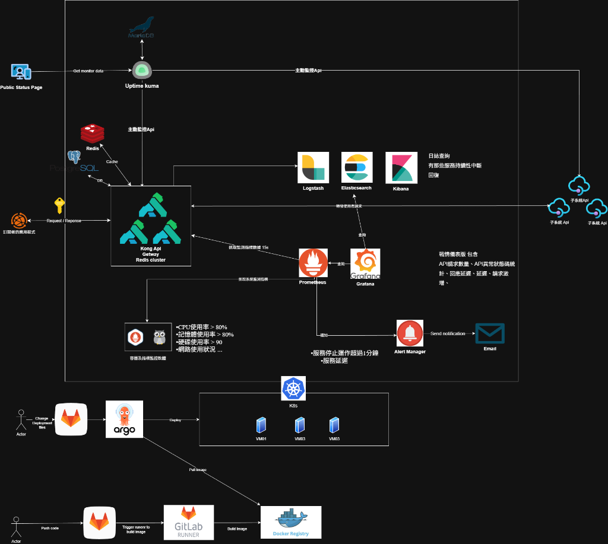

在過去的半年裡，我投入了「圖資服務入口網」的建置案，我的主要任務是負責第一期 **API Gateway 的導入與評估**。

這不僅僅是部署一個服務，而是要為海量的地理空間資訊（如 WMTS, WFS, 3D Tiles）建立一個安全、可觀測且高可用的流量入口。以下整理了這段時間的技術架構與實作細節。

## 1. 核心架構：為什麼選擇 Kong？

在評估階段，我們需要一個能夠處理高並發請求、支援豐富插件且能與 Kubernetes 原生整合的解決方案。最終我們選用了 **Kong API Gateway** 搭配 **Redis Cluster** 作為核心架構。

根據我們的架構規劃 ：
* **流量入口**：所有的外部請求（Request）都由 Kong 統一接管。
* **狀態管理**：使用 Redis Cluster 處理 Kong 的 Cache 與 Rate Limiting 狀態。
* **GitOps 流程**：透過 GitLab CI/CD 與 ArgoCD 將設定檔同步至 K8s 環境。

## 2. API 管理機制的實作 (API Management)

導入 API Gateway 的首要目標是將既有的圖資服務（如通用版電子地圖、建物模型等）納入統一管理。

### 路由與服務配置
我利用 **Kong Manager** 進行了標準化的配置工作：
* **Gateway Services**：定義了後端服務的轉發目標，包含 WFS、WMS、3D Tiles 等多種 GIS 服務協定。
* **Routes**：設定了精確的路徑轉發規則（Paths, Methods, Protocols），確保請求能準確送達目標子系統。

### 安全與流量控制
為了保護後端服務不被濫用，我配置了以下關鍵插件（Plugins）：
* **Key Authentication**：實作了 API 金鑰驗證機制。經過測試，無金鑰或無效金鑰的請求會直接被攔截（HTTP 401/403），只有攜帶正確 Key 的請求才能通過。
* **Rate Limiting**：針對不同等級的用戶設定流量限制。當請求超過閥值時，系統會自動回傳 `API rate limit exceeded`，並在 Response Header 中顯示剩餘額度。

## 3. 打造全方位的監控體系 (Observability)

一個強大的 Gateway 不能沒有監控。這半年我花了不少心力整合 **ELK** 與 **Prometheus** 生態系，實現了從「日誌查詢」到「指標儀表板」的完整可觀測性。

### Log 分析 (ELK Stack)
我們將 Kong 的 Access Logs 透過 UDP Log 插件發送至 **Logstash**，並儲存於 **Elasticsearch**。
* **成果**：在 **Kibana** 中建立了 `kong-logs` 索引，開發團隊可以隨時查詢每一個 API 請求的詳細日誌，快速定位問題。

### 指標監控 (Prometheus & Grafana)
利用 Kong 的 Prometheus 插件，我們收集了詳細的流量指標，並在 **Grafana** 建立了專屬儀表板：
* **Kong API Gateway Dashboard**：即時顯示 Request Rate、Latency（延遲）、Bandwidth（頻寬）等關鍵指標。
* **Node Exporter Full**：監控底層伺服器的 CPU、記憶體、硬碟與網路使用率。

### 服務可用性監控 (Uptime Kuma)
為了模擬外部使用者的視角，我部署了 **Uptime Kuma** 定期對 API 進行 HTTP 探測。然而在面對高達 4000 支 API 的監控需求時，原生的 Uptime Kuma (約 800 支監控) 即會遇到效能瓶頸。為此，我進行了深度的客製化開發：

* **Restful API 擴充**：實作 API 介面以支援監控項目的自動化上架。
* **集群架構 (Clustering) 與容錯移轉**：改造為集群架構，克服單機效能限制；並實作 Failover 機制，當單一節點故障時，其他節點能自動接手監控任務。
* **Public Status Page 優化**：實作狀態頁面的分頁功能，優化大量監控項目的顯示效能。

關於這部分的實作細節，我另外整理了一篇文章：[使用 Vibe Coding 打造 Uptime Kuma 集群系統：從單機到高可用監控平台](../2025-08-22-implement-uptime-kuma-cluster-vibe-coding)。

## 4. 告警機制的建立 (Alerting)

監控的最後一哩路是「告警」。我在 Prometheus 與 **Alert Manager** 中定義了多項告警規則（Alerting Rules），確保在異常發生時（如服務停止運作超過 1 分鐘）能立即發送 Email 通知維運人員。

我們定義的關鍵閥值包括：
* **KongServiceDown**：服務無法運行持續 2 分鐘。
* **KongHighErrorRate**：5xx 錯誤率 > 5%。
* **KongHighLatency**：P95 延遲 > 2 秒。
* **System Resources**：CPU 或記憶體使用率過高 (> 95%)。

## 5. 驗證與成果

在專案驗證階段，我們使用了 **Hoppscotch** 進行了詳盡的 API 測試，涵蓋了從 WFS 到 I3S 建築模型等 15 項關鍵服務。測試結果顯示，API Gateway 成功攔截了未授權請求，且流量控制機制運作正常，系統在壓力下仍能保持穩定。

這半年的努力，讓圖資平台從傳統的單體架構，成功轉型為具備現代化 API 管理能力的雲原生架構。
