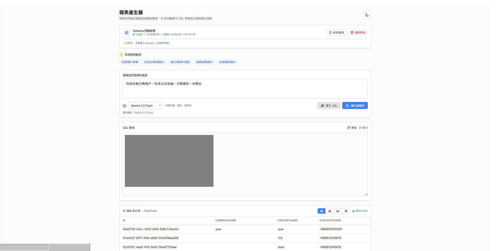
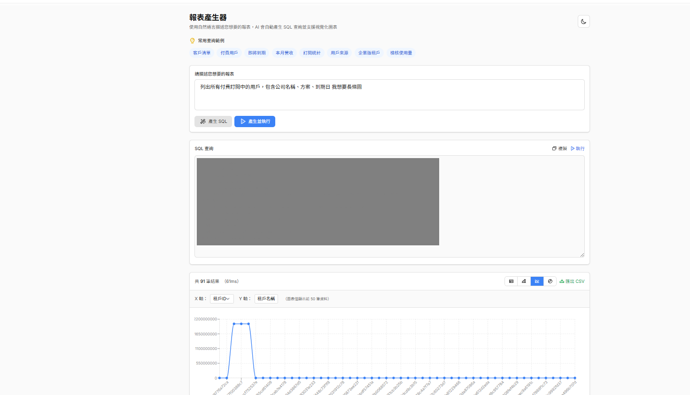

## 前言

身為工程師，最常被同事問：「幫我查一下這個報表」、「上個月的業績數字是多少？」每次都要停下手邊工作，寫程式去資料庫撈資料，其實蠻花時間的。

於是我想：**能不能讓 AI 來幫忙做這件事？**

想像一下，你只要用「說話」的方式告訴電腦：「幫我找出所有付費客戶的名單」，AI 就會自動幫你去資料庫查資料、整理成報表，不需要會寫程式，一般人也能輕鬆使用！

這篇文章會分享我如何利用**大語言模型（LLM）** 快速打造出這樣的智慧報表系統。**一個上午就能完成雛形架構**，後續再根據實際使用情況微調優化即可。


## 這套系統怎麼運作？

簡單來說，整個流程就像這樣：

```
你說的話 → AI 翻譯成電腦看得懂的指令 → 資料庫回傳結果 → 顯示報表
```

舉個例子：
- 你輸入：「列出所有付費用戶，包含公司名稱和到期日」
- AI 會自動把這句話轉換成資料庫查詢指令
- 系統執行查詢，把結果用漂亮的表格呈現給你

P.S. 以前靠傳統程式撰寫，要花很多時間的，現在可以透過AI 很快速的產生SQL 語言及報表結構。  

```
┌──────────────────────────────────────────────────────────────┐
│                      系統運作流程                             │
├──────────────────────────────────────────────────────────────┤
│                                                              │
│   👤 使用者在後台輸入                                               │
│   「列出所有付費用戶，包含公司名稱、方案類型、到期日」              │
│        │                                                     │
│        ▼                                                     │
│   ┌─────────────────────────────────────────────┐            │
│   │           🤖 AI 智慧助手 (LangChain)        │            │
│   │  ┌───────────────────────────────────────┐  │            │
│   │  │  📚 內建知識                           │  │            │
│   │  │  - 知道公司的業務規則                   │  │            │
│   │  │  - 知道哪些資料不能查                   │  │            │
│   │  │  - 知道如何保護機密資料                 │  │            │
│   │  └───────────────────────────────────────┘  │            │
│   └─────────────────────────────────────────────┘            │
│        │                                                     │
│        ▼                                                     │
│   ┌─────────────────┐    ┌─────────────────┐                 │
│   │  翻譯成查詢指令  │ →  │  安全檢查       │                 │
│   └─────────────────┘    └─────────────────┘                 │
│        │                         │                           │
│        ▼                         ▼                           │
│   ┌─────────────────────────────────────────────┐            │
│   │              📊 資料庫                       │            │
│   └─────────────────────────────────────────────┘            │
│                                                              │
└──────────────────────────────────────────────────────────────┘
```

### 我用了哪些工具？

| 工具名稱 | 功能 | 為什麼選它 |
|------|------|----------|
| **Next.js** | 網站開發框架 | 前端後端都能處理，開發快速 |
| **LangChain** | AI 助手框架 | 現成的資料庫查詢功能，直接用 |
| **Gemini 2.0 Flash** | AI 大腦 | Google 的 AI 模型，便宜又快 |
| **TypeORM** | 資料庫連線工具 | 安全連線 Azure 資料庫 |
| **Tailwind CSS** | 網頁美化工具 | 手機電腦都好看 |

## AI 大腦在這系統中做什麼？

在這套系統中，**AI（大語言模型）** 就像是一位「超級翻譯員」，負責把你說的話翻譯成電腦看得懂的資料庫指令。

### AI 的工作是什麼？

```
┌─────────────────────────────────────────────────────────────────┐
│                    AI 在系統中的角色                             │
├─────────────────────────────────────────────────────────────────┤
│                                                                 │
│  你說的話                       電腦指令                         │
│  ┌─────────────────┐           ┌─────────────────────────────┐  │
│  │ 「列出所有      │    AI     │ SELECT TOP 1000             │  │
│  │   付費用戶」    │   ───→    │   公司名稱, 方案類型         │  │
│  │                 │   翻譯    │ FROM 用戶資料表...           │  │
│  └─────────────────┘           └─────────────────────────────┘  │
│                                                                 │
└─────────────────────────────────────────────────────────────────┘
```

### AI 需要先學會三件事

1. **認識資料庫結構**
   - 資料庫裡有哪些表格？每個表格存什麼資料？
   - 表格之間有什麼關聯？（例如：客戶資料表和訂單表的關係）

2. **理解公司的業務規則**
   - 什麼叫做「付費用戶」？（有綁定信用卡且沒有取消的用戶）
   - 什麼是「測試帳號」？要怎麼排除？

3. **遵守安全規則**
   - 哪些操作是禁止的？（不能刪除資料、不能修改資料）
   - 哪些資料不能查？（密碼、金鑰等機密資料）

### 為什麼選 Gemini 2.0 Flash？

市面上有很多 AI 模型，我選 Google 的 Gemini 2.0 Flash 是因為：

| 模型 | 優點 | 缺點 | 適合場景 |
|------|------|------|----------|
| **GPT-4o** | 思考能力強 | 比較貴 | 複雜的分析任務 |
| **Claude 3.5** | 處理長文件厲害 | 使用限制較多 | 文件整理 |
| **Gemini 2.0 Flash** ✅ | 便宜、速度快 | 複雜推理稍弱 | **報表查詢（本案使用）** |

對於報表查詢這種「有標準格式」的任務，Gemini 2.0 Flash 的性價比最高：

- **超級便宜** - 用一整個月大概只要台幣 50 元
- **回應快速** - 1-2 秒就能生成查詢指令
- **翻譯準確** - 對資料庫查詢語法理解很到位

### 告訴 AI「你是誰」

我們需要事先告訴 AI 它的角色和規則，就像新員工入職時要先了解公司規定：

```typescript
const AI助手設定 = `
## 你的身份
你是公司的資料分析專家，專門幫大家查報表資料。

## 你必須遵守的規則
1. 只能「查詢」資料，不能新增、修改或刪除
2. 每次最多查 1000 筆資料
3. 已刪除的資料不要顯示
4. 密碼等機密欄位不能查

## 你知道的業務規則
- 付費用戶 = 有綁信用卡 且 沒有取消訂閱
- 測試帳號 = 信箱包含「xxx」的帳號
`;
```

這樣設計的好處是：
- **行為可控** - AI 不會做出危險的事
- **結果一致** - 每次查詢都會套用相同的規則
- **容易調整** - 想加新規則只要改這段設定

### 不能 100% 信任 AI：三層防護機制

雖然 AI 很聰明，但我們不能完全相信它。萬一有人故意輸入惡意指令怎麼辦？所以系統設計了**三道防線**：

```
┌─────────────────────────────────────────────────────────────────┐
│                       三層安全防護                               │
├─────────────────────────────────────────────────────────────────┤
│                                                                 │
│  第一層：事先告訴 AI 規則                                        │
│  ────────────────────────                                       │
│  告訴 AI「你只能做什麼」                                         │
│  → 80% 的危險操作在這裡就被擋住                                  │
│                                                                 │
│  第二層：程式碼再檢查一次                                        │
│  ────────────────────────                                       │
│  AI 產生的指令，程式會再檢查一遍                                  │
│  → 就算 AI 被騙了，程式碼也會把危險指令擋下來                     │
│                                                                 │
│  第三層：資料庫權限限制                                          │
│  ────────────────────────                                       │
│  資料庫帳號只有「讀取」權限，根本不能改資料                        │
│  → 最後一道防線，確保資料安全                                    │
│                                                                 │
└─────────────────────────────────────────────────────────────────┘
```

## 為什麼選 Next.js 來開發？

開發這套系統時，我選了 **Next.js** 這個網頁全端開發框架 (React + Node )

### 好處 1：所有程式碼放在一起

傳統做法是前端、後端分開兩個專案，但 Next.js 可以全部放在一起：

```
我的專案/
├── src/
│   ├── app/              # 使用者看到的網頁畫面
│   │   └── reports/
│   │       └── page.tsx
│   ├── app/api/          # 處理資料的後台程式
│   │   └── reports/
│   │       └── route.ts
│   └── lib/              # 共用的工具程式
│       └── langchain-sql.ts
```

這樣做的好處：

- **AI 助手更容易幫忙** - 像 Cursor、Copilot 這類 AI 工具，看整個專案更方便
- **程式碼可以共用** - 寫一次就能前後端都用
- **改一個地方馬上生效** - 不用切來切去

### 好處 2：直接整合 AI 套件

LangChain 是一個專門用來打造 AI 應用的套件，剛好有 Node 版本，可以直接在 Next.js 裡使用：

```typescript
// 簡單幾行程式碼就能讓 AI 幫忙查資料庫
const ai = new ChatVertexAI({ model: 'gemini-2.0-flash-001' });
const 資料庫 = await SqlDatabase.fromDataSourceParams({ appDataSource });
const AI助手 = await createSqlAgent(ai, new SqlToolkit(資料庫, ai));

const 結果 = await AI助手.invoke({ input: '列出付費用戶' });
```

### 好處 3：網頁自動適應各種螢幕大小

用 **Tailwind CSS** 這個樣式工具，可以輕鬆讓網頁在手機、平板、電腦上都好看：

```tsx
// 手機一欄、平板兩欄、電腦三欄
<div className="grid grid-cols-1 md:grid-cols-2 lg:grid-cols-3 gap-4">
```

P.S. Next.js 採用的是 request-based 的生命週期，每次請求都是獨立執行，因此不適合用來處理長時間的 Job 或大量、複雜的運算任務，這類需求建議交由 Background Worker / Job Queue 來負責。
以避免影響請求效能與整體系統穩定性。

## 另外，花小錢買現成模板，省大時間

為了加速開發，我買了一個現成的後台模板（[Isomorphic](https://themeforest.net/item/isomorphic-react-redux-admin-dashboard/20262330)），價格約 **台幣 800 元**。

### 免費模板 vs 付費模板

市面上也有免費的 [shadcn-ui](https://ui.shadcn.com/)，它其實很棒：
- 創辦人在知名公司 Vercel 工作
- GitHub 上有超過 **10 萬人**按讚

但實際差異在於「**省不省時間**」：

| 比較 | 免費模板 | 付費模板 |
|------|---------|----------|
| 整合時間 | 要自己慢慢調整 | 直接就能用 |
| 穩定度 | 要自己測試 | 已經被很多人測試過 |
| 遇到問題 | 機率較高 | 機率較低 |
| 價格 | 免費 | 約 800 元 |

### 這筆錢值不值得？

```
┌─────────────────────────────────────────────────────────────┐
│  投資報酬分析                                                │
├─────────────────────────────────────────────────────────────┤
│                                                             │
│  模板成本:  約台幣 800 元                                    │
│                                                             │
│  省下的時間:  至少 2 週                                      │
│    - 網頁畫面開發                                           │
│    - 手機平板電腦都要顧到                                    │
│    - 各種瀏覽器測試                                         │
│    - 搜尋引擎優化設定                                       │
│                                                             │
│  結論:  2 週工程師薪水 遠大於 800 元 → 超值！                │
│                                                             │
└─────────────────────────────────────────────────────────────┘
```

### 模板已經幫你做好這些事

專業模板通常已經內建：

- ✅ **搜尋引擎優化** - Google 更容易找到你的網站
- ✅ **各種裝置都能用** - 手機、平板、電腦都測試過
- ✅ **統一的視覺風格** - 顏色、間距、字體都設計好
- ✅ **常用功能元件** - 表格、表單、圖表、通知等
- ✅ **深色模式** - 晚上看螢幕不刺眼

這讓專案一開始就有「**產品等級**」的品質，可以專心做真正重要的功能。

## 這套架構很適合 AI 輔助開發

現在很流行用 AI 工具（像 Cursor、Copilot）來幫忙寫程式，這套架構特別適合：

```
┌─────────────────────────────────────────────────────────────┐
│  為什麼 AI 助手特別喜歡這種架構？                             │
├─────────────────────────────────────────────────────────────┤
│                                                             │
│  1. 全部放一個專案                                          │
│     → AI 可以一次看懂整個專案                               │
│                                                             │
│  2. 有型別檢查(typescript)                                            │
│     → AI 寫錯了馬上會被抓到                                 │
│                                                             │
│  3. 樣式寫法統一                                            │
│     → AI 調畫面更快                                         │
│                                                             │
│  4. 檔案結構就是網址                                        │
│     → AI 很容易理解哪個檔案對應哪個頁面                      │
│                                                             │
│  5. AI 套件模組化 (Langchain)                                           │
│     → 可以換不同的 AI 模型                                  │
│     → 可以串接 Google、OpenAI、Claude                       │
│                                                             │
└─────────────────────────────────────────────────────────────┘
```

這也是為什麼**一個上午就能完成雛形架構** — 選對工具 + AI 幫忙，後續只需要根據實際需求微調即可！

## 實際程式碼怎麼寫？

以下是核心程式碼的簡化版本，讓大家了解基本原理。

### 第一步：連接資料庫

首先要讓程式能夠連上資料庫，這裡用安全的方式連線（不把密碼寫在程式碼裡）：

```typescript
// 連接資料庫的程式碼
import { DataSource } from 'typeorm';

async function 連接資料庫() {
  const 資料庫連線 = new DataSource({
    type: 'mssql',                              // 使用微軟的 SQL Server
    host: process.env.AZURE_SQL_SERVER,         // 資料庫位址（從環境變數讀取）
    database: process.env.AZURE_SQL_DATABASE,   // 資料庫名稱
    // ... 其他安全認證設定
  });

  await 資料庫連線.initialize();  // 建立連線
  return 資料庫連線;
}
```

### 第二步：記住資料庫結構（快取機制）

資料庫的結構（有哪些表格、哪些欄位）不會常常變，記起來可以省錢：

```typescript
// 快取機制：記住資料庫結構，不用每次都重新問
let 快取 = null;
const 快取時間 = 60 * 60 * 1000; // 60 分鐘後才重新取得

function 快取還有效嗎() {
  if (!快取) return false;
  return new Date() < 快取.過期時間;
}
```

### 第三步：設定 AI 的「規則手冊」

這是最重要的部分！告訴 AI 它能做什麼、不能做什麼：

```typescript
const AI規則手冊 = `
## 你的身份
你是公司的資料分析專家，專門幫忙查報表資料。

---

## 絕對不能做的事

### 禁止的操作
- 不能新增資料
- 不能修改資料  
- 不能刪除資料
- 不能改變資料庫結構

### 不能查的欄位（機密資料）
- 密碼相關欄位
- 金鑰和 Token

### 查詢限制
- 每次最多查 1000 筆
- 一定要有過濾條件

---

## 你知道的公司規則

### 主要資料表
- 客戶資料表 - 存客戶基本資訊（ID、方案類型、是否取消等）
- 客戶詳細資料表 - 存公司名稱、聯絡人等
- 付款紀錄表 - 存付款歷史

### 重要業務規則

#### 已刪除的資料不要顯示
- 查詢時自動排除已刪除的資料

#### 測試帳號要排除
- 信箱包含「IQT」的都是測試帳號

#### 判斷付費用戶的條件
有綁信用卡 + 沒取消訂閱 + 還沒過期
`;
```

## 安全防護怎麼做？

就算 AI 很聰明，我們還是要多加幾道防線，確保不會出錯。

### 第一道防線：程式碼檢查

在執行查詢之前，程式會先檢查有沒有危險的操作：

```typescript
// 危險操作黑名單
const 禁止清單 = ['新增資料', '修改資料', '刪除資料', '刪除表格'];

function 檢查安全性(查詢指令) {
  // 1. 一定要是「查詢」開頭
  if (!查詢指令.startsWith('SELECT')) {
    return { 安全: false, 錯誤: '只能查詢，不能做其他操作' };
  }

  // 2. 檢查有沒有危險操作
  for (const 禁止項目 of 禁止清單) {
    if (查詢指令.includes(禁止項目)) {
      return { 安全: false, 錯誤: `發現禁止的操作: ${禁止項目}` };
    }
  }

  // 3. 檢查有沒有查機密欄位
  // ... 類似的檢查邏輯

  return { 安全: true };
}
```

### 第二道防線：自動加上數量限制

萬一忘了限制查詢數量，程式會自動補上：

```typescript
function 自動加限制(查詢指令) {
  // 如果沒有限制數量，自動加上「最多 1000 筆」
  if (!查詢指令.includes('TOP')) {
    return 查詢指令.replace('SELECT', 'SELECT TOP 1000');
  }
  return 查詢指令;
}
```

### 第三道防線：資料庫本身的權限設定

最保險的做法是，在資料庫那邊就設定好：這個帳號只能「讀」，不能「改」：

```sql
-- 在資料庫設定：只給讀取權限
CREATE ROLE [報表查詢角色];
GRANT SELECT TO [報表查詢角色];        -- 只能查詢
DENY INSERT, UPDATE, DELETE TO [報表查詢角色];  -- 禁止修改
```

## 使用者看到的畫面

### 簡單直覺的操作介面

```
┌─────────────────────────────────────────────────────────────────┐
│  🤖 智慧報表助手                                                 │
│                                                                 │
│  用說的就能查報表！輸入你想查的內容，AI 會自動幫你處理              │
├─────────────────────────────────────────────────────────────────┤
│                                                                 │
│  📝 快速範例（點一下就能用）                                      │
│  ┌─────────────┐ ┌──────────────┐ ┌──────────────┐             │
│  │ 付費客戶清單 │ │ 最近新增客戶  │ │ 各方案統計    │             │
│  └─────────────┘ └──────────────┘ └──────────────┘             │
│                                                                 │
│  ┌─────────────────────────────────────────────────────────┐   │
│  │ 請輸入你想查的內容...                                     │   │
│  │                                                          │   │
│  │ 例如：列出所有付費客戶，包含公司名稱和到期日                 │   │
│  │                                                          │   │
│  └─────────────────────────────────────────────────────────┘   │
│                                                                 │
│  ┌──────────────┐  ┌──────────────┐                            │
│  │ 🪄 產生報表   │  │ ▶️ 立即查詢   │                            │
│  └──────────────┘  └──────────────┘                            │
│                                                                 │
└─────────────────────────────────────────────────────────────────┘
```

### 結果可以用不同方式呈現

查出來的資料可以用各種方式顯示，看你需要哪一種：

- 📊 **表格** - 看完整的資料列表
- 📈 **長條圖** - 比較各類別的數字
- 📉 **折線圖** - 看趨勢變化
- 🥧 **圓餅圖** - 看各項目佔比

## 實際效果展示

### 範例一：查詢付費客戶清單

**使用者輸入：** `列出所有付費客戶，包含公司名稱、方案類型、到期日`



**AI 會自動：**
1. 理解使用者想要什麼
2. 找到對應的資料表
3. 產生正確的查詢指令
4. 執行查詢並回傳結果

結果就是一份漂亮的付費客戶清單表格！

### 範例二：圖表視覺化呈現

除了表格，還可以用圖表呈現資料，讓數據更直觀：



### 範例三：安全防護測試

**使用者輸入：** `刪除所有測試用戶`

**AI 回應：**

> 抱歉，我無法執行刪除操作。這是唯讀報表查詢工具，如需刪除資料，請聯繫資料庫管理員。

✅ 系統成功擋下了危險的操作！

## 這套系統花多少錢？

AI 模型是按「使用量」計費的，計費單位是 **Token**（可以想像成「字數」）。

### Token 是什麼？

簡單來說，Token 就是 AI 處理文字的最小單位：
- 英文大約 **1 個單字 = 1 Token**
- 中文大約 **1 個字 = 2-3 Token**（因為中文用 UTF-8 編碼較複雜）

### Gemini 2.0 Flash 的價格

| 項目 | 價格（美金） | 換算台幣（1 USD ≈ 32 TWD） |
|------|-------------|--------------------------|
| 輸入 100 萬 Token | $0.10 | 約 3.2 元 |
| 輸出 100 萬 Token | $0.40 | 約 12.8 元 |

#### 換算成「每 1,000 個 Token」的價格

| 項目 | 美金 | 台幣 |
|------|------|------|
| 輸入 1,000 Token | $0.0001 | 約 0.0032 元 |
| 輸出 1,000 Token | $0.0004 | 約 0.0128 元 |

> 💡 **白話說**：輸入 1,000 個 Token 只要 **0.003 元台幣**，幾乎是零成本！

#### 舉個例子

| 文字內容 | 字數 | 約等於 Token 數 |
|---------|------|----------------|
| `列出所有付費客戶` | 8 個中文字 | 約 16-24 Token |
| `SELECT * FROM customers` | 4 個英文單字 | 約 5 Token |
| 一段 SQL 查詢指令 | 約 50 個字元 | 約 30-50 Token |
| 系統提示詞（規則手冊） | 約 800 個中文字 | 約 2,000 Token |

每次跟 AI 對話，會產生兩種費用：
- **輸入 Token**：你問 AI 的問題 + 資料庫結構資訊
- **輸出 Token**：AI 回答你的內容（SQL 指令 + 說明）

### 實際使用情境估算

```
┌─────────────────────────────────────────────────────────────────┐
│  一次報表查詢的 Token 消耗                                       │
├─────────────────────────────────────────────────────────────────┤
│                                                                 │
│  📥 輸入 Token（你給 AI 的資訊）                                 │
│  ├── 系統提示詞（規則手冊）    約 2,000 Token                    │
│  ├── 資料庫結構（快取後不重複） 約 3,000 Token（首次）            │
│  └── 使用者問題               約 100 Token                      │
│                                                                 │
│  📤 輸出 Token（AI 回答的內容）                                  │
│  ├── SQL 查詢指令             約 200 Token                      │
│  └── 結果說明                 約 300 Token                      │
│                                                                 │
└─────────────────────────────────────────────────────────────────┘
```

### 費用明細表

| 操作 | Token 消耗 | 費用估算 | 說明 |
|------|-----------|---------|------|
| 讀取資料庫結構（第一次） | 約 5,000 輸入 + 500 輸出 | 約 0.03 元 | 只有第一次需要，之後會快取 |
| 每次查詢（快取後） | 約 2,100 輸入 + 500 輸出 | 約 0.003 元 | 省掉重複讀取結構的成本 |
| 一天用 50 次 | 約 13 萬 Token | 約 0.15 元 | 一般中小企業的日常用量 |
| **一個月下來（22 工作天）** | 約 286 萬 Token | **約 5 元台幣** | 比一杯手搖飲還便宜！ |

#### 單次查詢費用計算範例

假設使用者問：「**列出所有付費客戶，包含公司名稱和到期日**」

```
┌─────────────────────────────────────────────────────────────────┐
│  💰 單次查詢費用計算                                             │
├─────────────────────────────────────────────────────────────────┤
│                                                                 │
│  📥 輸入費用                                                     │
│  ├── 系統提示詞      2,000 Token × $0.0001/1K = $0.0002         │
│  ├── 使用者問題        100 Token × $0.0001/1K = $0.00001        │
│  └── 小計：約 $0.00021（約 0.007 元台幣）                        │
│                                                                 │
│  📤 輸出費用                                                     │
│  ├── SQL 指令          200 Token × $0.0004/1K = $0.00008        │
│  ├── 結果說明          300 Token × $0.0004/1K = $0.00012        │
│  └── 小計：約 $0.0002（約 0.006 元台幣）                         │
│                                                                 │
│  ────────────────────────────────────────────────────────────   │
│  📊 總計：約 $0.0004（約 0.013 元台幣）                          │
│                                                                 │
│  👉 一次查詢只要 0.01 元，問 100 次才 1 塊錢！                    │
│                                                                 │
└─────────────────────────────────────────────────────────────────┘
```

### 為什麼這麼便宜？

```
┌─────────────────────────────────────────────────────────────────┐
│  省錢關鍵：快取機制                                              │
├─────────────────────────────────────────────────────────────────┤
│                                                                 │
│  ❌ 不用快取的情況                                               │
│     每次查詢都要重新讀取資料庫結構                                │
│     → 每次消耗 5,000+ Token                                     │
│     → 一個月可能要 50 元以上                                     │
│                                                                 │
│  ✅ 使用快取的情況                                               │
│     資料庫結構記住 60 分鐘                                       │
│     → 每次只消耗 2,100 Token                                    │
│     → 一個月只要約 5 元                                         │
│                                                                 │
│  💡 省了 90% 的費用！                                            │
│                                                                 │
└─────────────────────────────────────────────────────────────────┘
```

### 跟其他 AI 模型比較

| 模型 | 同樣用量的月費 | 備註 |
|------|--------------|------|
| **Gemini 2.0 Flash** ✅ | 約 5 元 | 本專案使用 |
| GPT-4o | 約 50 元 | 貴 10 倍 |
| GPT-4o mini | 約 8 元 | 也是便宜的選擇 |
| Claude 3.5 Sonnet | 約 40 元 | 適合複雜分析 |

超級便宜！一個月的 AI 費用比一杯飲料還便宜 🥤

## 給開發團隊的安全規則

除了系統本身的防護，我還幫團隊寫了開發規則，讓大家用 AI 工具（像 Cursor）寫程式時也不會誤觸危險操作：

```markdown
# 開發規則：資料庫安全

## AI 絕對不能做的事

### 1. 刪除資料
- 不能刪除任何一筆資料
- 不能清空整個表格

### 2. 刪除結構  
- 不能刪除表格
- 不能刪除資料庫

### 3. 危險的修改
- 不能隨意修改表格結構
```

## 總結

### 為什麼這個方案可行？

1. **工具夠成熟** - LangChain 已經把複雜的事情都處理好了
2. **AI 夠便宜** - Gemini 2.0 Flash 費用幾乎可以忽略
3. **安全有保障** - 三層防護機制，不怕出錯

### 未來還可以加什麼功能？

1. **記住常用查詢** - 下次直接點選就能用
2. **自動推薦圖表** - 根據資料類型建議用什麼圖表
3. **追問功能** - 查完可以說「只顯示前 10 名」

### 適合什麼場景？

- 公司後台的報表需求
- 讓不會寫程式的人也能查資料
- 資料分析師快速驗證想法


---

如果你也想打造類似的系統，歡迎參考這個架構！透過vibe coding ，一個上午就能做出雛形，後續微調優化，很快就能上線使用。

