## 前言

開工後，我在公司做了一場關於 AI 開發經驗的內部分享。

老實說，這兩年軟體開發真的變超快。快到有時候不是在學新技術而已，是**整個思維都在變**。我自己也還在適應這波浪潮。

過年那段時間，看了一些資料，也觀察了一下現在產業往哪走，慢慢有一些感覺。這篇就是把當天分享的內容整理出來，包含團隊實際用 Vibe Coding 做出的專案，以及我對 AI 開發的一些反思。

## 從開發軟體工具到開發 AI 工作流程

以前我們在做什麼？做表單、做按鈕、設計操作流程，讓「人」來用系統。

但未來可能不是這樣了。

```
┌──────────────────────────────┬──────────────────────────────┐
│  The Old Way                 │  The New Way                 │
│  (SaaS Application)          │  (AI Agent Application)      │
├──────────────────────────────┼──────────────────────────────┤
│                              │                              │
│  🖥️ 依靠訂閱時長收費          │  🤖 依靠完成成果收費          │
│                              │                              │
│  📋 逐步操作表單與按鈕        │  🎯 描述目標與限制條件        │
│                              │                              │
│  🔧 開發工具給使用者 (Tool)   │  📦 交付結果給使用者          │
│                              │     (Result Deliverer)       │
│                              │                              │
└──────────────────────────────┴──────────────────────────────┘
```

> 💡 軟體的未來不再只是操作功能，而是將結果交付使用者。

現在用 AI 寫程式、做 Prototype 真的太容易了。很多以前要討論兩週、開三次會的東西，現在一個晚上就能生出來。所以未來軟體的價值，可能不再只是「做功能」，而是設計 Agent、設計 Workflow，讓 AI 幫你把事情做完。

## 團隊的 Vibe Coding 實戰成果

這次分享中，我展示了團隊用 Vibe Coding 快速打造的幾個系統。每個都是短時間內從想法變成可用原型的真實案例。

> 👉 我們能將商業點子在「小時級」而非「週級」的時間內轉化為原型。

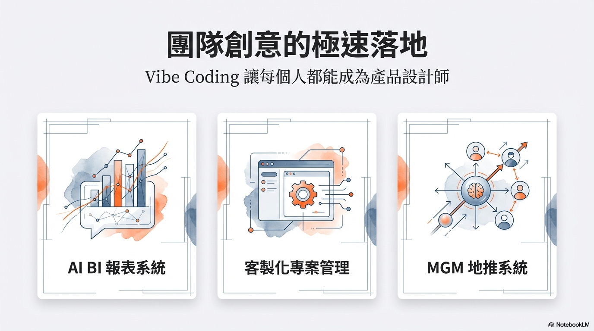

### 🤖 案例一：支援自然語言的 AI 報表系統

這是讓我最有感的一個 — **Ask, don't Query**。

以前要看報表，業務或 PM 得跟工程師說：「幫我查一下上個月的數據」，工程師再寫 SQL 去撈。現在呢？直接用自然語言問就好。

**思維轉換**：原本以為需要複雜的儀表板開發，結果發現直接串接大語言模型 API 就能做到。

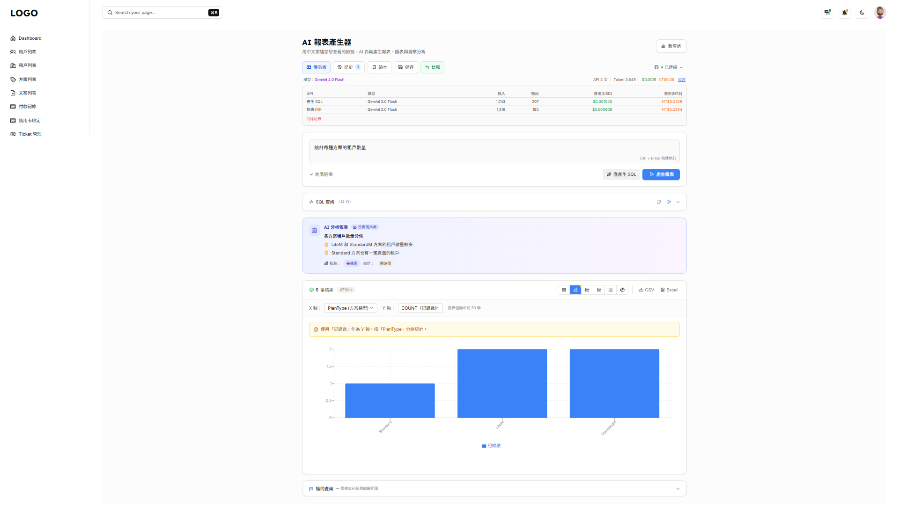

這套系統做到了：

- 🗣️ 直接用自然語言詢問資料庫，即時獲得統計圖表與分析
- 📊 自動將結果轉成表格、長條圖、折線圖、圓餅圖
- 💰 使用 Gemini 2.0 Flash，一個月的 AI 費用不到 50 元台幣

> 👉 打破舊思維，讓非技術人員（業務、PM）無須等待工程師。

### 🎨 案例二：合規圖文廣告產生器

行銷團隊常常需要產生符合法規的廣告文案和圖片。以前要行銷自己寫、法務審核、來回修改，流程很長。

現在透過 AI，輸入產品名稱和描述，就能自動產生合規的圖文廣告：

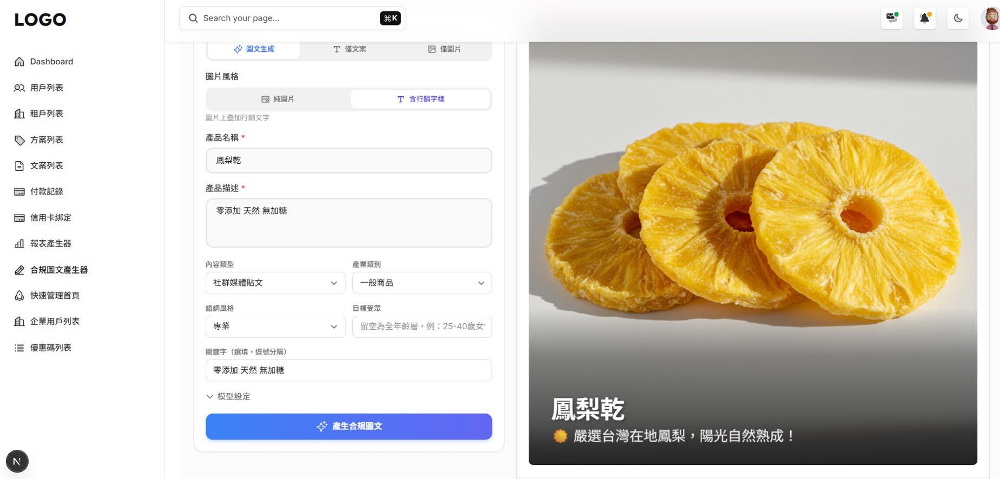

- 支援多種內容類型（社群媒體貼文、廣告文案等）
- 可選擇產業類別、語調風格、目標受眾
- **一鍵產生合規圖文**，大幅縮短行銷流程

### 📋 案例三：基於 Azure DevOps 客製化專案管理軟體

我們利用 Azure DevOps API 搭配 Vibe Coding，快速打造了友善的專屬看板。

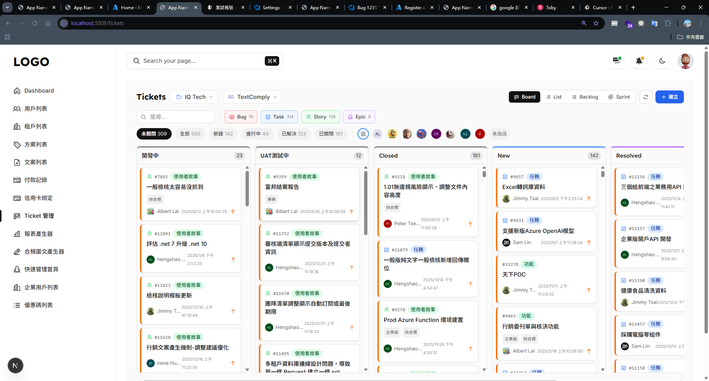

為什麼不直接用 Jira？因為：

| 比較項目 | 直接用 Jira | 自己做看板 |
|---------|-----------|----------|
| 授權費用 | 💸 每人每月都要付 | ✅ 大幅節省 |
| 介面體驗 | 功能多但複雜 | ✅ 依團隊需求優化 |
| 客製化程度 | 有限 | ✅ 完全自由 |
| 開發時間 | 不需開發 | ⚡ Vibe Coding 短時間完成 |

### 🎁 案例四：MGM 會員推廣系統

這套系統透過統一會員與 API 整合，實現高效的 MGM（Member Get Member）返利與結算。

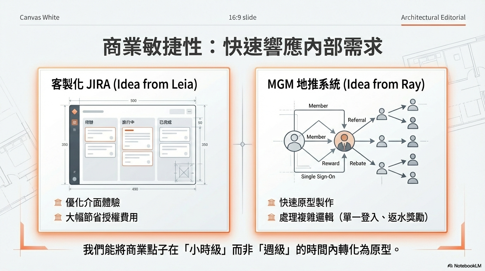

**挑戰**：各平台會員資料獨立，整合困難。
**解法**：導入單一登入（SSO），整合社群帳號，各產品呼叫 MGM API 進行核心功能。

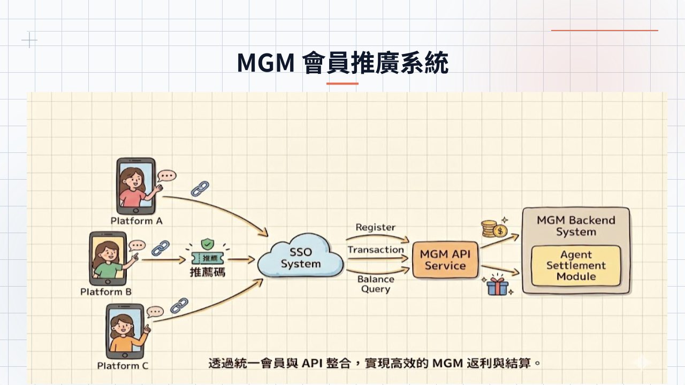

後台管理面板也是透過 Vibe Coding 快速生成，邏輯清晰且易於維護：

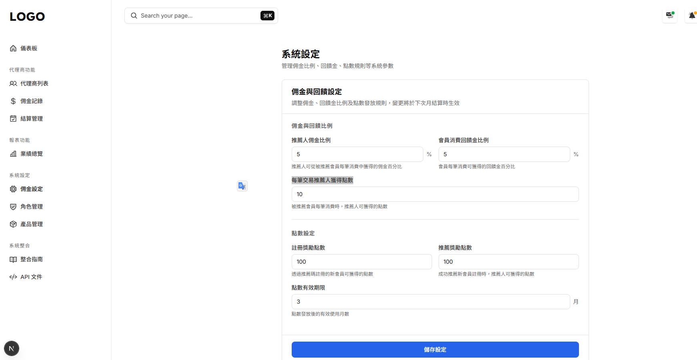

功能包括：
- 管理佣金發放比例
- 設定消費與註冊獎勵點數
- 點數效期限控管

同時也提供了完整的產品整合指南，讓其他產品能快速串接：

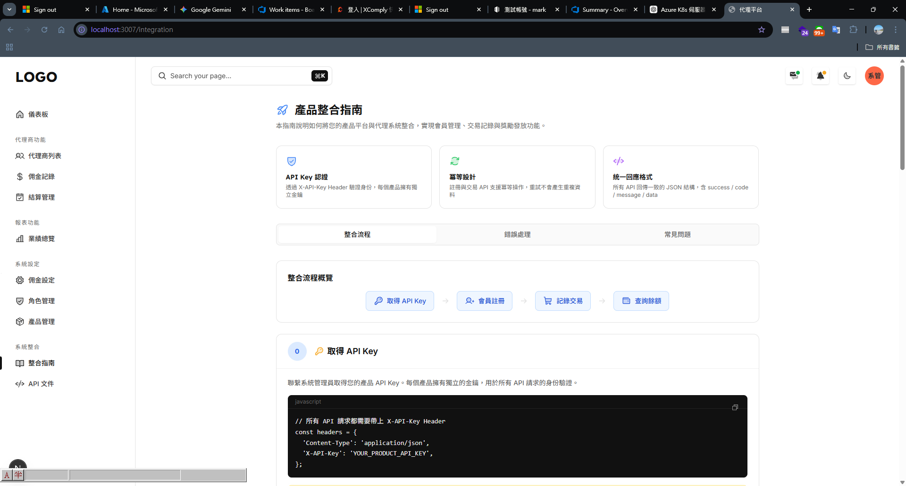

### 非技術人員也能開發後台

上面這幾個案例有個共同點 — **降低了開發門檻**。透過 Vibe Coding + AI 輔助，非技術人員也能參與後台的開發和調整，不再什麼都要等工程師。

## 技術選型與框架

這些專案統一採用 **Next.js** 作為全端開發框架：

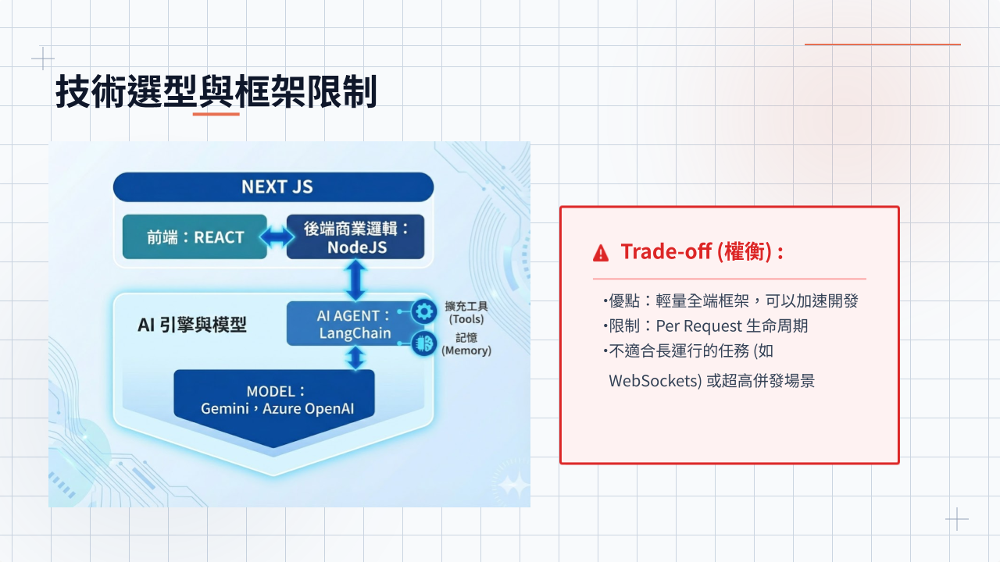

| 層級 | 技術 | 說明 |
|------|------|------|
| 前端 | Next.js（React） | 輕量化，快速開發 UI |
| 後端邏輯 | Node.js | 商業邏輯處理 |
| AI 引擎 | LangChain | Agent + Tools + Memory |
| 模型 | Gemini Vertex / Azure OpenAI | 可彈性切換不同模型 |

### Trade-off（權衡）

- ✅ **優點**：輕量全端框架，可以加速開發
- ⚠️ **限制**：Next.js 的 Per Request 生命周期
- ❌ **不適合**：繁重的 WebSockets 或長時間運行的任務
- 💡 為加速開發，還買了付費 Theme 來用

## 我們的技術護城河在哪裡？

當 AI 讓開發變得更容易，大家都能快速做出產品時，真正的競爭優勢在哪？

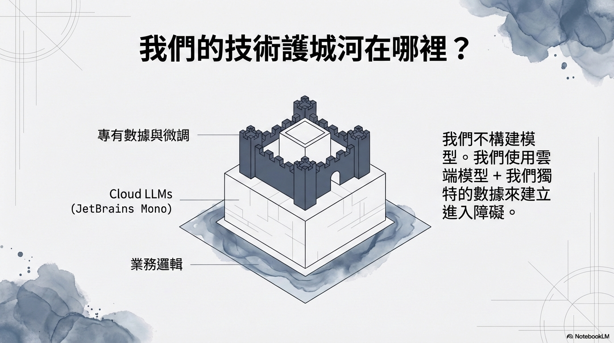

我們不構建模型。我們使用雲端模型 + 我們獨特的數據來建立進入障礙：

- 🏰 **頂層：專有數據與微調** — 我們的產業數據、合規知識庫、業務規則，這是別人複製不了的
- 🌥️ **中層：Cloud LLMs** — Gemini、Azure OpenAI 等雲端模型，大家都能用，但怎麼用是關鍵
- 🏗️ **底層：業務邏輯** — 多年累積的領域知識和系統整合經驗，深厚的業務理解才是根基

> 💡 AI 模型人人都能用，但**專有數據 + 業務邏輯**才是真正的護城河。

## 安全規範：我們如何放心地用 AI？

AI 很聰明，但我們不能完全信任它。團隊定了一條**黃金法則（Golden Rule）**：

> 🔒 無資料寫入權限，「只讀取，不刪改」

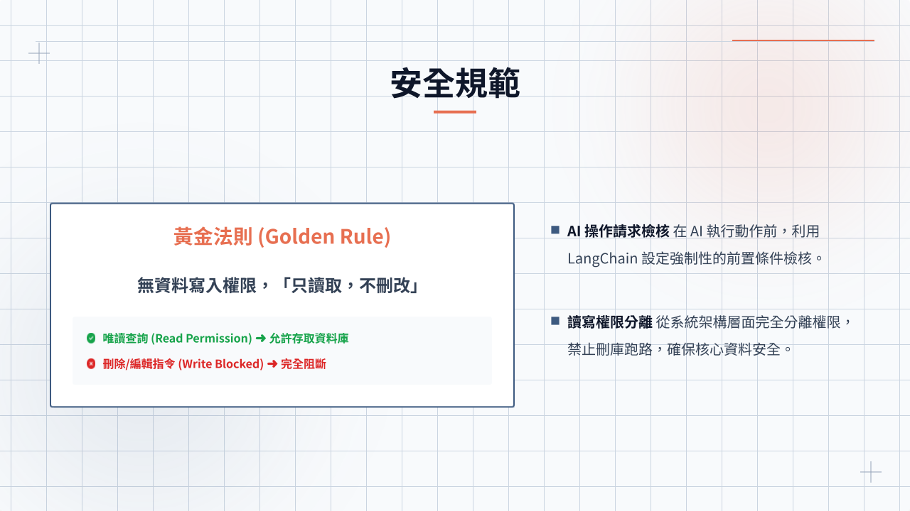

兩道防線：

1. **AI 操作請求檢核** — 在 AI 執行動作前，利用 LangChain 設定強制性的前置條件檢核
2. **讀寫權限分離** — 從系統架構層面完全分離權限，禁止刪庫跑路，確保核心資料安全

這個原則很重要 — 不管 AI 多聰明，都不應該讓它有能力破壞你的資料。

## Vibe Coding 下的工程專業

講完了好處，接下來聊聊我比較擔心的部分。

> ⚠️ 一直以來軟體最大的成本，不在於開發，而是在維護成本。

AI 能快速產生 10 倍的程式碼，也可能帶來 10 倍的維護債。

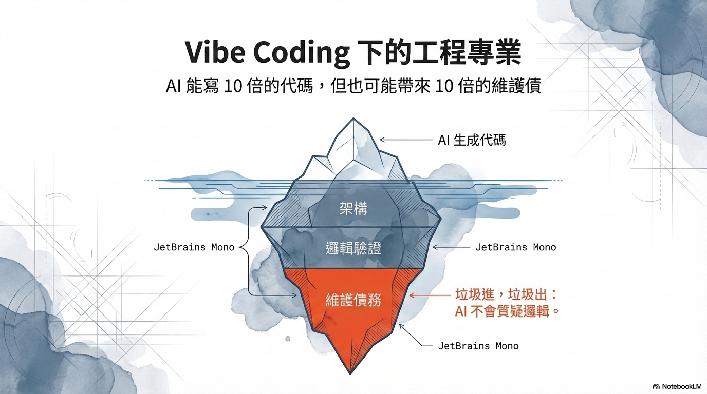

這就像一座冰山 — AI 生成的代碼是海面上看得到的部分，但水面下藏著**架構設計**、**邏輯驗證**和**維護債務**，這些才是真正決定專案成敗的關鍵。

> 👉 垃圾進，垃圾出（Garbage In, Garbage Out）— AI 不會質疑邏輯。

### 速度快 ≠ 品質好

| 面向 | AI 帶來的好處 | 可能的隱憂 |
|------|------------|---------|
| 開發速度 | ⚡ 快 10 倍 | 技術債也可能多 10 倍 |
| 程式碼量 | 快速產出大量程式碼 | 沒有測試覆蓋率 |
| 入門門檻 | 非技術人員也能參與 | 架構設計缺乏全局思考 |
| 原型驗證 | 一天就能完成 | 從原型到產品的路還很長 |
| 團隊理解 | 減少重複工作 | AI 寫的程式碼，團隊不見得看得懂 |

這一波不是單純效率提升而已，而是考驗工程師怎麼控制品質、怎麼設計架構、怎麼不被速度反噬。

說白一點，未來比的可能不是「誰寫得快」，而是「**誰能駕馭 AI，而不是被 AI 駕馭**」。

## 總結

幾個我覺得重要的 Takeaway：

1. **從開發工具到開發 AI 工作流程** — 軟體的未來不再只是操作功能，而是將結果交付使用者
2. **Vibe Coding 真的能用** — 團隊實際用它做出了 AI 報表、專案管理、MGM 系統，將商業點子在「小時級」轉化為原型
3. **技術護城河在數據和業務邏輯** — AI 模型人人都能用，專有數據才是真正的競爭優勢
4. **安全規範不能省** — 黃金法則：只讀取，不刪改。AI 再聰明也要有防線
5. **軟體最貴的是維護，不是開發** — AI 產出 10 倍程式碼，也可能帶來 10 倍技術債

這波 AI 浪潮不會停下來，Anything is possible. 🚴

## 參考資料

- [用 AI Agent + LangChain 打造自然語言 BI 報表系統](/bi-agent-langchain-natural-language-sql) — AI 報表系統的詳細技術分享
- [Anthropic - Building effective agents](https://www.anthropic.com/research/building-effective-agents) — Agent 設計的參考
- [The End of Programming as We Know It](https://www.oreilly.com/radar/the-end-of-programming-as-we-know-it/) — O'Reilly 對未來程式開發的觀點
