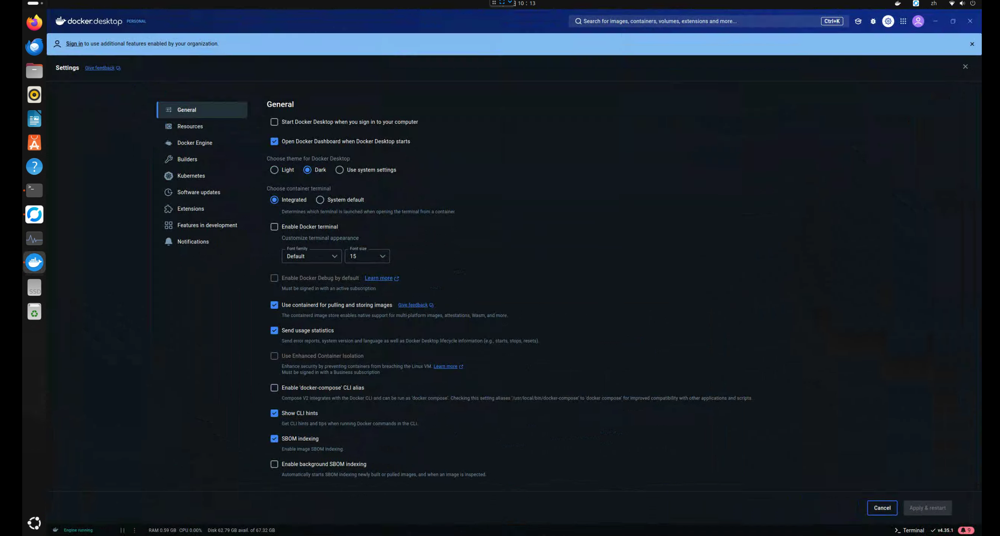

## 問題
在 Ubuntu 先裝了 Docker desktop ，Docker，發現遠端訪問及佈署 ( 2375 port ) 怎麼調整，一直都跑不起來，將其全部移除後再裝。

## 在 Windows 可以透過Docker desktop 勾選 "Expose daemon on tcp://localhost:2375 without TLS" 來啟用2375 port ，但在Linux 版本是沒有這個設定的，如果先裝了 Docker desktop 可能會遇到和我一樣的狀況。


## 環境說明
因為越來越多雲端服務都是採用 Linux 伺服器，且因為Linux 輕載又穩定的特性，不需要特別高規格的電腦，因此將舊電腦，Intel 8700 + 1060 顯卡整理成做為實驗機，並在上面安裝了 Ubuntu 22.04.5 LTS，做為研究一些雲平台使用，為了方便管理，我裝了 Ubuntu Desktop ，並自己架了 Rust Destktop ，方便連線進去維護。

## 首先，在Ubuntu 安裝 Docker 
```
// 1. 更新系統的軟體

sudo apt update
sudo apt upgrade

// 2. 安裝必要的相依套件

sudo apt install -y apt-transport-https ca-certificates curl software-properties-common

// 3. 加入 Docker 官方的 GPG 金鑰

curl -fsSL https://download.docker.com/linux/ubuntu/gpg | sudo gpg --dearmor -o /usr/share/keyrings/docker-archive-keyring.gpg

// 4. 新增 Docker 的軟體庫

echo "deb [arch=$(dpkg --print-architecture) signed-by=/usr/share/keyrings/docker-archive-keyring.gpg] https://download.docker.com/linux/ubuntu $(lsb_release -cs) stable" | sudo tee /etc/apt/sources.list.d/docker.list > /dev/null

// 5. 更新軟體包列表並安裝 Docker

sudo apt remove --purge docker-ce docker-ce-cli containerd.io
sudo apt install docker-ce docker-ce-cli containerd.io

// 6. 檢查 Docker 是否安裝成功

sudo systemctl status docker
sudo systemctl start docker
sudo docker run hello-world

```
修改這行，在後面加上 -H fd:// -H tcp://0.0.0.0:2375

```
ExecStart=/usr/bin/dockerd -H fd:// --containerd=/run/containerd/containerd.sock -H fd:// -H tcp://0.0.0.0:2375
```

重新啟動
```
sudo systemctl daemon-reload  // reload service
sudo systemctl enable docker.service 
sudo systemctl restart docker.service 
sudo systemctl status docker.service 
```
## 開啟防火牆
```
sudo ufw allow 2375
```
## 測試 (在別台電腦)
```
docker -H 192.168.50.50:2375 info
docker -H 192.168.50.50:2375 ps
```
[test result](test.png)
## 最後
做了些實驗，Docker 透過 2375 指令建的容器，在Docker desktop 看不到，如果要用 Docker desktop 可能會和原本的 Docker 有衝突，看起來，Docker 和 DockerDesktop 不能混用。
